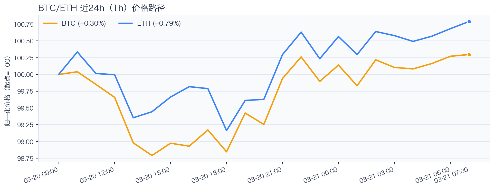
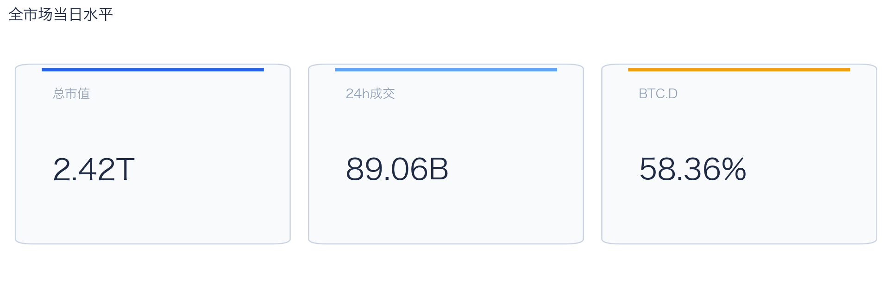
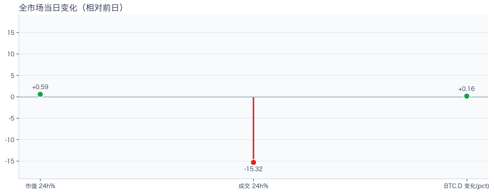
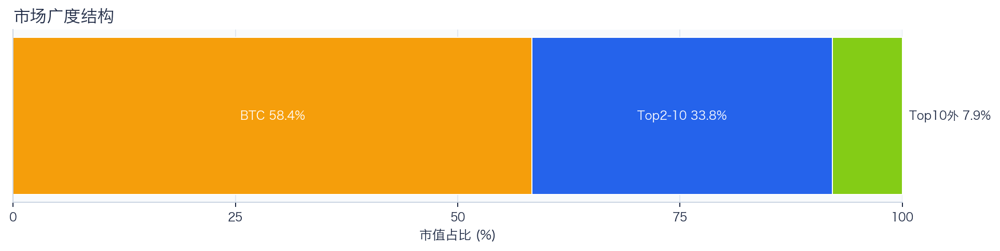
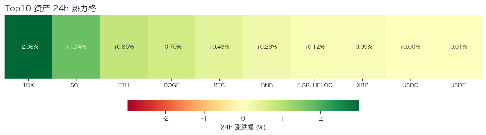
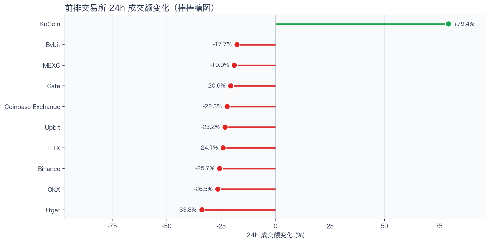
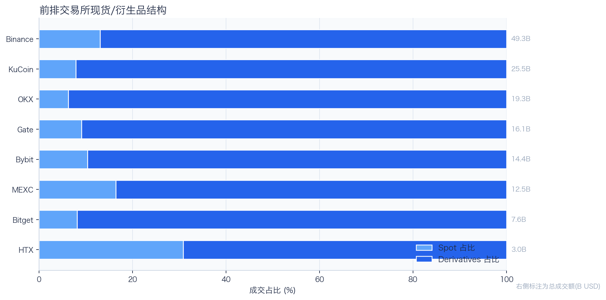
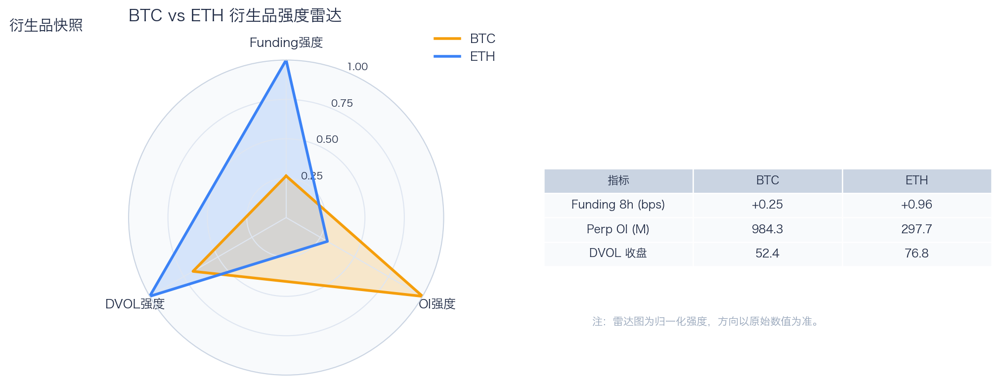
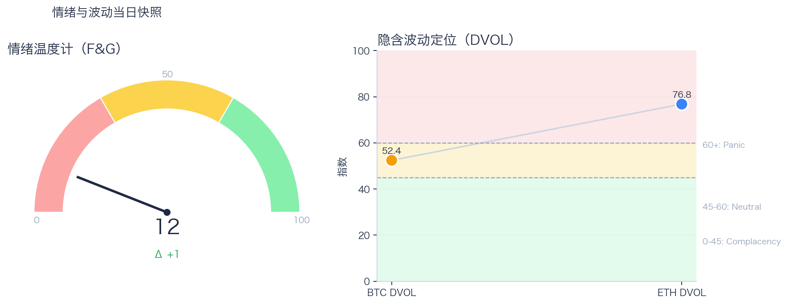

# 二级市场日报（2026-03-21）

## 关键结论
- 全市场市值 $2.42T（24h +0.59%），成交额 $89.06B（24h -15.32%）。
- BTC 主导率 58.36%（+0.16pct），Top10 外占比 7.86%。
- Top10 资产上涨 9 / 下跌 1，平均涨跌幅 +0.71%，首尾分化 2.99pct。
- 衍生品：BTC/ETH 资金费率分别为 +0.25bps / +0.96bps，DVOL 收盘 52.43 / 76.81。

## 今日盘面判断
如果只用一句话概括今天的市场，关键词是 `Range Trading`。价格与成交未形成同向趋势，市场仍在区间内进行结构轮动。广度仍偏窄，增量风险偏好尚未形成持续外溢。这意味着短线虽然有可交易的弹性，但要把它理解成新一轮趋势启动，证据还不够。

## 核心驱动因素
从流动性结构看，多数平台成交走弱，流动性恢复仍依赖少数头部平台；从杠杆维度看，杠杆拥挤度整体可控；在风险定价层面，期权端对尾部波动的定价仍偏谨慎；再结合情绪仍在恐惧区，反弹更容易受到外部事件扰动。整体来看，盘面更像是修复中的高波动环境，而不是低波动顺趋势环境。

## BTC/ETH 24h 趋势判断

- BTC：$70,793.37（24h +0.62%，区间 $69,388.00 - $71,367.00，当前位于区间 71%）=> 区间震荡。
- ETH：$2,158.10（24h +1.17%，区间 $2,116.88 - $2,176.84，当前位于区间 69%）=> 偏强震荡。
- 简评：BTC 与 ETH 出现分化，短线以结构性机会为主。

## 市场脉冲

截至 2026-03-21，全市场市值 $2.42T，24h 成交额 $89.06B，BTC 主导率 58.36%。
价格上涨但成交回落，反弹质量偏弱，需警惕高位回吐。在这种盘面下，成交能否继续跟上，是判断明天反弹延续还是回吐的第一道分水岭。

相对前日，市值 +0.59%、成交 -15.32%、BTC.D +0.16pct。
把这组变化拆开看，比看单一涨跌更有用：价格、成交、主导率三者同向时，行情更有连续性；一旦出现背离，走势往往会变得更短促、更反复。

## 主导率与市场广度

当前结构为 BTC 58.36% / Top2-10 33.77% / Top10 外 7.86%。长尾占比仍偏低，广度修复还未形成持续趋势。
Top10 外占比处于低位，风险偏好仍主要停留在 BTC 与头部资产。换句话说，资金目前更愿意在高流动性的核心资产里做仓位调整，而不是大面积扩散到长尾资产。

## 资产与交易所资金流

Top10 中领涨 TRX（+2.98%），尾部 USDT（-0.01%），均值 +0.71%。分化 2.99pct，结构性交易仍是主导。
上涨家数明显占优，但首尾分化仍大，表明反弹并非无差别普涨。对交易而言，这通常意味着“选币”比“全市场方向”更重要，错配带来的收益差会明显放大。

前排样本上涨 1 家、下跌 9 家，均值 -13.36%。KuCoin 最强（+79.39%），Bitget 最弱（-33.84%）。
最强与最弱平台的 24h 变化差达到 113.23pct，说明流动性仍在选择性回流，头部平台的价格发现能力更强。当平台间流量分化明显时，报价连续性和滑点表现会同步分化，执行层面要更关注成交质量。

样本内衍生品成交占比 87.84%。若该占比继续走高且 funding 不同步回落，短线波动脉冲通常会增强。
衍生品占比处于高位，行情更容易出现脉冲式放大，风控阈值建议偏保守。这也是为什么同样的消息面在当前阶段更容易被放大成大振幅走势。

## 衍生品与情绪

资金费率（Funding）仍在中性附近，BTC/ETH 分别 +0.25bps / +0.96bps；未平仓合约（OI）为 $984.26M / $297.69M；隐含波动率指数（DVOL）位于 Neutral（中性波动定价） / Panic（高波动溢价）。
Funding 与 DVOL 的组合显示，方向拥挤暂未极端，但尾部风险定价仍未完全回落。因此更合适的做法不是激进追单边，而是围绕波动管理仓位和节奏。

恐惧与贪婪指数（F&G）当日 12（较前日 +1）；配合 BTC/ETH DVOL 52.43/76.81，当前更像情绪修复中的高波动区。
恐惧区内出现边际改善，说明市场开始试探修复，但尚不足以支持激进风险暴露。只有当情绪、广度和成交三者同时改善，市场才更可能从“反弹交易”切换到“趋势交易”。

## 未来24小时观察
1. 若 Top10 外占比继续抬升且 BTC.D 回落，说明风险偏好开始从核心资产向外扩散。
2. 若衍生品占比继续上升而 funding 仍中性，盘面大概率维持高波动震荡而非顺滑上行。
3. 若 F&G 反弹但 DVOL 不降，代表情绪与风险定价背离，追涨胜率会明显下降。

## 交易与风控含义
- 仓位管理优先级高于方向押注，建议保持核心仓位稳定、战术仓位滚动。
- 若交易所衍生品占比继续上升，建议同步收紧杠杆和止损参数。
- 关注情绪改善与广度扩散是否同步发生，二者背离时避免追逐单边。

