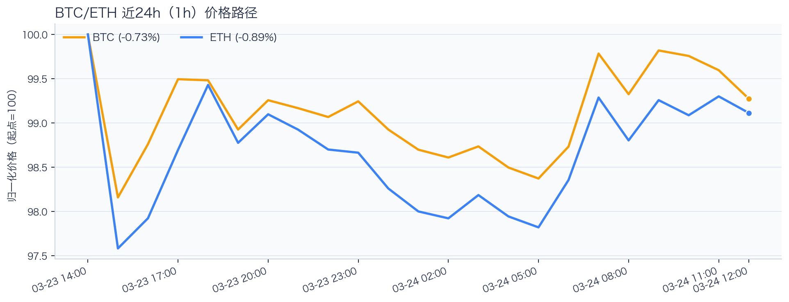
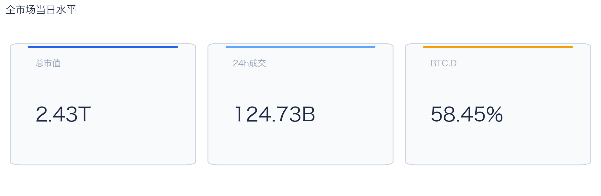
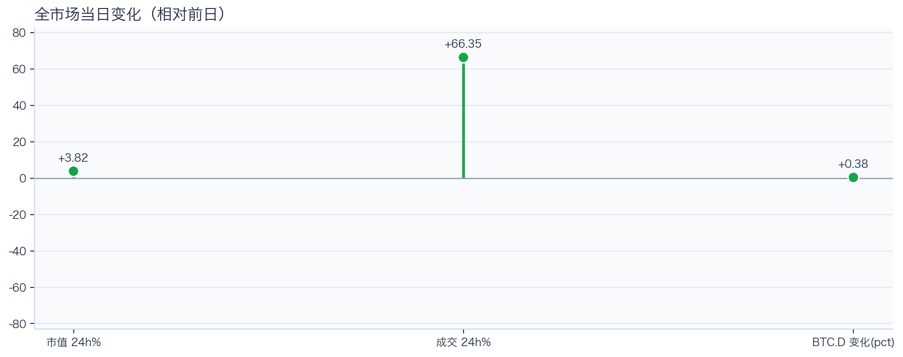
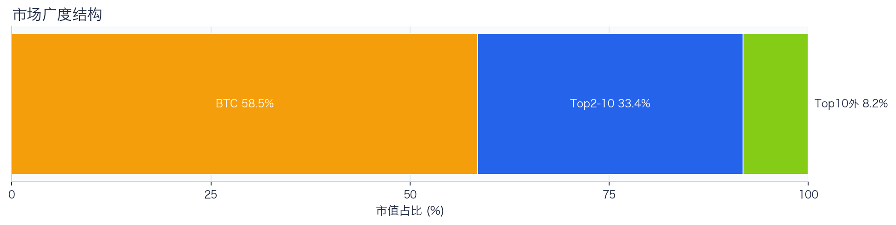
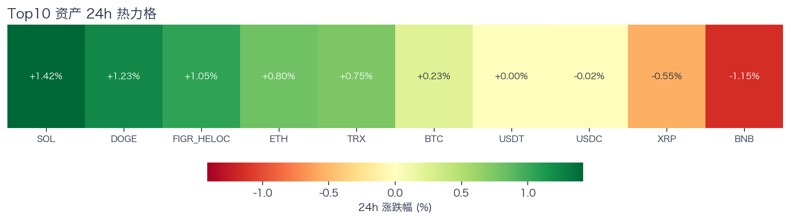
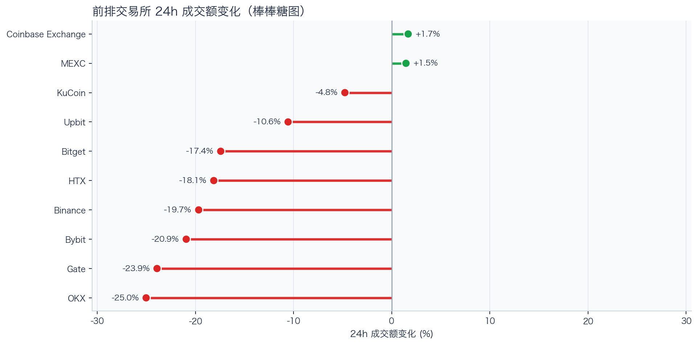
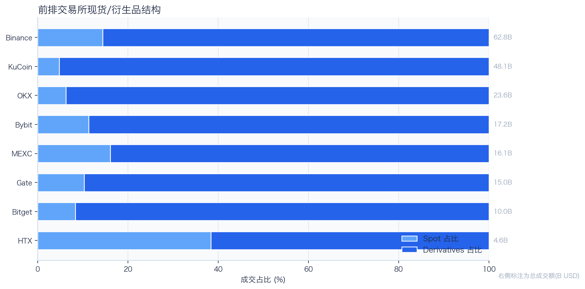
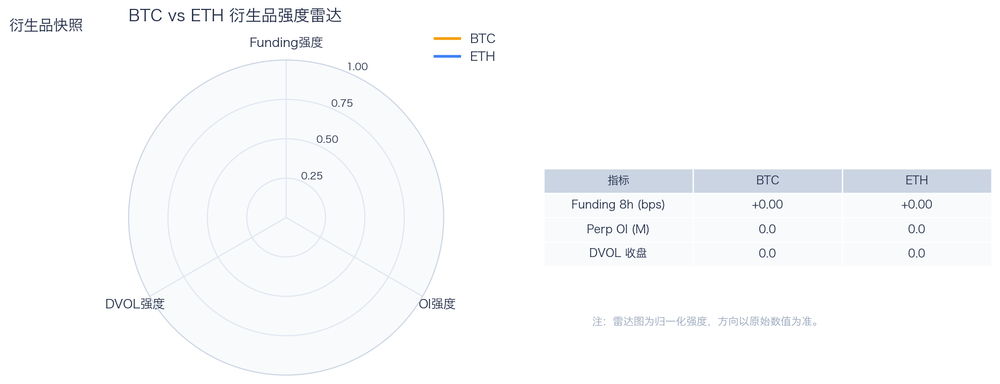
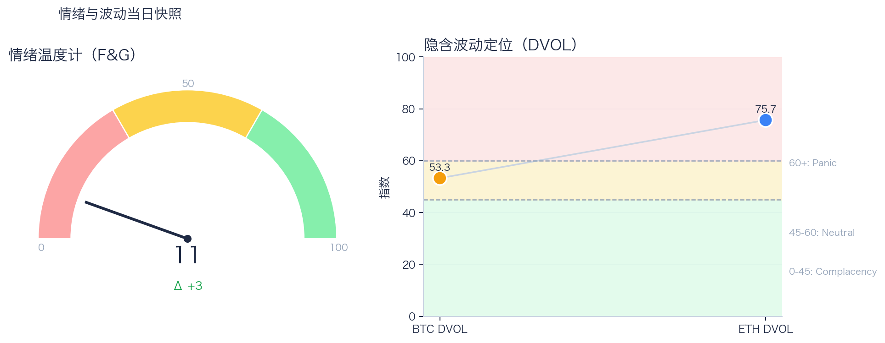

# 二级市场日报（2026-03-24）

## 关键结论
- 全市场市值 N/A（24h N/A），成交额 N/A（24h N/A）。
- BTC 主导率 N/A。
- Top10 资产广度统计不完整。
- 衍生品：部分数据缺失。

## 今日盘面判断
如果只用一句话概括今天的市场，关键词是 `Data-Limited`。核心价格或成交数据不完整，当前以结构信号做保守判断。广度仍偏窄，增量风险偏好尚未形成持续外溢。这意味着短线虽然有可交易的弹性，但要把它理解成新一轮趋势启动，证据还不够。

## 核心驱动因素
从流动性结构看，平台流量呈分化状态，头部与非头部恢复节奏不一致；从杠杆维度看，杠杆拥挤度整体可控；在风险定价层面，期权端对尾部波动的定价仍偏谨慎；再结合情绪与价格修复节奏尚未完全同步。整体来看，盘面更像是修复中的高波动环境，而不是低波动顺趋势环境。

## BTC/ETH 24h 趋势判断

- BTC/ETH 24h 趋势数据暂不可用。

## 市场脉冲

截至 2026-03-24，全市场市值 N/A，24h 成交额 N/A，BTC 主导率 N/A。
价格与成交同向上行，说明风险预算有边际回补，短线反弹具备交易基础。在这种盘面下，成交能否继续跟上，是判断明天反弹延续还是回吐的第一道分水岭。

相对前日，市值 N/A、成交 N/A。
把这组变化拆开看，比看单一涨跌更有用：价格、成交、主导率三者同向时，行情更有连续性；一旦出现背离，走势往往会变得更短促、更反复。

## 主导率与市场广度

广度快照数据不完整。
当前广度仍集中于核心资产，长尾板块的参与度有限。换句话说，资金目前更愿意在高流动性的核心资产里做仓位调整，而不是大面积扩散到长尾资产。

## 资产与交易所资金流

Top10 涨跌数据不完整。
头部资产分化仍在，当前更像结构行情。对交易而言，这通常意味着“选币”比“全市场方向”更重要，错配带来的收益差会明显放大。

交易所 24h 成交变化数据不完整。
平台流量分层明显，交易恢复并不均匀。当平台间流量分化明显时，报价连续性和滑点表现会同步分化，执行层面要更关注成交质量。

交易所结构占比数据不完整。
衍生品在样本成交中占比较高，短线波动通常会被杠杆交易放大。这也是为什么同样的消息面在当前阶段更容易被放大成大振幅走势。

## 衍生品与情绪

衍生品关键指标有缺口，当前解读以可得数据为准。
Funding 与 DVOL 的组合显示，方向拥挤暂未极端，但尾部风险定价仍未完全回落。因此更合适的做法不是激进追单边，而是围绕波动管理仓位和节奏。

F&G 数据不可用，情绪判断需结合成交与 funding 变化。
情绪仍在低位区，价格修复尚未转化为广泛风险偏好回升。只有当情绪、广度和成交三者同时改善，市场才更可能从“反弹交易”切换到“趋势交易”。

## 未来24小时观察
1. 若 Top10 外占比继续抬升且 BTC.D 回落，说明风险偏好开始从核心资产向外扩散。
2. 若衍生品占比继续上升而 funding 仍中性，盘面大概率维持高波动震荡而非顺滑上行。
3. 若 F&G 反弹但 DVOL 不降，代表情绪与风险定价背离，追涨胜率会明显下降。

## 交易与风控含义
- 仓位管理优先级高于方向押注，建议保持核心仓位稳定、战术仓位滚动。
- 若交易所衍生品占比继续上升，建议同步收紧杠杆和止损参数。
- 关注情绪改善与广度扩散是否同步发生，二者背离时避免追逐单边。

## 数据缺口（Data Gaps）
- CMC 全市场历史数据获取失败: <urlopen error [Errno 1] Operation not permitted>
- CoinGecko Top资产数据获取失败（已按 key 尝试 demo）: demo: <urlopen error [Errno 1] Operation not permitted>
- CMC 交易所报价数据获取失败: <urlopen error [Errno 1] Operation not permitted>
- Deribit ticker BTC-PERPETUAL 获取失败: <urlopen error [Errno 1] Operation not permitted>
- Deribit ticker ETH-PERPETUAL 获取失败: <urlopen error [Errno 1] Operation not permitted>
- Deribit DVOL BTC 获取失败: <urlopen error [Errno 1] Operation not permitted>
- Deribit DVOL ETH 获取失败: <urlopen error [Errno 1] Operation not permitted>
- Alternative.me F&G 获取失败: <urlopen error [Errno 1] Operation not permitted>
- Binance BTC/ETH 24h 批量数据获取失败，转单币重试: <urlopen error [Errno 1] Operation not permitted>
- Binance 24h 单币数据获取失败 BTCUSDT: <urlopen error [Errno 1] Operation not permitted>
- Binance 24h 未返回 BTCUSDT 数据。
- Binance 24h 单币数据获取失败 ETHUSDT: <urlopen error [Errno 1] Operation not permitted>
- Binance 24h 未返回 ETHUSDT 数据。
- Binance BTCUSDT 1h K线获取失败: <urlopen error [Errno 1] Operation not permitted>
- Binance ETHUSDT 1h K线获取失败: <urlopen error [Errno 1] Operation not permitted>

