# 二级市场日报（2026-03-25）

## 关键结论
- 全市场市值 $2.42T（24h -0.37%），成交额 $95.66B（24h -23.30%）。
- BTC 主导率 58.35%（-0.10pct），Top10 外占比 6.83%。
- Top10 资产上涨 7 / 下跌 3，平均涨跌幅 +1.52%，首尾分化 3.53pct。
- 衍生品：BTC/ETH 资金费率分别为 +0.16bps / +0.00bps，DVOL 收盘 50.96 / 73.09。

## 今日盘面判断
如果只用一句话概括今天的市场，关键词是 `Defensive Drift`。价格与成交同步走弱，属于防守型下移结构，短线以控制回撤为主。广度仍偏窄，增量风险偏好尚未形成持续外溢。这意味着短线虽然有可交易的弹性，但要把它理解成新一轮趋势启动，证据还不够。

## 核心驱动因素
从流动性结构看，多数平台成交回暖，短线流动性环境较前一日改善；从杠杆维度看，杠杆拥挤度整体可控；在风险定价层面，期权端对尾部波动的定价仍偏谨慎；再结合情绪仍在恐惧区，反弹更容易受到外部事件扰动。整体来看，盘面更像是修复中的高波动环境，而不是低波动顺趋势环境。

## BTC/ETH 24h 趋势判断
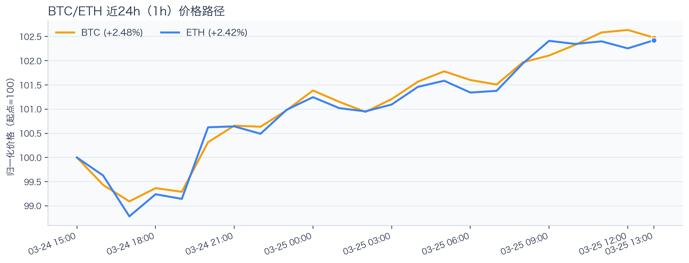

- BTC：$71,604.03（24h +1.98%，区间 $68,923.07 - $72,026.09，当前位于区间 86%）=> 偏强震荡。
- ETH：$2,185.99（24h +2.30%，区间 $2,103.02 - $2,199.02，当前位于区间 86%）=> 偏强，上行主导。
- 简评：BTC 与 ETH 同步偏强，短线仍有上行动能。

## 稳定币收益情况（链上协议）
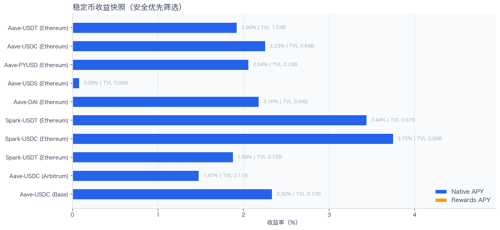

按安全优先（协议成熟度、链层风险、是否依赖激励）筛选了 10 个主流池；原生供给利率均值约 +2.02%。
其中包含奖励补贴的池有 1 个，补贴收益已单列，不与原生利率混合。

核心观察
- 利率结构：Total APY 位于 0.00% 至 3.44% 区间。
- 资金集中：TVL 主要集中在 Aave-USDT（Ethereum，TVL $1.53B）、Aave-USDC（Ethereum，TVL $838.05M）。
- 收益领先：当前收益靠前样本包括 Spark-USDT（Ethereum，Total 3.44%）、Compound-USDC（Ethereum，Total 2.56%）。

风险提示
- 利用率达到 70% 以上的池有 3 个，杠杆需求主要集中在头部池。
- 利用率最高样本：Aave-USDC（Ethereum） 75.52%，Borrow APY 3.34%。
- 奖励收益池数量：1 个。当前收益主体仍以原生利率为主。

重点池（官方口径）
- Spark-USDT（Ethereum）：Total 3.44% / TVL $665.26M / Utilization N/A。
- Compound-USDC（Ethereum）：Total 2.56% / TVL $120.14M / Utilization N/A。
- Aave-USDC（Base）：Total 2.32% / TVL $104.62M / Utilization 71.63%。

交易含义：当前稳定币收益更偏“头部池中等收益 + 局部高利用率”结构，策略上优先流动性与透明度，再考虑收益增强。
部分协议未公开借款侧与利用率口径，报告仅展示可验证数据。

## 非 DeFi（交易所期现）
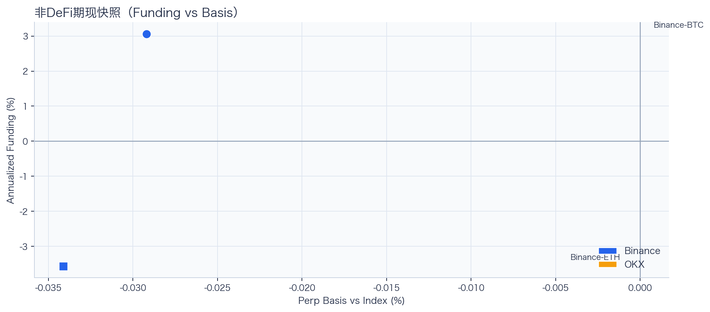

样本范围覆盖 Binance 与 OKX 的 BTC/ETH 现货与永续，用于观察 funding 与 basis 的当期结构。
- Funding 最高样本：Binance-BTC，年化约 3.06%。
- Funding 最低样本：OKX-ETH，年化约 -11.35%。
- Basis 偏离最大：Binance-ETH，相对指数约 -0.03%。
- 交易含义：当 funding 年化显著高于 basis 且持续为正，carry 交易更偏向收取 funding；若 basis 与 funding 同步回落，需降低杠杆并关注资金回流速度。
本段为交易所公开行情口径，不与链上收益口径混合。

## 市场脉冲
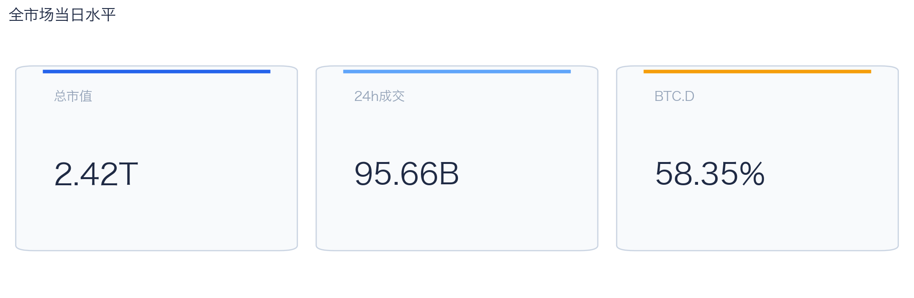

截至 2026-03-25，全市场市值 $2.42T，24h 成交额 $95.66B，BTC 主导率 58.35%。
价格与成交同步走弱，风险偏好仍在收缩，盘面更偏防守。在这种盘面下，成交能否继续跟上，是判断明天反弹延续还是回吐的第一道分水岭。

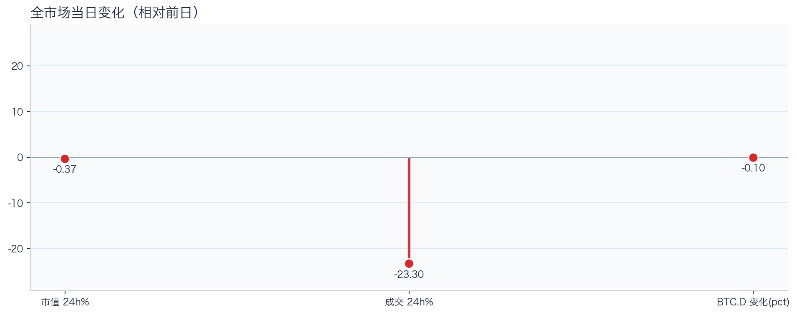

相对前日，市值 -0.37%、成交 -23.30%、BTC.D -0.10pct。
把这组变化拆开看，比看单一涨跌更有用：价格、成交、主导率三者同向时，行情更有连续性；一旦出现背离，走势往往会变得更短促、更反复。

## 主导率与市场广度
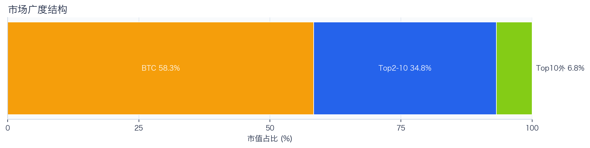

当前结构为 BTC 58.35% / Top2-10 34.82% / Top10 外 6.83%。长尾占比仍偏低，广度修复还未形成持续趋势。
Top10 外占比处于低位，风险偏好仍主要停留在 BTC 与头部资产。换句话说，资金目前更愿意在高流动性的核心资产里做仓位调整，而不是大面积扩散到长尾资产。

## 资产与交易所资金流
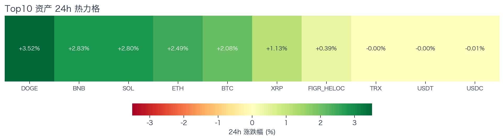

Top10 中领涨 DOGE（+3.52%），尾部 USDC（-0.01%），均值 +1.52%。分化 3.53pct，结构性交易仍是主导。
上涨家数明显占优，但首尾分化仍大，表明反弹并非无差别普涨。对交易而言，这通常意味着“选币”比“全市场方向”更重要，错配带来的收益差会明显放大。

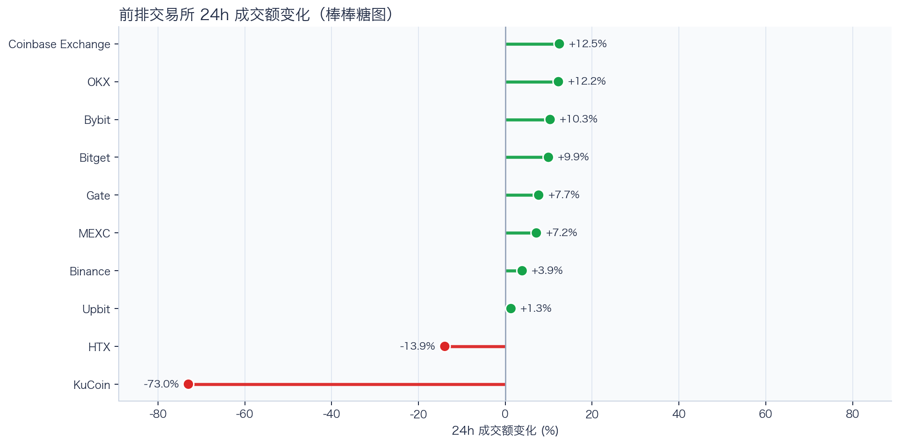

前排样本上涨 8 家、下跌 2 家，均值 -2.18%。Coinbase Exchange 最强（+12.47%），KuCoin 最弱（-72.98%）。
最强与最弱平台的 24h 变化差达到 85.45pct，说明流动性仍在选择性回流，头部平台的价格发现能力更强。当平台间流量分化明显时，报价连续性和滑点表现会同步分化，执行层面要更关注成交质量。

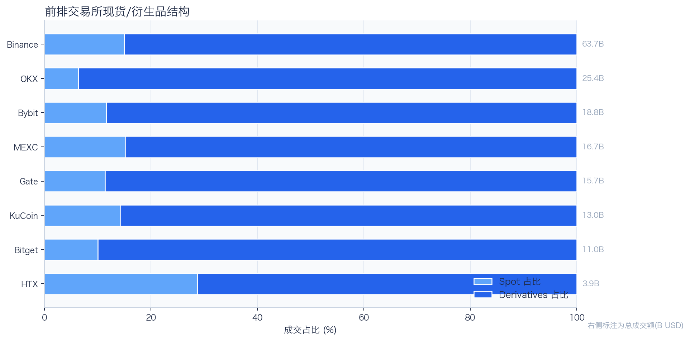

样本内衍生品成交占比 85.59%。若该占比继续走高且 funding 不同步回落，短线波动脉冲通常会增强。
衍生品占比处于高位，行情更容易出现脉冲式放大，风控阈值建议偏保守。这也是为什么同样的消息面在当前阶段更容易被放大成大振幅走势。

## 衍生品与情绪
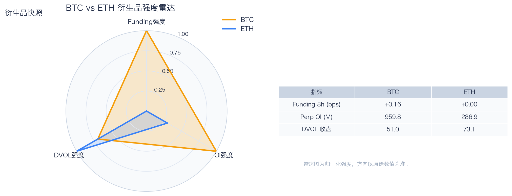

资金费率（Funding）仍在中性附近，BTC/ETH 分别 +0.16bps / +0.00bps；未平仓合约（OI）为 $959.78M / $286.90M；隐含波动率指数（DVOL）位于 Neutral（中性波动定价） / Panic（高波动溢价）。
资金费率接近中性，说明方向拥挤度有限；但 DVOL 仍偏高，市场对突发波动仍保留保险溢价。因此更合适的做法不是激进追单边，而是围绕波动管理仓位和节奏。

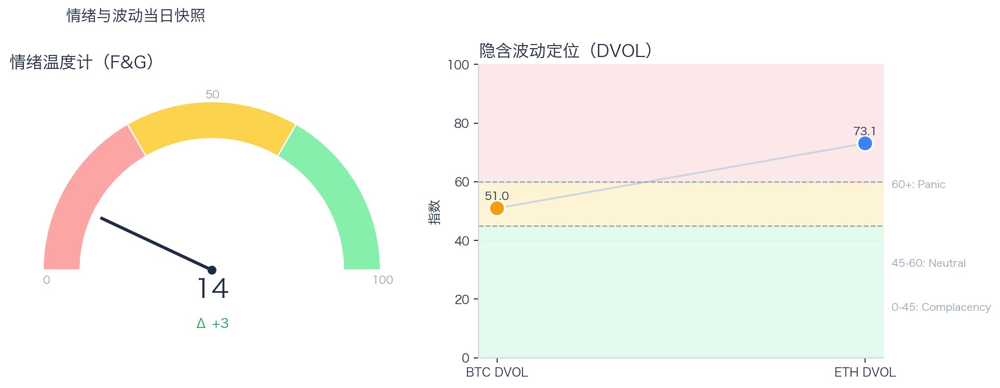

恐惧与贪婪指数（F&G）当日 14（较前日 +3）；配合 BTC/ETH DVOL 50.96/73.09，当前更像情绪修复中的高波动区。
恐惧区内出现边际改善，说明市场开始试探修复，但尚不足以支持激进风险暴露。只有当情绪、广度和成交三者同时改善，市场才更可能从“反弹交易”切换到“趋势交易”。

## 未来24小时观察
1. 若 Top10 外占比继续抬升且 BTC.D 回落，说明风险偏好开始从核心资产向外扩散。
2. 若衍生品占比继续上升而 funding 仍中性，盘面大概率维持高波动震荡而非顺滑上行。
3. 若 F&G 反弹但 DVOL 不降，代表情绪与风险定价背离，追涨胜率会明显下降。

## 交易与风控含义
- 仓位管理优先级高于方向押注，建议保持核心仓位稳定、战术仓位滚动。
- 若交易所衍生品占比继续上升，建议同步收紧杠杆和止损参数。
- 关注情绪改善与广度扩散是否同步发生，二者背离时避免追逐单边。

