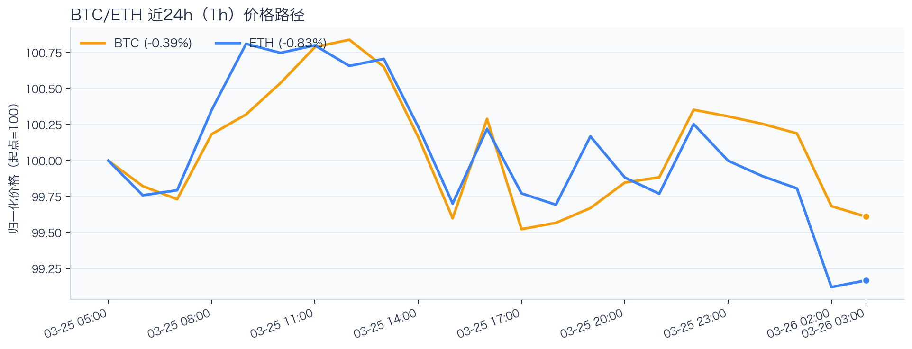
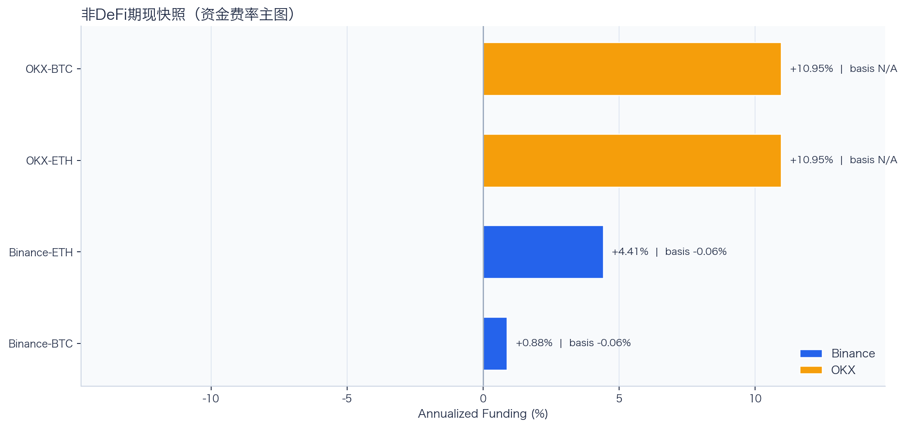
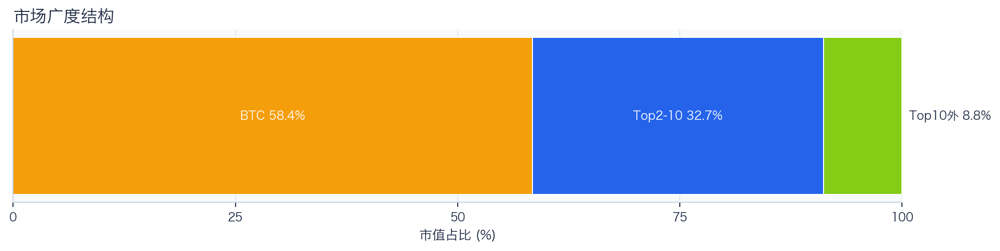
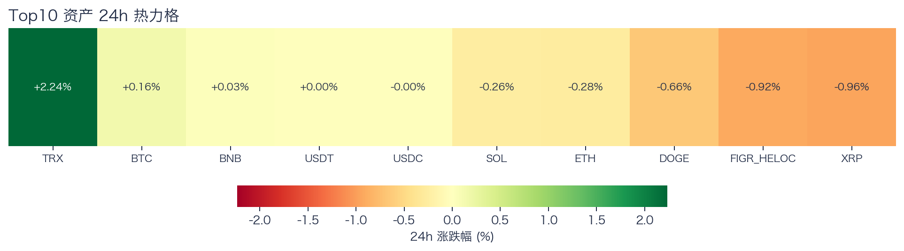
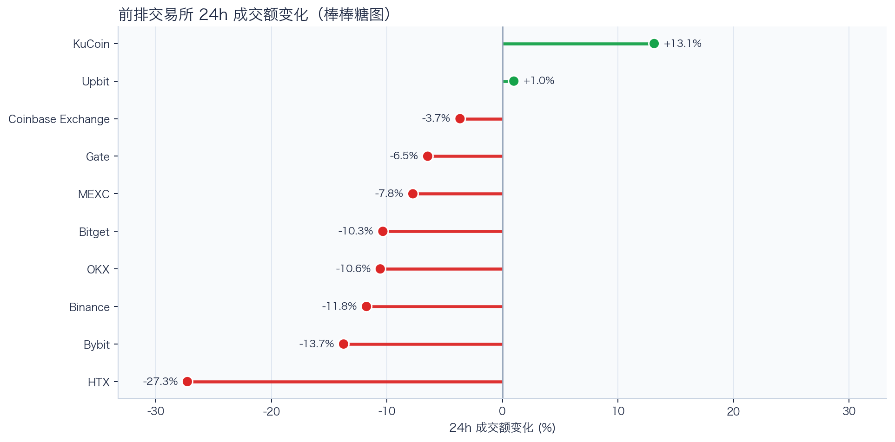
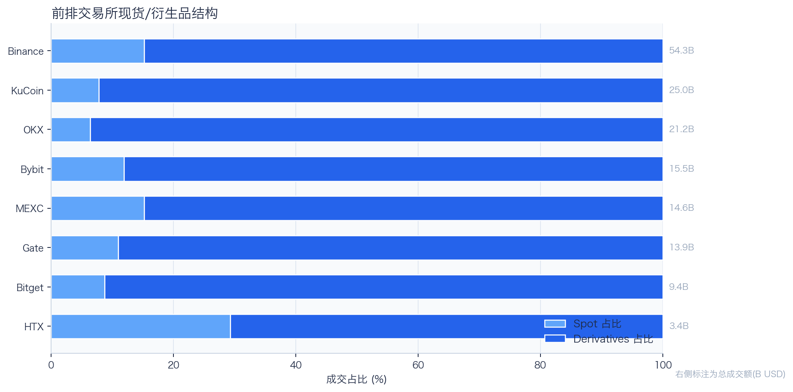
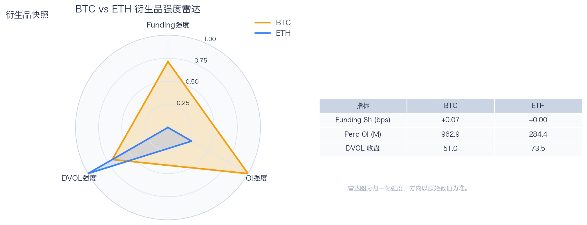
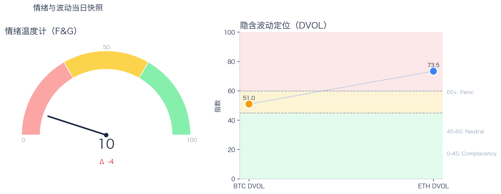

# 二级市场日报（2026-03-26）

## 关键结论
- 全市场市值 $2.44T（24h +0.99%），成交额 $87.68B（24h -8.35%）。
- BTC 主导率 58.42%（+0.07pct），Top10 外占比 8.83%。
- Top10 资产上涨 4 / 下跌 6，平均涨跌幅 -0.06%，首尾分化 3.19pct。
- 衍生品：BTC/ETH 资金费率分别为 +0.07bps / +0.00bps，DVOL 收盘 51.00 / 73.45。

## 今日盘面判断
如果只用一句话概括今天的市场，关键词是 `Range Trading`。价格与成交未形成同向趋势，市场仍在区间内进行结构轮动。广度仍偏窄，增量风险偏好尚未形成持续外溢。这意味着短线虽然有可交易的弹性，但要把它理解成新一轮趋势启动，证据还不够。

## 核心驱动因素
从流动性结构看，多数平台成交走弱，流动性恢复仍依赖少数头部平台；从杠杆维度看，杠杆拥挤度整体可控；在风险定价层面，期权端对尾部波动的定价仍偏谨慎；再结合情绪仍在恐惧区，反弹更容易受到外部事件扰动。整体来看，盘面更像是修复中的高波动环境，而不是低波动顺趋势环境。

## BTC/ETH 24h 趋势判断

- BTC：$70,841.04（24h +0.05%，区间 $70,530.47 - $72,026.09，当前位于区间 21%）=> 区间震荡。
- ETH：$2,150.96（24h -0.40%，区间 $2,144.05 - $2,199.02，当前位于区间 13%）=> 区间震荡。
- 简评：BTC 与 ETH 出现分化，短线以结构性机会为主。

## 稳定币收益情况（链上协议）
按安全优先（协议成熟度、链层风险、是否依赖激励）筛选了 10 个主流池；原生供给利率均值约 +2.38%。
其中包含奖励补贴的池有 1 个，补贴收益已单列，不与原生利率混合。

核心观察
- 利率结构：Total APY 位于 0.08% 至 5.64% 区间。
- 资金集中：TVL 主要集中在 Aave-USDT（Ethereum，TVL $1.55B）、Aave-USDC（Ethereum，TVL $903.84M）。
- 收益领先：当前收益靠前样本包括 Morpho-USDS（Ethereum，Total 5.64%）、Spark-USDT（Ethereum，Total 3.42%）。

风险提示
- 利用率达到 70% 以上的池有 4 个，杠杆需求主要集中在头部池。
- 利用率最高样本：Morpho-USDS（Ethereum） 91.67%，Borrow APY 6.16%。
- 奖励收益池数量：1 个。当前收益主体仍以原生利率为主。

数据覆盖：Aave API(7)，Compound API(1)，DefiLlama(9)，Morpho API(1)。

稳定币收益对照表（安全优先）
| 协议 | 链 | 币种 | Supply | Borrow | Rewards | Total | Utilization | TVL | 数据源 |
|---|---|---|---:|---:|---:|---:|---:|---:|---|
| Aave | Ethereum | USDT | 1.91% | 3.07% | N/A | 1.88% | 69.46% | $1.55B | DefiLlama+Aave API |
| Spark | Ethereum | USDT | 3.42% | N/A | N/A | 3.42% | N/A | $656.37M | DefiLlama |
| Compound | Ethereum | USDC | 2.48% | 3.41% | 0.10% | 2.58% | 68.78% | $374.51M | DefiLlama+Compound API |
| Morpho | Ethereum | USDS | 5.64% | 6.16% | N/A | 5.64% | 91.67% | $5.39M | Morpho API |
| Aave | Ethereum | USDC | 2.15% | 3.25% | N/A | 2.12% | 73.66% | $903.84M | DefiLlama+Aave API |
| Aave | Ethereum | PYUSD | 2.09% | 3.81% | N/A | 2.07% | 61.56% | $130.35M | DefiLlama+Aave API |
| Aave | Ethereum | USDS | 0.08% | 5.67% | N/A | 0.08% | 1.94% | $55.52M | DefiLlama+Aave API |
| Aave | Ethereum | DAI | 2.19% | 4.04% | N/A | 2.16% | 72.85% | $38.30M | DefiLlama+Aave API |
| Aave | Arbitrum | USDC | 1.47% | 2.72% | N/A | 1.46% | 60.34% | $106.08M | DefiLlama+Aave API |
| Aave | Base | USDC | 2.37% | 3.67% | N/A | 2.34% | 72.10% | $103.14M | DefiLlama+Aave API |

交易含义：当前稳定币收益更偏“头部池中等收益 + 局部高利用率”结构，策略上优先流动性与透明度，再考虑收益增强。
部分池的 Borrow 与 Utilization 暂未返回，表内仅展示已获取字段。

## 非 DeFi（交易所期现）

样本范围覆盖 Binance 与 OKX 的 BTC/ETH 现货与永续，用于观察 funding 与 basis 的当期结构。
- Funding 最高样本：OKX-BTC，年化约 10.95%。
- Funding 最低样本：Binance-BTC，年化约 0.88%。
- Basis 偏离最大：Binance-BTC，相对指数约 -0.06%。

借币成本多源对比表
| 资产 | Binance(日/年) | OKX(日/年) | Bybit(日/年) | Backpack(日/年) | KuCoin(日/年) | 最低日利率 |
|---|---:|---:|---:|---:|---:|---:|
| USDT | 0.01%/3.00% · 100k | 0.01%/2.51% · 5.0M | 0.01%/3.09% · 8.0M | 0.01%/2.44% · 50.0M | N/A | Backpack 0.01% |
| USDC | 0.01%/2.96% · 100k | 0.01%/2.51% · 1.0M | 0.01%/2.62% · 3.5M | 0.00%/1.37% · 300.0M | N/A | Backpack 0.00% |
| DAI | N/A | N/A | 0.07%/26.26% · 482k | N/A | N/A | Bybit 0.07% |
| USDE | N/A | N/A | 0.01%/5.00% · 1.0M | N/A | N/A | Bybit 0.01% |
| BTC | 0.00%/0.39% · 60 | 0.00%/1.01% · 175 | 0.00%/0.39% · 300 | 0.00%/0.30% · 3k | N/A | Backpack 0.00% |
| ETH | 0.01%/2.32% · 400 | 0.01%/2.01% · 7k | 0.01%/2.28% · 2k | 0.01%/3.02% · 20k | N/A | OKX 0.01% |
说明：统一按日利率/年化展示，单元格尾部为可借额度。
- 交易含义：当 funding 年化显著高于 basis 且持续为正，carry 交易更偏向收取 funding；若 basis 与 funding 同步回落，需降低杠杆并关注资金回流速度。
该部分与链上收益分开统计，便于比较两类策略的收益与风险结构。

## 市场脉冲

截至 2026-03-26，全市场市值 $2.44T，24h 成交额 $87.68B，BTC 主导率 58.42%。
价格上涨但成交回落，反弹质量偏弱，需警惕高位回吐。在这种盘面下，成交能否继续跟上，是判断明天反弹延续还是回吐的第一道分水岭。

相对前日，市值 +0.99%、成交 -8.35%、BTC.D +0.07pct。
把这组变化拆开看，比看单一涨跌更有用：价格、成交、主导率三者同向时，行情更有连续性；一旦出现背离，走势往往会变得更短促、更反复。

## 主导率与市场广度

当前结构为 BTC 58.42% / Top2-10 32.75% / Top10 外 8.83%。长尾占比仍偏低，广度修复还未形成持续趋势。
Top10 外占比处于低位，风险偏好仍主要停留在 BTC 与头部资产。换句话说，资金目前更愿意在高流动性的核心资产里做仓位调整，而不是大面积扩散到长尾资产。

## 资产与交易所资金流

Top10 中领涨 TRX（+2.24%），尾部 XRP（-0.96%），均值 -0.06%。分化 3.19pct，结构性交易仍是主导。
涨跌家数接近均衡，市场处于结构轮动阶段，方向一致性较弱。对交易而言，这通常意味着“选币”比“全市场方向”更重要，错配带来的收益差会明显放大。

前排样本上涨 2 家、下跌 8 家，均值 -7.75%。KuCoin 最强（+13.14%），HTX 最弱（-27.27%）。
最强与最弱平台的 24h 变化差达到 40.41pct，说明流动性仍在选择性回流，头部平台的价格发现能力更强。当平台间流量分化明显时，报价连续性和滑点表现会同步分化，执行层面要更关注成交质量。

样本内衍生品成交占比 86.53%。若该占比继续走高且 funding 不同步回落，短线波动脉冲通常会增强。
衍生品占比处于高位，行情更容易出现脉冲式放大，风控阈值建议偏保守。这也是为什么同样的消息面在当前阶段更容易被放大成大振幅走势。

## 衍生品与情绪

资金费率（Funding）仍在中性附近，BTC/ETH 分别 +0.07bps / +0.00bps；未平仓合约（OI）为 $962.91M / $284.40M；隐含波动率指数（DVOL）位于 Neutral（中性波动定价） / Panic（高波动溢价）。
资金费率接近中性，说明方向拥挤度有限；但 DVOL 仍偏高，市场对突发波动仍保留保险溢价。因此更合适的做法不是激进追单边，而是围绕波动管理仓位和节奏。

恐惧与贪婪指数（F&G）当日 10（较前日 -4）；配合 BTC/ETH DVOL 51.00/73.45，当前更像情绪修复中的高波动区。
情绪维持在恐惧区，反弹通常更依赖事件驱动，持续性需要成交确认。只有当情绪、广度和成交三者同时改善，市场才更可能从“反弹交易”切换到“趋势交易”。

## 未来24小时观察
1. 若 Top10 外占比继续抬升且 BTC.D 回落，说明风险偏好开始从核心资产向外扩散。
2. 若衍生品占比继续上升而 funding 仍中性，盘面大概率维持高波动震荡而非顺滑上行。
3. 若 F&G 反弹但 DVOL 不降，代表情绪与风险定价背离，追涨胜率会明显下降。

## 交易与风控含义
- 仓位管理优先级高于方向押注，建议保持核心仓位稳定、战术仓位滚动。
- 若交易所衍生品占比继续上升，建议同步收紧杠杆和止损参数。
- 关注情绪改善与广度扩散是否同步发生，二者背离时避免追逐单边。

