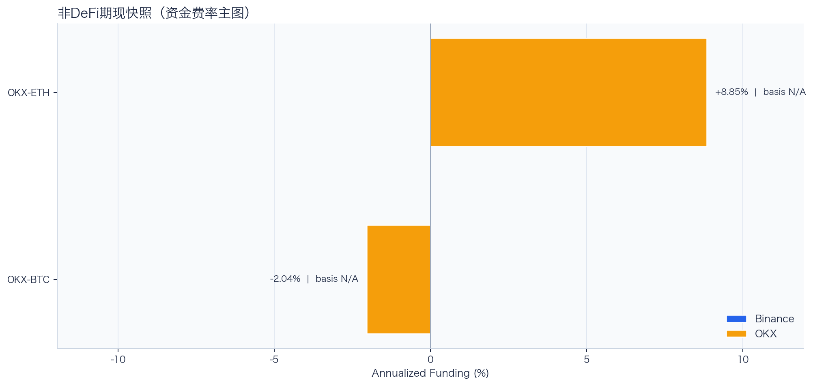
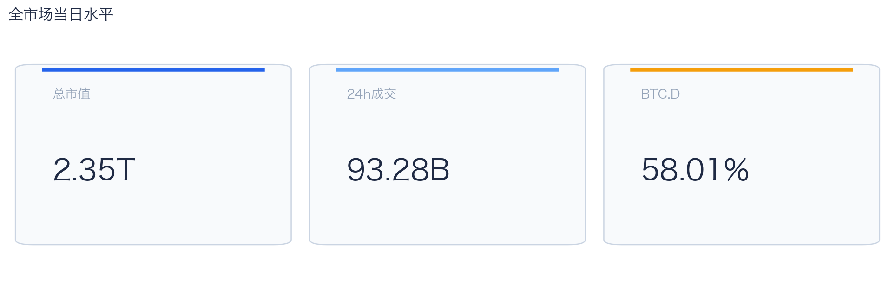
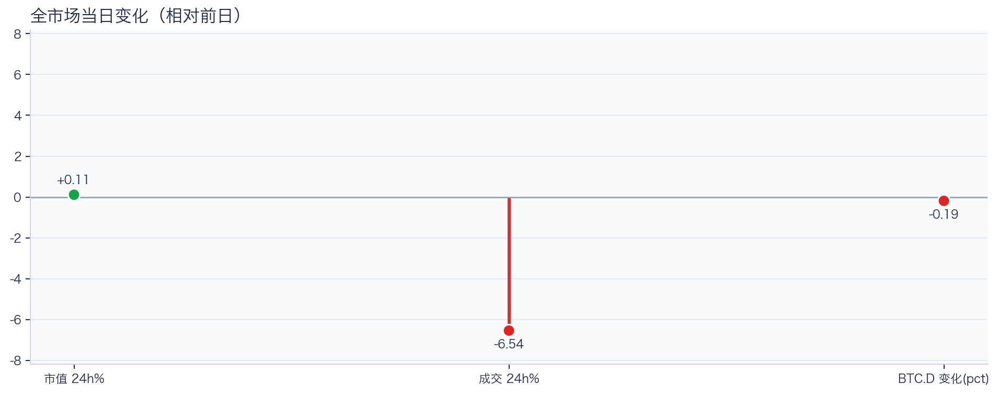
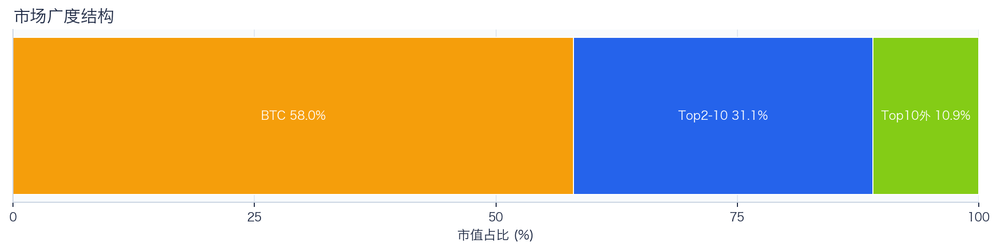
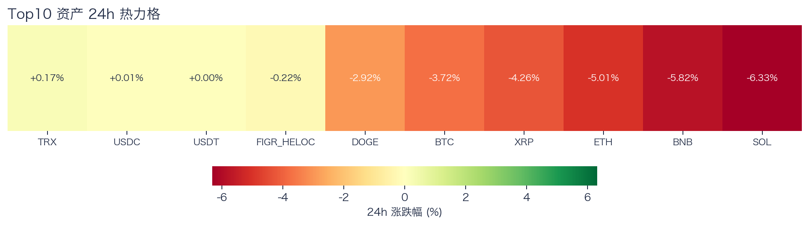
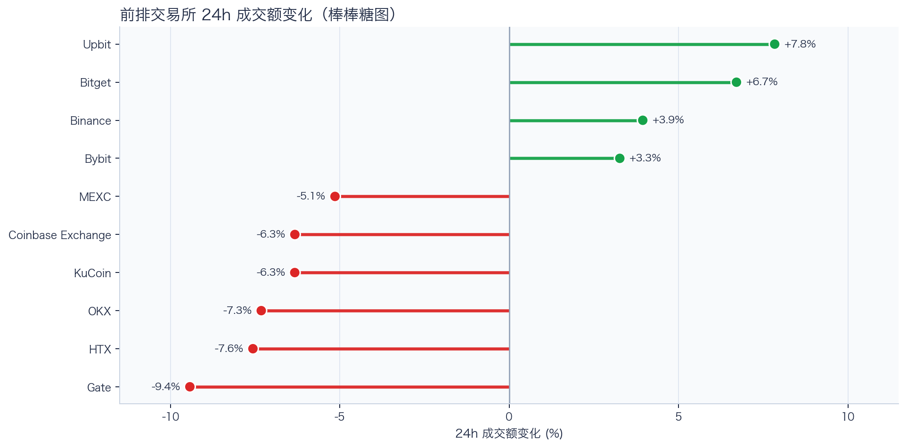
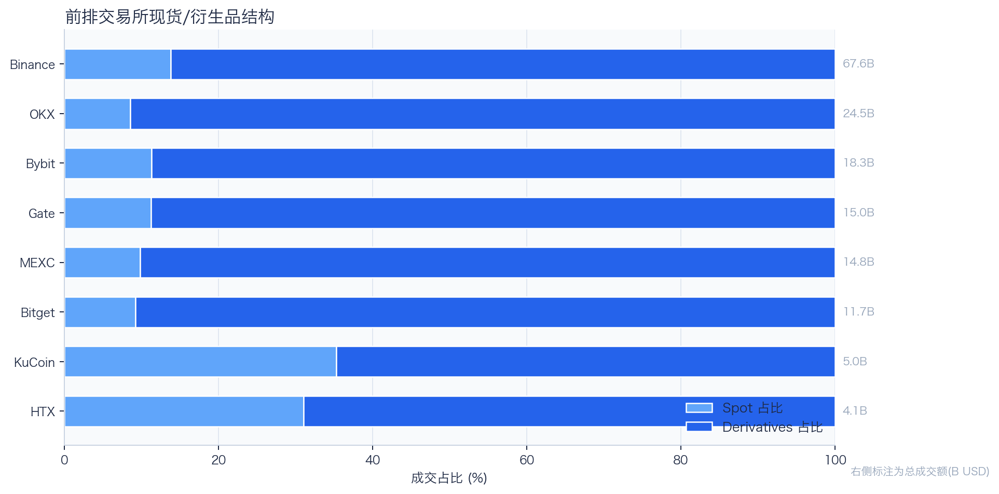
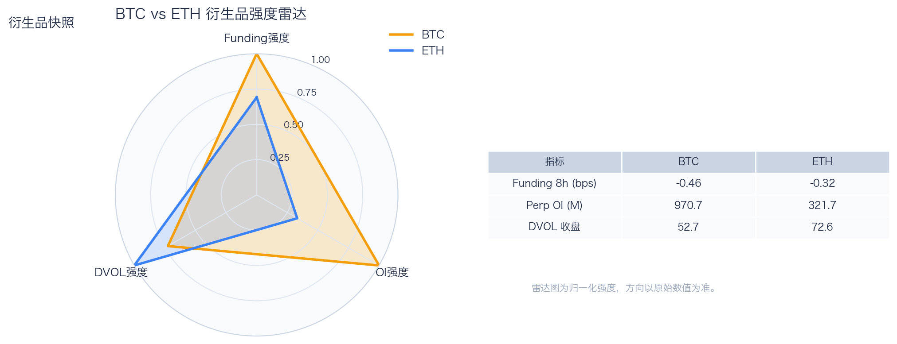
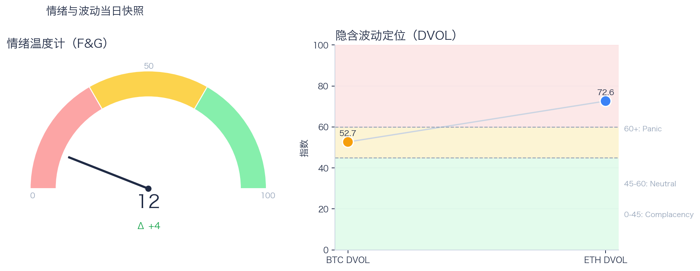

# 二级市场日报（2026-04-02）

## 关键结论
- 全市场市值 $2.35T（24h +0.11%），成交额 $93.28B（24h -6.54%）。
- BTC 主导率 58.01%（-0.19pct），Top10 外占比 10.93%。
- Top10 资产上涨 3 / 下跌 7，平均涨跌幅 -2.81%，首尾分化 6.49pct。
- 衍生品：BTC/ETH 资金费率分别为 -0.46bps / -0.32bps，DVOL 收盘 52.67 / 72.63。

## 今日盘面判断
如果只用一句话概括今天的市场，关键词是 `Range Trading`。价格与成交未形成同向趋势，市场仍在区间内进行结构轮动。长尾占比处于中性修复区，需继续观察是否出现连续两日抬升。这意味着短线虽然有可交易的弹性，但要把它理解成新一轮趋势启动，证据还不够。

## 核心驱动因素
从流动性结构看，多数平台成交走弱，流动性恢复仍依赖少数头部平台；从杠杆维度看，杠杆拥挤度整体可控；在风险定价层面，期权端对尾部波动的定价仍偏谨慎；再结合情绪仍在恐惧区，反弹更容易受到外部事件扰动。整体来看，盘面更像是修复中的高波动环境，而不是低波动顺趋势环境。

## BTC/ETH 24h 趋势判断

- BTC/ETH 24h 趋势数据暂不可用。

## 稳定币收益情况（链上协议）
稳定币收益数据暂不可用（见 Data Gaps）。

## 非 DeFi（交易所期现）

样本范围覆盖 Binance 与 OKX 的 BTC/ETH 现货与永续，用于观察 funding 与 basis 的当期结构。
- Funding 最高样本：OKX-ETH，年化约 8.85%。
- Funding 最低样本：OKX-BTC，年化约 -2.04%。

借币成本多源对比表
| 资产 | Binance(日/年) | OKX(日/年) | Bybit(日/年) | Backpack(日/年) | KuCoin(日/年) | 最低日利率 |
|---|---:|---:|---:|---:|---:|---:|
| USDT | 0.01%/3.22% · 100k | 0.01%/2.51% · 5.0M | N/A | 0.01%/2.79% · 50.0M | N/A | OKX 0.01% |
| USDC | 0.01%/3.04% · 100k | 0.01%/2.51% · 1.0M | N/A | 0.00%/1.51% · 300.0M | N/A | Backpack 0.00% |
| BTC | 0.00%/0.40% · 60 | 0.00%/1.01% · 175 | N/A | 0.00%/0.19% · 3k | N/A | Backpack 0.00% |
| ETH | 0.01%/2.08% · 400 | 0.01%/2.01% · 7k | N/A | 0.00%/1.16% · 20k | N/A | Backpack 0.00% |
说明：统一按日利率/年化展示，单元格尾部为可借额度。
- 交易含义：当 funding 年化显著高于 basis 且持续为正，carry 交易更偏向收取 funding；若 basis 与 funding 同步回落，需降低杠杆并关注资金回流速度。
该部分与链上收益分开统计，便于比较两类策略的收益与风险结构。

## 市场脉冲

截至 2026-04-02，全市场市值 $2.35T，24h 成交额 $93.28B，BTC 主导率 58.01%。
价格上涨但成交回落，反弹质量偏弱，需警惕高位回吐。在这种盘面下，成交能否继续跟上，是判断明天反弹延续还是回吐的第一道分水岭。

相对前日，市值 +0.11%、成交 -6.54%、BTC.D -0.19pct。
把这组变化拆开看，比看单一涨跌更有用：价格、成交、主导率三者同向时，行情更有连续性；一旦出现背离，走势往往会变得更短促、更反复。

## 主导率与市场广度

当前结构为 BTC 58.01% / Top2-10 31.06% / Top10 外 10.93%。长尾占比仍偏低，广度修复还未形成持续趋势。
Top10 外占比处于中性区域，说明扩散迹象出现但尚未形成持续趋势。换句话说，资金目前更愿意在高流动性的核心资产里做仓位调整，而不是大面积扩散到长尾资产。

## 资产与交易所资金流

Top10 中领涨 TRX（+0.17%），尾部 SOL（-6.33%），均值 -2.81%。分化 6.49pct，结构性交易仍是主导。
下跌家数占优，风险偏好修复仍较脆弱，短线追高性价比一般。对交易而言，这通常意味着“选币”比“全市场方向”更重要，错配带来的收益差会明显放大。

前排样本上涨 4 家、下跌 6 家，均值 -2.04%。Upbit 最强（+7.84%），Gate 最弱（-9.43%）。
最强与最弱平台的 24h 变化差达到 17.27pct，说明流动性仍在选择性回流，头部平台的价格发现能力更强。当平台间流量分化明显时，报价连续性和滑点表现会同步分化，执行层面要更关注成交质量。

样本内衍生品成交占比 85.57%。若该占比继续走高且 funding 不同步回落，短线波动脉冲通常会增强。
衍生品占比处于高位，行情更容易出现脉冲式放大，风控阈值建议偏保守。这也是为什么同样的消息面在当前阶段更容易被放大成大振幅走势。

## 衍生品与情绪

资金费率（Funding）仍在中性附近，BTC/ETH 分别 -0.46bps / -0.32bps；未平仓合约（OI）为 $970.70M / $321.71M；隐含波动率指数（DVOL）位于 Neutral（中性波动定价） / Panic（高波动溢价）。
资金费率接近中性，说明方向拥挤度有限；但 DVOL 仍偏高，市场对突发波动仍保留保险溢价。因此更合适的做法不是激进追单边，而是围绕波动管理仓位和节奏。

恐惧与贪婪指数（F&G）当日 12（较前日 +4）；配合 BTC/ETH DVOL 52.67/72.63，当前更像情绪修复中的高波动区。
恐惧区内出现边际改善，说明市场开始试探修复，但尚不足以支持激进风险暴露。只有当情绪、广度和成交三者同时改善，市场才更可能从“反弹交易”切换到“趋势交易”。

## 未来24小时观察
1. 若 Top10 外占比继续抬升且 BTC.D 回落，说明风险偏好开始从核心资产向外扩散。
2. 若衍生品占比继续上升而 funding 仍中性，盘面大概率维持高波动震荡而非顺滑上行。
3. 若 F&G 反弹但 DVOL 不降，代表情绪与风险定价背离，追涨胜率会明显下降。

## 交易与风控含义
- 仓位管理优先级高于方向押注，建议保持核心仓位稳定、战术仓位滚动。
- 若交易所衍生品占比继续上升，建议同步收紧杠杆和止损参数。
- 关注情绪改善与广度扩散是否同步发生，二者背离时避免追逐单边。

## 数据缺口（Data Gaps）
- Binance BTC/ETH 24h 批量数据获取失败，转单币重试: <urlopen error EOF occurred in violation of protocol (_ssl.c:1129)>
- Binance 24h 单币数据获取失败 BTCUSDT: HTTP Error 451: 
- Binance 24h 未返回 BTCUSDT 数据。
- Binance 24h 单币数据获取失败 ETHUSDT: HTTP Error 451: 
- Binance 24h 未返回 ETHUSDT 数据。
- Binance BTCUSDT 1h K线获取失败: HTTP Error 451: 
- Binance ETHUSDT 1h K线获取失败: HTTP Error 451: 
- Binance 非DeFi期现数据获取失败 BTC: HTTP Error 451: 
- Binance 非DeFi期现数据获取失败 ETH: HTTP Error 451: 
- 借币成本部分数据源不可用: Bybit: HTTP Error 403: Forbidden
- DefiLlama 稳定币收益数据获取失败: IncompleteRead(2097152 bytes read)

