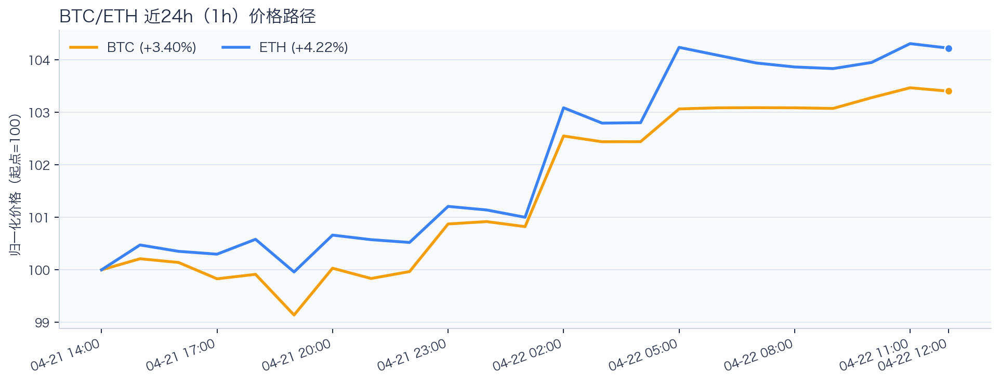
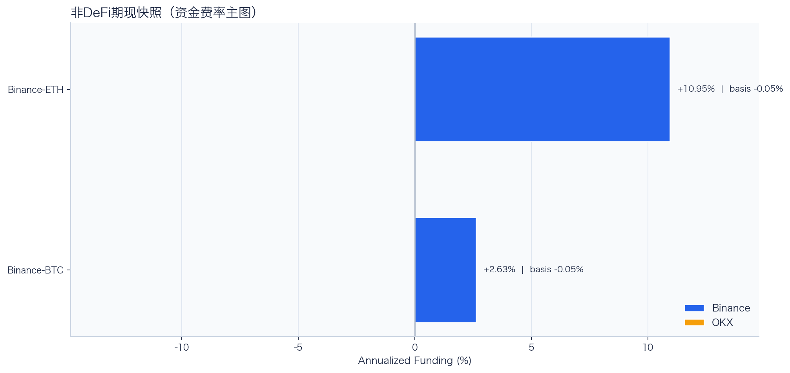
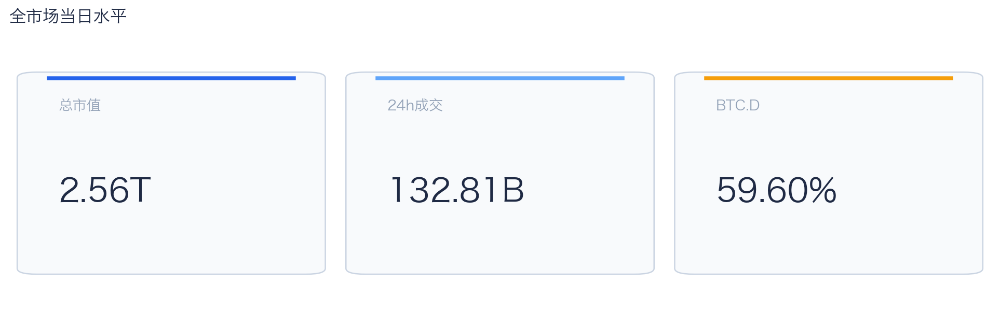
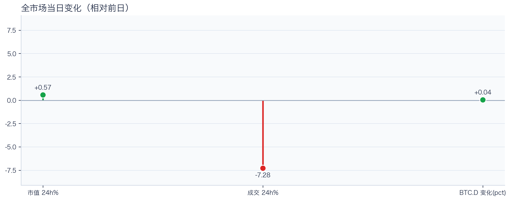
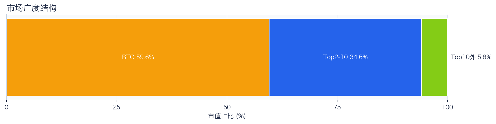
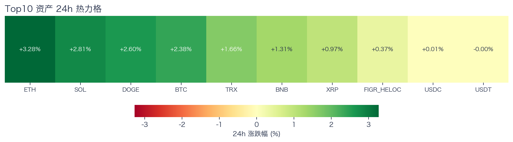
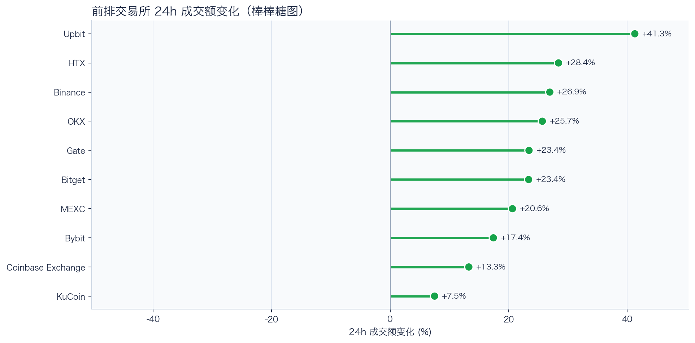
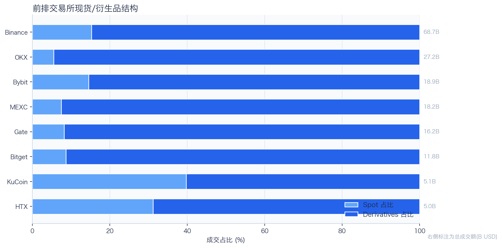
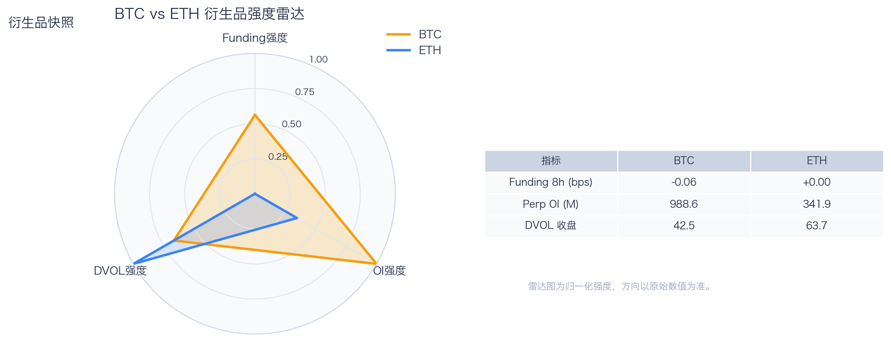
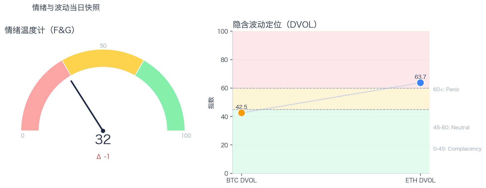

# 二级市场日报（2026-04-22）

## 关键结论
- 全市场市值 $2.56T（24h +0.57%），成交额 $132.81B（24h -7.28%）。
- BTC 主导率 59.60%（+0.04pct），Top10 外占比 5.84%。
- Top10 资产上涨 9 / 下跌 1，平均涨跌幅 +1.54%，首尾分化 3.28pct。
- 衍生品：BTC/ETH 资金费率分别为 -0.06bps / +0.00bps，DVOL 收盘 42.49 / 63.73。

## 今日盘面判断
如果只用一句话概括今天的市场，关键词是 `Range Trading`。价格与成交未形成同向趋势，市场仍在区间内进行结构轮动。广度仍偏窄，增量风险偏好尚未形成持续外溢。这意味着短线虽然有可交易的弹性，但要把它理解成新一轮趋势启动，证据还不够。

## 核心驱动因素
从流动性结构看，多数平台成交回暖，短线流动性环境较前一日改善；从杠杆维度看，杠杆拥挤度整体可控；在风险定价层面，期权端对尾部波动的定价仍偏谨慎；再结合情绪与价格修复节奏尚未完全同步。整体来看，盘面更像是修复中的高波动环境，而不是低波动顺趋势环境。

## BTC/ETH 24h 趋势判断

- BTC：$78,250.82（24h +2.33%，区间 $74,821.57 - $78,452.18，当前位于区间 94%）=> 偏强，上行主导。
- ETH：$2,396.48（24h +3.25%，区间 $2,284.19 - $2,413.83，当前位于区间 87%）=> 偏强，上行主导。
- 简评：BTC 与 ETH 同步偏强，短线仍有上行动能。

## 稳定币收益情况（链上协议）
按安全优先（协议成熟度、链层风险、是否依赖激励）筛选了 10 个主流池；原生供给利率均值约 +10.38%。
其中包含奖励补贴的池有 0 个，补贴收益已单列，不与原生利率混合。

核心观察
- 利率结构：Total APY 位于 1.94% 至 16.57% 区间。
- 资金集中：TVL 主要集中在 Spark-USDT（Ethereum，TVL $904.77M）、Aave-USDC（Base，TVL $15.88M）。
- 收益领先：当前收益靠前样本包括 Compound-USDS（Ethereum，Total 16.57%）、Aave-USDT（Ethereum，Total 12.60%）。

风险提示
- 利用率达到 70% 以上的池有 8 个，杠杆需求主要集中在头部池。
- 利用率最高样本：Aave-USDC（Ethereum） 100.00%，Borrow APY 15.02%。
- 奖励收益池数量：0 个。当前收益主体仍以原生利率为主。

数据覆盖：Aave API(6)，Compound API(6)，DefiLlama(19)，Morpho API(1)。

稳定币收益对照表（安全优先）
| 协议 | 链 | 币种 | Supply | Borrow | Rewards | Total | Utilization | TVL | 数据源 |
|---|---|---|---:|---:|---:|---:|---:|---:|---|
| Aave | Ethereum | USDS | 2.67% | 6.16% | N/A | 1.94% | 58.78% | $15.70M | DefiLlama+Aave API |
| Spark | Ethereum | USDT | 3.00% | N/A | N/A | 3.00% | N/A | $904.77M | DefiLlama |
| Compound | Ethereum | USDS | 16.57% | 19.01% | 0.00% | 16.57% | 94.17% | $1.96M | Compound API |
| Morpho | Ethereum | USDC | 7.51% | 8.48% | 0.00% | 7.51% | 89.03% | $161,308 | Morpho API |
| Aave | Ethereum | DAI | 28.96% | 41.00% | N/A | 9.57% | 98.71% | $7.17M | DefiLlama+Aave API |
| Aave | Ethereum | PYUSD | 3.82% | 4.95% | N/A | 3.74% | 86.16% | $4.24M | DefiLlama+Aave API |
| Aave | Ethereum | USDC | 13.43% | 15.02% | N/A | 3.83% | 100.00% | $2.30M | DefiLlama+Aave API |
| Aave | Ethereum | USDT | 13.42% | 15.02% | N/A | 12.60% | 100.00% | $22,219 | DefiLlama+Aave API |
| Aave | Base | USDC | 4.90% | 6.00% | N/A | 4.59% | 91.32% | $15.88M | DefiLlama+Aave API |
| Aave | Arbitrum | USDC | 9.51% | 11.03% | N/A | 8.75% | 96.46% | $6.11M | DefiLlama+Aave API |

稳定币收益对比（扩展样本，TVL≥$1M，共 20 条）
| 币种 | 协议 | 链 | Supply | Borrow | Rewards | Total | Utilization | TVL | 数据源 |
|---|---|---|---:|---:|---:|---:|---:|---:|---|
| USDC | Aave | Ethereum | 13.43% | 15.02% | N/A | 3.83% | 100.00% | $2.30M | DefiLlama+Aave API |
| USDC | Aave | Arbitrum | 9.51% | 11.03% | N/A | 8.75% | 96.46% | $6.11M | DefiLlama+Aave API |
| USDC | Aave | Base | 4.90% | 6.00% | N/A | 4.59% | 91.32% | $15.88M | DefiLlama+Aave API |
| USDC | Spark | Ethereum | 3.75% | N/A | N/A | 3.75% | N/A | $490.75M | DefiLlama |
| USDC | Compound | Ethereum | 2.48% | 3.42% | 0.12% | 2.61% | 68.99% | $385.69M | DefiLlama+Compound API |
| USDC | Compound | Arbitrum | 2.34% | 3.30% | 0.00% | 2.34% | 64.98% | $21.12M | DefiLlama+Compound API |
| USDC | Compound | Base | 4.23% | 5.11% | 0.00% | 4.23% | 90.31% | $9.63M | DefiLlama+Compound API |
| USDC | Morpho | Base | 27.13% | 27.13% | N/A | 27.13% | 100.00% | $1.26M | DefiLlama+Morpho API |
| USDT | Spark | Ethereum | 3.00% | N/A | N/A | 3.00% | N/A | $904.77M | DefiLlama |
| USDT | Compound | Ethereum | 4.32% | 5.22% | 0.14% | 4.46% | 90.34% | $182.96M | DefiLlama+Compound API |
| USDT | Compound | Arbitrum | 2.00% | 3.05% | 0.00% | 2.00% | 55.68% | $19.77M | DefiLlama+Compound API |
| DAI | Aave | Ethereum | 28.96% | 41.00% | N/A | 9.57% | 98.71% | $7.17M | DefiLlama+Aave API |
| USDS | Aave | Ethereum | 2.67% | 6.16% | N/A | 1.94% | 58.78% | $15.70M | DefiLlama+Aave API |
| USDS | Spark | Ethereum | 2.55% | N/A | N/A | 2.55% | N/A | $96.15M | DefiLlama |
| USDS | Compound | Ethereum | 16.57% | 19.01% | 0.00% | 16.57% | 94.17% | $1.96M | Compound API |
| SUSDS | Spark | Ethereum | 0.00% | N/A | N/A | 0.00% | N/A | $3.43M | DefiLlama |
| SUSDS | Morpho | Ethereum | N/A | N/A | N/A | 0.00% | N/A | $164.99M | DefiLlama |
| SUSDS | Morpho | Arbitrum | N/A | N/A | N/A | 0.00% | N/A | $5.83M | DefiLlama |
| PYUSD | Aave | Ethereum | 3.82% | 4.95% | N/A | 3.74% | 86.16% | $4.24M | DefiLlama+Aave API |
| PYUSD | Spark | Ethereum | 0.39% | N/A | N/A | 0.39% | N/A | $88.81M | DefiLlama |

跨源补充（比 taoli 更全）
- 新增对比源：DefiLlama 全量稳定币池（筛选口径）+ Bitcompare CeFi 利率，并与现有链上主流池快照交叉核对。
- 覆盖规模：原链上精表 20 条；DefiLlama 扩展样本 64 条（展示 Top20）；Bitcompare 稳定币利率样本 5 条。
- 覆盖维度：扩展样本覆盖 44 个协议、13 条链、44 类稳定币。
- 口径说明：Bitcompare 为平台展示 APY，taoli 为 Binance 借币年化，两者用于横向参考，不等价于无风险套利收益。

稳定币收益补充表（DefiLlama 扩展，TVL≥$30M，去重后 Top20）
| 币种 | 协议 | 链 | Base | Rewards | Total | TVL | 数据源 |
|---|---|---|---:|---:|---:|---:|---|
| SUSDS | sky-lending | Ethereum | N/A | N/A | 3.75% | $5.80B | DefiLlama API |
| USYC | circle-usyc | BSC | 3.35% | N/A | 3.35% | $2.79B | DefiLlama API |
| USDC | maple | Ethereum | 4.82% | 0.00% | 4.82% | $2.52B | DefiLlama API |
| SUSDE | ethena-usde | Ethereum | 5.20% | N/A | 5.20% | $2.51B | DefiLlama API |
| USDT | maple | Ethereum | 4.80% | 0.00% | 4.80% | $1.26B | DefiLlama API |
| BUIDL | blackrock-buidl | Ethereum | 3.55% | N/A | 3.55% | $1.12B | DefiLlama API |
| USDYC | ondo-yield-assets | Ethereum | 3.55% | N/A | 3.55% | $808.25M | DefiLlama API |
| USTB | superstate-ustb | Ethereum | 3.67% | N/A | 3.67% | $728.46M | DefiLlama API |
| BUIDL | blackrock-buidl | Aptos | 3.21% | N/A | 3.21% | $559.04M | DefiLlama API |
| USDY | ondo-yield-assets | Ethereum | 3.55% | N/A | 3.55% | $534.15M | DefiLlama API |
| BUIDL | blackrock-buidl | Solana | 3.52% | N/A | 3.52% | $527.34M | DefiLlama API |
| BUIDL | blackrock-buidl | BSC | 3.21% | N/A | 3.21% | $508.32M | DefiLlama API |
| BUSD0 | usual-usd0 | Ethereum | N/A | 3.37% | 3.37% | $503.81M | DefiLlama API |
| USDC | jupiter-lend | Solana | 3.28% | 1.13% | 4.41% | $418.90M | DefiLlama API |
| SUSDS | sky-lending | Arbitrum | N/A | N/A | 3.75% | $357.66M | DefiLlama API |
| USDD | justlend | Tron | 0.00% | 4.21% | 4.21% | $308.31M | DefiLlama API |
| SUSDAI | usd-ai | Arbitrum | 7.11% | N/A | 7.11% | $259.95M | DefiLlama API |
| DAI | sky-lending | Ethereum | N/A | N/A | 1.25% | $244.06M | DefiLlama API |
| USDY | ondo-yield-assets | Solana | 3.55% | N/A | 3.55% | $180.17M | DefiLlama API |
| REUSD | re | Ethereum | 6.08% | N/A | 6.08% | $164.77M | DefiLlama API |

CeFi 稳定币收益/成本对比（Bitcompare vs taoli）
| 币种 | Bitcompare 最高APY | 对应平台 | taoli(Binance借币年化) | 利差(APY-借币) |
|---|---:|---|---:|---:|
| DAI | 7.00% | EarnPark | N/A | N/A |
| TUSD | 1.46% | JustLend | N/A | N/A |
| USDC | 4.00% | EarnPark | N/A | N/A |
| USDP | 10.50% | Nexo | N/A | N/A |
| USDT | 20.00% | EarnPark | N/A | N/A |

交易含义：当前稳定币收益更偏“头部池中等收益 + 局部高利用率”结构，策略上优先流动性与透明度，再考虑收益增强。
部分池的 Borrow 与 Utilization 暂未返回，表内仅展示已获取字段。

## 非 DeFi（交易所期现）

样本范围覆盖 Binance 与 OKX 的 BTC/ETH 现货与永续，用于观察 funding 与 basis 的当期结构。
- Funding 最高样本：Binance-ETH，年化约 10.95%。
- Funding 最低样本：Binance-BTC，年化约 2.63%。
- Basis 偏离最大：Binance-BTC，相对指数约 -0.05%。
- 交易含义：当 funding 年化显著高于 basis 且持续为正，carry 交易更偏向收取 funding；若 basis 与 funding 同步回落，需降低杠杆并关注资金回流速度。
该部分与链上收益分开统计，便于比较两类策略的收益与风险结构。

## 市场脉冲

截至 2026-04-22，全市场市值 $2.56T，24h 成交额 $132.81B，BTC 主导率 59.60%。
价格上涨但成交回落，反弹质量偏弱，需警惕高位回吐。在这种盘面下，成交能否继续跟上，是判断明天反弹延续还是回吐的第一道分水岭。

相对前日，市值 +0.57%、成交 -7.28%、BTC.D +0.04pct。
把这组变化拆开看，比看单一涨跌更有用：价格、成交、主导率三者同向时，行情更有连续性；一旦出现背离，走势往往会变得更短促、更反复。

## 主导率与市场广度

当前结构为 BTC 59.60% / Top2-10 34.55% / Top10 外 5.84%。长尾占比仍偏低，广度修复还未形成持续趋势。
Top10 外占比处于低位，风险偏好仍主要停留在 BTC 与头部资产。换句话说，资金目前更愿意在高流动性的核心资产里做仓位调整，而不是大面积扩散到长尾资产。

## 资产与交易所资金流

Top10 中领涨 ETH（+3.28%），尾部 USDT（-0.00%），均值 +1.54%。分化 3.28pct，结构性交易仍是主导。
上涨家数明显占优，但首尾分化仍大，表明反弹并非无差别普涨。对交易而言，这通常意味着“选币”比“全市场方向”更重要，错配带来的收益差会明显放大。

前排样本上涨 10 家、下跌 0 家，均值 +22.80%。Upbit 最强（+41.29%），KuCoin 最弱（+7.50%）。
最强与最弱平台的 24h 变化差达到 33.79pct，说明流动性仍在选择性回流，头部平台的价格发现能力更强。当平台间流量分化明显时，报价连续性和滑点表现会同步分化，执行层面要更关注成交质量。

样本内衍生品成交占比 85.42%。若该占比继续走高且 funding 不同步回落，短线波动脉冲通常会增强。
衍生品占比处于高位，行情更容易出现脉冲式放大，风控阈值建议偏保守。这也是为什么同样的消息面在当前阶段更容易被放大成大振幅走势。

## 衍生品与情绪

资金费率（Funding）仍在中性附近，BTC/ETH 分别 -0.06bps / +0.00bps；未平仓合约（OI）为 $988.61M / $341.92M；隐含波动率指数（DVOL）位于 Complacency（低波动定价） / Panic（高波动溢价）。
Funding 与 DVOL 的组合显示，方向拥挤暂未极端，但尾部风险定价仍未完全回落。因此更合适的做法不是激进追单边，而是围绕波动管理仓位和节奏。

恐惧与贪婪指数（F&G）当日 32（较前日 -1）；配合 BTC/ETH DVOL 42.49/63.73，当前更像情绪修复中的高波动区。
情绪回到中性区，若后续成交和广度同步改善，趋势性机会会明显增多。只有当情绪、广度和成交三者同时改善，市场才更可能从“反弹交易”切换到“趋势交易”。

## 未来24小时观察
1. 若 Top10 外占比继续抬升且 BTC.D 回落，说明风险偏好开始从核心资产向外扩散。
2. 若衍生品占比继续上升而 funding 仍中性，盘面大概率维持高波动震荡而非顺滑上行。
3. 若 F&G 反弹但 DVOL 不降，代表情绪与风险定价背离，追涨胜率会明显下降。

## 交易与风控含义
- 仓位管理优先级高于方向押注，建议保持核心仓位稳定、战术仓位滚动。
- 若交易所衍生品占比继续上升，建议同步收紧杠杆和止损参数。
- 关注情绪改善与广度扩散是否同步发生，二者背离时避免追逐单边。

## 数据缺口（Data Gaps）
- OKX 非DeFi期现数据获取失败 BTC: <urlopen error EOF occurred in violation of protocol (_ssl.c:1129)>
- OKX 非DeFi期现数据获取失败 ETH: <urlopen error EOF occurred in violation of protocol (_ssl.c:1129)>
- 借币成本多源数据获取失败: Binance: <urlopen error EOF occurred in violation of protocol (_ssl.c:1129)> | OKX: <urlopen error EOF occurred in violation of protocol (_ssl.c:1129)> | Bybit: <urlopen error EOF occurred in violation of protocol (_ssl.c:1129)> | Backpack: <urlopen error EOF occurred in violation of protocol (_ssl.c:1129)>

