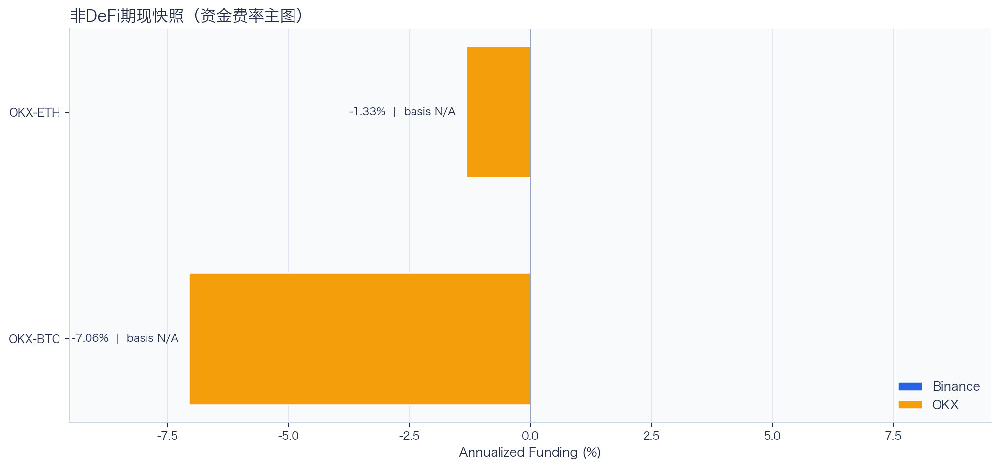
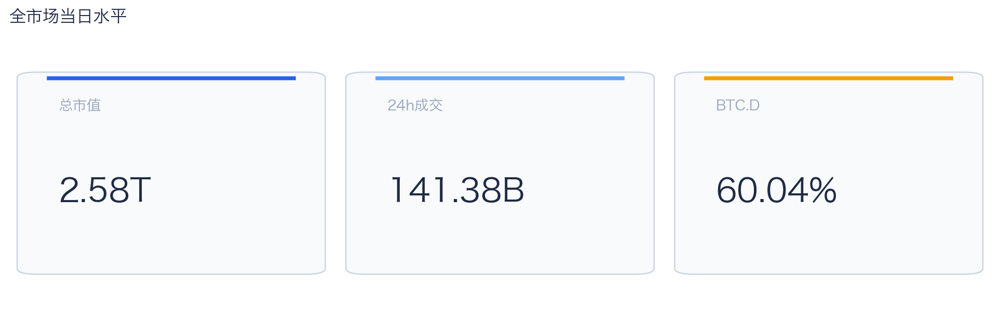
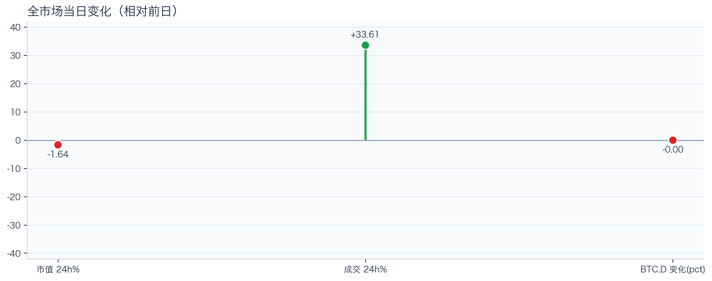
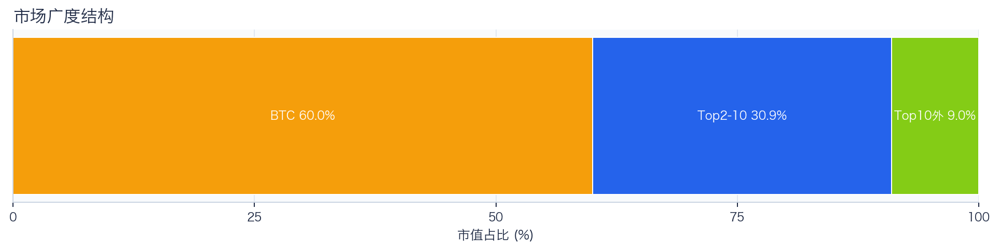
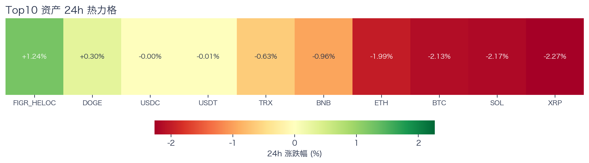
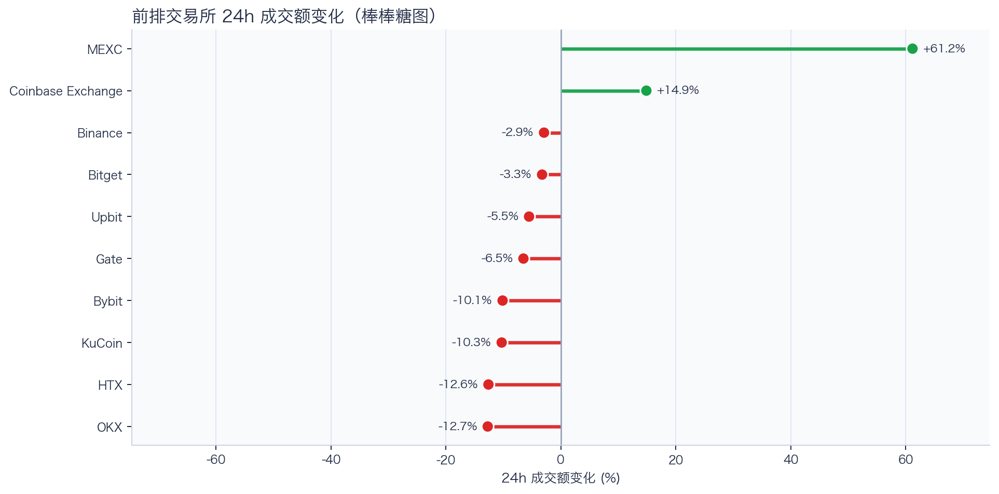
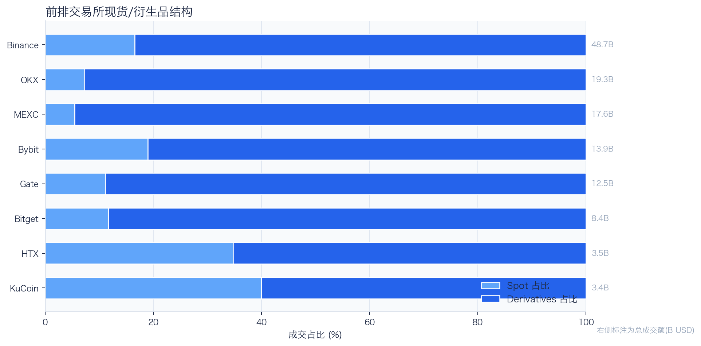
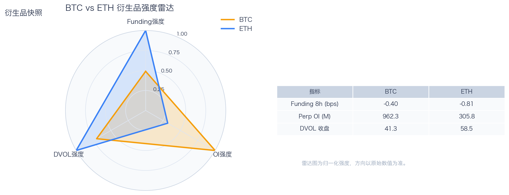
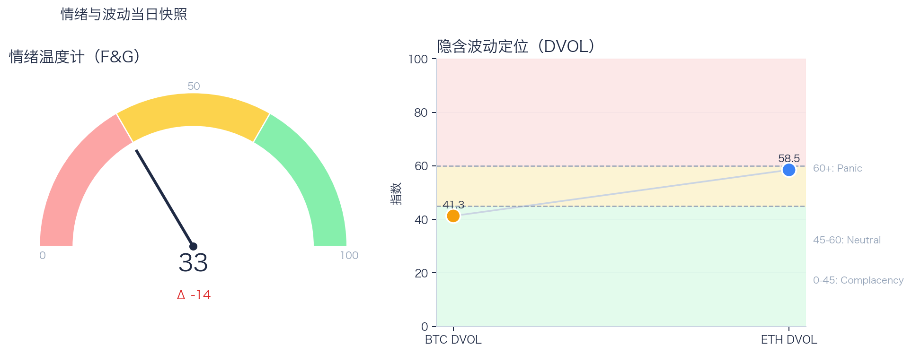

# 二级市场日报（2026-04-28）

## 关键结论
- 全市场市值 $2.58T（24h -1.64%），成交额 $141.38B（24h +33.61%）。
- BTC 主导率 60.04%（-0.00pct），Top10 外占比 9.02%。
- Top10 资产上涨 2 / 下跌 8，平均涨跌幅 -0.86%，首尾分化 3.50pct。
- 衍生品：BTC/ETH 资金费率分别为 -0.40bps / -0.81bps，DVOL 收盘 41.27 / 58.48。

## 今日盘面判断
如果只用一句话概括今天的市场，关键词是 `Stress Repricing`。价格回撤但换手抬升，说明市场在高分歧下重估风险，波动脉冲概率偏高。广度仍偏窄，增量风险偏好尚未形成持续外溢。这意味着短线虽然有可交易的弹性，但要把它理解成新一轮趋势启动，证据还不够。

## 核心驱动因素
从流动性结构看，多数平台成交走弱，流动性恢复仍依赖少数头部平台；从杠杆维度看，杠杆拥挤度整体可控；在风险定价层面，隐含波动率回落至相对低位，事件冲击前的保护成本下降；再结合情绪与价格修复节奏尚未完全同步。整体来看，盘面更像是修复中的高波动环境，而不是低波动顺趋势环境。

## BTC/ETH 24h 趋势判断

- BTC/ETH 24h 趋势数据暂不可用。

## 稳定币收益情况（链上协议）
按安全优先（协议成熟度、链层风险、是否依赖激励）筛选了 10 个主流池；原生供给利率均值约 +5.47%。
其中包含奖励补贴的池有 0 个，补贴收益已单列，不与原生利率混合。

核心观察
- 利率结构：Total APY 位于 0.67% 至 11.52% 区间。
- 资金集中：TVL 主要集中在 Spark-USDT（Ethereum，TVL $1.00B）、Aave-USDC（Ethereum，TVL $122.97M）。
- 收益领先：当前收益靠前样本包括 Compound-USDS（Ethereum，Total 11.52%）、Morpho-USDC（Ethereum，Total 7.11%）。

风险提示
- 利用率达到 70% 以上的池有 8 个，杠杆需求主要集中在头部池。
- 利用率最高样本：Aave-USDT（Ethereum） 93.76%，Borrow APY 6.40%。
- 奖励收益池数量：0 个。当前收益主体仍以原生利率为主。

数据覆盖：Aave API(7)，Compound API(6)，DefiLlama(17)。

稳定币收益对照表（安全优先）
| 协议 | 链 | 币种 | Supply | Borrow | Rewards | Total | Utilization | TVL | 数据源 |
|---|---|---|---:|---:|---:|---:|---:|---:|---|
| Aave | Ethereum | USDC | 4.86% | 5.82% | N/A | 4.80% | 93.32% | $122.97M | DefiLlama+Aave API |
| Spark | Ethereum | USDT | 3.00% | N/A | N/A | 3.00% | N/A | $1.00B | DefiLlama |
| Compound | Ethereum | USDS | 11.52% | 13.33% | 0.00% | 11.52% | 92.59% | $1.97M | Compound API |
| Morpho | Ethereum | USDC | 7.11% | 8.18% | 0.00% | 7.11% | 87.42% | $164,488 | Morpho API |
| Aave | Ethereum | USDT | 5.37% | 6.40% | N/A | 5.24% | 93.76% | $119.60M | DefiLlama+Aave API |
| Aave | Ethereum | USDS | 0.67% | 5.79% | N/A | 0.67% | 15.80% | $27.04M | DefiLlama+Aave API |
| Aave | Ethereum | DAI | 8.86% | 12.85% | N/A | 6.73% | 93.62% | $7.80M | DefiLlama+Aave API |
| Aave | Ethereum | PYUSD | 3.87% | 4.98% | N/A | 3.80% | 86.80% | $3.65M | DefiLlama+Aave API |
| Aave | Base | USDC | 3.55% | 4.50% | N/A | 3.49% | 88.04% | $20.73M | DefiLlama+Aave API |
| Aave | Arbitrum | USDC | 5.90% | 7.10% | N/A | 5.80% | 92.86% | $11.02M | DefiLlama+Aave API |

稳定币收益对比（扩展样本，TVL≥$1M，共 18 条）
| 币种 | 协议 | 链 | Supply | Borrow | Rewards | Total | Utilization | TVL | 数据源 |
|---|---|---|---:|---:|---:|---:|---:|---:|---|
| USDC | Aave | Ethereum | 4.86% | 5.82% | N/A | 4.80% | 93.32% | $122.97M | DefiLlama+Aave API |
| USDC | Aave | Arbitrum | 5.90% | 7.10% | N/A | 5.80% | 92.86% | $11.02M | DefiLlama+Aave API |
| USDC | Aave | Base | 3.55% | 4.50% | N/A | 3.49% | 88.04% | $20.73M | DefiLlama+Aave API |
| USDC | Spark | Ethereum | 3.65% | N/A | N/A | 3.65% | N/A | $528.76M | DefiLlama |
| USDC | Compound | Ethereum | 2.82% | 3.68% | 0.14% | 2.96% | 78.31% | $341.04M | DefiLlama+Compound API |
| USDC | Compound | Arbitrum | 2.61% | 3.51% | 0.00% | 2.61% | 72.42% | $19.99M | DefiLlama+Compound API |
| USDC | Compound | Base | 8.77% | 10.22% | 0.00% | 8.77% | 91.73% | $9.36M | DefiLlama+Compound API |
| USDT | Aave | Ethereum | 5.37% | 6.40% | N/A | 5.24% | 93.76% | $119.60M | DefiLlama+Aave API |
| USDT | Spark | Ethereum | 3.00% | N/A | N/A | 3.00% | N/A | $1.00B | DefiLlama |
| USDT | Compound | Ethereum | 2.92% | 3.75% | 0.13% | 3.05% | 81.07% | $192.43M | DefiLlama+Compound API |
| USDT | Compound | Arbitrum | 2.09% | 3.11% | 0.00% | 2.09% | 58.11% | $19.71M | DefiLlama+Compound API |
| DAI | Aave | Ethereum | 8.86% | 12.85% | N/A | 6.73% | 93.62% | $7.80M | DefiLlama+Aave API |
| USDS | Aave | Ethereum | 0.67% | 5.79% | N/A | 0.67% | 15.80% | $27.04M | DefiLlama+Aave API |
| USDS | Spark | Ethereum | 2.48% | N/A | N/A | 2.48% | N/A | $47.64M | DefiLlama |
| USDS | Compound | Ethereum | 11.52% | 13.33% | 0.00% | 11.52% | 92.59% | $1.97M | Compound API |
| SUSDS | Spark | Ethereum | 0.00% | N/A | N/A | 0.00% | N/A | $3.43M | DefiLlama |
| PYUSD | Aave | Ethereum | 3.87% | 4.98% | N/A | 3.80% | 86.80% | $3.65M | DefiLlama+Aave API |
| PYUSD | Spark | Ethereum | 0.47% | N/A | N/A | 0.47% | N/A | $86.49M | DefiLlama |

跨源补充（比 taoli 更全）
- 新增对比源：DefiLlama 全量稳定币池（筛选口径）+ Bitcompare CeFi 利率，并与现有链上主流池快照交叉核对。
- 覆盖规模：原链上精表 18 条；DefiLlama 扩展样本 85 条（展示 Top20）；Bitcompare 稳定币利率样本 7 条。
- 覆盖维度：扩展样本覆盖 42 个协议、14 条链、59 类稳定币。
- 口径说明：Bitcompare 为平台展示 APY，taoli 为 Binance 借币年化，两者用于横向参考，不等价于无风险套利收益。

稳定币收益补充表（DefiLlama 扩展，TVL≥$30M，去重后 Top20）
| 币种 | 协议 | 链 | Base | Rewards | Total | TVL | 数据源 |
|---|---|---|---:|---:|---:|---:|---|
| SUSDS | sky-lending | Ethereum | N/A | N/A | 3.65% | $5.42B | DefiLlama API |
| USYC | circle-usyc | BSC | 3.24% | N/A | 3.24% | $2.79B | DefiLlama API |
| USDC | maple | Ethereum | 4.83% | 0.00% | 4.83% | $2.61B | DefiLlama API |
| SUSDE | ethena-usde | Ethereum | 5.33% | N/A | 5.33% | $2.15B | DefiLlama API |
| BUIDL | blackrock-buidl | Ethereum | 3.58% | N/A | 3.58% | $1.12B | DefiLlama API |
| USTB | superstate-ustb | Ethereum | 3.35% | N/A | 3.35% | $904.72M | DefiLlama API |
| USDT | maple | Ethereum | 4.59% | 0.00% | 4.59% | $871.39M | DefiLlama API |
| USDYC | ondo-yield-assets | Ethereum | 3.55% | N/A | 3.55% | $808.71M | DefiLlama API |
| BUIDL | blackrock-buidl | Aptos | 3.24% | N/A | 3.24% | $559.05M | DefiLlama API |
| USDY | ondo-yield-assets | Ethereum | 3.55% | N/A | 3.55% | $532.18M | DefiLlama API |
| BUIDL | blackrock-buidl | BSC | 3.24% | N/A | 3.24% | $508.61M | DefiLlama API |
| BUSD0 | usual-usd0 | Ethereum | N/A | 3.20% | 3.20% | $504.31M | DefiLlama API |
| STEAKUSDC | morpho-blue | Base | 4.07% | 0.00% | 4.07% | $470.97M | DefiLlama API |
| USDC | jupiter-lend | Solana | 3.06% | 1.11% | 4.16% | $425.37M | DefiLlama API |
| SUSDS | sky-lending | Arbitrum | N/A | N/A | 3.65% | $357.94M | DefiLlama API |
| GTUSDCP | morpho-blue | Base | 4.07% | 0.00% | 4.07% | $353.55M | DefiLlama API |
| USDD | justlend | Tron | 0.00% | 4.25% | 4.25% | $322.00M | DefiLlama API |
| SUSDAI | usd-ai | Arbitrum | 7.09% | N/A | 7.09% | $263.46M | DefiLlama API |
| DAI | sky-lending | Ethereum | N/A | N/A | 1.25% | $241.80M | DefiLlama API |
| BUIDL | blackrock-buidl | Solana | 3.55% | N/A | 3.55% | $231.53M | DefiLlama API |

CeFi 稳定币收益/成本对比（Bitcompare vs taoli）
| 币种 | Bitcompare 最高APY | 对应平台 | taoli(Binance借币年化) | 利差(APY-借币) |
|---|---:|---|---:|---:|
| DAI | 7.00% | EarnPark | N/A | N/A |
| PYUSD | 6.64% | Euler Finance | N/A | N/A |
| TUSD | 1.38% | JustLend | N/A | N/A |
| USDC | 4.00% | EarnPark | 2.82% | 1.18% |
| USDE | 5.44% | Pendle | N/A | N/A |
| USDP | 10.50% | Nexo | N/A | N/A |
| USDT | 20.00% | EarnPark | 3.00% | 17.00% |

交易含义：当前稳定币收益更偏“头部池中等收益 + 局部高利用率”结构，策略上优先流动性与透明度，再考虑收益增强。
部分池的 Borrow 与 Utilization 暂未返回，表内仅展示已获取字段。

## 非 DeFi（交易所期现）

样本范围覆盖 Binance 与 OKX 的 BTC/ETH 现货与永续，用于观察 funding 与 basis 的当期结构。
- Funding 最高样本：OKX-ETH，年化约 -1.33%。
- Funding 最低样本：OKX-BTC，年化约 -7.06%。

借币成本多源对比表
| 资产 | Binance(日/年) | OKX(日/年) | Bybit(日/年) | Backpack(日/年) | KuCoin(日/年) | 最低日利率 |
|---|---:|---:|---:|---:|---:|---:|
| USDT | 0.01%/3.00% · 100k | 0.01%/2.51% · 5.0M | N/A | 0.01%/3.34% · 50.0M | N/A | OKX 0.01% |
| USDC | 0.01%/2.82% · 100k | 0.00%/1.01% · 1.0M | N/A | 0.00%/1.56% · 300.0M | N/A | OKX 0.00% |
| BTC | 0.00%/0.42% · 60 | 0.00%/1.01% · 175 | N/A | 0.00%/0.37% · 3k | N/A | Backpack 0.00% |
| ETH | 0.01%/2.18% · 400 | 0.01%/2.01% · 7k | N/A | 0.01%/2.00% · 20k | N/A | Backpack 0.01% |
说明：统一按日利率/年化展示，单元格尾部为可借额度。
- 交易含义：当 funding 年化显著高于 basis 且持续为正，carry 交易更偏向收取 funding；若 basis 与 funding 同步回落，需降低杠杆并关注资金回流速度。
该部分与链上收益分开统计，便于比较两类策略的收益与风险结构。

## 市场脉冲

截至 2026-04-28，全市场市值 $2.58T，24h 成交额 $141.38B，BTC 主导率 60.04%。
价格下行但换手放大，反映分歧加剧，通常伴随更高的日内波动。在这种盘面下，成交能否继续跟上，是判断明天反弹延续还是回吐的第一道分水岭。

相对前日，市值 -1.64%、成交 +33.61%、BTC.D -0.00pct。
把这组变化拆开看，比看单一涨跌更有用：价格、成交、主导率三者同向时，行情更有连续性；一旦出现背离，走势往往会变得更短促、更反复。

## 主导率与市场广度

当前结构为 BTC 60.04% / Top2-10 30.95% / Top10 外 9.02%。长尾占比仍偏低，广度修复还未形成持续趋势。
Top10 外占比处于低位，风险偏好仍主要停留在 BTC 与头部资产。换句话说，资金目前更愿意在高流动性的核心资产里做仓位调整，而不是大面积扩散到长尾资产。

## 资产与交易所资金流

Top10 中领涨 FIGR_HELOC（+1.24%），尾部 XRP（-2.27%），均值 -0.86%。分化 3.50pct，结构性交易仍是主导。
下跌家数占优，风险偏好修复仍较脆弱，短线追高性价比一般。对交易而言，这通常意味着“选币”比“全市场方向”更重要，错配带来的收益差会明显放大。

前排样本上涨 2 家、下跌 8 家，均值 +1.21%。MEXC 最强（+61.20%），OKX 最弱（-12.72%）。
最强与最弱平台的 24h 变化差达到 73.93pct，说明流动性仍在选择性回流，头部平台的价格发现能力更强。当平台间流量分化明显时，报价连续性和滑点表现会同步分化，执行层面要更关注成交质量。

样本内衍生品成交占比 83.93%。若该占比继续走高且 funding 不同步回落，短线波动脉冲通常会增强。
衍生品仍是主导成交形态，价格连续性更多由杠杆侧情绪决定。这也是为什么同样的消息面在当前阶段更容易被放大成大振幅走势。

## 衍生品与情绪

资金费率（Funding）仍在中性附近，BTC/ETH 分别 -0.40bps / -0.81bps；未平仓合约（OI）为 $962.34M / $305.79M；隐含波动率指数（DVOL）位于 Complacency（低波动定价） / Neutral（中性波动定价）。
Funding 与 DVOL 的组合显示，方向拥挤暂未极端，但尾部风险定价仍未完全回落。因此更合适的做法不是激进追单边，而是围绕波动管理仓位和节奏。

恐惧与贪婪指数（F&G）当日 33（较前日 -14）；配合 BTC/ETH DVOL 41.27/58.48，当前更像情绪修复中的高波动区。
情绪回到中性区，若后续成交和广度同步改善，趋势性机会会明显增多。只有当情绪、广度和成交三者同时改善，市场才更可能从“反弹交易”切换到“趋势交易”。

## 未来24小时观察
1. 若 Top10 外占比继续抬升且 BTC.D 回落，说明风险偏好开始从核心资产向外扩散。
2. 若衍生品占比继续上升而 funding 仍中性，盘面大概率维持高波动震荡而非顺滑上行。
3. 若 F&G 反弹但 DVOL 不降，代表情绪与风险定价背离，追涨胜率会明显下降。

## 交易与风控含义
- 仓位管理优先级高于方向押注，建议保持核心仓位稳定、战术仓位滚动。
- 若交易所衍生品占比继续上升，建议同步收紧杠杆和止损参数。
- 关注情绪改善与广度扩散是否同步发生，二者背离时避免追逐单边。

## 数据缺口（Data Gaps）
- Binance BTC/ETH 24h 批量数据获取失败，转单币重试: HTTP Error 451: 
- Binance 24h 单币数据获取失败 BTCUSDT: HTTP Error 451: 
- Binance 24h 未返回 BTCUSDT 数据。
- Binance 24h 单币数据获取失败 ETHUSDT: HTTP Error 451: 
- Binance 24h 未返回 ETHUSDT 数据。
- Binance BTCUSDT 1h K线获取失败: HTTP Error 451: 
- Binance ETHUSDT 1h K线获取失败: HTTP Error 451: 
- Binance 非DeFi期现数据获取失败 BTC: HTTP Error 451: 
- Binance 非DeFi期现数据获取失败 ETH: HTTP Error 451: 
- 借币成本部分数据源不可用: Bybit: HTTP Error 403: Forbidden

