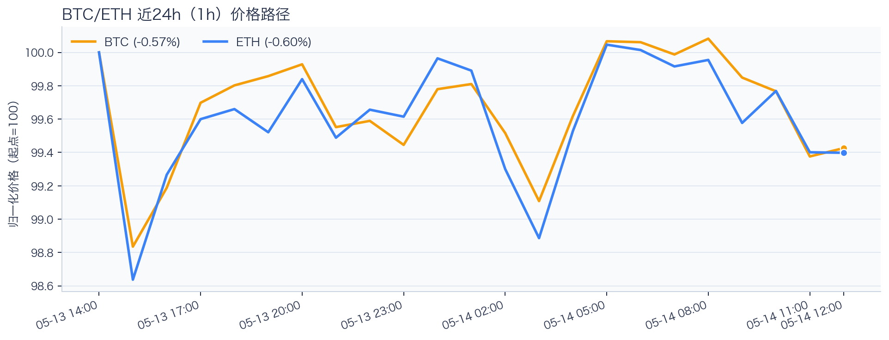
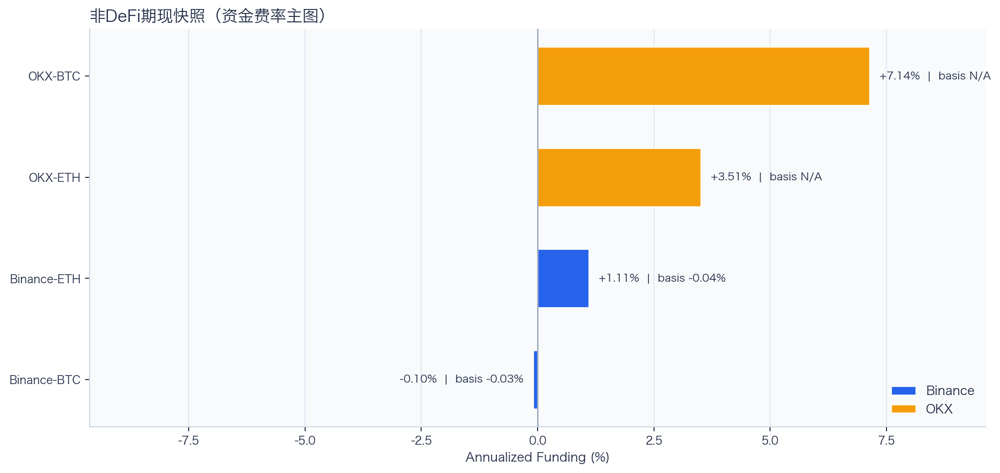
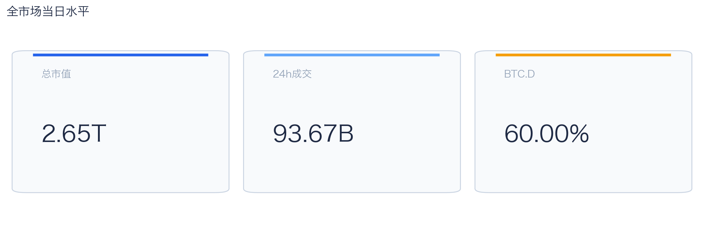
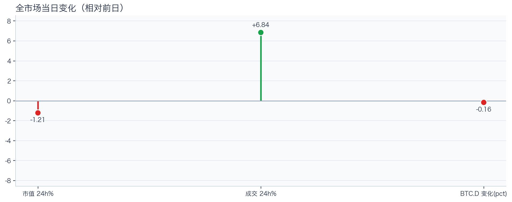
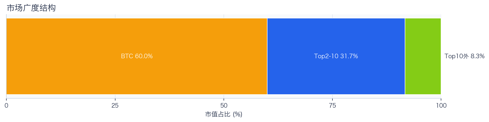
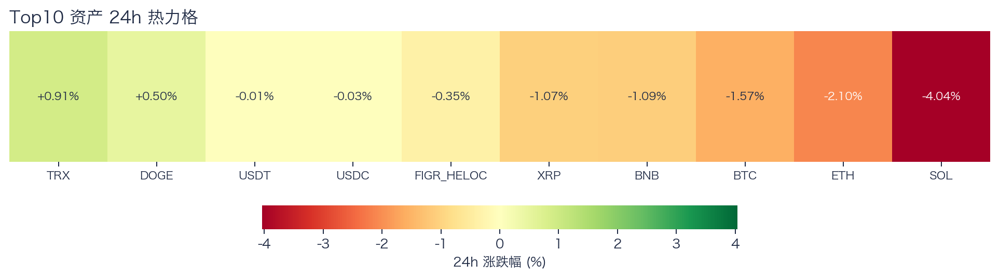
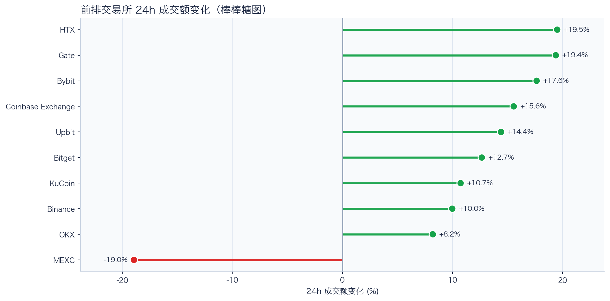
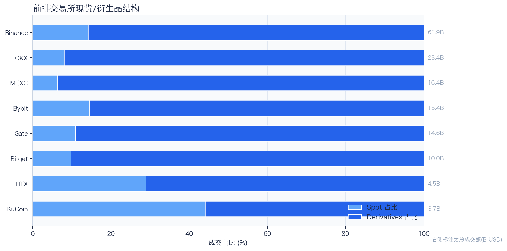
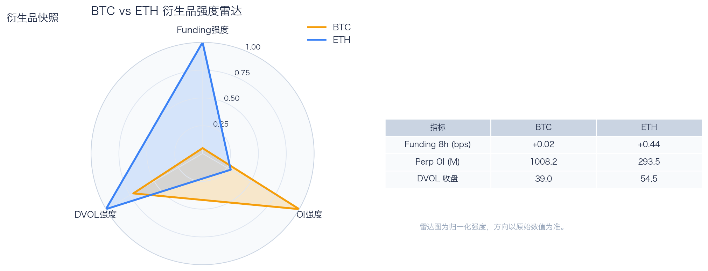
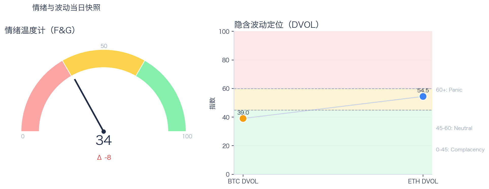

# 二级市场日报（2026-05-14）

## 关键结论
- 全市场市值 $2.65T（24h -1.21%），成交额 $93.67B（24h +6.84%）。
- BTC 主导率 60.00%（-0.16pct），Top10 外占比 8.30%。
- Top10 资产上涨 2 / 下跌 8，平均涨跌幅 -0.89%，首尾分化 4.95pct。
- 衍生品：BTC/ETH 资金费率分别为 +0.02bps / +0.44bps，DVOL 收盘 39.04 / 54.45。

## 今日盘面判断
如果只用一句话概括今天的市场，关键词是 `Stress Repricing`。价格回撤但换手抬升，说明市场在高分歧下重估风险，波动脉冲概率偏高。广度仍偏窄，增量风险偏好尚未形成持续外溢。这意味着短线虽然有可交易的弹性，但要把它理解成新一轮趋势启动，证据还不够。

## 核心驱动因素
从流动性结构看，多数平台成交回暖，短线流动性环境较前一日改善；从杠杆维度看，杠杆拥挤度整体可控；在风险定价层面，隐含波动率回落至相对低位，事件冲击前的保护成本下降；再结合情绪与价格修复节奏尚未完全同步。整体来看，盘面更像是修复中的高波动环境，而不是低波动顺趋势环境。

## BTC/ETH 24h 趋势判断

- BTC：$79,302.79（24h -1.54%，区间 $78,754.65 - $80,592.65，当前位于区间 30%）=> 偏弱震荡。
- ETH：$2,254.00（24h -2.19%，区间 $2,234.13 - $2,307.54，当前位于区间 27%）=> 偏弱，下行主导。
- 简评：BTC 偏弱震荡下行，ETH 相对更弱。

## 稳定币收益情况（链上协议）
按安全优先（协议成熟度、链层风险、是否依赖激励）筛选了 10 个主流池；原生供给利率均值约 +3.33%。
其中包含奖励补贴的池有 0 个，补贴收益已单列，不与原生利率混合。

核心观察
- 利率结构：Total APY 位于 0.58% 至 7.10% 区间。
- 资金集中：TVL 主要集中在 Spark-USDT（Ethereum，TVL $1.17B）、Aave-USDT（Ethereum，TVL $263.99M）。
- 收益领先：当前收益靠前样本包括 Morpho-USDC（Ethereum，Total 7.10%）、Aave-PYUSD（Ethereum，Total 3.98%）。

风险提示
- 利用率达到 70% 以上的池有 8 个，杠杆需求主要集中在头部池。
- 利用率最高样本：Aave-USDC（Ethereum） 92.14%，Borrow APY 4.27%。
- 奖励收益池数量：0 个。当前收益主体仍以原生利率为主。

数据覆盖：Aave API(8)，Compound API(6)，DefiLlama(20)。

稳定币收益对照表（安全优先）
| 协议 | 链 | 币种 | Supply | Borrow | Rewards | Total | Utilization | TVL | 数据源 |
|---|---|---|---:|---:|---:|---:|---:|---:|---|
| Aave | Ethereum | USDT | 3.06% | 3.89% | N/A | 3.00% | 87.74% | $263.99M | DefiLlama+Aave API |
| Spark | Ethereum | USDT | 2.50% | N/A | N/A | 2.50% | N/A | $1.17B | DefiLlama |
| Compound | Ethereum | USDS | 3.12% | 3.91% | 0.00% | 3.12% | 86.76% | $2.11M | Compound API |
| Morpho | Ethereum | USDC | 7.10% | 8.00% | N/A | 7.10% | 89.07% | $161,974 | Morpho API |
| Aave | Ethereum | USDC | 3.53% | 4.27% | N/A | 3.59% | 92.14% | $161.59M | DefiLlama+Aave API |
| Aave | Ethereum | USDS | 0.58% | 5.77% | N/A | 0.58% | 13.78% | $22.69M | DefiLlama+Aave API |
| Aave | Ethereum | DAI | 3.03% | 4.76% | N/A | 2.99% | 85.63% | $17.63M | DefiLlama+Aave API |
| Aave | Ethereum | PYUSD | 4.06% | 5.09% | N/A | 3.98% | 89.16% | $1.77M | DefiLlama+Aave API |
| Aave | Base | USDC | 3.18% | 4.26% | N/A | 3.13% | 83.40% | $30.36M | DefiLlama+Aave API |
| Aave | Arbitrum | USDC | 3.18% | 4.01% | N/A | 3.13% | 88.49% | $19.28M | DefiLlama+Aave API |

稳定币收益对比（扩展样本，TVL≥$1M，共 21 条）
| 币种 | 协议 | 链 | Supply | Borrow | Rewards | Total | Utilization | TVL | 数据源 |
|---|---|---|---:|---:|---:|---:|---:|---:|---|
| USDC | Aave | Ethereum | 3.53% | 4.27% | N/A | 3.59% | 92.14% | $161.59M | DefiLlama+Aave API |
| USDC | Aave | Arbitrum | 3.18% | 4.01% | N/A | 3.13% | 88.49% | $19.28M | DefiLlama+Aave API |
| USDC | Aave | Base | 3.18% | 4.26% | N/A | 3.13% | 83.40% | $30.36M | DefiLlama+Aave API |
| USDC | Spark | Ethereum | 3.65% | N/A | N/A | 3.65% | N/A | $948.51M | DefiLlama |
| USDC | Compound | Ethereum | 3.19% | 3.96% | 0.14% | 3.33% | 88.70% | $331.74M | DefiLlama+Compound API |
| USDC | Compound | Arbitrum | 2.50% | 3.43% | 0.00% | 2.50% | 69.36% | $18.54M | DefiLlama+Compound API |
| USDC | Compound | Base | 7.29% | 8.56% | 0.00% | 7.29% | 91.27% | $9.42M | DefiLlama+Compound API |
| USDT | Aave | Ethereum | 3.06% | 3.89% | N/A | 3.00% | 87.74% | $263.99M | DefiLlama+Aave API |
| USDT | Spark | Ethereum | 2.50% | N/A | N/A | 2.50% | N/A | $1.17B | DefiLlama |
| USDT | Compound | Ethereum | 3.03% | 3.84% | 0.13% | 3.17% | 84.26% | $185.70M | DefiLlama+Compound API |
| USDT | Compound | Arbitrum | 2.06% | 3.09% | 0.00% | 2.06% | 57.34% | $19.79M | DefiLlama+Compound API |
| DAI | Aave | Ethereum | 3.03% | 4.76% | N/A | 2.99% | 85.63% | $17.63M | DefiLlama+Aave API |
| DAI | Aave | Arbitrum | 2.27% | 4.16% | N/A | 2.25% | 73.42% | $1.03M | DefiLlama+Aave API |
| USDS | Aave | Ethereum | 0.58% | 5.77% | N/A | 0.58% | 13.78% | $22.69M | DefiLlama+Aave API |
| USDS | Spark | Ethereum | 2.48% | N/A | N/A | 2.48% | N/A | $70.07M | DefiLlama |
| USDS | Spark | Arbitrum | 3.65% | N/A | N/A | 3.65% | N/A | $358.43M | DefiLlama |
| USDS | Spark | Base | 3.65% | N/A | N/A | 3.65% | N/A | $222.29M | DefiLlama |
| USDS | Compound | Ethereum | 3.12% | 3.91% | 0.00% | 3.12% | 86.76% | $2.11M | Compound API |
| SUSDS | Spark | Ethereum | 0.00% | N/A | N/A | 0.00% | N/A | $3.44M | DefiLlama |
| PYUSD | Aave | Ethereum | 4.06% | 5.09% | N/A | 3.98% | 89.16% | $1.77M | DefiLlama+Aave API |
| PYUSD | Spark | Ethereum | 0.13% | N/A | N/A | 0.13% | N/A | $96.17M | DefiLlama |

跨源补充（比 taoli 更全）
- 新增对比源：DefiLlama 全量稳定币池（筛选口径）+ Bitcompare CeFi 利率，并与现有链上主流池快照交叉核对。
- 覆盖规模：原链上精表 21 条；DefiLlama 扩展样本 88 条（展示 Top20）；Bitcompare 稳定币利率样本 0 条。
- 覆盖维度：扩展样本覆盖 45 个协议、14 条链、61 类稳定币。
- 口径说明：Bitcompare 为平台展示 APY，taoli 为 Binance 借币年化，两者用于横向参考，不等价于无风险套利收益。

稳定币收益补充表（DefiLlama 扩展，TVL≥$30M，去重后 Top20）
| 币种 | 协议 | 链 | Base | Rewards | Total | TVL | 数据源 |
|---|---|---|---:|---:|---:|---:|---|
| SUSDS | sky-lending | Ethereum | 3.65% | N/A | 3.65% | $5.92B | DefiLlama API |
| USDC | maple | Ethereum | 4.87% | 0.00% | 4.87% | $3.36B | DefiLlama API |
| USYC | circle-usyc | BSC | 3.17% | N/A | 3.17% | $2.86B | DefiLlama API |
| SUSDE | ethena-usde | Ethereum | 3.87% | N/A | 3.87% | $1.84B | DefiLlama API |
| BUIDL | blackrock-buidl | Ethereum | 3.52% | N/A | 3.52% | $1.07B | DefiLlama API |
| USDT | maple | Ethereum | 4.47% | 0.00% | 4.47% | $892.81M | DefiLlama API |
| USTB | superstate-ustb | Ethereum | 3.52% | N/A | 3.52% | $878.82M | DefiLlama API |
| USDY | ondo-yield-assets | Ethereum | 3.55% | N/A | 3.55% | $741.15M | DefiLlama API |
| BUIDL | blackrock-buidl | Aptos | 3.18% | N/A | 3.18% | $559.08M | DefiLlama API |
| BUIDL | blackrock-buidl | BSC | 3.18% | N/A | 3.18% | $509.39M | DefiLlama API |
| BUSD0 | usual-usd0 | Ethereum | N/A | 3.48% | 3.48% | $507.66M | DefiLlama API |
| STEAKUSDC | morpho-blue | Base | 4.94% | 0.00% | 4.94% | $467.42M | DefiLlama API |
| USDC | jupiter-lend | Solana | 3.78% | 1.08% | 4.86% | $451.67M | DefiLlama API |
| SUSDS | sky-lending | Arbitrum | 3.65% | N/A | 3.65% | $358.43M | DefiLlama API |
| GTUSDCP | morpho-blue | Base | 4.94% | 0.00% | 4.94% | $352.19M | DefiLlama API |
| USDD | justlend | Tron | 0.00% | 3.95% | 3.95% | $299.23M | DefiLlama API |
| SUSDAI | usd-ai | Arbitrum | 7.22% | N/A | 7.22% | $283.58M | DefiLlama API |
| BUIDL | blackrock-buidl | Solana | 3.49% | N/A | 3.49% | $279.71M | DefiLlama API |
| SENPYUSD | morpho-blue | Ethereum | 2.54% | 0.00% | 2.54% | $277.50M | DefiLlama API |
| SENPYUSDMAIN | morpho-blue | Ethereum | 1.54% | 3.15% | 4.68% | $277.50M | DefiLlama API |

交易含义：当前稳定币收益更偏“头部池中等收益 + 局部高利用率”结构，策略上优先流动性与透明度，再考虑收益增强。
部分池的 Borrow 与 Utilization 暂未返回，表内仅展示已获取字段。

## 非 DeFi（交易所期现）

样本范围覆盖 Binance 与 OKX 的 BTC/ETH 现货与永续，用于观察 funding 与 basis 的当期结构。
- Funding 最高样本：OKX-BTC，年化约 7.14%。
- Funding 最低样本：Binance-BTC，年化约 -0.10%。
- Basis 偏离最大：Binance-ETH，相对指数约 -0.04%。

借币成本多源对比表
| 资产 | Binance(日/年) | OKX(日/年) | Bybit(日/年) | Backpack(日/年) | KuCoin(日/年) | 最低日利率 |
|---|---:|---:|---:|---:|---:|---:|
| USDT | 0.01%/3.36% · 100k | 0.01%/2.51% · 5.0M | 0.01%/3.36% · 8.0M | 0.01%/4.88% · 50.0M | N/A | OKX 0.01% |
| USDC | 0.01%/3.24% · 100k | 0.01%/2.51% · 1.0M | 0.01%/2.96% · 3.5M | 0.01%/2.16% · 300.0M | N/A | Backpack 0.01% |
| USDE | N/A | N/A | 0.01%/5.00% · 1.0M | N/A | N/A | Bybit 0.01% |
| BTC | 0.00%/0.41% · 60 | 0.00%/0.51% · 175 | 0.00%/0.41% · 300 | 0.00%/0.60% · 3k | N/A | Binance 0.00% |
| ETH | 0.01%/2.20% · 400 | 0.01%/2.01% · 7k | 0.01%/2.17% · 2k | 0.00%/0.91% · 20k | N/A | Backpack 0.00% |
说明：统一按日利率/年化展示，单元格尾部为可借额度。
- 交易含义：当 funding 年化显著高于 basis 且持续为正，carry 交易更偏向收取 funding；若 basis 与 funding 同步回落，需降低杠杆并关注资金回流速度。
该部分与链上收益分开统计，便于比较两类策略的收益与风险结构。

## 市场脉冲

截至 2026-05-14，全市场市值 $2.65T，24h 成交额 $93.67B，BTC 主导率 60.00%。
价格下行但换手放大，反映分歧加剧，通常伴随更高的日内波动。在这种盘面下，成交能否继续跟上，是判断明天反弹延续还是回吐的第一道分水岭。

相对前日，市值 -1.21%、成交 +6.84%、BTC.D -0.16pct。
把这组变化拆开看，比看单一涨跌更有用：价格、成交、主导率三者同向时，行情更有连续性；一旦出现背离，走势往往会变得更短促、更反复。

## 主导率与市场广度

当前结构为 BTC 60.00% / Top2-10 31.70% / Top10 外 8.30%。长尾占比仍偏低，广度修复还未形成持续趋势。
Top10 外占比处于低位，风险偏好仍主要停留在 BTC 与头部资产。换句话说，资金目前更愿意在高流动性的核心资产里做仓位调整，而不是大面积扩散到长尾资产。

## 资产与交易所资金流

Top10 中领涨 TRX（+0.91%），尾部 SOL（-4.04%），均值 -0.89%。分化 4.95pct，结构性交易仍是主导。
下跌家数占优，风险偏好修复仍较脆弱，短线追高性价比一般。对交易而言，这通常意味着“选币”比“全市场方向”更重要，错配带来的收益差会明显放大。

前排样本上涨 9 家、下跌 1 家，均值 +10.92%。HTX 最强（+19.52%），MEXC 最弱（-18.95%）。
最强与最弱平台的 24h 变化差达到 38.47pct，说明流动性仍在选择性回流，头部平台的价格发现能力更强。当平台间流量分化明显时，报价连续性和滑点表现会同步分化，执行层面要更关注成交质量。

样本内衍生品成交占比 85.46%。若该占比继续走高且 funding 不同步回落，短线波动脉冲通常会增强。
衍生品占比处于高位，行情更容易出现脉冲式放大，风控阈值建议偏保守。这也是为什么同样的消息面在当前阶段更容易被放大成大振幅走势。

## 衍生品与情绪

资金费率（Funding）仍在中性附近，BTC/ETH 分别 +0.02bps / +0.44bps；未平仓合约（OI）为 $1.01B / $293.48M；隐含波动率指数（DVOL）位于 Complacency（低波动定价） / Neutral（中性波动定价）。
Funding 与 DVOL 的组合显示，方向拥挤暂未极端，但尾部风险定价仍未完全回落。因此更合适的做法不是激进追单边，而是围绕波动管理仓位和节奏。

恐惧与贪婪指数（F&G）当日 34（较前日 -8）；配合 BTC/ETH DVOL 39.04/54.45，当前更像情绪修复中的高波动区。
情绪回到中性区，若后续成交和广度同步改善，趋势性机会会明显增多。只有当情绪、广度和成交三者同时改善，市场才更可能从“反弹交易”切换到“趋势交易”。

## OKX 聪明钱仓位结构（Top10交易员）
聪明钱榜单数据暂不可用（见 Data Gaps）。

仓位结构暂不可用（见 Data Gaps）。

BTC/ETH 聪明钱聚合信号未启用（设置 `OKX_SMARTMONEY_FETCH_SIGNAL=1` 可尝试拉取）。

交易含义：聪明钱仓位更适合做方向与拥挤度监控，不应单独作为开仓触发。

## OKX 新闻情绪快照
OKX 新闻情绪快照暂不可用（见 Data Gaps）。

## 未来24小时观察
1. 若 Top10 外占比继续抬升且 BTC.D 回落，说明风险偏好开始从核心资产向外扩散。
2. 若衍生品占比继续上升而 funding 仍中性，盘面大概率维持高波动震荡而非顺滑上行。
3. 若 F&G 反弹但 DVOL 不降，代表情绪与风险定价背离，追涨胜率会明显下降。

## 交易与风控含义
- 仓位管理优先级高于方向押注，建议保持核心仓位稳定、战术仓位滚动。
- 若交易所衍生品占比继续上升，建议同步收紧杠杆和止损参数。
- 关注情绪改善与广度扩散是否同步发生，二者背离时避免追逐单边。

## 数据缺口（Data Gaps）
- Bitcompare CeFi 稳定币样本为空：未匹配到稳定币资产。
- OKX 聪明钱数据获取失败（traders）: Update available for @okx_ai/okx-trade-cli: 1.3.2 → 1.3.4
Run: npm install -g @okx_ai/okx-trade-cli

Error: Session expired — run `okx-auth login` again
Error: No credentials found.
Hint: Run `okx auth login` to authenticate, or configure API key credentials.
Version: @okx_ai/okx-trade-cli@1.3.2
- OKX 聪明钱数据获取失败（news:coin-sentiment）: Update available for @okx_ai/okx-trade-cli: 1.3.2 → 1.3.4
Run: npm install -g @okx_ai/okx-trade-cli

Error: Session expired — run `okx-auth login` again
Error: No credentials found.
Hint: Run `okx auth login` to authenticate, or configure API key credentials.
Version: @okx_ai/okx-trade-cli@1.3.2
- OKX 新闻情绪快照为空：coin-sentiment 未返回有效样本。

