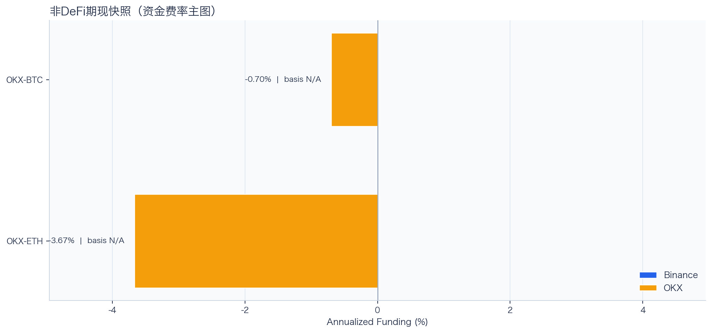
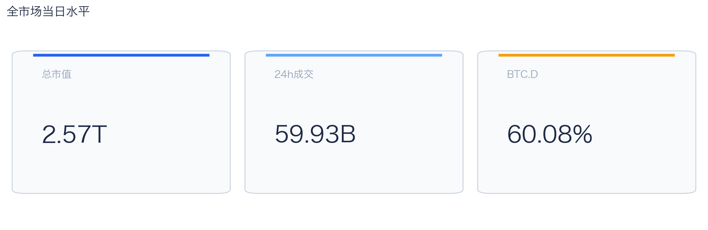
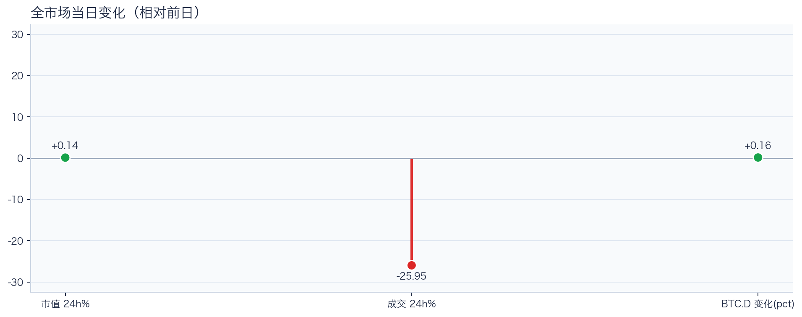
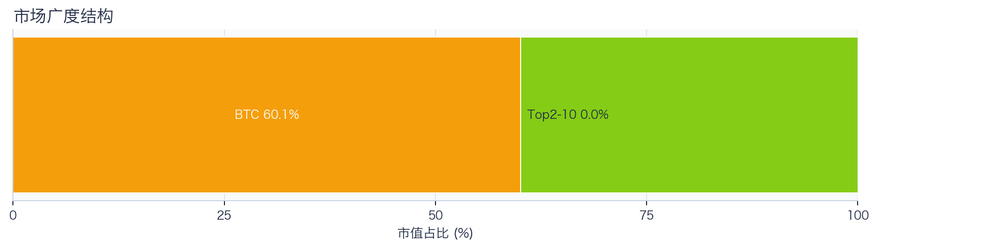
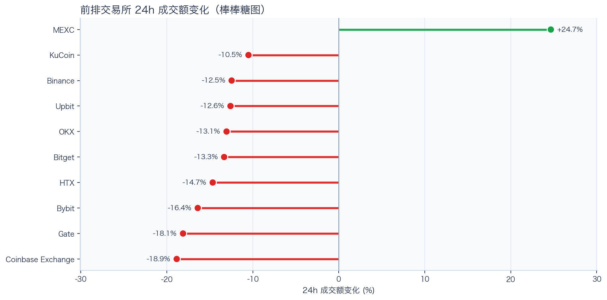
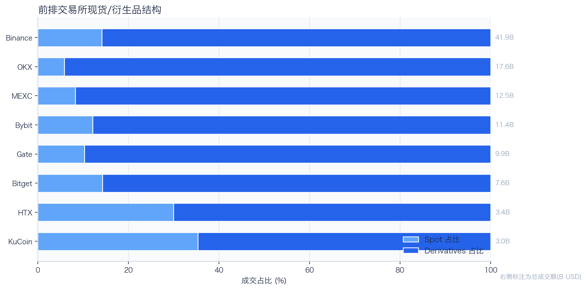
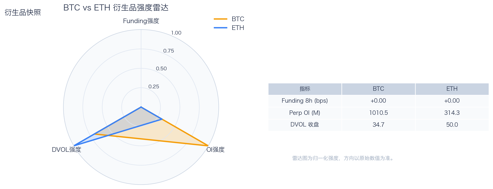
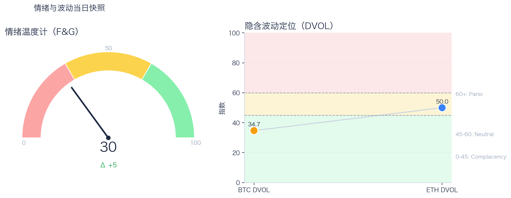

# 二级市场日报（2026-05-25）

## 关键结论
- 全市场市值 $2.57T（24h +0.14%），成交额 $59.93B（24h -25.95%）。
- BTC 主导率 60.08%（+0.16pct），Top10 外占比 100.00%。
- Top10 资产广度统计不完整。
- 衍生品：BTC/ETH 资金费率分别为 +0.00bps / +0.00bps，DVOL 收盘 34.71 / 49.99。

## 今日盘面判断
如果只用一句话概括今天的市场，关键词是 `Range Trading`。价格与成交未形成同向趋势，市场仍在区间内进行结构轮动。长尾占比已进入可观察扩散区间，若持续抬升，风格可能从核心资产外溢。这意味着短线虽然有可交易的弹性，但要把它理解成新一轮趋势启动，证据还不够。

## 核心驱动因素
从流动性结构看，多数平台成交走弱，流动性恢复仍依赖少数头部平台；从杠杆维度看，杠杆拥挤度整体可控；在风险定价层面，隐含波动率回落至相对低位，事件冲击前的保护成本下降；再结合情绪与价格修复节奏尚未完全同步。整体来看，盘面更像是修复中的高波动环境，而不是低波动顺趋势环境。

## BTC/ETH 24h 趋势判断

- BTC/ETH 24h 趋势数据暂不可用。

## 稳定币收益情况（链上协议）
按安全优先（协议成熟度、链层风险、是否依赖激励）筛选了 10 个主流池；原生供给利率均值约 +2.91%。
其中包含奖励补贴的池有 2 个，补贴收益已单列，不与原生利率混合。

核心观察
- 利率结构：Total APY 位于 0.09% 至 8.32% 区间。
- 资金集中：TVL 主要集中在 Spark-USDT（Ethereum，TVL $1.31B）、Aave-USDT（Ethereum，TVL $84.63M）。
- 收益领先：当前收益靠前样本包括 Aave-USDC（Ethereum，Total 8.32%）、Aave-USDT（Ethereum，Total 6.67%）。

风险提示
- 利用率达到 70% 以上的池有 7 个，杠杆需求主要集中在头部池。
- 利用率最高样本：Aave-USDC（Ethereum） 92.32%，Borrow APY 4.51%。
- 奖励收益池数量：2 个。当前收益主体仍以原生利率为主。

数据覆盖：Aave API(8)，Compound API(6)，DefiLlama(21)，Morpho API(6)。

稳定币收益对照表（安全优先）
| 协议 | 链 | 币种 | Supply | Borrow | Rewards | Total | Utilization | TVL | 数据源 |
|---|---|---|---:|---:|---:|---:|---:|---:|---|
| Aave | Ethereum | DAI | 1.87% | 3.73% | N/A | 1.85% | 67.37% | $48.36M | DefiLlama+Aave API |
| Spark | Ethereum | USDT | 2.50% | N/A | N/A | 2.50% | N/A | $1.31B | DefiLlama |
| Compound | Ethereum | USDS | 3.24% | 4.00% | 0.00% | 3.24% | 89.99% | $2.03M | Compound API |
| Morpho | Ethereum | USDC | 5.05% | 5.63% | 0.00% | 5.05% | 89.91% | $8.66M | Morpho API |
| Aave | Ethereum | USDS | 0.09% | 5.67% | N/A | 0.09% | 2.06% | $28.96M | DefiLlama+Aave API |
| Aave | Ethereum | PYUSD | 3.87% | 4.98% | N/A | 3.79% | 86.79% | $1.83M | DefiLlama+Aave API |
| Aave | Ethereum | USDT | 2.57% | 3.56% | 4.13% | 6.67% | 80.50% | $84.63M | DefiLlama+Aave API |
| Aave | Ethereum | USDC | 3.73% | 4.51% | 4.50% | 8.32% | 92.32% | $46.22M | DefiLlama+Aave API |
| Aave | Base | USDC | 3.15% | 4.24% | N/A | 3.10% | 83.03% | $30.38M | DefiLlama+Aave API |
| Aave | Arbitrum | USDC | 3.08% | 3.95% | N/A | 3.03% | 87.13% | $21.70M | DefiLlama+Aave API |

稳定币收益对比（扩展样本，TVL≥$1M，共 28 条）
| 币种 | 协议 | 链 | Supply | Borrow | Rewards | Total | Utilization | TVL | 数据源 |
|---|---|---|---:|---:|---:|---:|---:|---:|---|
| USDC | Aave | Ethereum | 3.73% | 4.51% | 4.50% | 8.32% | 92.32% | $46.22M | DefiLlama+Aave API |
| USDC | Aave | Arbitrum | 3.08% | 3.95% | N/A | 3.03% | 87.13% | $21.70M | DefiLlama+Aave API |
| USDC | Aave | Base | 3.15% | 4.24% | N/A | 3.10% | 83.03% | $30.38M | DefiLlama+Aave API |
| USDC | Spark | Ethereum | 3.65% | N/A | N/A | 3.65% | N/A | $397.63M | DefiLlama |
| USDC | Compound | Ethereum | 3.64% | 4.45% | 0.12% | 3.76% | 90.13% | $332.89M | DefiLlama+Compound API |
| USDC | Compound | Arbitrum | 2.65% | 3.54% | 0.00% | 2.65% | 73.61% | $17.52M | DefiLlama+Compound API |
| USDC | Compound | Base | 3.22% | 3.98% | 0.00% | 3.22% | 89.44% | $9.72M | DefiLlama+Compound API |
| USDC | Morpho | Ethereum | 5.05% | 5.63% | 0.00% | 5.05% | 89.91% | $8.66M | Morpho API |
| USDC | Morpho | Arbitrum | 3.40% | 3.97% | N/A | 3.40% | 85.82% | $10.28M | Morpho API |
| USDT | Aave | Ethereum | 2.57% | 3.56% | 4.13% | 6.67% | 80.50% | $84.63M | DefiLlama+Aave API |
| USDT | Spark | Ethereum | 2.50% | N/A | N/A | 2.50% | N/A | $1.31B | DefiLlama |
| USDT | Compound | Ethereum | 2.63% | 3.53% | 0.10% | 2.73% | 73.06% | $207.24M | DefiLlama+Compound API |
| USDT | Compound | Arbitrum | 2.06% | 3.09% | 0.00% | 2.06% | 57.27% | $19.78M | DefiLlama+Compound API |
| USDT | Morpho | Ethereum | 2.49% | 3.01% | N/A | 2.49% | 82.95% | $213.74M | Morpho API |
| DAI | Aave | Ethereum | 1.87% | 3.73% | N/A | 1.85% | 67.37% | $48.36M | DefiLlama+Aave API |
| DAI | Aave | Arbitrum | 2.15% | 4.05% | N/A | 2.12% | 71.40% | $1.08M | DefiLlama+Aave API |
| DAI | Spark | Ethereum | 2.37% | N/A | N/A | 2.37% | N/A | $97.30M | DefiLlama |
| DAI | Morpho | Ethereum | 6.95% | 8.02% | N/A | 6.95% | 87.10% | $1.44M | Morpho API |
| USDS | Aave | Ethereum | 0.09% | 5.67% | N/A | 0.09% | 2.06% | $28.96M | DefiLlama+Aave API |
| USDS | Spark | Ethereum | 2.24% | N/A | N/A | 2.24% | N/A | $153.00M | DefiLlama |
| USDS | Spark | Arbitrum | 3.65% | N/A | N/A | 3.65% | N/A | $358.81M | DefiLlama |
| USDS | Spark | Base | 3.65% | N/A | N/A | 3.65% | N/A | $222.53M | DefiLlama |
| USDS | Compound | Ethereum | 3.24% | 4.00% | 0.00% | 3.24% | 89.99% | $2.03M | Compound API |
| USDS | Morpho | Ethereum | 4.25% | 4.81% | N/A | 4.25% | 88.63% | $4.29M | Morpho API |
| SUSDS | Spark | Ethereum | 0.00% | N/A | N/A | 0.00% | N/A | $3.44M | DefiLlama |
| PYUSD | Aave | Ethereum | 3.87% | 4.98% | N/A | 3.79% | 86.79% | $1.83M | DefiLlama+Aave API |
| PYUSD | Spark | Ethereum | 0.40% | N/A | N/A | 0.40% | N/A | $88.34M | DefiLlama |
| PYUSD | Morpho | Ethereum | 3.70% | 4.15% | N/A | 3.70% | 89.44% | $75.02M | Morpho API |

跨源补充（比 taoli 更全）
- 新增对比源：DefiLlama 全量稳定币池（筛选口径）+ Bitcompare CeFi 利率，并与现有链上主流池快照交叉核对。
- 覆盖规模：原链上精表 28 条；DefiLlama 扩展样本 89 条（展示 Top20）；Bitcompare 稳定币利率样本 7 条。
- 覆盖维度：扩展样本覆盖 46 个协议、15 条链、61 类稳定币。
- 口径说明：Bitcompare 为平台展示 APY，taoli 为 Binance 借币年化，两者用于横向参考，不等价于无风险套利收益。

稳定币收益补充表（DefiLlama 扩展，TVL≥$30M，去重后 Top20）
| 币种 | 协议 | 链 | Base | Rewards | Total | TVL | 数据源 |
|---|---|---|---:|---:|---:|---:|---|
| SUSDS | sky-lending | Ethereum | 3.65% | N/A | 3.65% | $6.20B | DefiLlama API |
| USDC | maple | Ethereum | 4.74% | 0.00% | 4.74% | $3.32B | DefiLlama API |
| USYC | circle-usyc | BSC | 2.93% | N/A | 2.93% | $2.86B | DefiLlama API |
| SUSDE | ethena-usde | Ethereum | 3.71% | N/A | 3.71% | $1.81B | DefiLlama API |
| USDY | ondo-yield-assets | Ethereum | 3.55% | N/A | 3.55% | $994.39M | DefiLlama API |
| USDS | centrifuge-protocol | Ethereum | 2.08% | N/A | 2.08% | $938.90M | DefiLlama API |
| USDT | maple | Ethereum | 4.19% | 0.00% | 4.19% | $917.63M | DefiLlama API |
| BUIDL | blackrock-buidl | Ethereum | 3.49% | N/A | 3.49% | $887.81M | DefiLlama API |
| USTB | superstate-ustb | Ethereum | 3.04% | N/A | 3.04% | $827.51M | DefiLlama API |
| BUIDL | blackrock-buidl | Avalanche | 3.46% | N/A | 3.46% | $624.87M | DefiLlama API |
| BUIDL | blackrock-buidl | Solana | 3.46% | N/A | 3.46% | $602.93M | DefiLlama API |
| BUIDL | blackrock-buidl | Aptos | 3.15% | N/A | 3.15% | $584.85M | DefiLlama API |
| BUSD0 | usual-usd0 | Ethereum | N/A | 3.44% | 3.44% | $507.58M | DefiLlama API |
| STEAKUSDC | morpho-blue | Base | 4.57% | 0.00% | 4.57% | $458.34M | DefiLlama API |
| USDC | jupiter-lend | Solana | 3.79% | 1.11% | 4.90% | $439.58M | DefiLlama API |
| GTUSDCP | morpho-blue | Base | 4.57% | 0.00% | 4.57% | $369.31M | DefiLlama API |
| SUSDS | sky-lending | Arbitrum | 3.65% | N/A | 3.65% | $358.81M | DefiLlama API |
| USDD | justlend | Tron | 0.00% | 3.99% | 3.99% | $306.85M | DefiLlama API |
| SUSDAI | usd-ai | Arbitrum | 7.07% | N/A | 7.07% | $299.55M | DefiLlama API |
| SENPYUSD | morpho-blue | Ethereum | 2.61% | 0.00% | 2.61% | $273.47M | DefiLlama API |

CeFi 稳定币收益/成本对比（Bitcompare vs taoli）
| 币种 | Bitcompare 最高APY | 对应平台 | taoli(Binance借币年化) | 利差(APY-借币) |
|---|---:|---|---:|---:|
| DAI | 7.00% | EarnPark | N/A | N/A |
| PYUSD | 4.41% | Euler Finance | N/A | N/A |
| TUSD | 1.43% | JustLend | N/A | N/A |
| USDC | 4.00% | EarnPark | 4.26% | -0.26% |
| USDE | 4.69% | Pendle | N/A | N/A |
| USDP | 10.50% | Nexo | N/A | N/A |
| USDT | 20.00% | EarnPark | 3.35% | 16.65% |

交易含义：当前稳定币收益更偏“头部池中等收益 + 局部高利用率”结构，策略上优先流动性与透明度，再考虑收益增强。
部分池的 Borrow 与 Utilization 暂未返回，表内仅展示已获取字段。

## 非 DeFi（交易所期现）

样本范围覆盖 Binance 与 OKX 的 BTC/ETH 现货与永续，用于观察 funding 与 basis 的当期结构。
- Funding 最高样本：OKX-BTC，年化约 -0.70%。
- Funding 最低样本：OKX-ETH，年化约 -3.67%。

借币成本多源对比表
| 资产 | Binance(日/年) | OKX(日/年) | Bybit(日/年) | Backpack(日/年) | KuCoin(日/年) | 最低日利率 |
|---|---:|---:|---:|---:|---:|---:|
| USDT | 0.01%/3.35% · 500k | 0.01%/2.51% · 5.0M | N/A | 0.01%/3.81% · 50.0M | N/A | OKX 0.01% |
| USDC | 0.01%/4.26% · 500k | 0.01%/2.51% · 1.0M | N/A | 0.01%/2.27% · 300.0M | N/A | Backpack 0.01% |
| BTC | 0.00%/0.41% · 100 | 0.00%/0.51% · 175 | N/A | 0.00%/0.42% · 3k | N/A | Binance 0.00% |
| ETH | 0.01%/2.25% · 2k | 0.00%/1.51% · 7k | N/A | 0.00%/1.05% · 20k | N/A | Backpack 0.00% |
说明：统一按日利率/年化展示，单元格尾部为可借额度。
- 交易含义：当 funding 年化显著高于 basis 且持续为正，carry 交易更偏向收取 funding；若 basis 与 funding 同步回落，需降低杠杆并关注资金回流速度。
该部分与链上收益分开统计，便于比较两类策略的收益与风险结构。

## 市场脉冲

截至 2026-05-25，全市场市值 $2.57T，24h 成交额 $59.93B，BTC 主导率 60.08%。
价格上涨但成交回落，反弹质量偏弱，需警惕高位回吐。在这种盘面下，成交能否继续跟上，是判断明天反弹延续还是回吐的第一道分水岭。

相对前日，市值 +0.14%、成交 -25.95%、BTC.D +0.16pct。
把这组变化拆开看，比看单一涨跌更有用：价格、成交、主导率三者同向时，行情更有连续性；一旦出现背离，走势往往会变得更短促、更反复。

## 主导率与市场广度

当前结构为 BTC 60.08% / Top2-10 0.00% / Top10 外 100.00%。长尾占比仍偏低，广度修复还未形成持续趋势。
Top10 外占比已进入扩散区，若继续抬升，市场风格可能向高 Beta 资产切换。换句话说，资金目前更愿意在高流动性的核心资产里做仓位调整，而不是大面积扩散到长尾资产。

## 资产与交易所资金流

Top10 涨跌数据不完整。
头部资产分化仍在，当前更像结构行情。对交易而言，这通常意味着“选币”比“全市场方向”更重要，错配带来的收益差会明显放大。

前排样本上涨 1 家、下跌 9 家，均值 -10.53%。MEXC 最强（+24.67%），Coinbase Exchange 最弱（-18.85%）。
最强与最弱平台的 24h 变化差达到 43.52pct，说明流动性仍在选择性回流，头部平台的价格发现能力更强。当平台间流量分化明显时，报价连续性和滑点表现会同步分化，执行层面要更关注成交质量。

样本内衍生品成交占比 86.00%。若该占比继续走高且 funding 不同步回落，短线波动脉冲通常会增强。
衍生品占比处于高位，行情更容易出现脉冲式放大，风控阈值建议偏保守。这也是为什么同样的消息面在当前阶段更容易被放大成大振幅走势。

## 衍生品与情绪

资金费率（Funding）仍在中性附近，BTC/ETH 分别 +0.00bps / +0.00bps；未平仓合约（OI）为 $1.01B / $314.26M；隐含波动率指数（DVOL）位于 Complacency（低波动定价） / Neutral（中性波动定价）。
Funding 与 DVOL 的组合显示，方向拥挤暂未极端，但尾部风险定价仍未完全回落。因此更合适的做法不是激进追单边，而是围绕波动管理仓位和节奏。

恐惧与贪婪指数（F&G）当日 30（较前日 +5）；配合 BTC/ETH DVOL 34.71/49.99，当前更像情绪修复中的高波动区。
情绪回到中性区，若后续成交和广度同步改善，趋势性机会会明显增多。只有当情绪、广度和成交三者同时改善，市场才更可能从“反弹交易”切换到“趋势交易”。

## OKX 聪明钱仓位结构（Top10交易员）
聪明钱榜单数据暂不可用（见 Data Gaps）。

仓位结构暂不可用（见 Data Gaps）。

BTC/ETH 聪明钱聚合信号未启用（设置 `OKX_SMARTMONEY_FETCH_SIGNAL=1` 可尝试拉取）。

交易含义：聪明钱仓位更适合做方向与拥挤度监控，不应单独作为开仓触发。

## OKX 新闻情绪快照
OKX 新闻情绪快照暂不可用（见 Data Gaps）。

## 未来24小时观察
1. 若 Top10 外占比继续抬升且 BTC.D 回落，说明风险偏好开始从核心资产向外扩散。
2. 若衍生品占比继续上升而 funding 仍中性，盘面大概率维持高波动震荡而非顺滑上行。
3. 若 F&G 反弹但 DVOL 不降，代表情绪与风险定价背离，追涨胜率会明显下降。

## 交易与风控含义
- 仓位管理优先级高于方向押注，建议保持核心仓位稳定、战术仓位滚动。
- 若交易所衍生品占比继续上升，建议同步收紧杠杆和止损参数。
- 关注情绪改善与广度扩散是否同步发生，二者背离时避免追逐单边。

## 数据缺口（Data Gaps）
- CoinGecko Top资产数据获取失败（已按 key 尝试 demo）: demo: <urlopen error EOF occurred in violation of protocol (_ssl.c:1129)>
- Binance BTC/ETH 24h 批量数据获取失败，转单币重试: HTTP Error 451: 
- Binance 24h 单币数据获取失败 BTCUSDT: HTTP Error 451: 
- Binance 24h 未返回 BTCUSDT 数据。
- Binance 24h 单币数据获取失败 ETHUSDT: HTTP Error 451: 
- Binance 24h 未返回 ETHUSDT 数据。
- Binance BTCUSDT 1h K线获取失败: HTTP Error 451: 
- Binance ETHUSDT 1h K线获取失败: HTTP Error 451: 
- Binance 非DeFi期现数据获取失败 BTC: HTTP Error 451: 
- Binance 非DeFi期现数据获取失败 ETH: HTTP Error 451: 
- 借币成本部分数据源不可用: Bybit: HTTP Error 403: Forbidden
- OKX 聪明钱数据获取失败（traders）: Update available for @okx_ai/okx-trade-cli: 1.3.2 → 1.3.5
Run: npm install -g @okx_ai/okx-trade-cli

Error: Session expired — run `okx-auth login` again
Error: No credentials found.
Hint: Run `okx auth login` to authenticate, or configure API key credentials.
Version: @okx_ai/okx-trade-cli@1.3.2
- OKX 聪明钱数据获取失败（news:coin-sentiment）: Update available for @okx_ai/okx-trade-cli: 1.3.2 → 1.3.5
Run: npm install -g @okx_ai/okx-trade-cli

Error: Session expired — run `okx-auth login` again
Error: No credentials found.
Hint: Run `okx auth login` to authenticate, or configure API key credentials.
Version: @okx_ai/okx-trade-cli@1.3.2
- OKX 新闻情绪快照为空：coin-sentiment 未返回有效样本。

