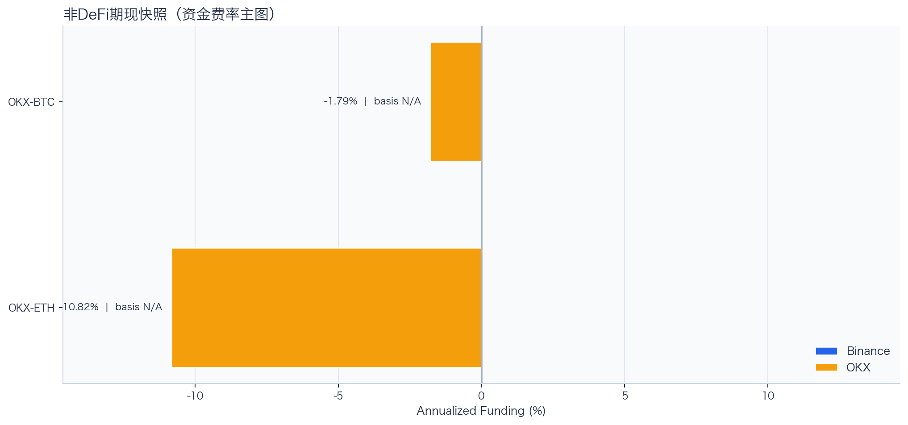
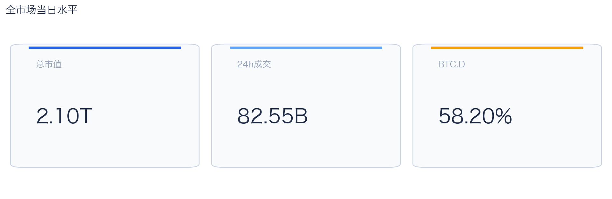
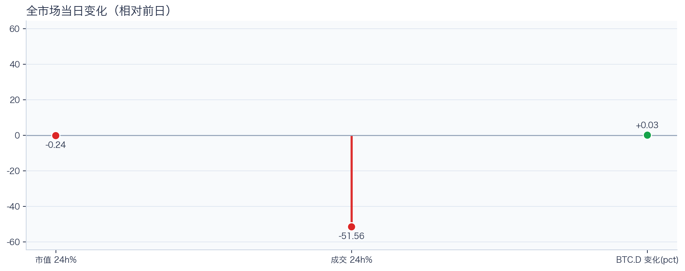
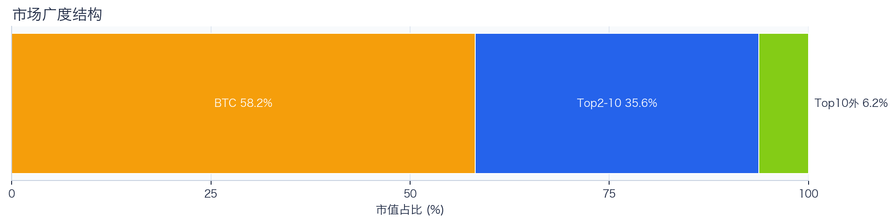
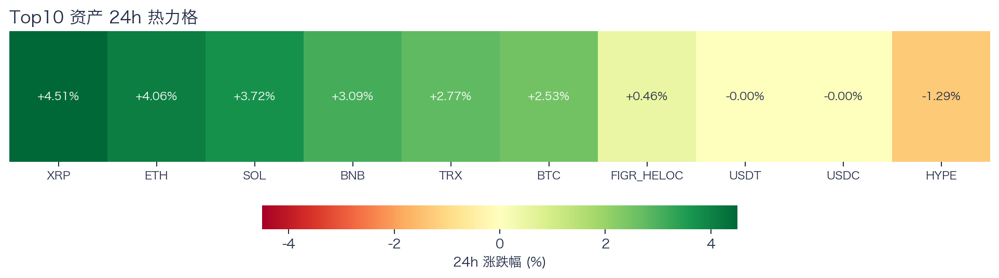
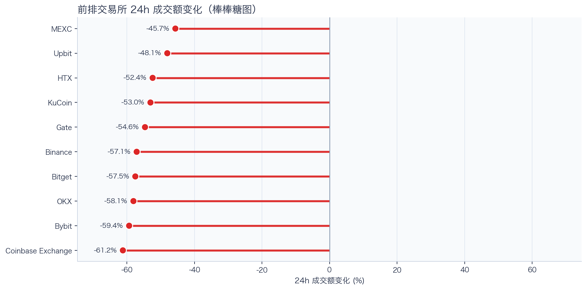
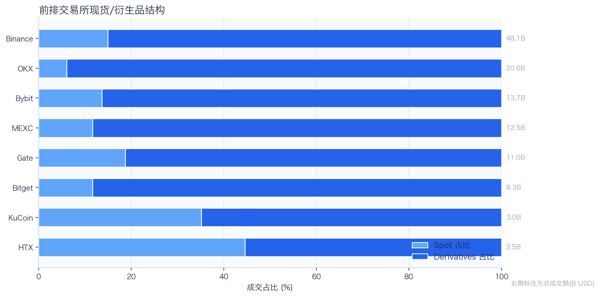
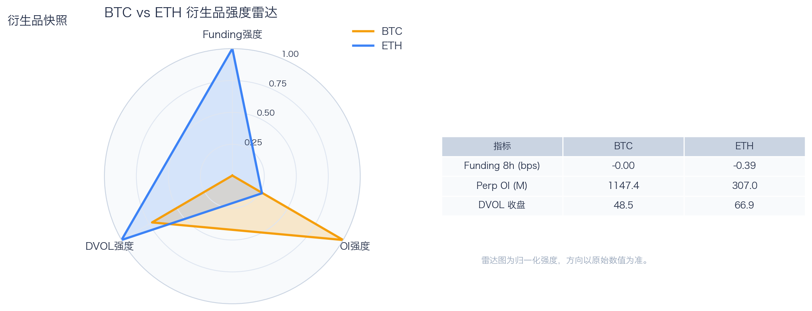
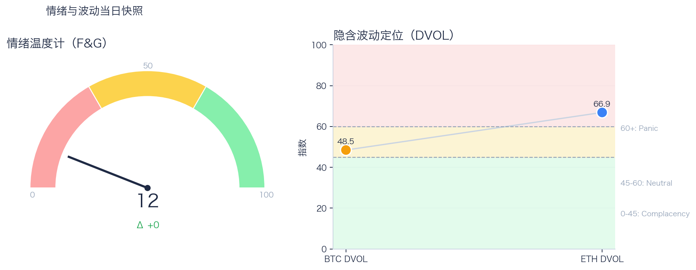

# 二级市场日报（2026-06-07）

## 关键结论
- 全市场市值 $2.10T（24h -0.24%），成交额 $82.55B（24h -51.56%）。
- BTC 主导率 58.20%（+0.03pct），Top10 外占比 6.24%。
- Top10 资产上涨 7 / 下跌 3，平均涨跌幅 +1.99%，首尾分化 5.79pct。
- 衍生品：BTC/ETH 资金费率分别为 -0.00bps / -0.39bps，DVOL 收盘 48.46 / 66.87。

## 今日盘面判断
如果只用一句话概括今天的市场，关键词是 `Defensive Drift`。价格与成交同步走弱，属于防守型下移结构，短线以控制回撤为主。广度仍偏窄，增量风险偏好尚未形成持续外溢。这意味着短线虽然有可交易的弹性，但要把它理解成新一轮趋势启动，证据还不够。

## 核心驱动因素
从流动性结构看，多数平台成交走弱，流动性恢复仍依赖少数头部平台；从杠杆维度看，杠杆拥挤度整体可控；在风险定价层面，期权端对尾部波动的定价仍偏谨慎；再结合情绪仍在恐惧区，反弹更容易受到外部事件扰动。整体来看，盘面更像是修复中的高波动环境，而不是低波动顺趋势环境。

## BTC/ETH 24h 趋势判断
- BTC/ETH 24h 趋势数据暂不可用。

## 稳定币收益情况（链上协议）
按安全优先（协议成熟度、链层风险、是否依赖激励）筛选了 10 个主流池；原生供给利率均值约 +2.34%。
其中包含奖励补贴的池有 2 个，补贴收益已单列，不与原生利率混合。

核心观察
- 利率结构：Total APY 位于 0.10% 至 7.32% 区间。
- 资金集中：TVL 主要集中在 Spark-USDT（Ethereum，TVL $1.21B）、Aave-USDT（Ethereum，TVL $85.33M）。
- 收益领先：当前收益靠前样本包括 Aave-USDC（Ethereum，Total 7.32%）、Aave-USDT（Ethereum，Total 6.85%）。

风险提示
- 利用率达到 70% 以上的池有 5 个，杠杆需求主要集中在头部池。
- 利用率最高样本：Compound-USDS（Ethereum） 90.07%，Borrow APY 4.26%。
- 奖励收益池数量：2 个。当前收益主体仍以原生利率为主。

数据覆盖：Aave API(8)，Compound API(6)，DefiLlama(21)。

稳定币收益对照表（安全优先）
| 协议 | 链 | 币种 | Supply | Borrow | Rewards | Total | Utilization | TVL | 数据源 |
|---|---|---|---:|---:|---:|---:|---:|---:|---|
| Aave | Ethereum | DAI | 1.78% | 3.64% | N/A | 1.76% | 65.76% | $50.66M | DefiLlama+Aave API |
| Spark | Ethereum | USDT | 2.50% | N/A | N/A | 2.50% | N/A | $1.21B | DefiLlama |
| Compound | Ethereum | USDS | 3.47% | 4.26% | 0.00% | 3.47% | 90.07% | $1.90M | Compound API |
| Aave | Ethereum | USDS | 0.10% | 5.67% | N/A | 0.10% | 2.42% | $22.63M | DefiLlama+Aave API |
| Aave | Ethereum | PYUSD | 2.26% | 3.94% | N/A | 2.24% | 64.39% | $5.89M | DefiLlama+Aave API |
| Aave | Ethereum | USDT | 2.78% | 3.71% | 4.11% | 6.85% | 83.70% | $85.33M | DefiLlama+Aave API |
| Aave | Ethereum | USDC | 3.16% | 3.95% | 4.22% | 7.32% | 89.17% | $51.89M | DefiLlama+Aave API |
| Aave | Arbitrum | USDC | 2.43% | 3.51% | N/A | 2.40% | 77.55% | $39.01M | DefiLlama+Aave API |
| Aave | Base | USDC | 3.19% | 4.26% | N/A | 3.14% | 83.47% | $28.69M | DefiLlama+Aave API |
| Aave | Arbitrum | DAI | 1.73% | 3.63% | N/A | 1.71% | 64.14% | $1.37M | DefiLlama+Aave API |

稳定币收益对比（扩展样本，TVL≥$1M，共 22 条）
| 币种 | 协议 | 链 | Supply | Borrow | Rewards | Total | Utilization | TVL | 数据源 |
|---|---|---|---:|---:|---:|---:|---:|---:|---|
| USDC | Aave | Ethereum | 3.16% | 3.95% | 4.22% | 7.32% | 89.17% | $51.89M | DefiLlama+Aave API |
| USDC | Aave | Arbitrum | 2.43% | 3.51% | N/A | 2.40% | 77.55% | $39.01M | DefiLlama+Aave API |
| USDC | Aave | Base | 3.19% | 4.26% | N/A | 3.14% | 83.47% | $28.69M | DefiLlama+Aave API |
| USDC | Spark | Ethereum | 3.60% | N/A | N/A | 3.60% | N/A | $288.27M | DefiLlama |
| USDC | Compound | Ethereum | 2.90% | 3.74% | 0.10% | 3.00% | 80.48% | $328.34M | DefiLlama+Compound API |
| USDC | Compound | Arbitrum | 2.64% | 3.54% | 0.00% | 2.64% | 73.46% | $16.37M | DefiLlama+Compound API |
| USDC | Compound | Base | 3.23% | 3.99% | 0.00% | 3.23% | 89.72% | $8.51M | DefiLlama+Compound API |
| USDT | Aave | Ethereum | 2.78% | 3.71% | 4.11% | 6.85% | 83.70% | $85.33M | DefiLlama+Aave API |
| USDT | Spark | Ethereum | 2.50% | N/A | N/A | 2.50% | N/A | $1.21B | DefiLlama |
| USDT | Compound | Ethereum | 2.60% | 3.51% | 0.10% | 2.70% | 72.21% | $187.99M | DefiLlama+Compound API |
| USDT | Compound | Arbitrum | 1.94% | 3.00% | 0.00% | 1.94% | 53.91% | $19.77M | DefiLlama+Compound API |
| DAI | Aave | Ethereum | 1.78% | 3.64% | N/A | 1.76% | 65.76% | $50.66M | DefiLlama+Aave API |
| DAI | Aave | Arbitrum | 1.73% | 3.63% | N/A | 1.71% | 64.14% | $1.37M | DefiLlama+Aave API |
| DAI | Spark | Ethereum | 2.34% | N/A | N/A | 2.34% | N/A | $95.17M | DefiLlama |
| USDS | Aave | Ethereum | 0.10% | 5.67% | N/A | 0.10% | 2.42% | $22.63M | DefiLlama+Aave API |
| USDS | Spark | Ethereum | 2.20% | N/A | N/A | 2.20% | N/A | $151.31M | DefiLlama |
| USDS | Spark | Arbitrum | 3.60% | N/A | N/A | 3.60% | N/A | $359.27M | DefiLlama |
| USDS | Spark | Base | 3.60% | N/A | N/A | 3.60% | N/A | $222.82M | DefiLlama |
| USDS | Compound | Ethereum | 3.47% | 4.26% | 0.00% | 3.47% | 90.07% | $1.90M | Compound API |
| SUSDS | Spark | Ethereum | 0.00% | N/A | N/A | 0.00% | N/A | $3.42M | DefiLlama |
| PYUSD | Aave | Ethereum | 2.26% | 3.94% | N/A | 2.24% | 64.39% | $5.89M | DefiLlama+Aave API |
| PYUSD | Spark | Ethereum | 0.47% | N/A | N/A | 0.47% | N/A | $86.22M | DefiLlama |

跨源补充（比 taoli 更全）
- 新增对比源：DefiLlama 全量稳定币池（筛选口径）+ Bitcompare CeFi 利率，并与现有链上主流池快照交叉核对。
- 覆盖规模：原链上精表 22 条；DefiLlama 扩展样本 90 条（展示 Top20）；Bitcompare 稳定币利率样本 7 条。
- 覆盖维度：扩展样本覆盖 46 个协议、14 条链、63 类稳定币。
- 口径说明：Bitcompare 为平台展示 APY，taoli 为 Binance 借币年化，两者用于横向参考，不等价于无风险套利收益。

稳定币收益补充表（DefiLlama 扩展，TVL≥$30M，去重后 Top20）
| 币种 | 协议 | 链 | Base | Rewards | Total | TVL | 数据源 |
|---|---|---|---:|---:|---:|---:|---|
| SUSDS | sky-lending | Ethereum | 3.60% | N/A | 3.60% | $6.29B | DefiLlama API |
| USDC | maple | Ethereum | 4.64% | 0.00% | 4.64% | $3.12B | DefiLlama API |
| USYC | circle-usyc | BSC | 3.03% | N/A | 3.03% | $2.75B | DefiLlama API |
| SUSDE | ethena-usde | Ethereum | 4.48% | N/A | 4.48% | $1.78B | DefiLlama API |
| USDY | ondo-yield-assets | Ethereum | 3.55% | N/A | 3.55% | $1.10B | DefiLlama API |
| USDS | centrifuge-protocol | Ethereum | 3.77% | N/A | 3.77% | $865.20M | DefiLlama API |
| USDT | maple | Ethereum | 4.12% | 0.00% | 4.12% | $840.32M | DefiLlama API |
| BUIDL | blackrock-buidl | Ethereum | 3.55% | N/A | 3.55% | $828.95M | DefiLlama API |
| BUIDL | blackrock-buidl | Aptos | 3.21% | N/A | 3.21% | $785.05M | DefiLlama API |
| USTB | invesco-ustb | Ethereum | 3.37% | N/A | 3.37% | $738.66M | DefiLlama API |
| BUIDL | blackrock-buidl | Solana | 3.52% | N/A | 3.52% | $571.65M | DefiLlama API |
| USDY | ondo-yield-assets | Stellar | 3.55% | N/A | 3.55% | $525.45M | DefiLlama API |
| BUSD0 | usual-usd0 | Ethereum | N/A | 2.59% | 2.59% | $506.76M | DefiLlama API |
| GTUSDCP | morpho-blue | Base | 3.86% | 0.00% | 3.86% | $438.49M | DefiLlama API |
| USDC | jupiter-lend | Solana | 2.84% | 1.17% | 4.01% | $417.60M | DefiLlama API |
| BUIDL | blackrock-buidl | Avalanche | 3.52% | N/A | 3.52% | $409.81M | DefiLlama API |
| SUSDS | sky-lending | Arbitrum | 3.60% | N/A | 3.60% | $359.27M | DefiLlama API |
| STEAKUSDC | morpho-blue | Base | 3.86% | 0.00% | 3.86% | $337.06M | DefiLlama API |
| SENPYUSDMAIN | morpho-blue | Ethereum | 1.69% | 3.70% | 5.39% | $291.23M | DefiLlama API |
| SENPYUSD | morpho-blue | Ethereum | 2.56% | 0.00% | 2.56% | $291.23M | DefiLlama API |

CeFi 稳定币收益/成本对比（Bitcompare vs taoli）
| 币种 | Bitcompare 最高APY | 对应平台 | taoli(Binance借币年化) | 利差(APY-借币) |
|---|---:|---|---:|---:|
| DAI | 7.00% | EarnPark | N/A | N/A |
| PYUSD | 4.32% | Euler Finance | N/A | N/A |
| TUSD | 1.41% | JustLend | N/A | N/A |
| USDC | 4.00% | EarnPark | 3.56% | 0.44% |
| USDE | 4.14% | Pendle | N/A | N/A |
| USDP | 10.50% | Nexo | N/A | N/A |
| USDT | 20.00% | EarnPark | 3.68% | 16.32% |

交易含义：当前稳定币收益更偏“头部池中等收益 + 局部高利用率”结构，策略上优先流动性与透明度，再考虑收益增强。
部分池的 Borrow 与 Utilization 暂未返回，表内仅展示已获取字段。

## 非 DeFi（交易所期现）

样本范围覆盖 Binance 与 OKX 的 BTC/ETH 现货与永续，用于观察 funding 与 basis 的当期结构。
- Funding 最高样本：OKX-BTC，年化约 -1.79%。
- Funding 最低样本：OKX-ETH，年化约 -10.82%。

借币成本多源对比表
| 资产 | Binance(日/年) | OKX(日/年) | Bybit(日/年) | Backpack(日/年) | KuCoin(日/年) | 最低日利率 |
|---|---:|---:|---:|---:|---:|---:|
| USDT | 0.01%/3.68% · 500k | 0.01%/2.51% · 5.0M | N/A | 0.01%/4.01% · 50.0M | N/A | OKX 0.01% |
| USDC | 0.01%/3.56% · 500k | 0.01%/2.51% · 1.0M | N/A | 0.01%/1.98% · 300.0M | N/A | Backpack 0.01% |
| BTC | 0.00%/0.39% · 100 | 0.00%/0.51% · 175 | N/A | 0.00%/0.48% · 3k | N/A | Binance 0.00% |
| ETH | 0.01%/2.13% · 2k | 0.00%/1.51% · 7k | N/A | 0.00%/0.90% · 20k | N/A | Backpack 0.00% |
说明：统一按日利率/年化展示，单元格尾部为可借额度。
- 交易含义：当 funding 年化显著高于 basis 且持续为正，carry 交易更偏向收取 funding；若 basis 与 funding 同步回落，需降低杠杆并关注资金回流速度。
该部分与链上收益分开统计，便于比较两类策略的收益与风险结构。

## 市场脉冲

截至 2026-06-07，全市场市值 $2.10T，24h 成交额 $82.55B，BTC 主导率 58.20%。
价格与成交同步走弱，风险偏好仍在收缩，盘面更偏防守。在这种盘面下，成交能否继续跟上，是判断明天反弹延续还是回吐的第一道分水岭。

相对前日，市值 -0.24%、成交 -51.56%、BTC.D +0.03pct。
把这组变化拆开看，比看单一涨跌更有用：价格、成交、主导率三者同向时，行情更有连续性；一旦出现背离，走势往往会变得更短促、更反复。

## 主导率与市场广度

当前结构为 BTC 58.20% / Top2-10 35.56% / Top10 外 6.24%。长尾占比仍偏低，广度修复还未形成持续趋势。
Top10 外占比处于低位，风险偏好仍主要停留在 BTC 与头部资产。换句话说，资金目前更愿意在高流动性的核心资产里做仓位调整，而不是大面积扩散到长尾资产。

## 资产与交易所资金流

Top10 中领涨 XRP（+4.51%），尾部 HYPE（-1.29%），均值 +1.99%。分化 5.79pct，结构性交易仍是主导。
上涨家数明显占优，但首尾分化仍大，表明反弹并非无差别普涨。对交易而言，这通常意味着“选币”比“全市场方向”更重要，错配带来的收益差会明显放大。

前排样本上涨 0 家、下跌 10 家，均值 -54.70%。MEXC 最强（-45.65%），Coinbase Exchange 最弱（-61.20%）。
最强与最弱平台的 24h 变化差达到 15.55pct，说明流动性仍在选择性回流，头部平台的价格发现能力更强。当平台间流量分化明显时，报价连续性和滑点表现会同步分化，执行层面要更关注成交质量。

样本内衍生品成交占比 84.30%。若该占比继续走高且 funding 不同步回落，短线波动脉冲通常会增强。
衍生品仍是主导成交形态，价格连续性更多由杠杆侧情绪决定。这也是为什么同样的消息面在当前阶段更容易被放大成大振幅走势。

## 衍生品与情绪

资金费率（Funding）仍在中性附近，BTC/ETH 分别 -0.00bps / -0.39bps；未平仓合约（OI）为 $1.15B / $307.02M；隐含波动率指数（DVOL）位于 Neutral（中性波动定价） / Panic（高波动溢价）。
Funding 与 DVOL 的组合显示，方向拥挤暂未极端，但尾部风险定价仍未完全回落。因此更合适的做法不是激进追单边，而是围绕波动管理仓位和节奏。

恐惧与贪婪指数（F&G）当日 12（较前日 +0）；配合 BTC/ETH DVOL 48.46/66.87，当前更像情绪修复中的高波动区。
情绪维持在恐惧区，反弹通常更依赖事件驱动，持续性需要成交确认。只有当情绪、广度和成交三者同时改善，市场才更可能从“反弹交易”切换到“趋势交易”。

## OKX 聪明钱仓位结构（Top10交易员）
聪明钱榜单数据暂不可用（见 Data Gaps）。

仓位结构暂不可用（见 Data Gaps）。

BTC/ETH 聪明钱聚合信号未启用（设置 `OKX_SMARTMONEY_FETCH_SIGNAL=1` 可尝试拉取）。

交易含义：聪明钱仓位更适合做方向与拥挤度监控，不应单独作为开仓触发。

## OKX 新闻情绪快照
OKX 新闻情绪快照暂不可用（见 Data Gaps）。

## 未来24小时观察
1. 若 Top10 外占比继续抬升且 BTC.D 回落，说明风险偏好开始从核心资产向外扩散。
2. 若衍生品占比继续上升而 funding 仍中性，盘面大概率维持高波动震荡而非顺滑上行。
3. 若 F&G 反弹但 DVOL 不降，代表情绪与风险定价背离，追涨胜率会明显下降。

## 交易与风控含义
- 仓位管理优先级高于方向押注，建议保持核心仓位稳定、战术仓位滚动。
- 若交易所衍生品占比继续上升，建议同步收紧杠杆和止损参数。
- 关注情绪改善与广度扩散是否同步发生，二者背离时避免追逐单边。

## 数据缺口（Data Gaps）
- Binance BTC/ETH 24h 批量数据获取失败，转单币重试: HTTP Error 451: 
- Binance 24h 单币数据获取失败 BTCUSDT: HTTP Error 451: 
- Binance 24h 未返回 BTCUSDT 数据。
- Binance 24h 单币数据获取失败 ETHUSDT: HTTP Error 451: 
- Binance 24h 未返回 ETHUSDT 数据。
- Binance BTCUSDT 1h K线获取失败: HTTP Error 451: 
- Binance ETHUSDT 1h K线获取失败: HTTP Error 451: 
- Binance 非DeFi期现数据获取失败 BTC: HTTP Error 451: 
- Binance 非DeFi期现数据获取失败 ETH: HTTP Error 451: 
- 借币成本部分数据源不可用: Bybit: HTTP Error 403: Forbidden
- Morpho API 获取失败: HTTP Error 400: Bad Request
- OKX 聪明钱数据获取失败（traders）: Command '['okx', '--profile', 'oauth', 'smartmoney', 'traders', '--period', '30', '--sortType', 'pnl', '--limit', '10', '--json']' timed out after 25 seconds
- OKX 聪明钱数据获取失败（news:coin-sentiment）: Update available for @okx_ai/okx-trade-cli: 1.3.2 → 1.3.5
Run: npm install -g @okx_ai/okx-trade-cli

Error: Session expired — run `okx-auth login` again
Error: No credentials found.
Hint: Run `okx auth login` to authenticate, or configure API key credentials.
Version: @okx_ai/okx-trade-cli@1.3.2
- OKX 新闻情绪快照为空：coin-sentiment 未返回有效样本。
