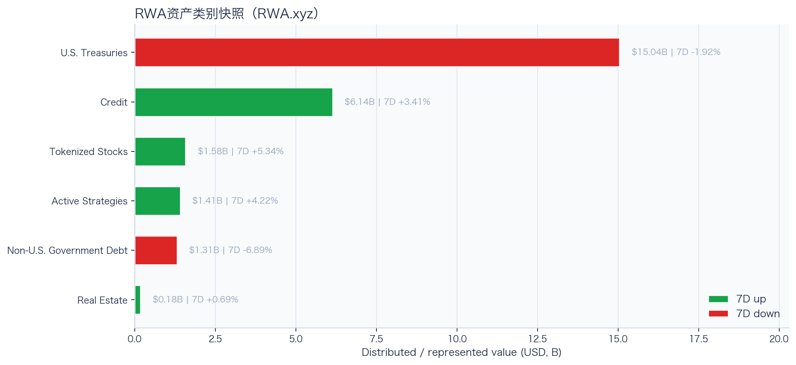
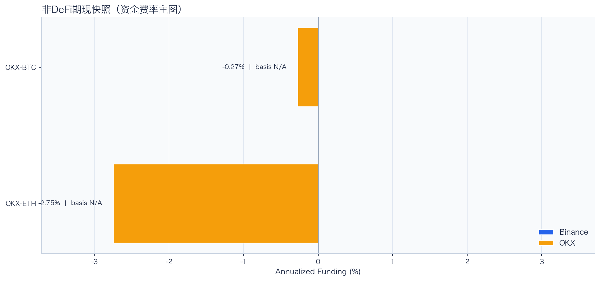
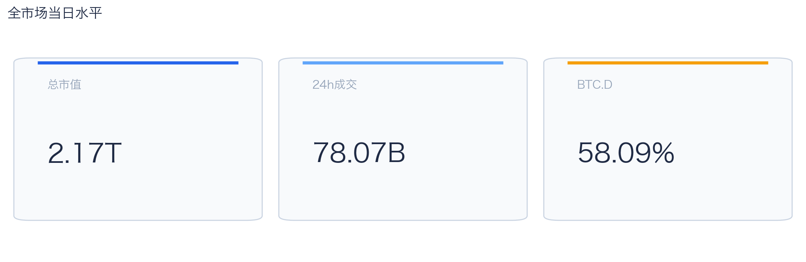
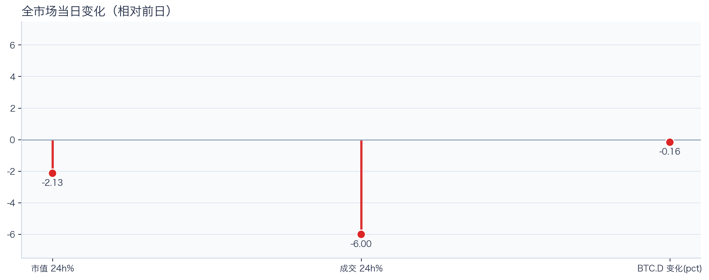
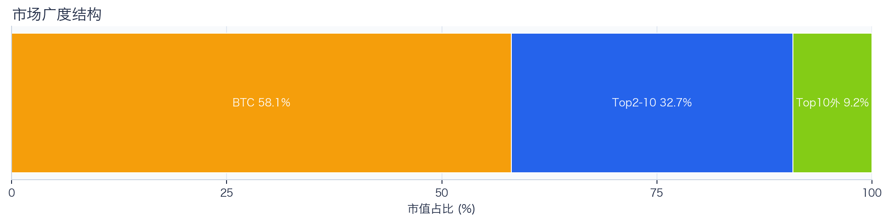
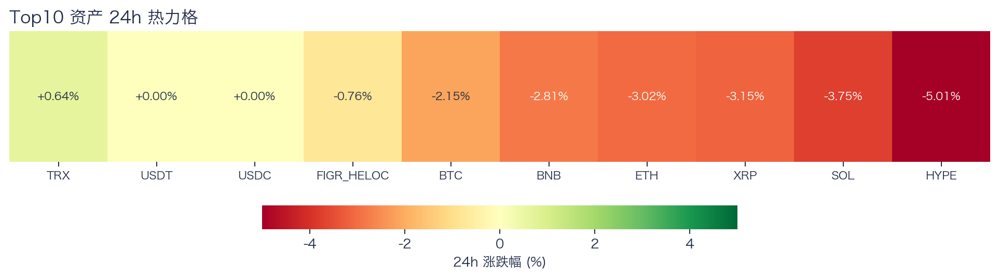
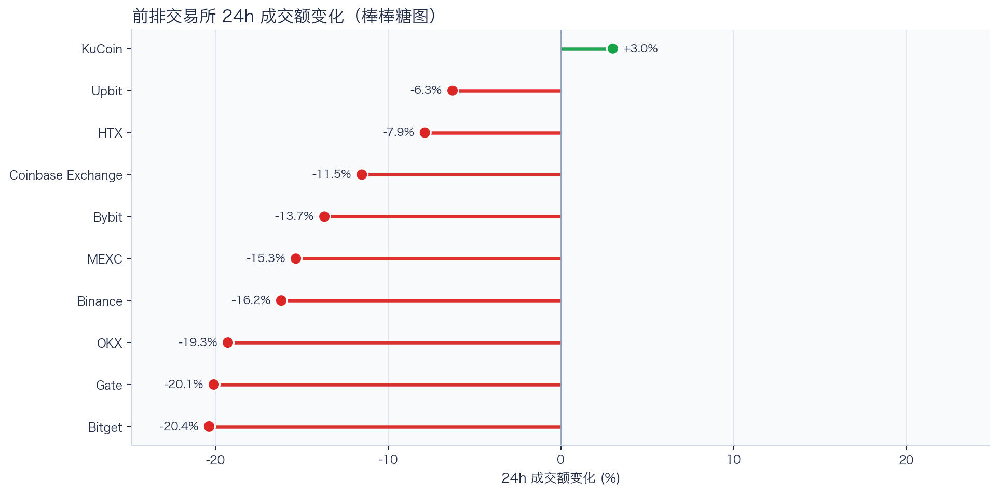
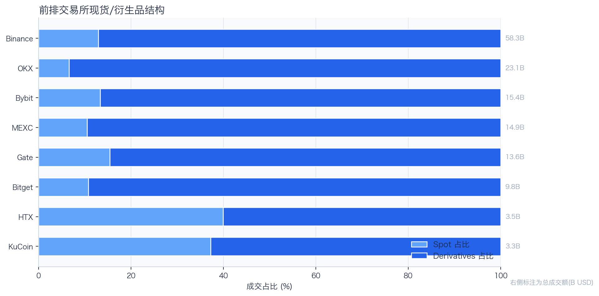
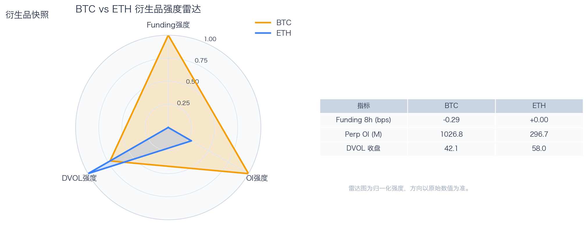
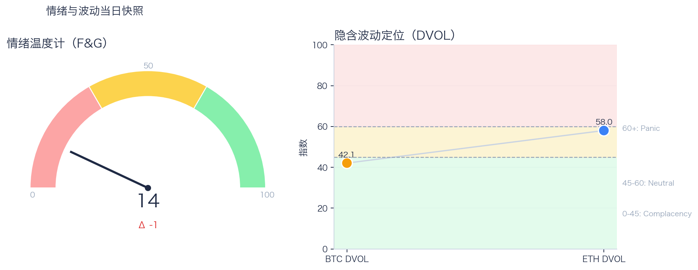

# 二级市场日报（2026-06-19）

## 关键结论
- 全市场市值 $2.17T（24h -2.13%），成交额 $78.07B（24h -6.00%）。
- BTC 主导率 58.09%（-0.16pct），Top10 外占比 9.18%。
- Top10 资产上涨 3 / 下跌 7，平均涨跌幅 -2.00%，首尾分化 5.66pct。
- 衍生品：BTC/ETH 资金费率分别为 -0.29bps / +0.00bps，DVOL 收盘 42.06 / 58.01。

## 今日盘面判断
如果只用一句话概括今天的市场，关键词是 `Defensive Drift`。价格与成交同步走弱，属于防守型下移结构，短线以控制回撤为主。广度仍偏窄，增量风险偏好尚未形成持续外溢。这意味着短线虽然有可交易的弹性，但要把它理解成新一轮趋势启动，证据还不够。

## 核心驱动因素
从流动性结构看，多数平台成交走弱，流动性恢复仍依赖少数头部平台；从杠杆维度看，杠杆拥挤度整体可控；在风险定价层面，隐含波动率回落至相对低位，事件冲击前的保护成本下降；再结合情绪仍在恐惧区，反弹更容易受到外部事件扰动。整体来看，盘面更像是修复中的高波动环境，而不是低波动顺趋势环境。

## BTC/ETH 24h 趋势判断

- BTC/ETH 24h 趋势数据暂不可用。

## 稳定币收益情况（链上协议）
稳定币收益数据暂不可用（见 Data Gaps）。

## RWA 结构观察

RWA.xyz 公开页快照显示，样本资产类别合计约 $25.66B；最大类别为 U.S. Treasuries（$15.04B，7D -1.92%）。7D 上升类别 4 个、下降类别 2 个，说明 RWA 当前更适合当作结构变量，而不是日内方向信号。
其中股票、主动策略和非美债这类交易属性更强的类别合计约 $4.30B，占样本 16.75%。这部分更接近 CEX 新品类、Perps 和跨资产成交额的观察入口。

RWA 资产类别对照表
| 类别 | 规模 | 7D变化 | as of |
|---|---:|---:|---|
| U.S. Treasuries | $15.04B | -1.92% | 2026-06-18 |
| Credit | $6.14B | +3.41% | 2026-06-18 |
| Tokenized Stocks | $1.58B | +5.34% | 2026-06-18 |
| Active Strategies | $1.41B | +4.22% | 2026-06-18 |
| Non-U.S. Government Debt | $1.31B | -6.89% | 2026-06-18 |
| Real Estate | $178.86M | +0.69% | 2026-06-18 |

交易含义：RWA 放在日报里可以，但应定位为二级市场的产品线与风险偏好背景；只有 tokenized stocks、RWA perps、可交易收益资产扩容时，才更直接影响交易所成交结构。
数据源：RWA.xyz 公开资产类别页；正式 API 可在设置 RWA_API_KEY 后替换为更稳定口径。

## 非 DeFi（交易所期现）

样本范围覆盖 Binance 与 OKX 的 BTC/ETH 现货与永续，用于观察 funding 与 basis 的当期结构。
- Funding 最高样本：OKX-BTC，年化约 -0.27%。
- Funding 最低样本：OKX-ETH，年化约 -2.75%。

借币成本多源对比表
| 资产 | Binance(日/年) | OKX(日/年) | Bybit(日/年) | Backpack(日/年) | KuCoin(日/年) | 最低日利率 |
|---|---:|---:|---:|---:|---:|---:|
| USDT | 0.01%/3.24% · 500k | 0.01%/2.51% · 5.0M | N/A | 0.01%/3.35% · 50.0M | N/A | OKX 0.01% |
| USDC | 0.01%/3.50% · 500k | 0.01%/2.51% · 1.0M | N/A | 0.01%/1.87% · 300.0M | N/A | Backpack 0.01% |
| BTC | 0.00%/0.40% · 100 | 0.00%/0.51% · 175 | N/A | 0.00%/0.45% · 3k | N/A | Binance 0.00% |
| ETH | 0.01%/2.22% · 2k | 0.00%/1.51% · 7k | N/A | 0.00%/0.58% · 20k | N/A | Backpack 0.00% |
说明：统一按日利率/年化展示，单元格尾部为可借额度。
- 交易含义：当 funding 年化显著高于 basis 且持续为正，carry 交易更偏向收取 funding；若 basis 与 funding 同步回落，需降低杠杆并关注资金回流速度。
该部分与链上收益分开统计，便于比较两类策略的收益与风险结构。

## 市场脉冲

截至 2026-06-19，全市场市值 $2.17T，24h 成交额 $78.07B，BTC 主导率 58.09%。
价格与成交同步走弱，风险偏好仍在收缩，盘面更偏防守。在这种盘面下，成交能否继续跟上，是判断明天反弹延续还是回吐的第一道分水岭。

相对前日，市值 -2.13%、成交 -6.00%、BTC.D -0.16pct。
把这组变化拆开看，比看单一涨跌更有用：价格、成交、主导率三者同向时，行情更有连续性；一旦出现背离，走势往往会变得更短促、更反复。

## 主导率与市场广度

当前结构为 BTC 58.09% / Top2-10 32.73% / Top10 外 9.18%。长尾占比仍偏低，广度修复还未形成持续趋势。
Top10 外占比处于低位，风险偏好仍主要停留在 BTC 与头部资产。换句话说，资金目前更愿意在高流动性的核心资产里做仓位调整，而不是大面积扩散到长尾资产。

## 资产与交易所资金流

Top10 中领涨 TRX（+0.64%），尾部 HYPE（-5.01%），均值 -2.00%。分化 5.66pct，结构性交易仍是主导。
下跌家数占优，风险偏好修复仍较脆弱，短线追高性价比一般。对交易而言，这通常意味着“选币”比“全市场方向”更重要，错配带来的收益差会明显放大。

前排样本上涨 1 家、下跌 9 家，均值 -12.76%。KuCoin 最强（+3.01%），Bitget 最弱（-20.37%）。
最强与最弱平台的 24h 变化差达到 23.38pct，说明流动性仍在选择性回流，头部平台的价格发现能力更强。当平台间流量分化明显时，报价连续性和滑点表现会同步分化，执行层面要更关注成交质量。

样本内衍生品成交占比 85.68%。若该占比继续走高且 funding 不同步回落，短线波动脉冲通常会增强。
衍生品占比处于高位，行情更容易出现脉冲式放大，风控阈值建议偏保守。这也是为什么同样的消息面在当前阶段更容易被放大成大振幅走势。

## 衍生品与情绪

资金费率（Funding）仍在中性附近，BTC/ETH 分别 -0.29bps / +0.00bps；未平仓合约（OI）为 $1.03B / $296.75M；隐含波动率指数（DVOL）位于 Complacency（低波动定价） / Neutral（中性波动定价）。
Funding 与 DVOL 的组合显示，方向拥挤暂未极端，但尾部风险定价仍未完全回落。因此更合适的做法不是激进追单边，而是围绕波动管理仓位和节奏。

恐惧与贪婪指数（F&G）当日 14（较前日 -1）；配合 BTC/ETH DVOL 42.06/58.01，当前更像情绪修复中的高波动区。
情绪维持在恐惧区，反弹通常更依赖事件驱动，持续性需要成交确认。只有当情绪、广度和成交三者同时改善，市场才更可能从“反弹交易”切换到“趋势交易”。

## OKX 聪明钱仓位结构（Top10交易员）
聪明钱榜单数据暂不可用（见 Data Gaps）。

仓位结构暂不可用（见 Data Gaps）。

BTC/ETH 聪明钱聚合信号未启用（设置 `OKX_SMARTMONEY_FETCH_SIGNAL=1` 可尝试拉取）。

交易含义：聪明钱仓位更适合做方向与拥挤度监控，不应单独作为开仓触发。

## OKX 新闻情绪快照
OKX 新闻情绪快照暂不可用（见 Data Gaps）。

## 未来24小时观察
1. 若 Top10 外占比继续抬升且 BTC.D 回落，说明风险偏好开始从核心资产向外扩散。
2. 若衍生品占比继续上升而 funding 仍中性，盘面大概率维持高波动震荡而非顺滑上行。
3. 若 F&G 反弹但 DVOL 不降，代表情绪与风险定价背离，追涨胜率会明显下降。

## 交易与风控含义
- 仓位管理优先级高于方向押注，建议保持核心仓位稳定、战术仓位滚动。
- 若交易所衍生品占比继续上升，建议同步收紧杠杆和止损参数。
- 关注情绪改善与广度扩散是否同步发生，二者背离时避免追逐单边。

## 数据缺口（Data Gaps）
- Binance BTC/ETH 24h 批量数据获取失败，转单币重试: HTTP Error 451: 
- Binance 24h 单币数据获取失败 BTCUSDT: HTTP Error 451: 
- Binance 24h 未返回 BTCUSDT 数据。
- Binance 24h 单币数据获取失败 ETHUSDT: HTTP Error 451: 
- Binance 24h 未返回 ETHUSDT 数据。
- Binance BTCUSDT 1h K线获取失败: HTTP Error 451: 
- Binance ETHUSDT 1h K线获取失败: HTTP Error 451: 
- Binance 非DeFi期现数据获取失败 BTC: HTTP Error 451: 
- Binance 非DeFi期现数据获取失败 ETH: HTTP Error 451: 
- 借币成本部分数据源不可用: Bybit: HTTP Error 403: Forbidden
- DefiLlama 稳定币收益数据获取失败: <urlopen error EOF occurred in violation of protocol (_ssl.c:1129)>
- OKX 聪明钱数据获取失败（traders）: Update available for @okx_ai/okx-trade-cli: 1.3.2 → 1.3.8
Run: npm install -g @okx_ai/okx-trade-cli

Error: Session expired — run `okx-auth login` again
Error: No credentials found.
Hint: Run `okx auth login` to authenticate, or configure API key credentials.
Version: @okx_ai/okx-trade-cli@1.3.2
- OKX 聪明钱数据获取失败（news:coin-sentiment）: Update available for @okx_ai/okx-trade-cli: 1.3.2 → 1.3.8
Run: npm install -g @okx_ai/okx-trade-cli

Error: Session expired — run `okx-auth login` again
Error: No credentials found.
Hint: Run `okx auth login` to authenticate, or configure API key credentials.
Version: @okx_ai/okx-trade-cli@1.3.2
- OKX 新闻情绪快照为空：coin-sentiment 未返回有效样本。

