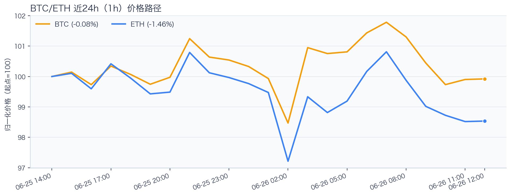
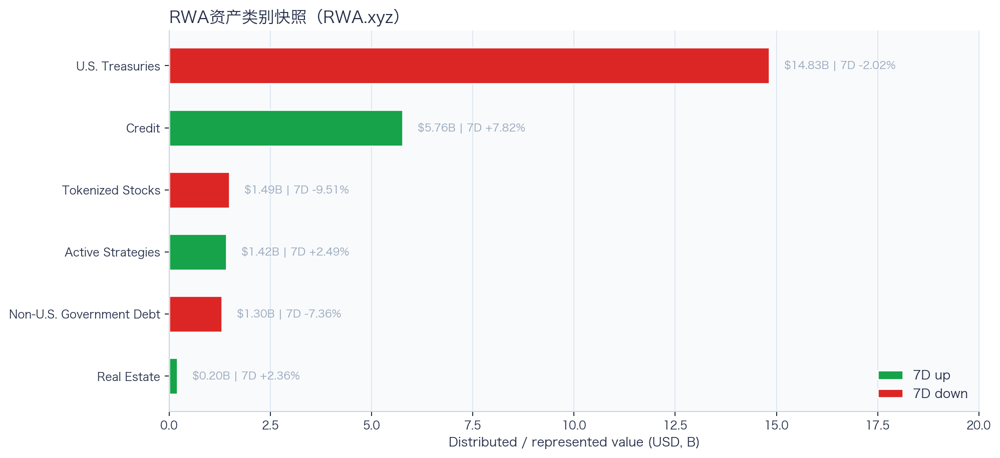
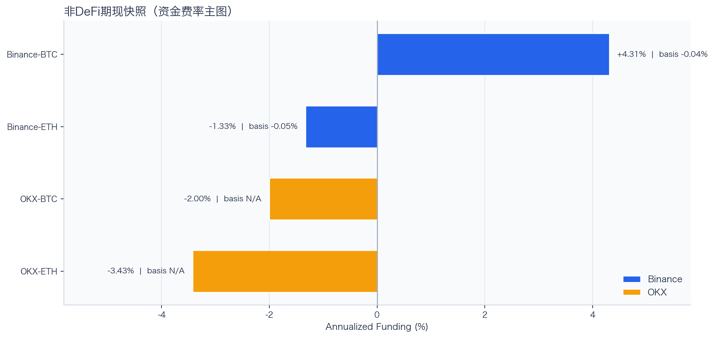
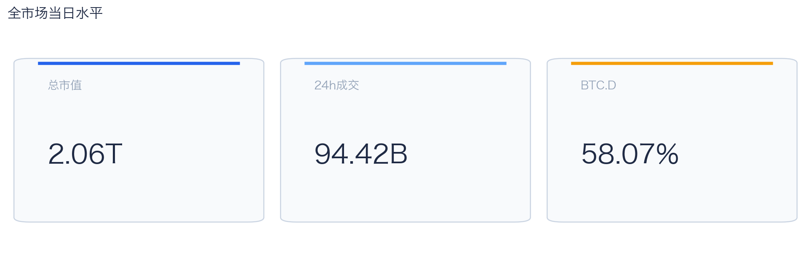
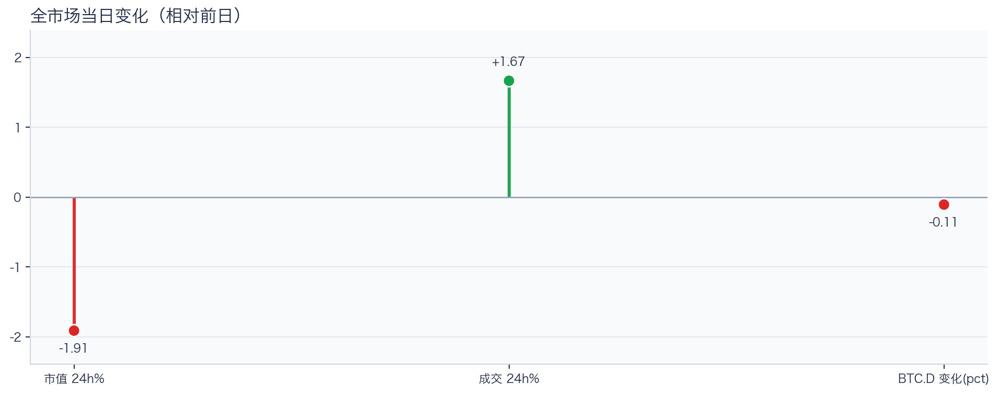
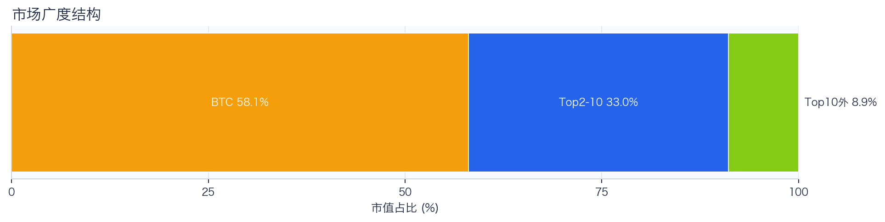
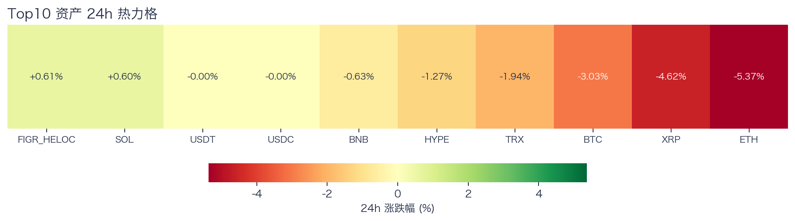
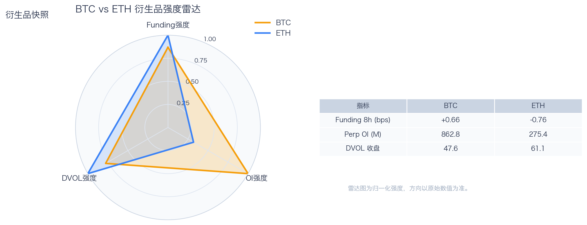
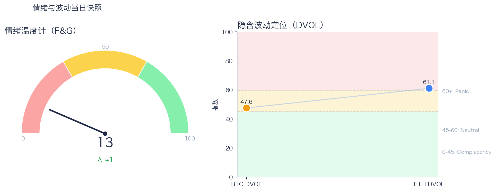

# 二级市场日报（2026-06-26）

## 关键结论
- 全市场市值 $2.06T（24h -1.91%），成交额 $94.42B（24h +1.67%）。
- BTC 主导率 58.07%（-0.11pct），Top10 外占比 8.93%。
- Top10 资产上涨 2 / 下跌 8，平均涨跌幅 -1.57%，首尾分化 5.98pct。
- 衍生品：BTC/ETH 资金费率分别为 +0.66bps / -0.76bps，DVOL 收盘 47.57 / 61.14。

## 今日盘面判断
如果只用一句话概括今天的市场，关键词是 `Stress Repricing`。价格回撤但换手抬升，说明市场在高分歧下重估风险，波动脉冲概率偏高。广度仍偏窄，增量风险偏好尚未形成持续外溢。这意味着短线虽然有可交易的弹性，但要把它理解成新一轮趋势启动，证据还不够。

## 核心驱动因素
从流动性结构看，平台流量呈分化状态，头部与非头部恢复节奏不一致；从杠杆维度看，杠杆拥挤度整体可控；在风险定价层面，期权端对尾部波动的定价仍偏谨慎；再结合情绪仍在恐惧区，反弹更容易受到外部事件扰动。整体来看，盘面更像是修复中的高波动环境，而不是低波动顺趋势环境。

## BTC/ETH 24h 趋势判断

- BTC：$59,424.93（24h -2.97%，区间 $58,115.01 - $61,761.35，当前位于区间 36%）=> 偏弱震荡。
- ETH：$1,545.40（24h -5.30%，区间 $1,512.00 - $1,650.38，当前位于区间 24%）=> 偏弱，下行主导。
- 简评：BTC 偏弱震荡下行，ETH 相对更弱。

## 稳定币收益情况（链上协议）
按安全优先（协议成熟度、链层风险、是否依赖激励）筛选了 10 个主流池；原生供给利率均值约 +2.52%。
其中包含奖励补贴的池有 2 个，补贴收益已单列，不与原生利率混合。

核心观察
- 利率结构：Total APY 位于 0.12% 至 7.03% 区间。
- 资金集中：TVL 主要集中在 Spark-USDT（Ethereum，TVL $855.54M）、Aave-USDT（Ethereum，TVL $79.38M）。
- 收益领先：当前收益靠前样本包括 Aave-USDC（Ethereum，Total 7.03%）、Aave-USDT（Ethereum，Total 6.44%）。

风险提示
- 利用率达到 70% 以上的池有 7 个，杠杆需求主要集中在头部池。
- 利用率最高样本：Aave-USDC（Ethereum） 90.40%，Borrow APY 4.01%。
- 奖励收益池数量：2 个。当前收益主体仍以原生利率为主。

数据覆盖：Aave API(8)，Compound API(6)，DefiLlama(21)。

稳定币收益对照表（安全优先）
| 协议 | 链 | 币种 | Supply | Borrow | Rewards | Total | Utilization | TVL | 数据源 |
|---|---|---|---:|---:|---:|---:|---:|---:|---|
| Aave | Ethereum | DAI | 3.24% | 4.93% | N/A | 3.19% | 88.49% | $12.83M | DefiLlama+Aave API |
| Spark | Ethereum | USDT | 2.50% | N/A | N/A | 2.50% | N/A | $855.54M | DefiLlama |
| Compound | Ethereum | USDS | 3.24% | 4.00% | 0.00% | 3.24% | 89.91% | $1.89M | Compound API |
| Aave | Ethereum | USDS | 0.12% | 5.68% | N/A | 0.12% | 2.92% | $12.07M | DefiLlama+Aave API |
| Aave | Ethereum | PYUSD | 3.29% | 4.63% | N/A | 3.24% | 79.41% | $2.68M | DefiLlama+Aave API |
| Aave | Ethereum | USDT | 2.18% | 3.28% | 4.29% | 6.44% | 74.20% | $79.38M | DefiLlama+Aave API |
| Aave | Ethereum | USDC | 3.25% | 4.01% | 3.78% | 7.03% | 90.40% | $60.66M | DefiLlama+Aave API |
| Aave | Arbitrum | USDC | 2.39% | 3.48% | N/A | 2.36% | 76.88% | $39.73M | DefiLlama+Aave API |
| Aave | Base | USDC | 3.21% | 4.28% | N/A | 3.16% | 83.74% | $28.45M | DefiLlama+Aave API |
| Aave | Arbitrum | DAI | 1.80% | 3.71% | N/A | 1.79% | 65.50% | $1.29M | DefiLlama+Aave API |

稳定币收益对比（扩展样本，TVL≥$1M，共 22 条）
| 币种 | 协议 | 链 | Supply | Borrow | Rewards | Total | Utilization | TVL | 数据源 |
|---|---|---|---:|---:|---:|---:|---:|---:|---|
| USDC | Aave | Ethereum | 3.25% | 4.01% | 3.78% | 7.03% | 90.40% | $60.66M | DefiLlama+Aave API |
| USDC | Aave | Arbitrum | 2.39% | 3.48% | N/A | 2.36% | 76.88% | $39.73M | DefiLlama+Aave API |
| USDC | Aave | Base | 3.21% | 4.28% | N/A | 3.16% | 83.74% | $28.45M | DefiLlama+Aave API |
| USDC | Spark | Ethereum | 3.60% | N/A | N/A | 3.60% | N/A | $318.82M | DefiLlama |
| USDC | Compound | Ethereum | 3.15% | 3.93% | 0.09% | 3.25% | 87.63% | $326.18M | DefiLlama+Compound API |
| USDC | Compound | Arbitrum | 2.63% | 3.53% | 0.00% | 2.63% | 73.12% | $15.51M | DefiLlama+Compound API |
| USDC | Compound | Base | 3.97% | 4.82% | 0.00% | 3.97% | 90.23% | $8.42M | DefiLlama+Compound API |
| USDT | Aave | Ethereum | 2.18% | 3.28% | 4.29% | 6.44% | 74.20% | $79.38M | DefiLlama+Aave API |
| USDT | Spark | Ethereum | 2.50% | N/A | N/A | 2.50% | N/A | $855.54M | DefiLlama |
| USDT | Compound | Ethereum | 2.72% | 3.60% | 0.09% | 2.81% | 75.64% | $191.16M | DefiLlama+Compound API |
| USDT | Compound | Arbitrum | 1.86% | 2.94% | 0.00% | 1.86% | 51.78% | $19.71M | DefiLlama+Compound API |
| DAI | Aave | Ethereum | 3.24% | 4.93% | N/A | 3.19% | 88.49% | $12.83M | DefiLlama+Aave API |
| DAI | Aave | Arbitrum | 1.80% | 3.71% | N/A | 1.79% | 65.50% | $1.29M | DefiLlama+Aave API |
| DAI | Spark | Ethereum | 2.34% | N/A | N/A | 2.34% | N/A | $103.17M | DefiLlama |
| USDS | Aave | Ethereum | 0.12% | 5.68% | N/A | 0.12% | 2.92% | $12.07M | DefiLlama+Aave API |
| USDS | Spark | Ethereum | 2.20% | N/A | N/A | 2.20% | N/A | $182.82M | DefiLlama |
| USDS | Spark | Arbitrum | 3.60% | N/A | N/A | 3.60% | N/A | $359.72M | DefiLlama |
| USDS | Spark | Base | 3.60% | N/A | N/A | 3.60% | N/A | $223.08M | DefiLlama |
| USDS | Compound | Ethereum | 3.24% | 4.00% | 0.00% | 3.24% | 89.91% | $1.89M | Compound API |
| SUSDS | Spark | Ethereum | 0.00% | N/A | N/A | 0.00% | N/A | $3.28M | DefiLlama |
| PYUSD | Aave | Ethereum | 3.29% | 4.63% | N/A | 3.24% | 79.41% | $2.68M | DefiLlama+Aave API |
| PYUSD | Spark | Ethereum | 0.27% | N/A | N/A | 0.27% | N/A | $92.00M | DefiLlama |

跨源补充（比 taoli 更全）
- 新增对比源：DefiLlama 全量稳定币池（筛选口径）+ Bitcompare CeFi 利率，并与现有链上主流池快照交叉核对。
- 覆盖规模：原链上精表 22 条；DefiLlama 扩展样本 87 条（展示 Top20）；Bitcompare 稳定币利率样本 0 条。
- 覆盖维度：扩展样本覆盖 46 个协议、14 条链、59 类稳定币。
- 口径说明：Bitcompare 为平台展示 APY，taoli 为 Binance 借币年化，两者用于横向参考，不等价于无风险套利收益。

稳定币收益补充表（DefiLlama 扩展，TVL≥$30M，去重后 Top20）
| 币种 | 协议 | 链 | Base | Rewards | Total | TVL | 数据源 |
|---|---|---|---:|---:|---:|---:|---|
| SUSDS | sky-lending | Ethereum | 3.60% | N/A | 3.60% | $5.89B | DefiLlama API |
| USYC | circle-usyc | BSC | 3.17% | N/A | 3.17% | $3.04B | DefiLlama API |
| USDC | maple | Ethereum | 5.11% | 0.00% | 5.11% | $2.88B | DefiLlama API |
| SUSDE | ethena-usde | Ethereum | 3.55% | N/A | 3.55% | $1.71B | DefiLlama API |
| USDY | ondo-yield-assets | Ethereum | 3.55% | N/A | 3.55% | $1.11B | DefiLlama API |
| USDT | maple | Ethereum | 4.04% | 0.00% | 4.04% | $1.03B | DefiLlama API |
| USDS | centrifuge-protocol | Ethereum | 1.37% | N/A | 1.37% | $869.43M | DefiLlama API |
| BUIDL | blackrock-buidl | Ethereum | 3.56% | N/A | 3.56% | $830.53M | DefiLlama API |
| BUIDL | blackrock-buidl | Aptos | 3.22% | N/A | 3.22% | $821.84M | DefiLlama API |
| BUIDL | blackrock-buidl | Solana | 3.53% | N/A | 3.53% | $615.99M | DefiLlama API |
| USTB | invesco-ustb | Ethereum | 3.77% | N/A | 3.77% | $614.91M | DefiLlama API |
| USDY | ondo-yield-assets | Stellar | 3.55% | N/A | 3.55% | $529.41M | DefiLlama API |
| BUSD0 | usual-usd0 | Ethereum | N/A | 1.95% | 1.95% | $510.48M | DefiLlama API |
| GTUSDCP | morpho-blue | Base | 4.39% | 0.00% | 4.39% | $429.26M | DefiLlama API |
| BUIDL | blackrock-buidl | Avalanche | 3.53% | N/A | 3.53% | $428.64M | DefiLlama API |
| USDC | jupiter-lend | Solana | 5.08% | 0.78% | 5.87% | $386.74M | DefiLlama API |
| AUSD | centrifuge-protocol | Ethereum | 9.35% | N/A | 9.35% | $370.73M | DefiLlama API |
| SUSDS | sky-lending | Arbitrum | 3.60% | N/A | 3.60% | $359.72M | DefiLlama API |
| SENPYUSDMAIN | morpho-blue | Ethereum | 2.26% | 3.21% | 5.47% | $320.39M | DefiLlama API |
| SUSDAI | usd-ai | Arbitrum | 7.60% | N/A | 7.60% | $298.89M | DefiLlama API |

交易含义：当前稳定币收益更偏“头部池中等收益 + 局部高利用率”结构，策略上优先流动性与透明度，再考虑收益增强。
部分池的 Borrow 与 Utilization 暂未返回，表内仅展示已获取字段。

## RWA 结构观察

RWA.xyz 公开页快照显示，样本资产类别合计约 $24.99B；最大类别为 U.S. Treasuries（$14.83B，7D -2.02%）。7D 上升类别 3 个、下降类别 3 个，说明 RWA 当前更适合当作结构变量，而不是日内方向信号。
其中股票、主动策略和非美债这类交易属性更强的类别合计约 $4.20B，占样本 16.81%。这部分更接近 CEX 新品类、Perps 和跨资产成交额的观察入口。

RWA 资产类别对照表
| 类别 | 规模 | 7D变化 | as of |
|---|---:|---:|---|
| U.S. Treasuries | $14.83B | -2.02% | 2026-06-25 |
| Credit | $5.76B | +7.82% | 2026-06-25 |
| Tokenized Stocks | $1.49B | -9.51% | 2026-06-25 |
| Active Strategies | $1.42B | +2.49% | 2026-06-25 |
| Non-U.S. Government Debt | $1.30B | -7.36% | 2026-06-25 |
| Real Estate | $202.65M | +2.36% | 2026-06-25 |

交易含义：RWA 放在日报里可以，但应定位为二级市场的产品线与风险偏好背景；只有 tokenized stocks、RWA perps、可交易收益资产扩容时，才更直接影响交易所成交结构。
数据源：RWA.xyz 公开资产类别页；正式 API 可在设置 RWA_API_KEY 后替换为更稳定口径。

## 非 DeFi（交易所期现）

样本范围覆盖 Binance 与 OKX 的 BTC/ETH 现货与永续，用于观察 funding 与 basis 的当期结构。
- Funding 最高样本：Binance-BTC，年化约 4.31%。
- Funding 最低样本：OKX-ETH，年化约 -3.43%。
- Basis 偏离最大：Binance-ETH，相对指数约 -0.05%。

借币成本多源对比表
| 资产 | Binance(日/年) | OKX(日/年) | Bybit(日/年) | Backpack(日/年) | KuCoin(日/年) | 最低日利率 |
|---|---:|---:|---:|---:|---:|---:|
| USDT | 0.01%/3.38% · 500k | 0.01%/2.51% · 5.0M | 0.01%/3.41% · 8.0M | 0.01%/3.58% · 50.0M | N/A | OKX 0.01% |
| USDC | 0.01%/3.74% · 500k | 0.01%/2.51% · 1.0M | 0.01%/3.60% · 3.5M | 0.01%/2.08% · 300.0M | N/A | Backpack 0.01% |
| USDE | N/A | N/A | 0.01%/5.00% · 1.0M | N/A | N/A | Bybit 0.01% |
| BTC | 0.00%/0.40% · 100 | 0.00%/0.51% · 175 | 0.00%/0.40% · 300 | 0.00%/0.46% · 3k | N/A | Bybit 0.00% |
| ETH | 0.01%/2.18% · 2k | 0.00%/1.51% · 7k | 0.01%/2.16% · 2k | 0.00%/1.02% · 20k | N/A | Backpack 0.00% |
说明：统一按日利率/年化展示，单元格尾部为可借额度。
- 交易含义：当 funding 年化显著高于 basis 且持续为正，carry 交易更偏向收取 funding；若 basis 与 funding 同步回落，需降低杠杆并关注资金回流速度。
该部分与链上收益分开统计，便于比较两类策略的收益与风险结构。

## 市场脉冲

截至 2026-06-26，全市场市值 $2.06T，24h 成交额 $94.42B，BTC 主导率 58.07%。
价格下行但换手放大，反映分歧加剧，通常伴随更高的日内波动。在这种盘面下，成交能否继续跟上，是判断明天反弹延续还是回吐的第一道分水岭。

相对前日，市值 -1.91%、成交 +1.67%、BTC.D -0.11pct。
把这组变化拆开看，比看单一涨跌更有用：价格、成交、主导率三者同向时，行情更有连续性；一旦出现背离，走势往往会变得更短促、更反复。

## 主导率与市场广度

当前结构为 BTC 58.07% / Top2-10 33.00% / Top10 外 8.93%。长尾占比仍偏低，广度修复还未形成持续趋势。
Top10 外占比处于低位，风险偏好仍主要停留在 BTC 与头部资产。换句话说，资金目前更愿意在高流动性的核心资产里做仓位调整，而不是大面积扩散到长尾资产。

## 资产与交易所资金流

Top10 中领涨 FIGR_HELOC（+0.61%），尾部 ETH（-5.37%），均值 -1.57%。分化 5.98pct，结构性交易仍是主导。
下跌家数占优，风险偏好修复仍较脆弱，短线追高性价比一般。对交易而言，这通常意味着“选币”比“全市场方向”更重要，错配带来的收益差会明显放大。

交易所 24h 成交变化数据不完整。
平台流量分层明显，交易恢复并不均匀。当平台间流量分化明显时，报价连续性和滑点表现会同步分化，执行层面要更关注成交质量。

交易所结构占比数据不完整。
衍生品在样本成交中占比较高，短线波动通常会被杠杆交易放大。这也是为什么同样的消息面在当前阶段更容易被放大成大振幅走势。

## 衍生品与情绪

资金费率（Funding）仍在中性附近，BTC/ETH 分别 +0.66bps / -0.76bps；未平仓合约（OI）为 $862.80M / $275.43M；隐含波动率指数（DVOL）位于 Neutral（中性波动定价） / Panic（高波动溢价）。
Funding 与 DVOL 的组合显示，方向拥挤暂未极端，但尾部风险定价仍未完全回落。因此更合适的做法不是激进追单边，而是围绕波动管理仓位和节奏。

恐惧与贪婪指数（F&G）当日 13（较前日 +1）；配合 BTC/ETH DVOL 47.57/61.14，当前更像情绪修复中的高波动区。
恐惧区内出现边际改善，说明市场开始试探修复，但尚不足以支持激进风险暴露。只有当情绪、广度和成交三者同时改善，市场才更可能从“反弹交易”切换到“趋势交易”。

## OKX 聪明钱仓位结构（Top10交易员）
聪明钱榜单数据暂不可用（见 Data Gaps）。

仓位结构暂不可用（见 Data Gaps）。

BTC/ETH 聪明钱聚合信号未启用（设置 `OKX_SMARTMONEY_FETCH_SIGNAL=1` 可尝试拉取）。

交易含义：聪明钱仓位更适合做方向与拥挤度监控，不应单独作为开仓触发。

## OKX 新闻情绪快照
OKX 新闻情绪快照暂不可用（见 Data Gaps）。

## 未来24小时观察
1. 若 Top10 外占比继续抬升且 BTC.D 回落，说明风险偏好开始从核心资产向外扩散。
2. 若衍生品占比继续上升而 funding 仍中性，盘面大概率维持高波动震荡而非顺滑上行。
3. 若 F&G 反弹但 DVOL 不降，代表情绪与风险定价背离，追涨胜率会明显下降。

## 交易与风控含义
- 仓位管理优先级高于方向押注，建议保持核心仓位稳定、战术仓位滚动。
- 若交易所衍生品占比继续上升，建议同步收紧杠杆和止损参数。
- 关注情绪改善与广度扩散是否同步发生，二者背离时避免追逐单边。

## 数据缺口（Data Gaps）
- CMC 交易所报价数据获取失败: <urlopen error EOF occurred in violation of protocol (_ssl.c:1129)>
- Morpho API 获取失败: HTTP Error 400: Bad Request
- Bitcompare CeFi 稳定币样本为空：未匹配到稳定币资产。
- OKX 聪明钱数据获取失败（traders）: Update available for @okx_ai/okx-trade-cli: 1.3.2 → 1.3.9
Run: npm install -g @okx_ai/okx-trade-cli

Error: Session expired — run `okx-auth login` again
Error: No credentials found.
Hint: Run `okx auth login` to authenticate, or configure API key credentials.
Version: @okx_ai/okx-trade-cli@1.3.2
- OKX 聪明钱数据获取失败（news:coin-sentiment）: Update available for @okx_ai/okx-trade-cli: 1.3.2 → 1.3.9
Run: npm install -g @okx_ai/okx-trade-cli

Error: Session expired — run `okx-auth login` again
Error: No credentials found.
Hint: Run `okx auth login` to authenticate, or configure API key credentials.
Version: @okx_ai/okx-trade-cli@1.3.2
- OKX 新闻情绪快照为空：coin-sentiment 未返回有效样本。

