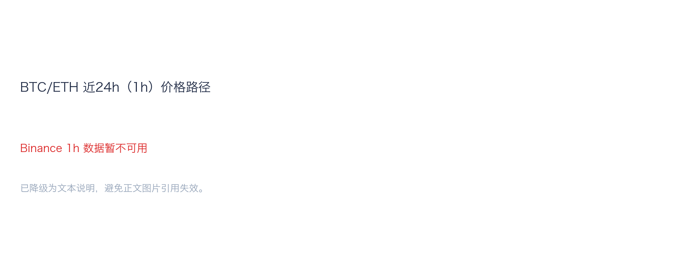
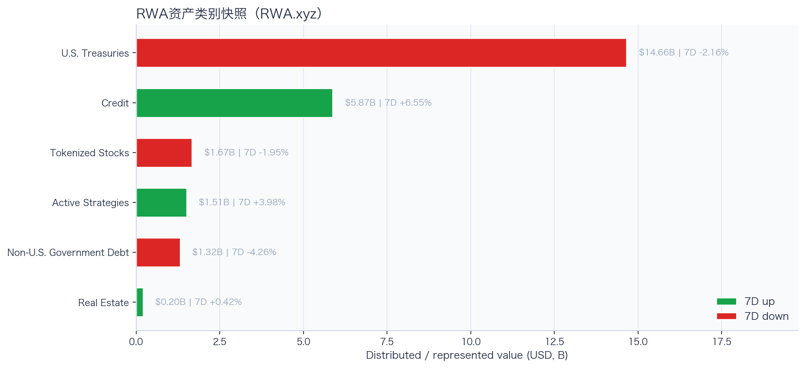
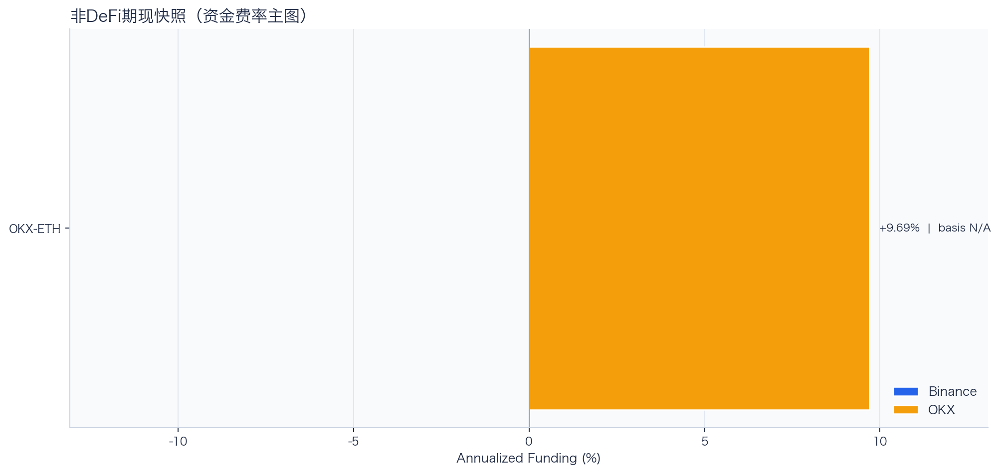
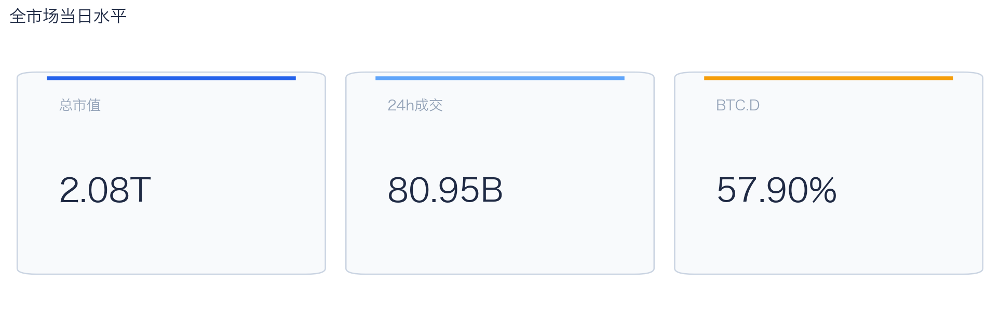
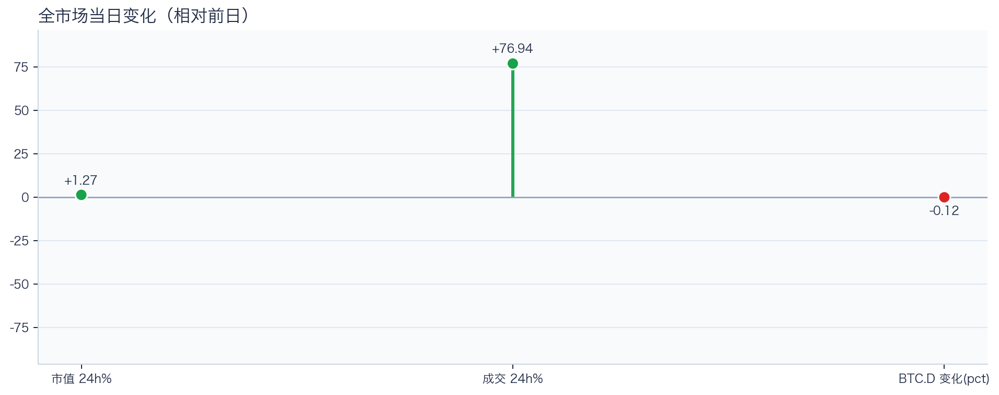
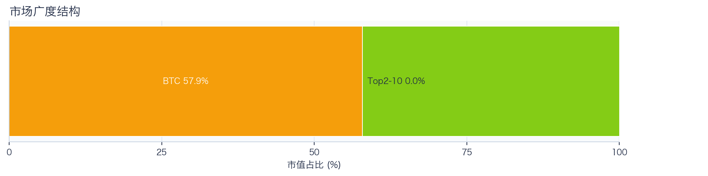
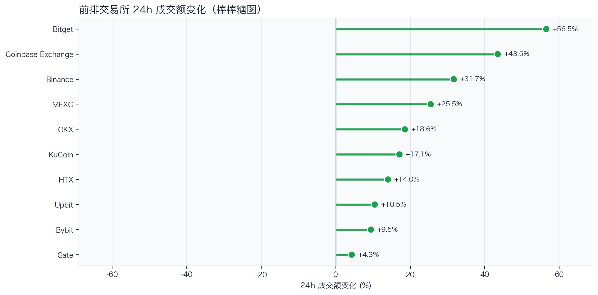
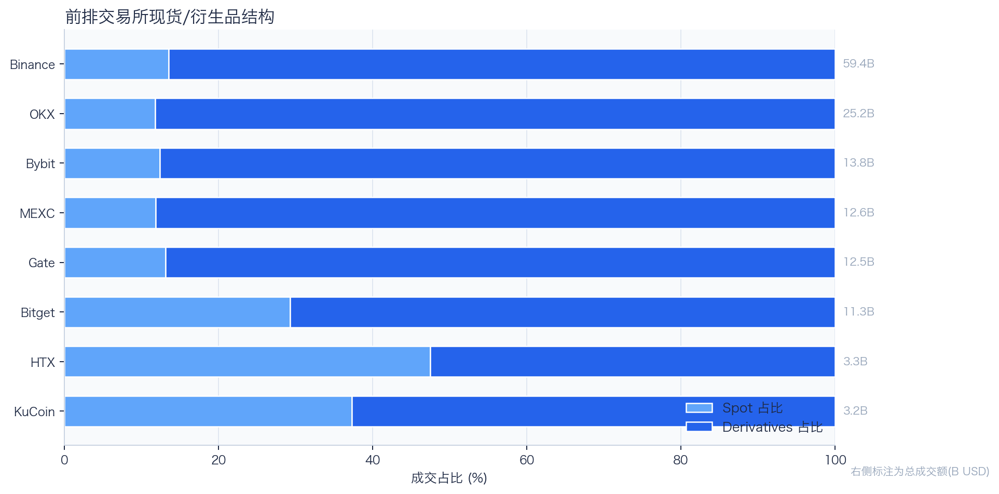
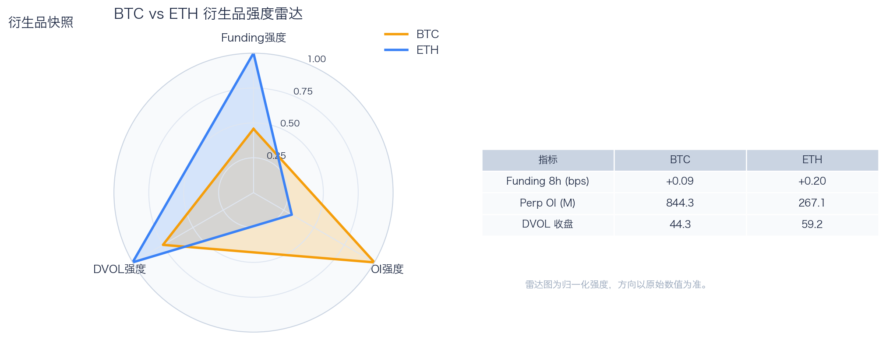
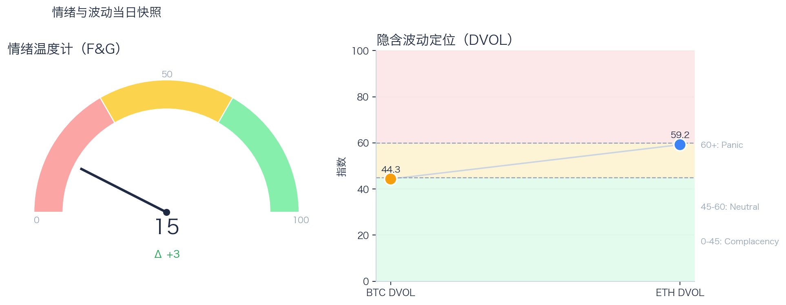

# 二级市场日报（2026-06-30）

## 关键结论
- 全市场市值 $2.08T（24h +1.27%），成交额 $80.95B（24h +76.94%）。
- BTC 主导率 57.90%（-0.12pct），Top10 外占比 100.00%。
- Top10 资产广度统计不完整。
- 衍生品：BTC/ETH 资金费率分别为 +0.09bps / +0.20bps，DVOL 收盘 44.33 / 59.20。

## 今日盘面判断
如果只用一句话概括今天的市场，关键词是 `Risk-On Broadening`。价格和成交同步修复，且长尾占比具备扩散条件，市场处于风险偏好外溢阶段。长尾占比已进入可观察扩散区间，若持续抬升，风格可能从核心资产外溢。这意味着短线虽然有可交易的弹性，但要把它理解成新一轮趋势启动，证据还不够。

## 核心驱动因素
从流动性结构看，多数平台成交回暖，短线流动性环境较前一日改善；从杠杆维度看，杠杆拥挤度整体可控；在风险定价层面，隐含波动率回落至相对低位，事件冲击前的保护成本下降；再结合情绪仍在恐惧区，反弹更容易受到外部事件扰动。整体来看，盘面更像是修复中的高波动环境，而不是低波动顺趋势环境。

## BTC/ETH 24h 趋势判断

- BTC/ETH 24h 趋势数据暂不可用。

## 稳定币收益情况（链上协议）
按安全优先（协议成熟度、链层风险、是否依赖激励）筛选了 10 个主流池；原生供给利率均值约 +3.92%。
其中包含奖励补贴的池有 2 个，补贴收益已单列，不与原生利率混合。

核心观察
- 利率结构：Total APY 位于 0.79% 至 15.28% 区间。
- 资金集中：TVL 主要集中在 Spark-USDT（Ethereum，TVL $851.45M）、Aave-USDT（Ethereum，TVL $79.03M）。
- 收益领先：当前收益靠前样本包括 Aave-DAI（Ethereum，Total 15.28%）、Aave-USDC（Ethereum，Total 6.86%）。

风险提示
- 利用率达到 70% 以上的池有 3 个，杠杆需求主要集中在头部池。
- 利用率最高样本：Compound-USDS（Ethereum） 90.44%，Borrow APY 5.59%。
- 奖励收益池数量：2 个。当前收益主体仍以原生利率为主。

数据覆盖：Aave API(3)，Compound API(6)，DefiLlama(21)。

稳定币收益对照表（安全优先）
| 协议 | 链 | 币种 | Supply | Borrow | Rewards | Total | Utilization | TVL | 数据源 |
|---|---|---|---:|---:|---:|---:|---:|---:|---|
| Aave | Ethereum | USDS | 0.79% | N/A | N/A | 0.79% | N/A | $10.10M | DefiLlama |
| Spark | Ethereum | USDT | 2.50% | N/A | N/A | 2.50% | N/A | $851.45M | DefiLlama |
| Compound | Ethereum | USDS | 4.65% | 5.59% | 0.00% | 4.65% | 90.44% | $1.88M | Compound API |
| Aave | Ethereum | DAI | 15.28% | N/A | N/A | 15.28% | N/A | $4.43M | DefiLlama |
| Aave | Ethereum | PYUSD | 3.20% | N/A | N/A | 3.20% | N/A | $2.39M | DefiLlama |
| Aave | Arbitrum | USDC | 2.32% | 3.42% | N/A | 2.30% | 75.76% | $42.18M | DefiLlama+Aave API |
| Aave | Base | USDC | 3.26% | 4.31% | N/A | 3.20% | 84.47% | $27.24M | DefiLlama+Aave API |
| Aave | Arbitrum | DAI | 1.82% | 3.73% | N/A | 1.81% | 65.86% | $1.28M | DefiLlama+Aave API |
| Aave | Ethereum | USDT | 2.22% | N/A | 4.30% | 6.52% | N/A | $79.03M | DefiLlama |
| Aave | Ethereum | USDC | 3.10% | N/A | 3.76% | 6.86% | N/A | $61.10M | DefiLlama |

稳定币收益对比（扩展样本，TVL≥$1M，共 22 条）
| 币种 | 协议 | 链 | Supply | Borrow | Rewards | Total | Utilization | TVL | 数据源 |
|---|---|---|---:|---:|---:|---:|---:|---:|---|
| USDC | Aave | Ethereum | 3.10% | N/A | 3.76% | 6.86% | N/A | $61.10M | DefiLlama |
| USDC | Aave | Arbitrum | 2.32% | 3.42% | N/A | 2.30% | 75.76% | $42.18M | DefiLlama+Aave API |
| USDC | Aave | Base | 3.26% | 4.31% | N/A | 3.20% | 84.47% | $27.24M | DefiLlama+Aave API |
| USDC | Spark | Ethereum | 3.60% | N/A | N/A | 3.60% | N/A | $317.78M | DefiLlama |
| USDC | Compound | Ethereum | 3.24% | 4.00% | 0.09% | 3.33% | 89.91% | $327.54M | DefiLlama+Compound API |
| USDC | Compound | Arbitrum | 2.56% | 3.48% | 0.00% | 2.56% | 71.22% | $15.93M | DefiLlama+Compound API |
| USDC | Compound | Base | 5.84% | 6.93% | 0.00% | 5.84% | 90.81% | $8.41M | DefiLlama+Compound API |
| USDT | Aave | Ethereum | 2.22% | N/A | 4.30% | 6.52% | N/A | $79.03M | DefiLlama |
| USDT | Spark | Ethereum | 2.50% | N/A | N/A | 2.50% | N/A | $851.45M | DefiLlama |
| USDT | Compound | Ethereum | 2.70% | 3.58% | 0.09% | 2.79% | 75.03% | $193.39M | DefiLlama+Compound API |
| USDT | Compound | Arbitrum | 1.86% | 2.93% | 0.00% | 1.86% | 51.66% | $19.71M | DefiLlama+Compound API |
| DAI | Aave | Ethereum | 15.28% | N/A | N/A | 15.28% | N/A | $4.43M | DefiLlama |
| DAI | Aave | Arbitrum | 1.82% | 3.73% | N/A | 1.81% | 65.86% | $1.28M | DefiLlama+Aave API |
| DAI | Spark | Ethereum | 2.34% | N/A | N/A | 2.34% | N/A | $100.08M | DefiLlama |
| USDS | Aave | Ethereum | 0.79% | N/A | N/A | 0.79% | N/A | $10.10M | DefiLlama |
| USDS | Spark | Ethereum | 2.20% | N/A | N/A | 2.20% | N/A | $174.90M | DefiLlama |
| USDS | Spark | Arbitrum | 3.60% | N/A | N/A | 3.60% | N/A | $360.11M | DefiLlama |
| USDS | Spark | Base | 3.60% | N/A | N/A | 3.60% | N/A | $223.32M | DefiLlama |
| USDS | Compound | Ethereum | 4.65% | 5.59% | 0.00% | 4.65% | 90.44% | $1.88M | Compound API |
| SUSDS | Spark | Ethereum | 0.00% | N/A | N/A | 0.00% | N/A | $3.28M | DefiLlama |
| PYUSD | Aave | Ethereum | 3.20% | N/A | N/A | 3.20% | N/A | $2.39M | DefiLlama |
| PYUSD | Spark | Ethereum | 0.26% | N/A | N/A | 0.26% | N/A | $92.09M | DefiLlama |

跨源补充（比 taoli 更全）
- 新增对比源：DefiLlama 全量稳定币池（筛选口径）+ Bitcompare CeFi 利率，并与现有链上主流池快照交叉核对。
- 覆盖规模：原链上精表 22 条；DefiLlama 扩展样本 88 条（展示 Top20）；Bitcompare 稳定币利率样本 6 条。
- 覆盖维度：扩展样本覆盖 44 个协议、14 条链、60 类稳定币。
- 口径说明：Bitcompare 为平台展示 APY，taoli 为 Binance 借币年化，两者用于横向参考，不等价于无风险套利收益。

稳定币收益补充表（DefiLlama 扩展，TVL≥$30M，去重后 Top20）
| 币种 | 协议 | 链 | Base | Rewards | Total | TVL | 数据源 |
|---|---|---|---:|---:|---:|---:|---|
| SUSDS | sky-lending | Ethereum | 3.60% | N/A | 3.60% | $5.53B | DefiLlama API |
| USDC | maple | Ethereum | 5.13% | 0.00% | 5.13% | $3.03B | DefiLlama API |
| USYC | circle-usyc | BSC | 3.27% | N/A | 3.27% | $3.02B | DefiLlama API |
| SUSDE | ethena-usde | Ethereum | 3.84% | N/A | 3.84% | $1.67B | DefiLlama API |
| USDY | ondo-yield-assets | Ethereum | 3.55% | N/A | 3.55% | $1.11B | DefiLlama API |
| USDT | maple | Ethereum | 3.95% | 0.00% | 3.95% | $1.06B | DefiLlama API |
| USDS | centrifuge-protocol | Ethereum | 3.75% | N/A | 3.75% | $869.68M | DefiLlama API |
| BUIDL | blackrock-buidl | Ethereum | 3.54% | N/A | 3.54% | $830.85M | DefiLlama API |
| BUIDL | blackrock-buidl | Aptos | 3.20% | N/A | 3.20% | $821.85M | DefiLlama API |
| USTB | invesco-ustb | Ethereum | 3.30% | N/A | 3.30% | $715.15M | DefiLlama API |
| BUIDL | blackrock-buidl | Solana | 3.51% | N/A | 3.51% | $636.22M | DefiLlama API |
| USDY | ondo-yield-assets | Stellar | 3.55% | N/A | 3.55% | $529.61M | DefiLlama API |
| BUSD0 | usual-usd0 | Ethereum | N/A | 2.25% | 2.25% | $508.13M | DefiLlama API |
| GTUSDCP | morpho-blue | Base | 4.27% | 0.00% | 4.27% | $433.09M | DefiLlama API |
| BUIDL | blackrock-buidl | Avalanche | 3.51% | N/A | 3.51% | $402.29M | DefiLlama API |
| AUSD | centrifuge-protocol | Ethereum | 3.22% | N/A | 3.22% | $370.75M | DefiLlama API |
| SUSDS | sky-lending | Arbitrum | 3.60% | N/A | 3.60% | $360.11M | DefiLlama API |
| SENPYUSDMAIN | morpho-blue | Ethereum | 1.95% | 3.14% | 5.10% | $326.69M | DefiLlama API |
| STEAKUSDC | morpho-blue | Base | 4.28% | 0.00% | 4.28% | $304.44M | DefiLlama API |
| SUSDAI | usd-ai | Arbitrum | 6.73% | N/A | 6.73% | $300.30M | DefiLlama API |

CeFi 稳定币收益/成本对比（Bitcompare vs taoli）
| 币种 | Bitcompare 最高APY | 对应平台 | taoli(Binance借币年化) | 利差(APY-借币) |
|---|---:|---|---:|---:|
| DAI | 7.00% | EarnPark | N/A | N/A |
| PYUSD | 4.58% | Euler Finance | N/A | N/A |
| TUSD | 1.37% | JustLend | N/A | N/A |
| USDC | 4.00% | EarnPark | 3.97% | 0.03% |
| USDE | 3.98% | Pendle | N/A | N/A |
| USDT | 10.66% | Bitfinex | 3.62% | 7.04% |

交易含义：当前稳定币收益更偏“头部池中等收益 + 局部高利用率”结构，策略上优先流动性与透明度，再考虑收益增强。
部分池的 Borrow 与 Utilization 暂未返回，表内仅展示已获取字段。

## RWA 结构观察

RWA.xyz 公开页快照显示，样本资产类别合计约 $25.23B；最大类别为 U.S. Treasuries（$14.66B，7D -2.16%）。7D 上升类别 3 个、下降类别 3 个，说明 RWA 当前更适合当作结构变量，而不是日内方向信号。
其中股票、主动策略和非美债这类交易属性更强的类别合计约 $4.50B，占样本 17.83%。这部分更接近 CEX 新品类、Perps 和跨资产成交额的观察入口。

RWA 资产类别对照表
| 类别 | 规模 | 7D变化 | as of |
|---|---:|---:|---|
| U.S. Treasuries | $14.66B | -2.16% | 2026-06-29 |
| Credit | $5.87B | +6.55% | 2026-06-29 |
| Tokenized Stocks | $1.67B | -1.95% | 2026-06-29 |
| Active Strategies | $1.51B | +3.98% | 2026-06-29 |
| Non-U.S. Government Debt | $1.32B | -4.26% | 2026-06-29 |
| Real Estate | $202.63M | +0.42% | 2026-06-29 |

交易含义：RWA 放在日报里可以，但应定位为二级市场的产品线与风险偏好背景；只有 tokenized stocks、RWA perps、可交易收益资产扩容时，才更直接影响交易所成交结构。
数据源：RWA.xyz 公开资产类别页；正式 API 可在设置 RWA_API_KEY 后替换为更稳定口径。

## 非 DeFi（交易所期现）

样本范围覆盖 Binance 与 OKX 的 BTC/ETH 现货与永续，用于观察 funding 与 basis 的当期结构。
- Funding 最高样本：OKX-ETH，年化约 9.69%。
- Funding 最低样本：OKX-ETH，年化约 9.69%。

借币成本多源对比表
| 资产 | Binance(日/年) | OKX(日/年) | Bybit(日/年) | Backpack(日/年) | KuCoin(日/年) | 最低日利率 |
|---|---:|---:|---:|---:|---:|---:|
| USDT | 0.01%/3.62% · 500k | 0.01%/2.51% · 5.0M | N/A | 0.01%/3.90% · 50.0M | N/A | OKX 0.01% |
| USDC | 0.01%/3.97% · 500k | 0.01%/2.51% · 1.0M | N/A | 0.01%/2.19% · 300.0M | N/A | Backpack 0.01% |
| BTC | 0.00%/0.40% · 100 | 0.00%/0.51% · 175 | N/A | 0.00%/0.47% · 3k | N/A | Binance 0.00% |
| ETH | 0.01%/2.20% · 2k | 0.00%/1.51% · 7k | N/A | 0.00%/0.92% · 20k | N/A | Backpack 0.00% |
说明：统一按日利率/年化展示，单元格尾部为可借额度。
- 交易含义：当 funding 年化显著高于 basis 且持续为正，carry 交易更偏向收取 funding；若 basis 与 funding 同步回落，需降低杠杆并关注资金回流速度。
该部分与链上收益分开统计，便于比较两类策略的收益与风险结构。

## 市场脉冲

截至 2026-06-30，全市场市值 $2.08T，24h 成交额 $80.95B，BTC 主导率 57.90%。
价格与成交同步上行，属于健康修复结构；若次日成交不掉队，修复延续概率更高。在这种盘面下，成交能否继续跟上，是判断明天反弹延续还是回吐的第一道分水岭。

相对前日，市值 +1.27%、成交 +76.94%、BTC.D -0.12pct。
把这组变化拆开看，比看单一涨跌更有用：价格、成交、主导率三者同向时，行情更有连续性；一旦出现背离，走势往往会变得更短促、更反复。

## 主导率与市场广度

当前结构为 BTC 57.90% / Top2-10 0.00% / Top10 外 100.00%。长尾占比仍偏低，广度修复还未形成持续趋势。
Top10 外占比已进入扩散区，若继续抬升，市场风格可能向高 Beta 资产切换。换句话说，资金目前更愿意在高流动性的核心资产里做仓位调整，而不是大面积扩散到长尾资产。

## 资产与交易所资金流

Top10 涨跌数据不完整。
头部资产分化仍在，当前更像结构行情。对交易而言，这通常意味着“选币”比“全市场方向”更重要，错配带来的收益差会明显放大。

前排样本上涨 10 家、下跌 0 家，均值 +23.11%。Bitget 最强（+56.50%），Gate 最弱（+4.30%）。
最强与最弱平台的 24h 变化差达到 52.20pct，说明流动性仍在选择性回流，头部平台的价格发现能力更强。当平台间流量分化明显时，报价连续性和滑点表现会同步分化，执行层面要更关注成交质量。

样本内衍生品成交占比 83.20%。若该占比继续走高且 funding 不同步回落，短线波动脉冲通常会增强。
衍生品仍是主导成交形态，价格连续性更多由杠杆侧情绪决定。这也是为什么同样的消息面在当前阶段更容易被放大成大振幅走势。

## 衍生品与情绪

资金费率（Funding）仍在中性附近，BTC/ETH 分别 +0.09bps / +0.20bps；未平仓合约（OI）为 $844.32M / $267.13M；隐含波动率指数（DVOL）位于 Complacency（低波动定价） / Neutral（中性波动定价）。
Funding 与 DVOL 的组合显示，方向拥挤暂未极端，但尾部风险定价仍未完全回落。因此更合适的做法不是激进追单边，而是围绕波动管理仓位和节奏。

恐惧与贪婪指数（F&G）当日 15（较前日 +3）；配合 BTC/ETH DVOL 44.33/59.20，当前更像情绪修复中的高波动区。
恐惧区内出现边际改善，说明市场开始试探修复，但尚不足以支持激进风险暴露。只有当情绪、广度和成交三者同时改善，市场才更可能从“反弹交易”切换到“趋势交易”。

## OKX 聪明钱仓位结构（Top10交易员）
聪明钱榜单数据暂不可用（见 Data Gaps）。

仓位结构暂不可用（见 Data Gaps）。

BTC/ETH 聪明钱聚合信号未启用（设置 `OKX_SMARTMONEY_FETCH_SIGNAL=1` 可尝试拉取）。

交易含义：聪明钱仓位更适合做方向与拥挤度监控，不应单独作为开仓触发。

## OKX 新闻情绪快照
OKX 新闻情绪快照暂不可用（见 Data Gaps）。

## 未来24小时观察
1. 若 Top10 外占比继续抬升且 BTC.D 回落，说明风险偏好开始从核心资产向外扩散。
2. 若衍生品占比继续上升而 funding 仍中性，盘面大概率维持高波动震荡而非顺滑上行。
3. 若 F&G 反弹但 DVOL 不降，代表情绪与风险定价背离，追涨胜率会明显下降。

## 交易与风控含义
- 仓位管理优先级高于方向押注，建议保持核心仓位稳定、战术仓位滚动。
- 若交易所衍生品占比继续上升，建议同步收紧杠杆和止损参数。
- 关注情绪改善与广度扩散是否同步发生，二者背离时避免追逐单边。

## 数据缺口（Data Gaps）
- CoinGecko Top资产数据获取失败（已按 key 尝试 demo）: demo: <urlopen error EOF occurred in violation of protocol (_ssl.c:1129)>
- Binance BTC/ETH 24h 批量数据获取失败，转单币重试: HTTP Error 451: 
- Binance 24h 单币数据获取失败 BTCUSDT: HTTP Error 451: 
- Binance 24h 未返回 BTCUSDT 数据。
- Binance 24h 单币数据获取失败 ETHUSDT: HTTP Error 451: 
- Binance 24h 未返回 ETHUSDT 数据。
- Binance BTCUSDT 1h K线获取失败: HTTP Error 451: 
- Binance ETHUSDT 1h K线获取失败: HTTP Error 451: 
- Binance 非DeFi期现数据获取失败 BTC: HTTP Error 451: 
- Binance 非DeFi期现数据获取失败 ETH: HTTP Error 451: 
- OKX 非DeFi期现数据获取失败 BTC: <urlopen error EOF occurred in violation of protocol (_ssl.c:1129)>
- 借币成本部分数据源不可用: Bybit: HTTP Error 403: Forbidden
- Aave API reserves 获取失败 chain_id=1: <urlopen error EOF occurred in violation of protocol (_ssl.c:1129)>
- Morpho API 获取失败: HTTP Error 400: Bad Request
- Bitcompare CeFi 利率获取中断：第 6 页失败，已保留已抓取样本。
- OKX 聪明钱数据获取失败：未安装 okx CLI。
- OKX 聪明钱数据获取失败：未安装 okx CLI。
- OKX 新闻情绪快照为空：coin-sentiment 未返回有效样本。

