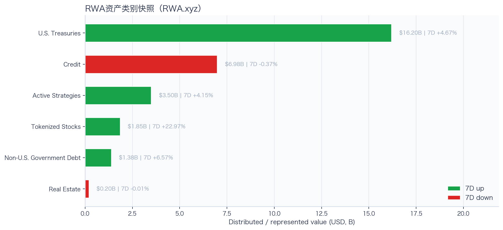
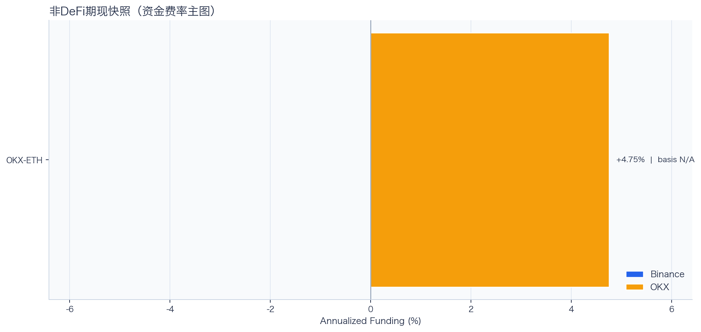
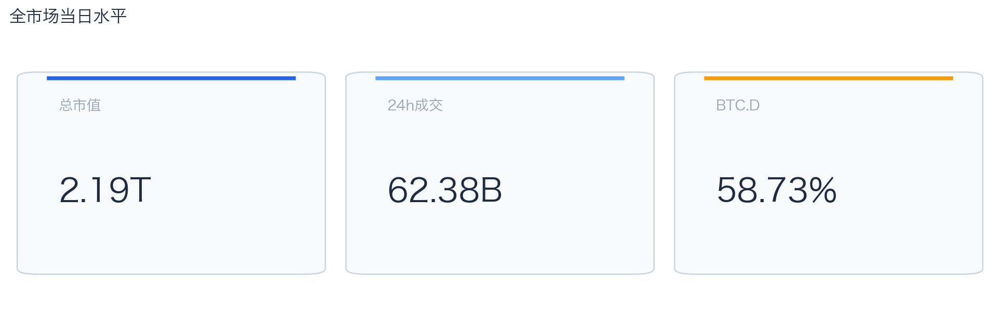
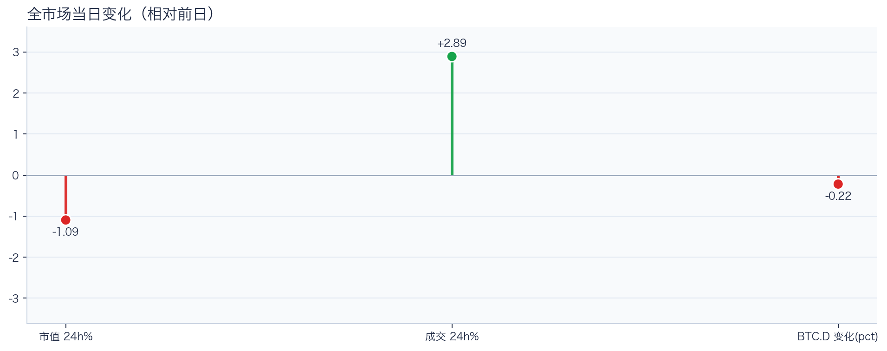
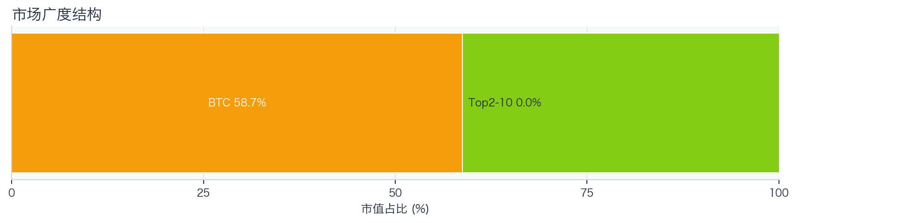
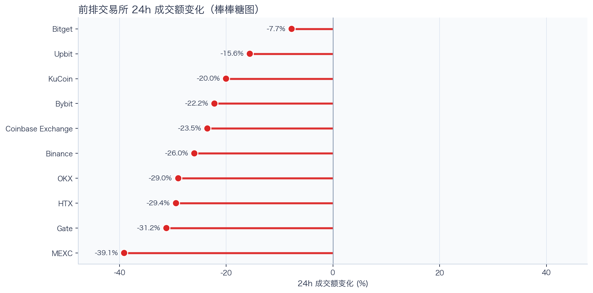
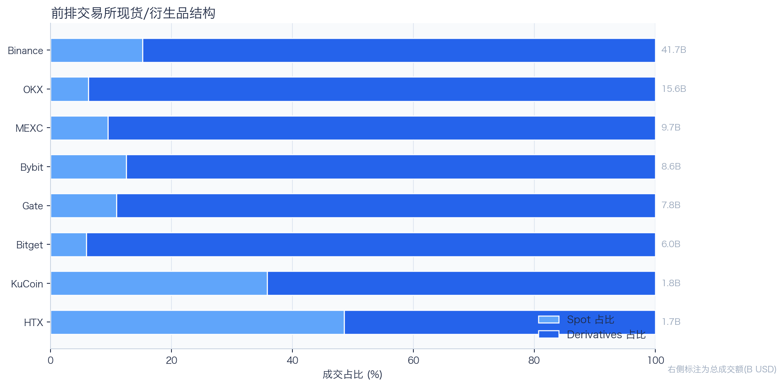
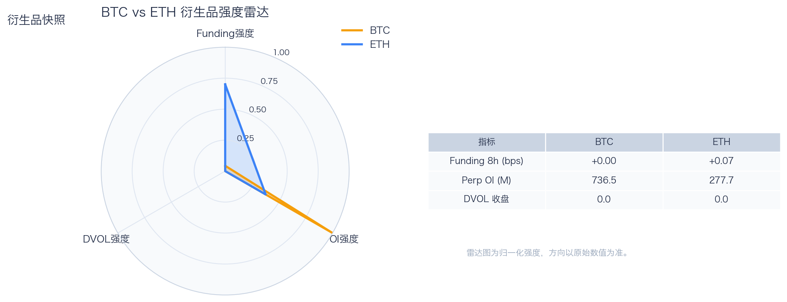
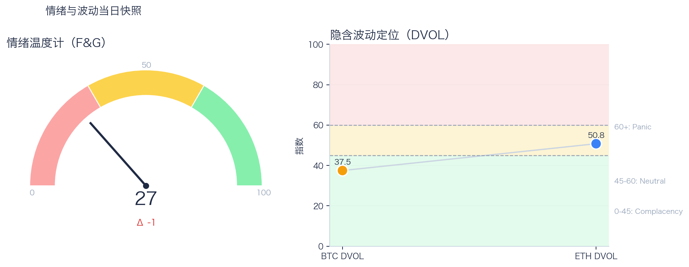

# 二级市场日报（2026-07-25）

## 关键结论
- 全市场市值 N/A（24h N/A），成交额 N/A（24h N/A）。
- BTC 主导率 N/A。
- Top10 资产广度统计不完整。
- 衍生品：部分数据缺失。

## 今日盘面判断
如果只用一句话概括今天的市场，关键词是 `Data-Limited`。核心价格或成交数据不完整，当前以结构信号做保守判断。广度仍偏窄，增量风险偏好尚未形成持续外溢。这意味着短线虽然有可交易的弹性，但要把它理解成新一轮趋势启动，证据还不够。

## 核心驱动因素
从流动性结构看，多数平台成交走弱，流动性恢复仍依赖少数头部平台；从杠杆维度看，杠杆拥挤度整体可控；在风险定价层面，期权端对尾部波动的定价仍偏谨慎；再结合情绪与价格修复节奏尚未完全同步。整体来看，盘面更像是修复中的高波动环境，而不是低波动顺趋势环境。

## BTC/ETH 24h 趋势判断

- BTC/ETH 24h 趋势数据暂不可用。

## 稳定币收益情况（链上协议）
按安全优先（协议成熟度、链层风险、是否依赖激励）筛选了 10 个主流池；原生供给利率均值约 +2.98%。
其中包含奖励补贴的池有 3 个，补贴收益已单列，不与原生利率混合。

核心观察
- 利率结构：Total APY 位于 2.01% 至 7.03% 区间。
- 资金集中：TVL 主要集中在 Spark-USDT（Ethereum，TVL $410.40M）、Aave-USDT（Ethereum，TVL $80.63M）。
- 收益领先：当前收益靠前样本包括 Aave-USDT（Ethereum，Total 7.03%）、Aave-USDC（Ethereum，Total 6.66%）。

风险提示
- 利用率达到 70% 以上的池有 7 个，杠杆需求主要集中在头部池。
- 利用率最高样本：Compound-USDS（Ethereum） 90.98%，Borrow APY 7.52%。
- 奖励收益池数量：3 个。当前收益主体仍以原生利率为主。

数据覆盖：Aave API(8)，Compound API(6)，DefiLlama(21)。

稳定币收益对照表（安全优先）
| 协议 | 链 | 币种 | Supply | Borrow | Rewards | Total | Utilization | TVL | 数据源 |
|---|---|---|---:|---:|---:|---:|---:|---:|---|
| Aave | Ethereum | DAI | 3.37% | 5.03% | N/A | 3.32% | 90.24% | $10.92M | DefiLlama+Aave API |
| Spark | Ethereum | USDT | 2.75% | N/A | N/A | 2.75% | N/A | $410.40M | DefiLlama |
| Compound | Ethereum | USDS | 6.37% | 7.52% | 0.00% | 6.37% | 90.98% | $1.82M | Compound API |
| Aave | Ethereum | PYUSD | 2.89% | 4.38% | N/A | 2.85% | 73.91% | $2.84M | DefiLlama+Aave API |
| Aave | Ethereum | USDT | 2.82% | 3.73% | 4.25% | 7.03% | 84.28% | $80.63M | DefiLlama+Aave API |
| Aave | Ethereum | USDC | 3.19% | 3.97% | 3.53% | 6.66% | 89.53% | $65.81M | DefiLlama+Aave API |
| Aave | Ethereum | USDS | 0.14% | 5.68% | 3.36% | 3.50% | 3.40% | $11.88M | DefiLlama+Aave API |
| Aave | Arbitrum | USDC | 2.68% | 3.68% | N/A | 2.64% | 81.27% | $31.82M | DefiLlama+Aave API |
| Aave | Base | USDC | 3.57% | 4.51% | N/A | 3.50% | 88.29% | $20.29M | DefiLlama+Aave API |
| Aave | Arbitrum | DAI | 2.03% | 3.93% | N/A | 2.01% | 69.40% | $1.09M | DefiLlama+Aave API |

稳定币收益对比（扩展样本，TVL≥$1M，共 22 条）
| 币种 | 协议 | 链 | Supply | Borrow | Rewards | Total | Utilization | TVL | 数据源 |
|---|---|---|---:|---:|---:|---:|---:|---:|---|
| USDC | Aave | Ethereum | 3.19% | 3.97% | 3.53% | 6.66% | 89.53% | $65.81M | DefiLlama+Aave API |
| USDC | Aave | Arbitrum | 2.68% | 3.68% | N/A | 2.64% | 81.27% | $31.82M | DefiLlama+Aave API |
| USDC | Aave | Base | 3.57% | 4.51% | N/A | 3.50% | 88.29% | $20.29M | DefiLlama+Aave API |
| USDC | Spark | Ethereum | 3.60% | N/A | N/A | 3.60% | N/A | $273.30M | DefiLlama |
| USDC | Compound | Ethereum | 3.11% | 3.90% | 0.10% | 3.21% | 86.30% | $345.73M | DefiLlama+Compound API |
| USDC | Compound | Arbitrum | 2.67% | 3.56% | 0.00% | 2.67% | 74.22% | $15.58M | DefiLlama+Compound API |
| USDC | Compound | Base | 4.75% | 5.70% | 0.00% | 4.75% | 90.47% | $8.41M | DefiLlama+Compound API |
| USDT | Aave | Ethereum | 2.82% | 3.73% | 4.25% | 7.03% | 84.28% | $80.63M | DefiLlama+Aave API |
| USDT | Spark | Ethereum | 2.75% | N/A | N/A | 2.75% | N/A | $410.40M | DefiLlama |
| USDT | Compound | Ethereum | 2.99% | 3.81% | 0.11% | 3.10% | 83.04% | $178.66M | DefiLlama+Compound API |
| USDT | Compound | Arbitrum | 1.95% | 3.00% | 0.00% | 1.95% | 54.07% | $19.61M | DefiLlama+Compound API |
| DAI | Aave | Ethereum | 3.37% | 5.03% | N/A | 3.32% | 90.24% | $10.92M | DefiLlama+Aave API |
| DAI | Aave | Arbitrum | 2.03% | 3.93% | N/A | 2.01% | 69.40% | $1.09M | DefiLlama+Aave API |
| DAI | Spark | Ethereum | 2.17% | N/A | N/A | 2.17% | N/A | $112.31M | DefiLlama |
| USDS | Aave | Ethereum | 0.14% | 5.68% | 3.36% | 3.50% | 3.40% | $11.88M | DefiLlama+Aave API |
| USDS | Spark | Ethereum | 2.03% | N/A | N/A | 2.03% | N/A | $274.48M | DefiLlama |
| USDS | Spark | Arbitrum | 3.60% | N/A | N/A | 3.60% | N/A | $361.82M | DefiLlama |
| USDS | Spark | Base | 3.60% | N/A | N/A | 3.60% | N/A | $11.98M | DefiLlama |
| USDS | Compound | Ethereum | 6.37% | 7.52% | 0.00% | 6.37% | 90.98% | $1.82M | Compound API |
| SUSDS | Spark | Ethereum | 0.00% | N/A | N/A | 0.00% | N/A | $3.29M | DefiLlama |
| PYUSD | Aave | Ethereum | 2.89% | 4.38% | N/A | 2.85% | 73.91% | $2.84M | DefiLlama+Aave API |
| PYUSD | Spark | Ethereum | 0.29% | N/A | N/A | 0.29% | N/A | $91.13M | DefiLlama |

跨源补充（比 taoli 更全）
- 新增对比源：DefiLlama 全量稳定币池（筛选口径）+ Bitcompare CeFi 利率，并与现有链上主流池快照交叉核对。
- 覆盖规模：原链上精表 22 条；DefiLlama 扩展样本 94 条（展示 Top20）；Bitcompare 稳定币利率样本 0 条。
- 覆盖维度：扩展样本覆盖 48 个协议、14 条链、61 类稳定币。
- 口径说明：Bitcompare 为平台展示 APY，taoli 为 Binance 借币年化，两者用于横向参考，不等价于无风险套利收益。

稳定币收益补充表（DefiLlama 扩展，TVL≥$30M，去重后 Top20）
| 币种 | 协议 | 链 | Base | Rewards | Total | TVL | 数据源 |
|---|---|---|---:|---:|---:|---:|---|
| SUSDS | sky-lending | Ethereum | 3.52% | N/A | 3.52% | $4.69B | DefiLlama API |
| USYC | circle-usyc | BSC | 3.05% | N/A | 3.05% | $2.91B | DefiLlama API |
| USDC | maple | Ethereum | 4.86% | 0.00% | 4.86% | $2.55B | DefiLlama API |
| SUSDE | ethena-usde | Ethereum | 4.12% | N/A | 4.12% | $1.54B | DefiLlama API |
| USDY | ondo-yield-assets | Ethereum | 3.55% | N/A | 3.55% | $1.11B | DefiLlama API |
| BUIDL | blackrock-buidl | Ethereum | 3.57% | N/A | 3.57% | $963.10M | DefiLlama API |
| USDS | centrifuge-protocol | Ethereum | 2.80% | N/A | 2.80% | $870.09M | DefiLlama API |
| USDT | maple | Ethereum | 4.37% | 0.00% | 4.37% | $867.72M | DefiLlama API |
| BUIDL | blackrock-buidl | Aptos | 3.23% | N/A | 3.23% | $821.88M | DefiLlama API |
| USTB | invesco-ustb | Ethereum | 3.32% | N/A | 3.32% | $717.74M | DefiLlama API |
| BUIDL | blackrock-buidl | Solana | 3.54% | N/A | 3.54% | $653.84M | DefiLlama API |
| BUIDL | blackrock-buidl | Avalanche | 3.54% | N/A | 3.54% | $634.20M | DefiLlama API |
| USDY | ondo-yield-assets | Stellar | 3.55% | N/A | 3.55% | $533.23M | DefiLlama API |
| BUSD0 | usual-usd0 | Ethereum | N/A | 2.20% | 2.20% | $508.97M | DefiLlama API |
| USDD | justlend-v1 | Tron | 0.02% | 3.98% | 4.00% | $449.38M | DefiLlama API |
| GTUSDCP | morpho-blue | Base | 4.67% | 0.00% | 4.67% | $425.91M | DefiLlama API |
| USDC | jupiter-lend | Solana | 4.33% | 0.73% | 5.06% | $414.30M | DefiLlama API |
| AUSD | centrifuge-protocol | Ethereum | 4.58% | N/A | 4.58% | $373.69M | DefiLlama API |
| STEAKUSDC | morpho-blue | Base | 4.47% | 0.00% | 4.47% | $370.68M | DefiLlama API |
| SUSDS | sky-lending | Arbitrum | 3.52% | N/A | 3.52% | $360.99M | DefiLlama API |

交易含义：当前稳定币收益更偏“头部池中等收益 + 局部高利用率”结构，策略上优先流动性与透明度，再考虑收益增强。
部分池的 Borrow 与 Utilization 暂未返回，表内仅展示已获取字段。

## RWA 结构观察
### 今日 tokenized stocks 异动雷达
筛选口径：核心美股/ETF 映射观察池按链上代币 24h 绝对涨跌选出前 5，再结合 1h K 线、技术指标、链上买卖流、持仓集中度和底层美股交易状态解释。
| 标的 | 24h | RSI14 | SMA6/24 | 链上净买入 | 映射溢折价 | 状态/事件 |
|---|---:|---:|---|---:|---:|---|
| HOOD | -6.73% | 17.6 | 空头 | $350 | +0.00% | Weekend or Holiday |
| RIOT | -6.17% | 26.4 | 空头 | $0 | +0.00% | Weekend or Holiday |
| MARA | -4.55% | 27.4 | 空头 | -$33 | +0.00% | Weekend or Holiday |
| CRCL | +3.75% | 56.5 | 多头 | -$237,974 | -0.02% | TRADING |
| COIN | -2.71% | 29.6 | 空头 | $26,130 | +0.00% | Weekend or Holiday |

- **HOOD**：24h -6.73%，RSI14 17.6，短周期均线未站上长周期均线；链上主动买入占优（净额 $350）；未匹配到活跃聪明钱交易信号，当前聪明钱持有地址 0 个。映射溢折价 +0.00%。资产状态显示 `Weekend or Holiday`，这是可验证的事件线索。
- **RIOT**：24h -6.17%，RSI14 26.4，短周期均线未站上长周期均线；链上主动卖出占优（净额 $0）；未匹配到活跃聪明钱交易信号，当前聪明钱持有地址 0 个。映射溢折价 +0.00%。资产状态显示 `Weekend or Holiday`，这是可验证的事件线索。
- **MARA**：24h -4.55%，RSI14 27.4，短周期均线未站上长周期均线；链上主动卖出占优（净额 -$33）；未匹配到活跃聪明钱交易信号，当前聪明钱持有地址 0 个。映射溢折价 +0.00%。资产状态显示 `Weekend or Holiday`，这是可验证的事件线索。

24×7 交易含义：美股休市期间，tokenized stock 的变化更像对新闻、指数期货和加密风险偏好的提前定价；但底层现货缺少连续套利锚、链上流动性通常更薄，溢折价可能放大。美股开盘后若底层价格不确认，夜间涨跌可能快速回归。
归因纪律：公司行动/财报限制、K 线和链上流向属于事实；只有事件时间、价格方向和资金方向一致时才写成高置信归因，其余仅标记为相关性或待验证假设。

### RWA 资产类别背景

RWA.xyz 公开页快照显示，样本资产类别合计约 $30.12B；最大类别为 U.S. Treasuries（$16.20B，7D +4.67%）。7D 上升类别 4 个、下降类别 2 个，说明 RWA 当前更适合当作结构变量，而不是日内方向信号。
其中股票、主动策略和非美债这类交易属性更强的类别合计约 $6.73B，占样本 22.36%。这部分更接近 CEX 新品类、Perps 和跨资产成交额的观察入口。

RWA 资产类别对照表
| 类别 | 规模 | 7D变化 | as of |
|---|---:|---:|---|
| U.S. Treasuries | $16.20B | +4.67% | 2026-07-24 |
| Credit | $6.98B | -0.37% | 2026-07-24 |
| Active Strategies | $3.50B | +4.15% | 2026-07-24 |
| Tokenized Stocks | $1.85B | +22.97% | 2026-07-24 |
| Non-U.S. Government Debt | $1.38B | +6.57% | 2026-07-24 |
| Real Estate | $202.63M | -0.01% | 2026-07-24 |

交易含义：RWA 放在日报里可以，但应定位为二级市场的产品线与风险偏好背景；只有 tokenized stocks、RWA perps、可交易收益资产扩容时，才更直接影响交易所成交结构。
数据源：RWA.xyz 公开资产类别页；正式 API 可在设置 RWA_API_KEY 后替换为更稳定口径。

## 非 DeFi（交易所期现）

样本范围覆盖 Binance 与 OKX 的 BTC/ETH 现货与永续，用于观察 funding 与 basis 的当期结构。
- Funding 最高样本：OKX-ETH，年化约 4.75%。
- Funding 最低样本：OKX-ETH，年化约 4.75%。

借币成本多源对比表
| 资产 | Binance(日/年) | OKX(日/年) | Bybit(日/年) | Backpack(日/年) | KuCoin(日/年) | 最低日利率 |
|---|---:|---:|---:|---:|---:|---:|
| USDT | 0.01%/3.83% · 500k | 0.01%/2.51% · 5.0M | N/A | 0.01%/4.54% · 50.0M | N/A | OKX 0.01% |
| USDC | 0.01%/4.18% · 500k | 0.01%/2.51% · 1.0M | N/A | 0.01%/2.18% · 300.0M | N/A | Backpack 0.01% |
| BTC | 0.00%/0.38% · 100 | 0.00%/0.51% · 175 | N/A | 0.00%/0.45% · 3k | N/A | Binance 0.00% |
| ETH | 0.01%/2.23% · 2k | 0.00%/1.51% · 7k | N/A | 0.00%/0.56% · 20k | N/A | Backpack 0.00% |
说明：统一按日利率/年化展示，单元格尾部为可借额度。
- 交易含义：当 funding 年化显著高于 basis 且持续为正，carry 交易更偏向收取 funding；若 basis 与 funding 同步回落，需降低杠杆并关注资金回流速度。
该部分与链上收益分开统计，便于比较两类策略的收益与风险结构。

## 市场脉冲

截至 2026-07-25，全市场市值 N/A，24h 成交额 N/A，BTC 主导率 N/A。
价格与成交同向上行，说明风险预算有边际回补，短线反弹具备交易基础。在这种盘面下，成交能否继续跟上，是判断明天反弹延续还是回吐的第一道分水岭。

相对前日，市值 N/A、成交 N/A。
把这组变化拆开看，比看单一涨跌更有用：价格、成交、主导率三者同向时，行情更有连续性；一旦出现背离，走势往往会变得更短促、更反复。

## 主导率与市场广度

广度快照数据不完整。
当前广度仍集中于核心资产，长尾板块的参与度有限。换句话说，资金目前更愿意在高流动性的核心资产里做仓位调整，而不是大面积扩散到长尾资产。

## 资产与交易所资金流

Top10 涨跌数据不完整。
头部资产分化仍在，当前更像结构行情。对交易而言，这通常意味着“选币”比“全市场方向”更重要，错配带来的收益差会明显放大。

前排样本上涨 0 家、下跌 10 家，均值 -24.38%。Bitget 最强（-7.74%），MEXC 最弱（-39.12%）。
最强与最弱平台的 24h 变化差达到 31.39pct，说明流动性仍在选择性回流，头部平台的价格发现能力更强。当平台间流量分化明显时，报价连续性和滑点表现会同步分化，执行层面要更关注成交质量。

样本内衍生品成交占比 85.85%。若该占比继续走高且 funding 不同步回落，短线波动脉冲通常会增强。
衍生品占比处于高位，行情更容易出现脉冲式放大，风控阈值建议偏保守。这也是为什么同样的消息面在当前阶段更容易被放大成大振幅走势。

## 衍生品与情绪

衍生品关键指标有缺口，当前解读以可得数据为准。
Funding 与 DVOL 的组合显示，方向拥挤暂未极端，但尾部风险定价仍未完全回落。因此更合适的做法不是激进追单边，而是围绕波动管理仓位和节奏。

F&G 数据不可用，情绪判断需结合成交与 funding 变化。
情绪仍在低位区，价格修复尚未转化为广泛风险偏好回升。只有当情绪、广度和成交三者同时改善，市场才更可能从“反弹交易”切换到“趋势交易”。

## OKX 聪明钱仓位结构（Top10交易员）
聪明钱榜单数据暂不可用（见 Data Gaps）。

仓位结构暂不可用（见 Data Gaps）。

BTC/ETH 聪明钱聚合信号未启用（设置 `OKX_SMARTMONEY_FETCH_SIGNAL=1` 可尝试拉取）。

交易含义：聪明钱仓位更适合做方向与拥挤度监控，不应单独作为开仓触发。

## OKX 新闻情绪快照
OKX 新闻情绪快照暂不可用（见 Data Gaps）。

## 未来24小时观察
1. 若 Top10 外占比继续抬升且 BTC.D 回落，说明风险偏好开始从核心资产向外扩散。
2. 若衍生品占比继续上升而 funding 仍中性，盘面大概率维持高波动震荡而非顺滑上行。
3. 若 F&G 反弹但 DVOL 不降，代表情绪与风险定价背离，追涨胜率会明显下降。

## 交易与风控含义
- 仓位管理优先级高于方向押注，建议保持核心仓位稳定、战术仓位滚动。
- 若交易所衍生品占比继续上升，建议同步收紧杠杆和止损参数。
- 关注情绪改善与广度扩散是否同步发生，二者背离时避免追逐单边。

## 数据缺口（Data Gaps）
- CMC 全市场历史数据获取失败: <urlopen error _ssl.c:1112: The handshake operation timed out>
- CoinGecko 数据获取失败：未设置 COINGECKO_API_KEY（已禁用匿名接口）。
- Deribit DVOL BTC 获取失败: Remote end closed connection without response
- Deribit DVOL ETH 获取失败: The read operation timed out
- Alternative.me F&G 获取失败: <urlopen error EOF occurred in violation of protocol (_ssl.c:1129)>
- Binance BTC/ETH 24h 批量数据获取失败，转单币重试: <urlopen error EOF occurred in violation of protocol (_ssl.c:1129)>
- Binance 24h 单币数据获取失败 BTCUSDT: <urlopen error EOF occurred in violation of protocol (_ssl.c:1129)>
- Binance 24h 未返回 BTCUSDT 数据。
- Binance 24h 单币数据获取失败 ETHUSDT: <urlopen error EOF occurred in violation of protocol (_ssl.c:1129)>
- Binance 24h 未返回 ETHUSDT 数据。
- Binance BTCUSDT 1h K线获取失败: <urlopen error EOF occurred in violation of protocol (_ssl.c:1129)>
- Binance ETHUSDT 1h K线获取失败: <urlopen error EOF occurred in violation of protocol (_ssl.c:1129)>
- Binance 非DeFi期现数据获取失败 BTC: <urlopen error EOF occurred in violation of protocol (_ssl.c:1129)>
- Binance 非DeFi期现数据获取失败 ETH: <urlopen error EOF occurred in violation of protocol (_ssl.c:1129)>
- OKX 非DeFi期现数据获取失败 BTC: <urlopen error EOF occurred in violation of protocol (_ssl.c:1129)>
- 借币成本部分数据源不可用: Bybit: HTTP Error 403: Forbidden
- Morpho API 获取失败: HTTP Error 400: Bad Request
- Bitcompare CeFi 稳定币样本为空：未匹配到稳定币资产。
- OKX 聪明钱数据获取失败（traders）: Update available for @okx_ai/okx-trade-cli: 1.3.2 → 1.4.2
Run: npm install -g @okx_ai/okx-trade-cli

Error: Session expired — run `okx-auth login` again
Error: No credentials found.
Hint: Run `okx auth login` to authenticate, or configure API key credentials.
Version: @okx_ai/okx-trade-cli@1.3.2
- OKX 聪明钱数据获取失败（news:coin-sentiment）: Update available for @okx_ai/okx-trade-cli: 1.3.2 → 1.4.2
Run: npm install -g @okx_ai/okx-trade-cli

Error: Session expired — run `okx-auth login` again
Error: No credentials found.
Hint: Run `okx auth login` to authenticate, or configure API key credentials.
Version: @okx_ai/okx-trade-cli@1.3.2
- OKX 新闻情绪快照为空：coin-sentiment 未返回有效样本。

