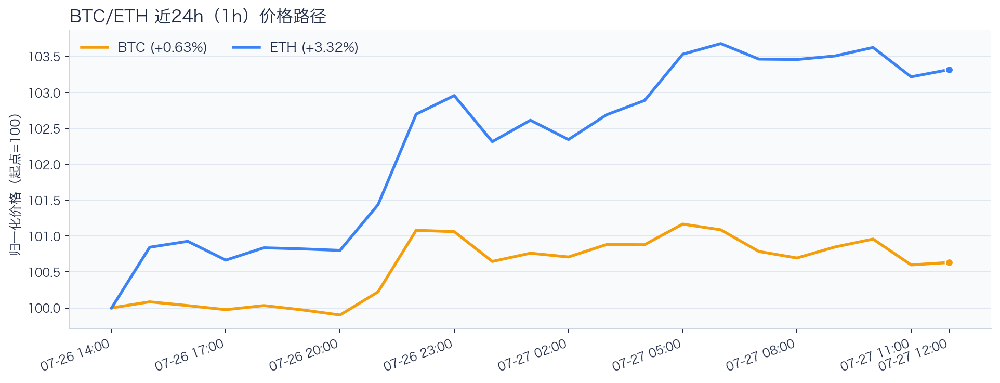
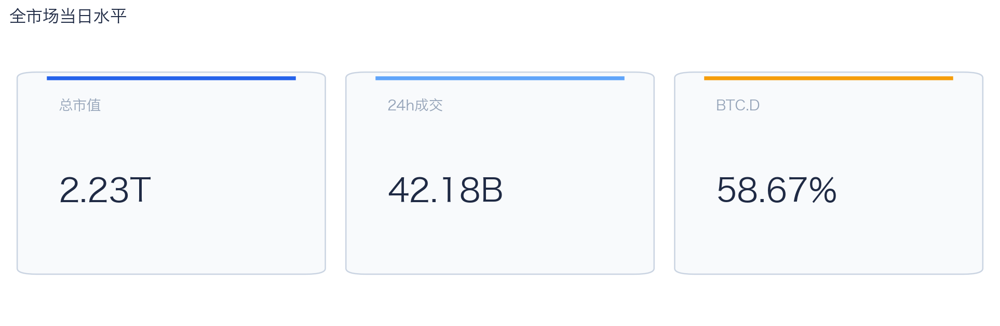
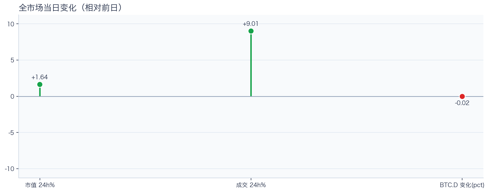
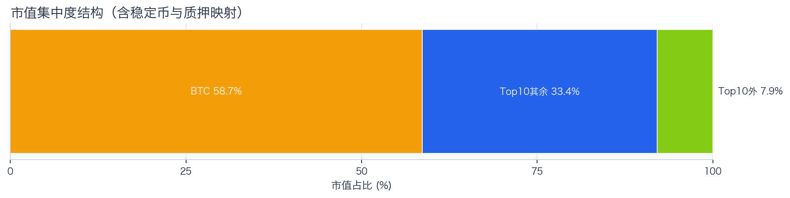
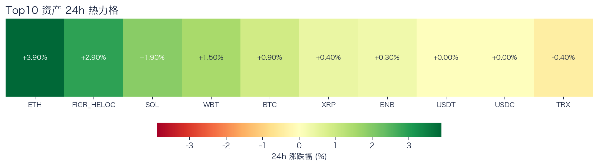
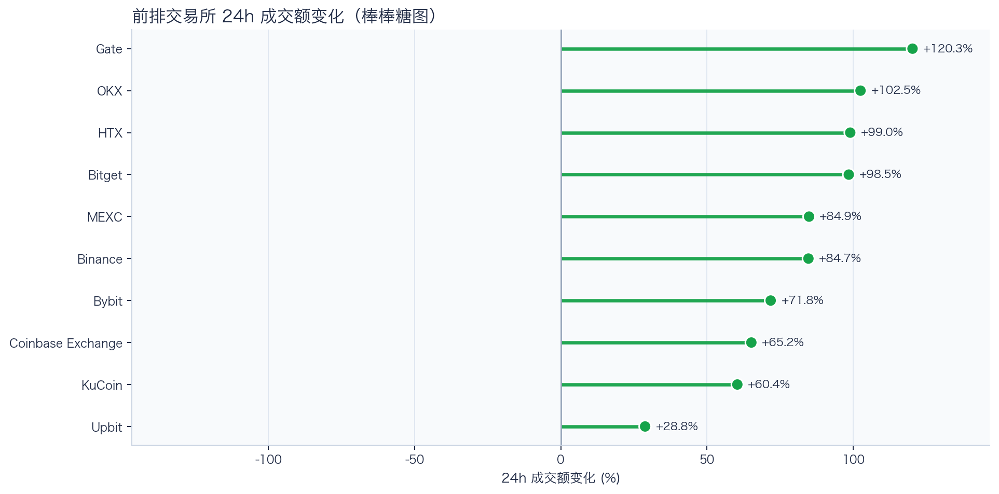
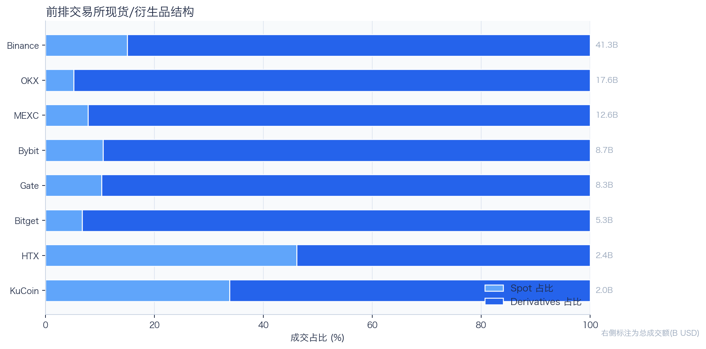
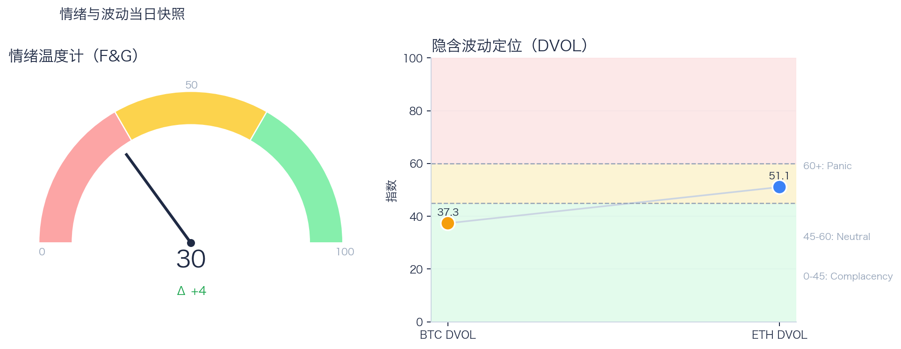

# 二级市场日报（2026-07-27）

## 快速结论
- 全市场指标当日：市值 $2.23T（24h +1.64%），成交额 $42.18B（24h +9.01%）。
- BTC 主导率 58.67%（-0.02pct），Top10 外市值占比（集中度口径）7.92%。
- 头部风险资产（排除稳定币、质押及信用映射）上涨 6 / 下跌 1 / 平盘 0，平均涨跌幅 +1.21%，首尾分化 4.30pct。
- 前排交易所样本成交普遍回升：上涨 10 家、下跌 0 家，24h 变化均值 +81.61%。
- 前一日类别快照显示，Tokenized Stocks 规模 $1.86B，7D +29.35%。

## 市场主线
今日市场状态为“交易性修复”。价格与成交共振上行，头部风险资产上涨覆盖率较高；但现有样本不足以证明长尾市场已经扩散，也不足以确认新一轮趋势启动。

交易所成交方面，多数平台成交回暖，短线流动性环境较前一日改善；杠杆方面，BTC/ETH 资金费率均接近中性，由于缺少资金费率与未平仓合约的可比前值，暂不判断杠杆是否正在升温或趋于拥挤；波动定价方面，BTC DVOL 处于低波动区间，ETH DVOL 处于中性区间。情绪与价格修复节奏尚未完全同步。这些指标共同用于确认市场状态，但暂不足以归因于特定事件。

## BTC/ETH 24h 趋势

口径：文字涨跌来自交易所 rolling 24h ticker；图内路径为当前可得 23 个小时点，首尾变化 BTC +0.63%、ETH +3.32%，两者窗口不可混用。
- BTC（交易所 rolling 24h）：$65,122.73（+0.95%，区间 $64,414.00 - $65,744.60，当前位于区间 53%）=> 区间震荡。
- ETH（交易所 rolling 24h）：$1,961.57（+4.01%，区间 $1,881.61 - $1,981.24，当前位于区间 80%）=> 偏强，上行主导。
- 简评：BTC 与 ETH 均温和上涨，ETH 相对更强，但幅度尚未达到强趋势阈值。

## 市场结构与交易状态
### 市场脉冲

当日，全市场市值 $2.23T，24h 成交额 $42.18B，BTC 主导率 58.67%。
价格与成交同步上行，属于健康修复结构；若次日成交不掉队，修复延续概率更高。

相对前一观测日，市值 +1.64%、成交 +9.01%、BTC.D -0.02pct。
市值与成交是同步观测；缺少事件时点和资金路径证据时，暂不作特定事件归因。

### 市场广度与集中度

当前市值结构为 BTC 58.67% / Top10 其余 33.41% / Top10 外 7.92%。该图含稳定币与质押映射，只描述集中度，不证明风险偏好扩散。
方向样本为 7 个头部风险资产，已排除 USDT, USDC, FIGR_HELOC；Top10 外占比仅是市值集中度，不作为风险扩散代理。

### 资产与交易结构

按头部资产统一快照口径，领涨 ETH（+3.90%），尾部 TRX（-0.40%），均值 +1.21%，首尾相差 4.30pct。
7 个头部风险资产中 6 个上涨、1 个下跌，样本方向明显偏强；但覆盖范围有限，尚不足以据此确认长尾扩散或显著结构行情。

前排样本上涨 10 家、下跌 0 家，均值 +81.61%。Gate 最强（+120.30%），Upbit 最弱（+28.84%）。
最强与最弱平台的 24h 变化差达到 91.47pct，说明平台间成交变化分化，但不能据此推断资金因果流向。报价连续性和滑点是否同步变化仍需盘口数据验证，执行层面应继续监控成交质量。

样本内衍生品成交占比 86.54%。该比例描述成交结构，不单独用于判断后续波动方向或幅度。
衍生品占比处于高位；是否放大波动仍需结合盘口、强平与 DVOL 数据验证。后续需用盘口深度、强平和事件窗口数据验证具体传导机制。

### 杠杆与风险定价
资金费率（Funding）接近中性，BTC/ETH 分别 +1.43bps / +0.89bps。由于缺少资金费率与未平仓合约的可比前值，暂不判断杠杆是否正在升温或趋于拥挤。
BTC DVOL 处于低波动定价区间，ETH DVOL 处于中性区间，当前波动定价未显示全面升温；后续仍需结合期限结构和偏度判断保护成本。

恐惧与贪婪指数（F&G）当日 30（较前一观测日 +4）；BTC/ETH DVOL 为 37.34/51.06，对应 Complacency（低波动定价） / Neutral（中性波动定价）。
F&G 升至 30，仍处于恐惧区，但较前一观测日回升 4 点；情绪修复能否延续仍需成交与市场广度共同确认。只有当情绪、广度和成交三者同时改善，市场才更可能从“反弹交易”切换到“趋势交易”。

## 今日差异化重点
### 事件驱动与市场响应
- 事件主线：4 条 RWA 新闻样本涉及 BTC、ETH 和 HOOD，覆盖代币化股票、财库与钱包安全等不同事件，只作为背景和验证线索。
- 市场响应：针对《Morning Minute: Tokenized Stocks Jump 5x on Robinhood Chain》的发布时间窗口，ETH 后 4 小时收益为 -0.87%，相对 BTC 基准的异常收益为 -0.75%，与事前正向假设相反；当前没有独立资金或技术信号确认。
- 归因边界：窗口内存在重叠新闻，且发布时间可能滞后于事件发生，因此上述结果只表示时序相关性，不构成该事件导致价格变动的因果证明。

### RWA 与 24×7 映射交易
- 映射异动：RIOT 24h +3.80%，属于今日 RWA 观察池中幅度较大的标的；底层市场非连续交易时不作溢折价结论。
- 类别结构：前一日类别快照中，Tokenized Stocks 规模约 $1.86B，7D +29.35%；该变化用于判断产品线活跃度，不直接外推大盘方向。
- 链上验证：公开聪明钱信号页在已覆盖标的中未命中活跃记录；这不等于不存在相关持仓或交易，异动仍需结合底层价格、成交与事件证据确认。

### 稳定币收益与资金成本
- 收益端：本期可得协议样本中，Aave-USDT 的 Total APY 为 6.99%，需继续区分原生利率与奖励补贴。
- 资金需求：本期可得样本最高利用率 90.27%；高利用率意味着借款需求较强，也可能压缩退出流动性。
- 跨平台成本：本期可得报价中，USDC 借币年化样本差约 5.02pct，适合继续核对额度、期限和地区准入，不直接视为套利利差。

## 未来24小时观察
1. 若头部风险资产上涨覆盖率连续改善且 BTC.D 回落，再结合更广币种样本验证风险偏好是否扩散。
2. 若衍生品占比继续上升而 funding 仍中性，只能确认交易向杠杆侧集中；是否放大波动仍需结合 DVOL 与成交验证。
3. 若 F&G 回升而 DVOL 不降，代表情绪改善尚未获得风险定价确认，应降低对追涨信号的置信度。

## 交易与风控含义
- 仓位管理优先级高于方向押注，建议保持核心仓位稳定、战术仓位滚动。
- 若衍生品占比上升并伴随 Funding 快速偏离中性或 DVOL 抬升，再考虑降低杠杆并收紧风险参数。
- 关注情绪改善与广度扩散是否同步发生，二者背离时避免追逐单边。
