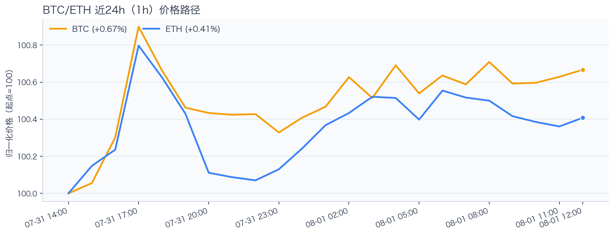
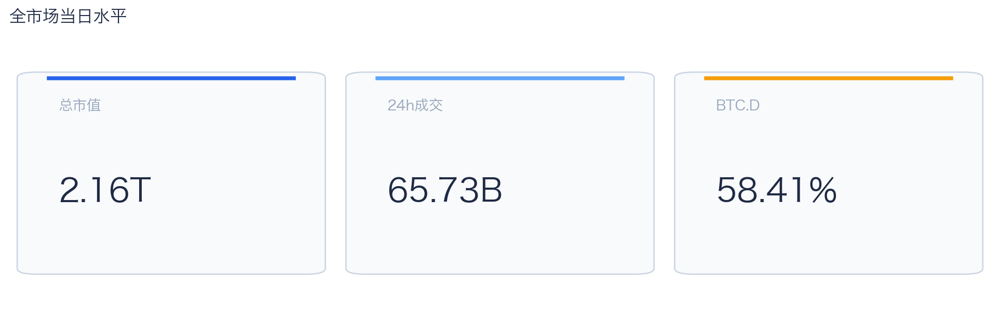
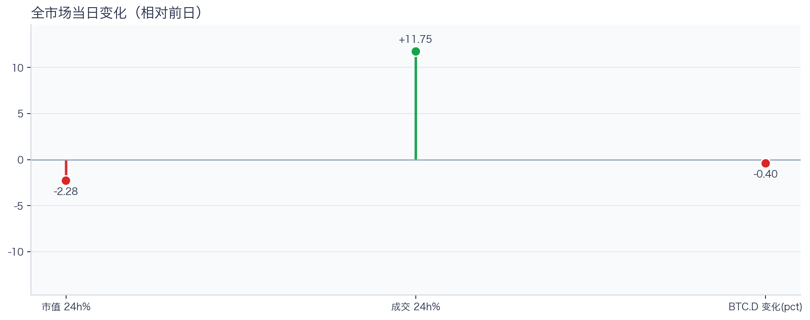
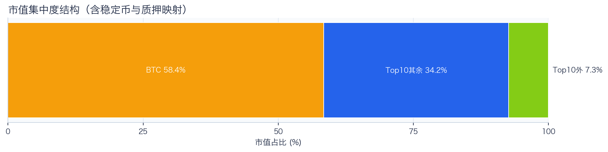
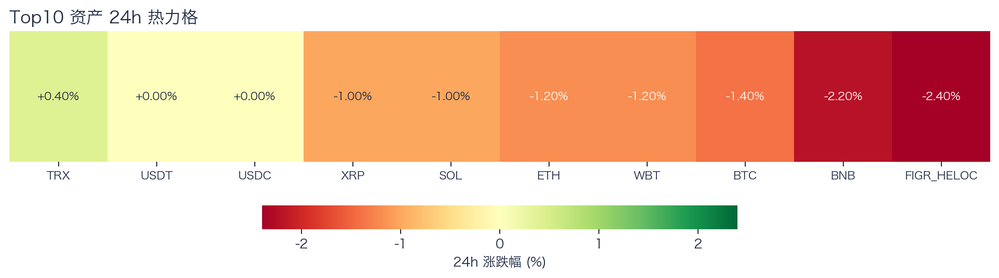
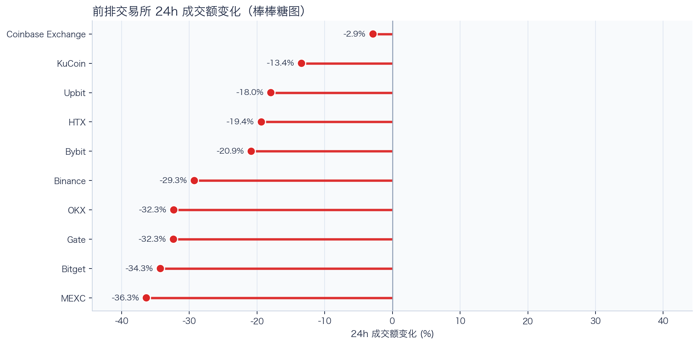
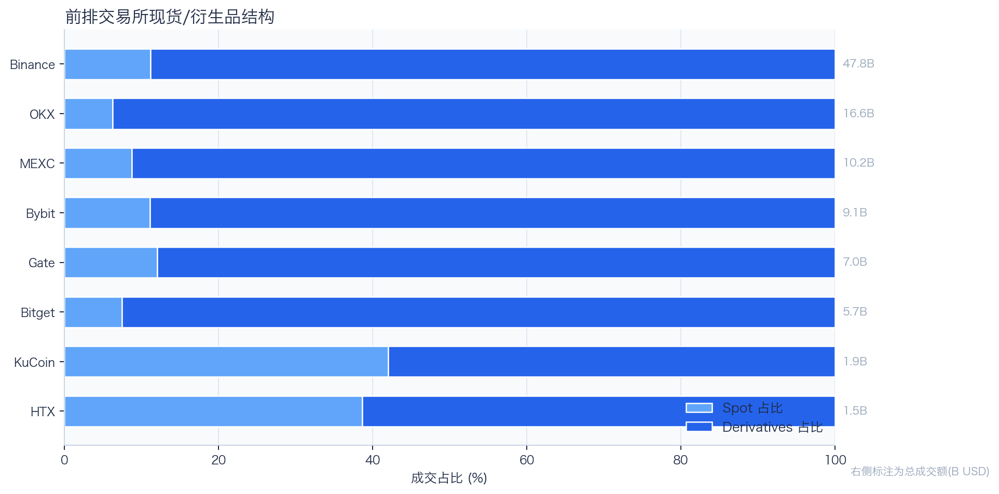
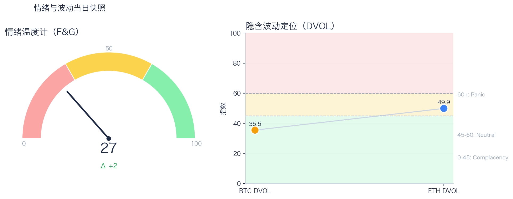

# 二级市场日报（2026-08-01）

## 快速结论
- 全市场指标当日：市值 $2.16T（24h -2.28%），成交额 $65.73B（24h +11.75%）。
- BTC 主导率（BTC.D）58.41%（-0.40pct），Top10 外市值占比（集中度口径）7.35%。
- 头部风险资产（排除稳定币、质押及信用映射）上涨 1 / 下跌 6 / 平盘 0，平均涨跌幅 -1.09%，首尾差距 2.60pct。
- 前排交易所样本成交普遍收缩：上涨 0 家、下跌 10 家，24h 变化均值 -23.90%。
- 稳定币收益与资金成本：Compound-USDS Total APY 5.01%，Aave-DAI 利用率 92.14%；本期样本呈现收益与资金需求的局部分化。
- Tokenized Stocks 类别规模 $2.26B，7D -0.26%。

## 市场主线
今日市场状态为“压力重定价”。价格回撤与成交放大同时出现，表明市场分歧上升；这一组合可能伴随日内波动放大，但单日快照不足以确认风险重估过程或新一轮趋势启动。头部风险资产下跌覆盖率较高，风险参与度偏弱。

交易所成交方面，多数平台成交走弱，样本只支持成交收缩及降幅分化，不支持资金回流判断；杠杆方面，当前资金费率未显示极端拥挤，但单一平台样本不足以概括整体杠杆状态；期权定价方面，隐含波动率处于相对低位，但单凭 DVOL 不足以判断期权保护成本是否便宜；情绪方面，情绪与价格修复节奏尚未完全同步。几项指标共同用于确认市场状态，但暂不足以归因于特定事件。

## BTC/ETH 24h 趋势

口径：文字涨跌来自交易所 rolling 24h ticker；图内路径为当前可得 23 个小时点，首尾变化 BTC +0.67%、ETH +0.41%，两者窗口不可混用。
- BTC（交易所 rolling 24h）：$63,100.00（-1.07%，区间 $62,466.00 - $63,849.19，当前位于区间 46%）=> 偏弱震荡。
- ETH（交易所 rolling 24h）：$1,867.77（-0.79%，区间 $1,848.70 - $1,890.61，当前位于区间 46%）=> 区间震荡。
- 简评：BTC 与 ETH 均处于偏弱或区间震荡，当前仅观察相对强弱与区间突破，不将小幅表现差异直接解读为结构性机会。

## 市场结构与交易状态
### 市场脉冲

当日，全市场市值 $2.16T，24h 成交额 $65.73B，BTC 主导率 58.41%。
价格与成交同步观测；单日快照不足以单独外推后续波动方向。

相对前一观测日，市值 -2.28%、成交 +11.75%、BTC.D -0.40pct。
市值与成交是同步观测；缺少事件时点和资金路径证据时，暂不作特定事件归因。

### 市场广度与集中度

当前市值结构为 BTC 58.41% / Top10 其余 34.25% / Top10 外 7.35%。该图含稳定币与质押映射，只描述集中度，不证明风险偏好扩散。
方向样本为 7 个头部风险资产，已排除 USDT, USDC, FIGR_HELOC；Top10 外占比仅是市值集中度，不作为风险扩散代理。

### 资产与交易结构

按头部资产统一快照口径，领涨的是 TRX（+0.40%），跌幅最大的是 BNB（-2.20%），均值 -1.09%，首尾差距 2.60pct。
下跌家数占优，风险偏好修复仍较脆弱，短线追高性价比一般。对交易而言，优先控制回撤并等待上涨覆盖率改善。

前排样本上涨 0 家、下跌 10 家，均值 -23.90%。Coinbase Exchange 最强（-2.86%），MEXC 最弱（-36.35%）。
样本平台成交普遍收缩，最小与最大降幅相差 33.48pct；这只说明收缩幅度不同，不构成流动性回流或价格发现能力增强的证据。报价连续性和滑点是否同步变化仍需盘口数据验证，执行层面应继续监控成交质量。

样本内衍生品成交占比 87.66%。该比例描述成交结构，不单独用于判断后续波动方向或幅度。
衍生品占比处于高位；该比例本身不说明波动方向。后续需用盘口深度、强平和事件窗口数据验证具体传导机制。

### 杠杆与风险定价
Deribit 样本的资金费率（Funding）接近中性，BTC/ETH 8h 费率分别为 +0.04bps / +0.08bps；隐含波动率指数（DVOL）位于 Complacency（低波动定价） / Neutral（中性波动定价）。
| 资产 | 近期清算样本（多头） | 近期清算样本（空头） | 近月年化基差 | 远月年化基差 | ATM IV | 25Δ 偏度 |
|---|---:|---:|---:|---:|---:|---:|
| BTC | 本期无读数 | 本期无读数 | +5.49% | +4.10% | 31.96% | 6.54 pp |
| ETH | 本期无读数 | 本期无读数 | +0.83% | +1.26% | 46.26% | 4.89 pp |
清算数据本期无可用读数，表中不作数值判断；如未来纳入单一平台近期样本，也不代表该平台或全市场清算总量。25Δ 偏度定义为 Put IV 减 Call IV。
Funding 与 DVOL 暂未显示极端方向拥挤；当前读数本身不足以判断尾部风险是否重新抬升。因此更合适的做法不是激进追单边，而是围绕波动管理仓位和节奏。

恐惧与贪婪指数（F&G）当日 27（较前一观测日 +2）；BTC/ETH DVOL 为 35.46/49.88，对应 Complacency（低波动定价） / Neutral（中性波动定价）。
情绪仍在恐惧区但已脱离极端恐惧，是否修复仍需成交和广度确认。只有当情绪、广度和成交三者同时改善，市场才更可能从“反弹交易”切换到“趋势交易”。

### 关键价位与失效条件
| 资产 | 24h 支撑 | 24h 阻力 | ATR14(1h) | 向上触发 | 多头失效 | 向下触发 | 空头失效 |
|---|---:|---:|---:|---:|---:|---:|---:|
| BTC | 62466.00 | 63310.00 | 101.59 | 63373.10 | 63246.90 | 62402.90 | 62529.10 |
| ETH | 1848.70 | 1878.14 | 3.66 | 1880.01 | 1876.27 | 1846.83 | 1850.57 |
计算口径：以当前可得 23 个 1h 小时点的高低点作为支撑/阻力，触发缓冲取现价 0.1% 与 0.25×ATR14 的较大值；触发价用于观察确认，不是自动交易指令。

## 今日差异化重点
### 稳定币收益与资金成本
- 收益端：本期可得协议样本中，Compound-USDS 的 Total APY 为 5.01%，需继续区分原生利率与奖励补贴。
- 资金需求：本期可得样本最高利用率 92.14%；高利用率意味着借款需求较强，也可能压缩退出流动性。
- 跨平台成本：本期可得报价中，USDC 借币年化样本差约 2.48pct，适合继续核对额度、期限和地区准入，不直接视为套利利差。

### RWA 与 24×7 映射交易
- 映射异动：RIOT 24h -10.96%，属于今日 RWA 观察池中幅度较大的标的；底层市场非连续交易时不作溢折价结论。
- 类别结构：最近一次可得类别快照显示，Tokenized Stocks 规模约 $2.26B，7D -0.26%；该变化用于判断产品线活跃度，不直接外推大盘方向。
- 链上验证：公开聪明钱信号页在已覆盖标的中未命中活跃记录；这不等于不存在相关持仓或交易，异动仍需结合底层价格、成交与事件证据确认。

## 未来24小时观察
1. 若头部风险资产上涨覆盖率连续改善且 BTC.D 回落，再结合更广币种样本验证风险偏好是否扩散。
2. 若衍生品占比继续上升而 Funding 仍中性，只能确认交易向杠杆侧集中；是否放大波动仍需结合 DVOL 与成交验证。
3. 若 F&G 回升而 DVOL 不降，代表情绪改善尚未获得风险定价确认，应降低对追涨信号的置信度。

## 交易与风控含义
- 仓位管理优先级高于方向押注，建议保持核心仓位稳定、战术仓位滚动。
- 若衍生品占比上升并伴随 Funding 快速偏离中性或 DVOL 抬升，再考虑降低杠杆并收紧风险参数。
- 关注情绪改善与广度扩散是否同步发生，二者背离时避免追逐单边。
