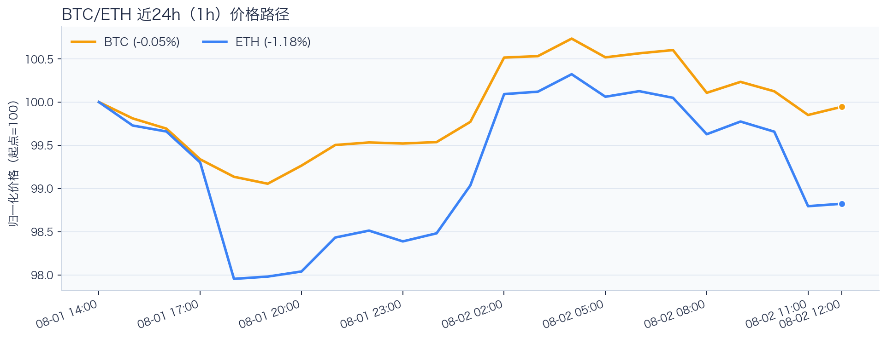
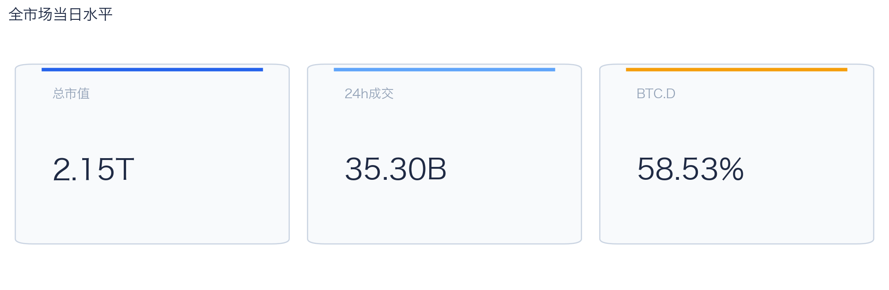
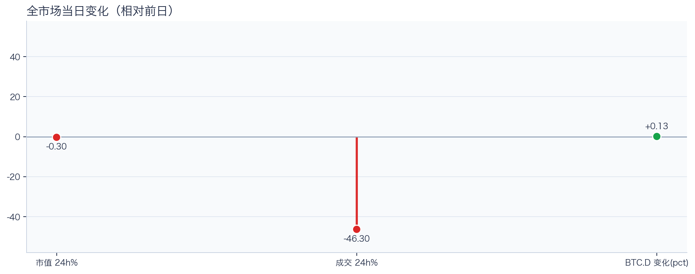
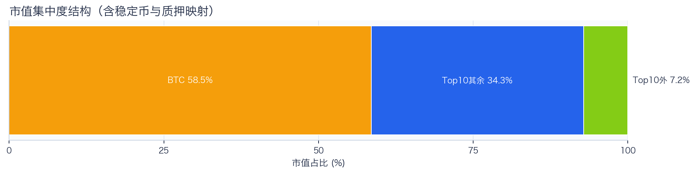
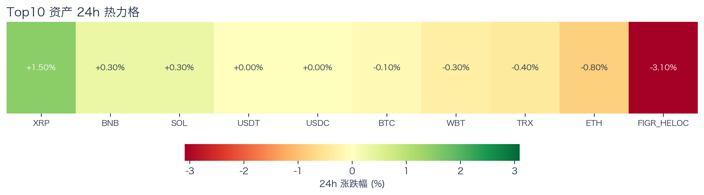
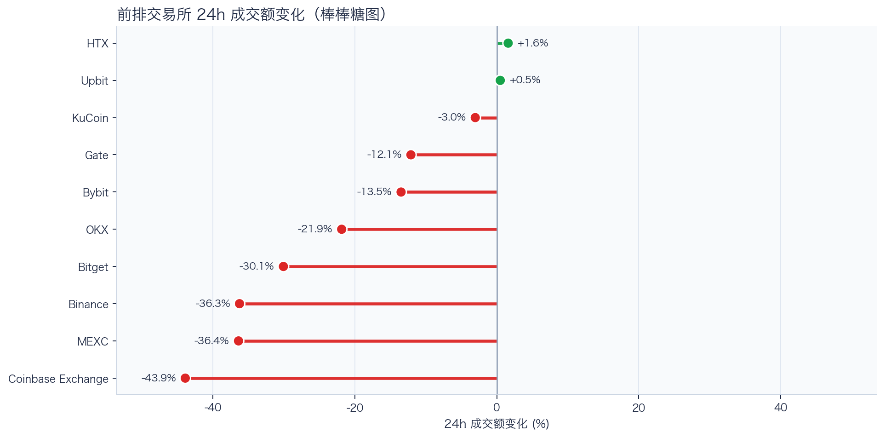
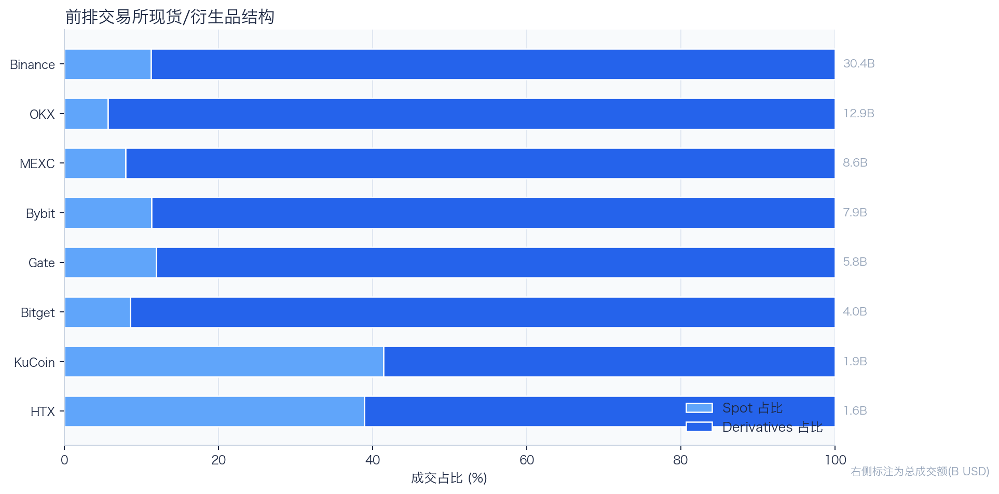
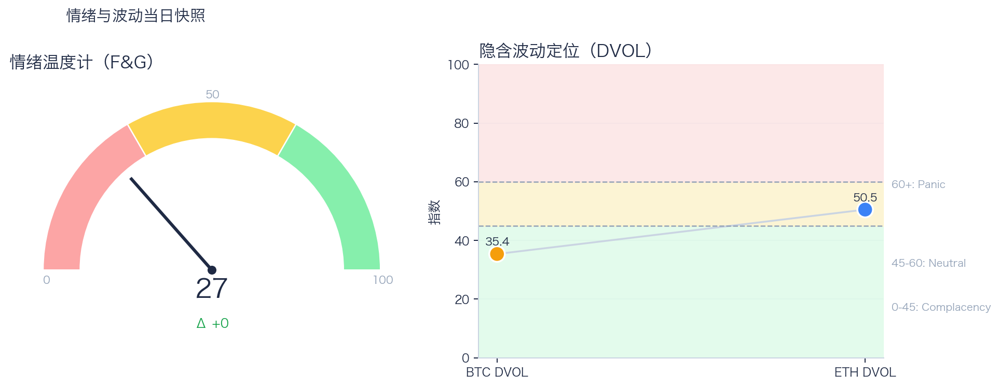

# 二级市场日报（2026-08-02）

## 快速结论
- 全市场指标当日：市值 $2.15T（24h -0.30%），成交额 $35.30B（24h -46.30%）。
- BTC 主导率 58.53%（+0.13pct），Top10 外市值占比（集中度口径）7.17%。
- 头部风险资产（排除稳定币、质押及信用映射）上涨 3 / 下跌 4 / 平盘 0，平均涨跌幅 +0.07%，首尾分化 2.30pct。
- 前排交易所样本成交普遍收缩：上涨 2 家、下跌 8 家，24h 变化均值 -19.51%。
- Tokenized Stocks 最近一次可得类别快照规模 $2.15B，7D -5.21%。

## 市场主线
今日市场状态为“防守下移”。价格与成交同步走弱，属于防守型下移结构，短线以控制回撤为主。头部风险资产涨跌分化，方向一致性有限。当前证据尚不足以确认新一轮趋势启动。

交易所成交方面，多数平台成交走弱，样本只支持成交收缩及降幅分化，不支持资金回流判断；杠杆方面，当前资金费率未显示极端拥挤，但单一平台样本不足以概括整体杠杆状态；期权定价方面，隐含波动率处于相对低位，但单凭 DVOL 不足以判断期权保护成本是否便宜；情绪方面，情绪与价格修复节奏尚未完全同步。几项指标共同用于确认市场状态，但暂不足以归因于特定事件。

## BTC/ETH 24h 趋势

口径：文字涨跌来自交易所 rolling 24h ticker；图内路径为当前可得 23 个小时点，首尾变化 BTC -0.05%、ETH -1.18%，两者窗口不可混用。
- BTC（交易所 rolling 24h）：$63,092.01（-0.01%，区间 $62,275.00 - $63,634.00，当前位于区间 60%）=> 区间震荡。
- ETH（交易所 rolling 24h）：$1,853.06（-0.79%，区间 $1,822.06 - $1,884.69，当前位于区间 49%）=> 区间震荡。
- 简评：BTC 与 ETH 出现分化，短线以结构性机会为主。

## 市场结构与交易状态
### 市场脉冲

当日，全市场市值 $2.15T，24h 成交额 $35.30B，BTC 主导率 58.53%。
价格与成交同步走弱，风险偏好仍在收缩，盘面更偏防守。

相对前一观测日，市值 -0.30%、成交 -46.30%、BTC.D +0.13pct。
市值与成交是同步观测；缺少事件时点和资金路径证据时，暂不作特定事件归因。

### 市场广度与集中度

当前市值结构为 BTC 58.53% / Top10 其余 34.30% / Top10 外 7.17%。该图含稳定币与质押映射，只描述集中度，不证明风险偏好扩散。
方向样本为 7 个头部风险资产，已排除 USDT, USDC, FIGR_HELOC；Top10 外占比仅是市值集中度，不作为风险扩散代理。

### 资产与交易结构

按头部资产统一快照口径，领涨的是 XRP（+1.50%），跌幅最大的是 ETH（-0.80%），均值 +0.07%，首尾相差 2.30pct。
下跌家数占优，风险偏好修复仍较脆弱，短线追高性价比一般。对交易而言，优先控制回撤并等待上涨覆盖率改善。

前排样本上涨 2 家、下跌 8 家，均值 -19.51%。HTX 最强（+1.60%），Coinbase Exchange 最弱（-43.92%）。
最强与最弱平台的 24h 变化差约 45.5pct（HTX +1.60%，Coinbase Exchange -43.92%），说明平台间成交变化分化，但不能据此推断资金因果流向。报价连续性和滑点是否同步变化仍需盘口数据验证，执行层面应继续监控成交质量。

样本内衍生品成交占比 87.54%，仅描述成交结构；是否传导至后续波动仍需结合盘口深度、强平和事件窗口验证。

### 杠杆与风险定价
Deribit 样本的资金费率（Funding）接近中性，BTC/ETH 8h 费率分别为 +0.02bps / +0.00bps；隐含波动率指数（DVOL）位于 Complacency（低波动定价） / Neutral（中性波动定价）。
| 资产 | OKX 多头清算样本 | OKX 空头清算样本 | 近月年化基差 | 远月年化基差 | ATM IV | 25Δ 偏度 |
|---|---:|---:|---:|---:|---:|---:|
| BTC | N/A | N/A | +2.76% | +4.51% | 31.86% | 4.69 pp |
| ETH | N/A | N/A | -2.09% | +0.53% | 47.19% | 4.28 pp |
清算口径：仅为 OKX 公共接口返回的近期样本，不代表 OKX 或全市场清算总量；25Δ 偏度定义为 Put IV 减 Call IV。
Funding 未显示极端方向拥挤；DVOL 分别为 35.36/50.50，显示波动定价偏低至中性，但这些读数本身不足以判断尾部风险是否重新抬升。因此更合适的做法不是激进追单边，而是围绕波动管理仓位和节奏。

恐惧与贪婪指数（F&G）当日 27（较前一观测日 +0）；BTC/ETH DVOL 为 35.36/50.50，对应 Complacency（低波动定价） / Neutral（中性波动定价）。
情绪仍在恐惧区但已脱离极端恐惧，是否修复仍需成交和广度确认。只有当情绪、广度和成交三者同时改善，市场才更可能从“反弹交易”切换到“趋势交易”。

### 关键价位与失效条件
| 资产 | 样本支撑 | 样本阻力 | ATR14(1h) | 向上触发 | 多头失效 | 向下触发 | 空头失效 |
|---|---:|---:|---:|---:|---:|---:|---:|
| BTC | 62275.00 | 63634.00 | 201.38 | 63697.09 | 63570.91 | 62211.91 | 62338.09 |
| ETH | 1822.06 | 1884.69 | 9.38 | 1887.04 | 1882.34 | 1819.71 | 1824.41 |
计算口径：以当前可得 23 个 1h 点的高低点作为样本支撑/阻力，触发缓冲取现价 0.1% 与 0.25×ATR14 的较大值；触发价用于观察确认，不是自动交易指令。

## 今日差异化重点
### 稳定币收益与资金成本
- 收益端：本期可得协议样本中，Compound-USDS 的 Total APY 为 14.13%，需继续区分原生利率与奖励补贴。
- 资金需求：本期可得样本最高利用率 93.41%；高利用率意味着借款需求较强，也可能压缩退出流动性。
- 跨平台成本：本期可得报价中，USDC 借币年化样本差约 2.63pct，适合继续核对额度、期限和地区准入，不直接视为套利利差。

### 跨交易所 Funding 与 Carry
- Funding：样本高位为 Binance-BTC，年化约 9.72%。
- 平台分化：样本低位为 Binance-ETH，年化约 5.42%。
- 可执行性：Funding 与 basis 均有记录的样本可进入 carry 复核，但仍需检查手续费、滑点、保证金和持续性。

### RWA 与 24×7 映射交易
- 映射异动：RIOT 24h -10.96%，属于今日 RWA 观察池中幅度较大的标的；底层市场非连续交易时不作溢折价结论。
- 类别结构：最近一次可得类别快照显示，Tokenized Stocks 规模约 $2.15B，7D -5.21%；该变化用于观察产品线规模变化与风险偏好背景，不直接外推大盘方向。
- 链上验证：公开聪明钱信号页在已覆盖标的中未命中活跃记录；这不等于不存在相关持仓或交易，异动仍需结合底层价格、成交与事件证据确认。

## 未来24小时观察
1. 若头部风险资产上涨覆盖率连续改善且 BTC.D 回落，再结合更广币种样本验证风险偏好是否扩散。
2. 若衍生品成交占比继续上升，只能确认成交结构中衍生品权重提高；即使 Funding 仍中性，也不足以确认杠杆或风险敞口集中。是否放大波动仍需结合 DVOL 与成交验证。
3. 若 F&G 回升而 DVOL 不降，代表情绪改善尚未获得风险定价确认，应降低对追涨信号的置信度。

## 交易与风控含义
- 仓位管理优先级高于方向押注，建议保持核心仓位稳定、战术仓位滚动。
- 若衍生品占比上升并伴随 Funding 快速偏离中性或 DVOL 抬升，再考虑降低杠杆并收紧风险参数。
- 关注情绪改善与广度扩散是否同步发生，二者背离时避免追逐单边。
