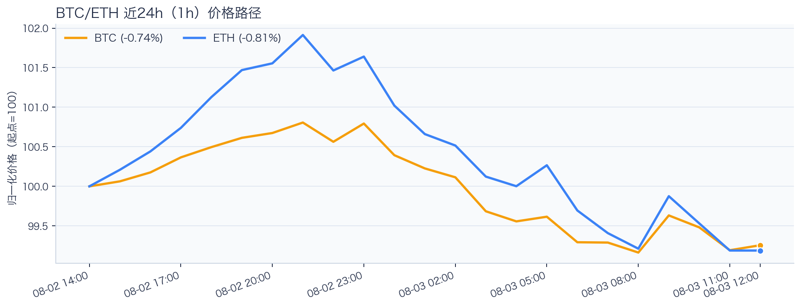
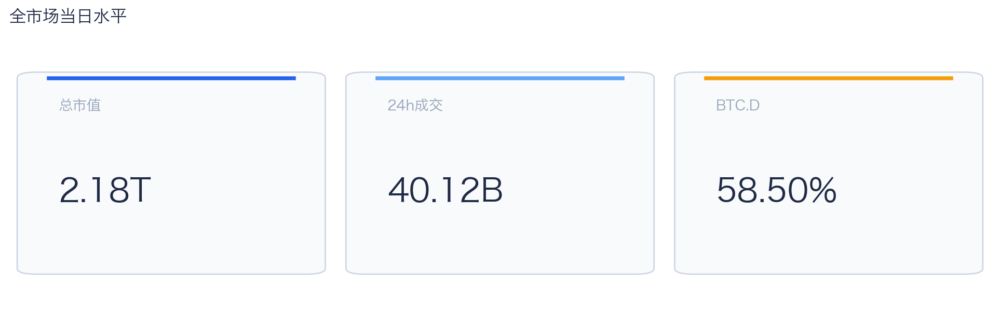
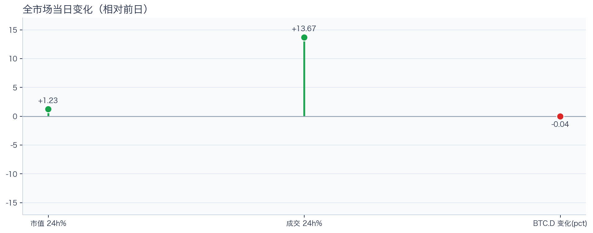
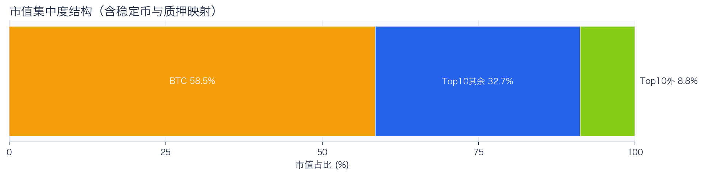
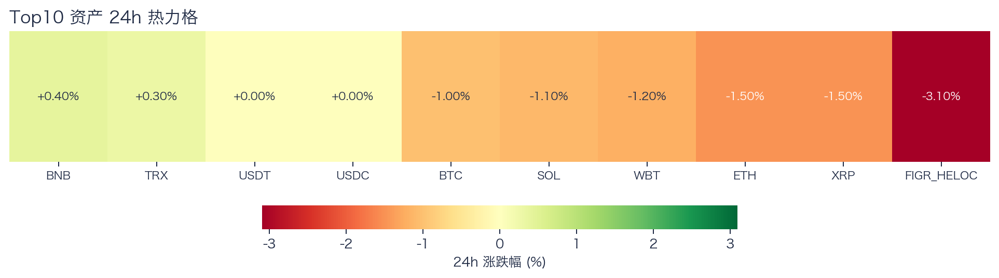
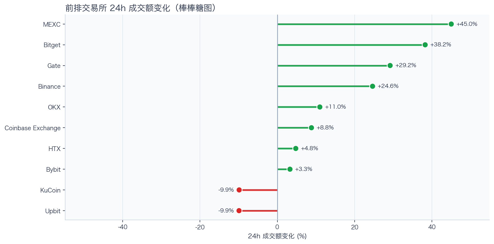
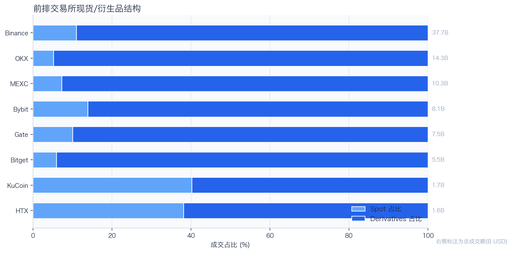
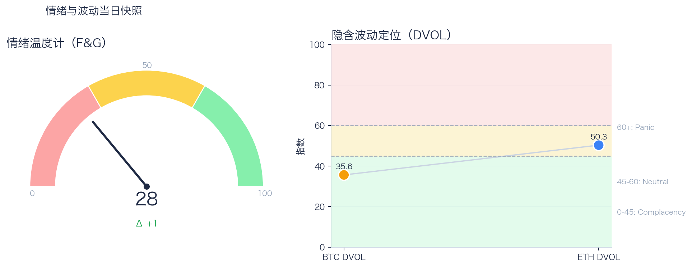

# 二级市场日报（2026-08-03）

## 快速结论
- 全市场指标当日：市值 $2.18T（24h +1.23%），成交额 $40.12B（24h +13.67%）。
- BTC 主导率 58.50%（-0.04个百分点），Top10 外市值占比（集中度口径）8.80%。
- 头部风险资产（排除稳定币、质押及信用映射）上涨 2 / 下跌 5 / 平盘 0，平均涨跌幅 -0.80%，首尾分化 1.90个百分点。
- 前排交易所样本成交普遍回升：上涨 8 家、下跌 2 家，24h 变化均值 +14.51%。
- 代币化股票（Tokenized Stocks）类别规模 $2.16B，7D -4.93%。

## 市场主线
今日市场状态为“交易性修复”。市值与成交额同步上升，但头部风险资产多数下跌，当前更接近成交放大下的局部修复；是否延续仍需观察上涨覆盖率和更广样本。现有样本只覆盖头部风险资产，尚不足以证明长尾市场已扩散。风险参与度仍偏弱，当前证据尚不足以确认新一轮趋势启动。

交易所成交方面，多数平台样本成交回升，但盘口深度、报价连续性与滑点尚未验证，不能直接等同于流动性改善；杠杆方面，当前资金费率未显示极端拥挤，但单一平台样本不足以概括整体杠杆状态；期权定价方面，BTC/ETH DVOL 当前分别为 35.62/50.31，单凭 DVOL 不足以判断期权保护成本是否便宜；情绪方面，情绪与价格修复节奏尚未完全同步。几项指标用于交叉观察市场状态，但尚不足以支持特定事件归因。

## BTC/ETH 24h 趋势

口径：文字涨跌来自交易所 rolling 24h ticker；图内路径为当前可得 23 个 1 小时点，首尾变化 BTC -0.74%、ETH -0.81%，两者窗口不可混用。
- BTC（交易所 rolling 24h）：$62,600.01（-0.78%，区间 $62,300.00 - $63,796.33，当前位于区间 20%）=> 区间震荡。
- ETH（交易所 rolling 24h）：$1,840.12（-0.79%，区间 $1,828.62 - $1,898.50，当前位于区间 16%）=> 区间震荡。
- 简评：BTC 与 ETH 均处于区间震荡，暂未见明显方向性分化；短线重点观察区间突破与相对强弱变化。

## 市场结构与交易状态
### 市场脉冲

当日，全市场市值 $2.18T，24h 成交额 $40.12B，BTC 主导率 58.50%。
市值与成交额同步上升，但头部风险资产多数下跌，当前更接近成交放大下的局部修复；若次日上涨覆盖率和更广样本同步改善，可作为修复延续的确认条件之一。

相对前一观测日，市值 +1.23%、成交 +13.67%、BTC.D -0.04个百分点。
市值与成交的同步上行只是同一观测窗口内的共同现象；在缺少事件时点和资金路径证据时，暂不作特定事件归因。

### 市场广度与集中度

当前市值结构为 BTC 58.50% / Top10 其余 32.70% / Top10 外 8.80%。该图含稳定币与质押映射，只描述集中度，不证明风险偏好扩散。
方向样本为 7 个头部风险资产，已排除 USDT, USDC, FIGR_HELOC；Top10 外占比仅是市值集中度，不作为风险扩散代理。

### 资产与交易结构

按头部资产统一快照口径，领涨的是 BNB（+0.40%），跌幅最大的是 XRP（-1.50%），均值 -0.80%，首尾相差 1.90个百分点。
下跌家数占优，当前上涨覆盖率不足，暂不足以支持追涨；交易上优先控制回撤，等待上涨覆盖率改善。

前排样本上涨 8 家、下跌 2 家，均值 +14.51%。MEXC 成交增幅最高（+44.99%），Upbit 成交变化最低（-9.91%）。
样本中最高与最低成交变化相差 54.90个百分点，说明平台间成交变化分化，但不能据此推断资金因果流向。报价连续性和滑点是否同步变化仍需盘口数据验证，执行层面应继续监控成交质量。

样本内衍生品成交占比为 88.38%，仅说明该样本的成交结构偏向衍生品，不代表后续波动方向；后续仍需结合盘口深度、强平和事件窗口验证传导机制。

### 杠杆与风险定价
Deribit 样本的资金费率（Funding）接近中性，BTC/ETH 8h 费率分别为 +0.33bps / +0.00bps；BTC/ETH DVOL 当前分别为 35.62/50.31。
| 资产 | OKX 多头清算样本 | OKX 空头清算样本 | 近月年化基差 | 远月年化基差 | ATM IV | 25Δ 偏度 |
|---|---:|---:|---:|---:|---:|---:|
| BTC | N/A | N/A | +4.61% | +4.39% | 32.66% | 6.56 pp |
| ETH | N/A | N/A | -2.24% | +0.02% | 46.95% | 5.12 pp |
清算数据：OKX 公共接口本期获取失败，相关数据暂不可用；即便接口可用，也仅代表近期样本，不代表 OKX 或全市场清算总量。25Δ 偏度定义为 Put IV 减 Call IV。
Funding 未显示明显的单边拥挤；DVOL 仅反映波动率定价，不能单独判断方向性拥挤或尾部风险，仍需结合未平仓合约、强平和偏度观察。因此更合适的做法不是激进追单边，而是围绕波动管理仓位和节奏。

恐惧与贪婪指数（F&G）当日 28（较前一观测日 +1）；BTC/ETH DVOL 为 35.62/50.31。
情绪仍在恐惧区但已脱离极端恐惧，是否修复仍需成交和广度确认。若情绪、广度和成交三者同步改善，市场从“反弹交易”转向“趋势交易”的可能性才会提高；在此之前仍需谨慎验证。

### 关键价位与失效条件
| 资产 | 24h 支撑 | 24h 阻力 | ATR14(1h) | 向上触发 | 多头失效 | 向下触发 | 空头失效 |
|---|---:|---:|---:|---:|---:|---:|---:|
| BTC | 62300.00 | 63796.33 | 245.93 | 63858.93 | 63733.73 | 62237.40 | 62362.60 |
| ETH | 1828.62 | 1898.50 | 10.92 | 1901.23 | 1895.77 | 1825.89 | 1831.35 |
计算口径：以当前可得 23 个 1 小时点的高低点作为支撑/阻力，触发缓冲取现价 0.1% 与 0.25×ATR14 的较大值；触发价用于观察确认，不是自动交易指令。

## 今日差异化重点
### 稳定币收益与资金成本
- 收益端：本期可得协议样本中，Compound-USDS 的 Total APY 为 5.92%，需继续区分原生利率与奖励补贴。
- 资金需求：本期可得样本最高利用率 91.03%；高利用率说明池内借款使用占可供流动性的比例较高，可能使即时可用流动性减少；仅凭该指标不足以确认借款需求增强。
- 跨平台成本：本期可得报价中，USDC 借币年化样本差约 2.74个百分点，适合继续核对额度、期限和地区准入，不直接视为套利利差。

### Binance Funding 与 Carry 快照
- Funding：样本高位为 Binance-BTC，年化约 3.56%。
- 资产分化：样本低位为 Binance-ETH，年化约 -0.55%。
- 可执行性：Funding 与 basis 均有记录的样本可进入 carry 复核，但仍需检查手续费、滑点、保证金和持续性。

### 现实世界资产（RWA）与 24×7 映射交易
- 映射异动居前：AMD -4.42%、CRCL -3.10%、PLTR +2.82%；底层市场尚未进入连续交易时段时，仅作为链上价格变化观察，不作溢折价结论。
- 类别结构：代币化股票（Tokenized Stocks）规模约 $2.16B，7D -4.93%；该变化仅作为类别规模与产品线背景，不直接外推大盘方向。
- 链上验证：公开聪明钱信号页在已覆盖标的中未命中活跃记录；这不等于不存在相关持仓或交易，异动仍需结合底层价格、成交与事件证据确认。

## 未来24小时观察
1. 若头部风险资产上涨覆盖率连续改善且 BTC.D 回落，再结合更广币种样本验证风险偏好是否扩散。
2. 若衍生品占比继续上升而 Funding 仍中性，只能说明样本成交结构进一步偏向衍生品；是否对应杠杆增加或波动放大，仍需结合 OI、强平、DVOL 与成交验证。
3. 若 F&G 回升而 DVOL 未同步下降，只能说明情绪改善尚未得到波动率定价的同步确认，应降低对追涨信号的置信度。

## 交易与风控含义
- 仓位管理优先级高于方向押注，建议保持核心仓位稳定、战术仓位滚动。
- 若衍生品占比上升并伴随 Funding 快速偏离中性或 DVOL 抬升，再考虑降低杠杆并收紧风险参数。
- 关注情绪改善与广度扩散是否同步发生，二者背离时避免追逐单边。
