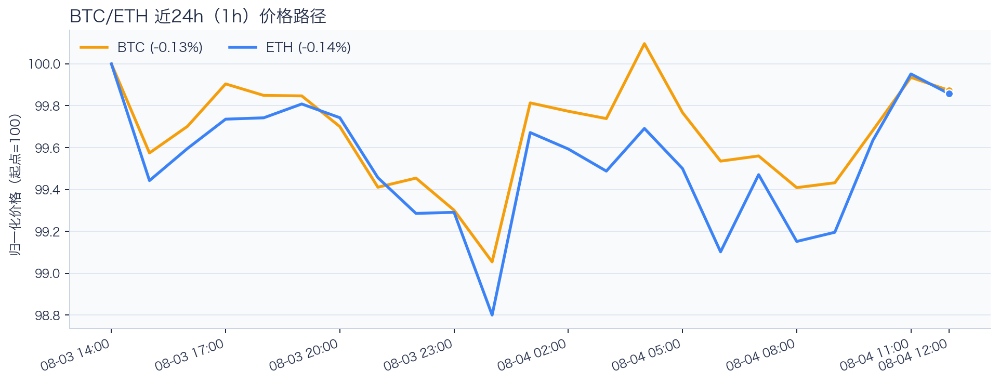
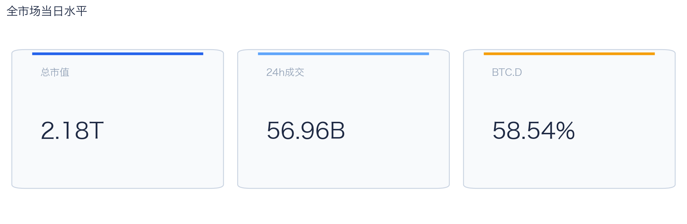
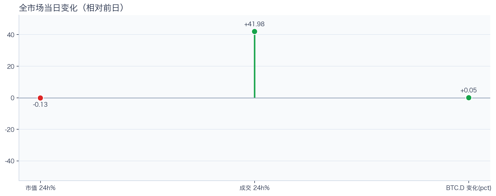
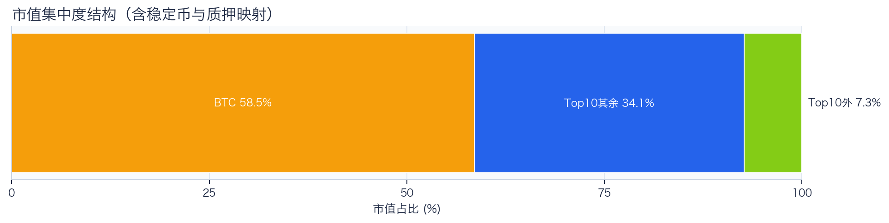
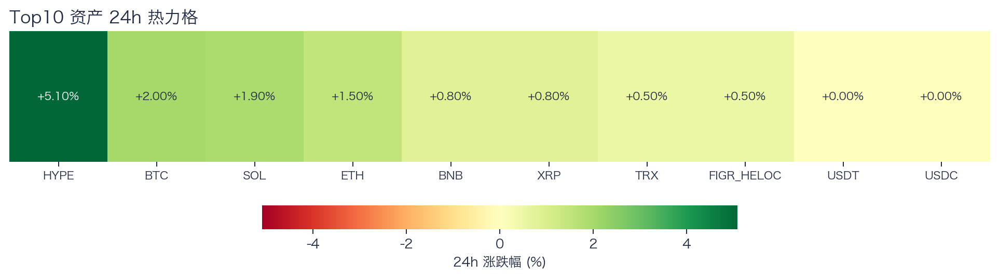
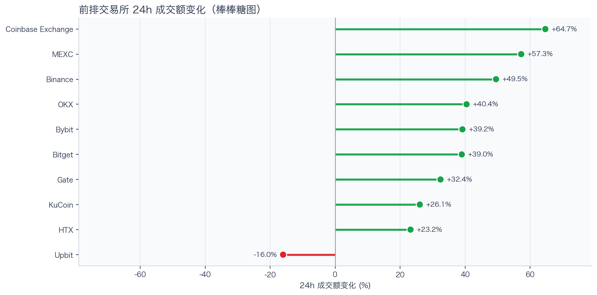
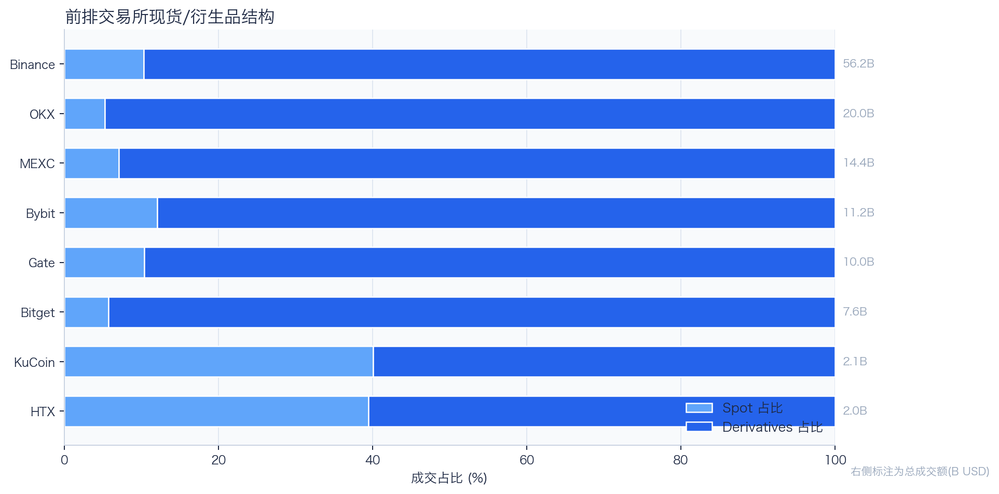
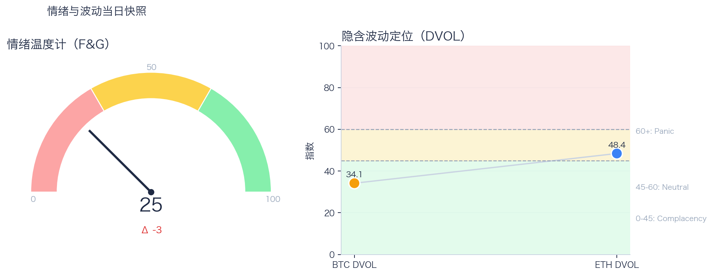

# 二级市场日报（2026-08-04）

## 快速结论
- 全市场指标当日：市值 $2.18T（24h -0.13%），成交额 $56.96B（24h +41.98%）。
- BTC 主导率 58.54%（+0.05pct），Top10 外市值占比（集中度口径）7.31%。
- 头部风险资产（排除稳定币、质押及信用映射）上涨 7 / 下跌 0 / 平盘 0，平均涨跌幅 +1.80%，首尾分化 4.60pct。
- 前排交易所样本成交普遍回升：上涨 9 家、下跌 1 家，24h 变化均值 +35.57%。
- Tokenized Stocks 类别规模 $2.28B，7D +0.17%（据最近可得类别快照）。

## 市场主线
今日市场状态为“压力重定价”。价格回撤而换手抬升，显示分歧加大，可能提高日内波动风险；但仅凭当日市值与成交变化，尚不足以确认波动脉冲。头部风险资产上涨覆盖率较高，但该样本不能外推为长尾扩散。当前证据尚不足以确认新一轮趋势启动。

交易所成交方面，多数平台样本成交回升，但盘口深度、报价连续性与滑点尚未验证，不能直接等同于流动性改善；杠杆方面，当前资金费率未显示极端拥挤，但单一平台样本不足以概括整体杠杆状态；期权定价方面，隐含波动率处于相对低位，但单凭 DVOL 不足以判断期权保护成本是否便宜；情绪方面，情绪与价格修复节奏尚未完全同步。几项指标共同用于确认市场状态，但暂不足以归因于特定事件。

## BTC/ETH 24h 趋势

口径：文字涨跌来自交易所 rolling 24h ticker；图内路径为当前可得 23 个 1 小时数据点，首尾变化 BTC -0.13%、ETH -0.14%，两者窗口不可混用。
- BTC（交易所 rolling 24h）：$63,886.00（+2.07%，区间 $62,445.26 - $64,243.81，当前位于区间 80%）=> 偏强，上行主导。
- ETH（交易所 rolling 24h）：$1,871.12（+1.70%，区间 $1,836.75 - $1,882.44，当前位于区间 75%）=> 偏强震荡。
- 简评：BTC 与 ETH 同步偏强，短线仍有上行动能。

## 市场结构与交易状态
### 市场脉冲

当日，全市场市值 $2.18T，24h 成交额 $56.96B，BTC 主导率 58.54%。
价格下行但换手放大，反映分歧加剧，通常伴随更高的日内波动。

相对前一观测日，市值 -0.13%、成交 +41.98%、BTC.D +0.05pct。
市值与成交是同步观测；缺少事件时点和资金路径证据时，暂不作特定事件归因。

### 市场广度与集中度

当前市值结构为 BTC 58.54% / Top10 其余 34.14% / Top10 外 7.31%。该图含稳定币与质押映射，只描述集中度，不证明风险偏好扩散。
方向样本为 7 个头部风险资产，已排除 USDT, USDC, FIGR_HELOC；Top10 外占比仅是市值集中度，不作为风险扩散代理。

### 资产与交易结构

按头部资产统一快照口径，领涨的是 HYPE（+5.10%），尾部的是 TRX（+0.50%），均值 +1.80%，首尾相差 4.60pct。
上涨家数明显占优，但资产间强弱仍有差异，反弹广度好于集中度信号。对交易而言，继续比较相对强弱，但不把有限的单日收益差夸大为显著结构行情。

前排样本上涨 9 家、下跌 1 家，均值 +35.57%。Coinbase Exchange 最强（+64.69%），Upbit 最弱（-16.01%）。
最强与最弱平台的 24h 变化差达到 80.70pct，说明平台间成交变化分化，但不能据此推断资金因果流向。报价连续性和滑点是否同步变化仍需盘口数据验证，执行层面应继续监控成交质量。

样本内衍生品成交占比 88.99%。该比例描述成交结构，不单独用于判断后续波动方向或幅度。
衍生品占比处于高位；该比例本身不说明波动方向。后续需用盘口深度、强平和事件窗口数据验证具体传导机制。

### 杠杆与风险定价
Deribit 样本的资金费率（Funding）接近中性，BTC/ETH 8h 费率分别为 +0.69bps / +0.79bps；隐含波动率指数（DVOL）位于 Complacency（低波动定价） / Neutral（中性波动定价）。
| 资产 | OKX 多头清算样本 | OKX 空头清算样本 | 近月年化基差 | 远月年化基差 | ATM IV | 25Δ 偏度 |
|---|---:|---:|---:|---:|---:|---:|
| BTC | N/A | N/A | +6.78% | +4.60% | 30.18% | 5.60 pp |
| ETH | N/A | N/A | -0.14% | +1.35% | 43.38% | 3.04 pp |
清算口径：仅为 OKX 公共接口返回的近期样本，不代表 OKX 或全市场清算总量；25Δ 偏度定义为 Put IV 减 Call IV。
Funding 未显示极端方向拥挤；DVOL 处于 Complacency / Neutral，未显示波动定价明显抬升，但这些读数仍不足以判断尾部风险是否重新抬升。因此更合适的做法不是激进追单边，而是围绕波动管理仓位和节奏。

恐惧与贪婪指数（F&G）当日 25（较前一观测日 -3）；BTC/ETH DVOL 为 34.14/48.39，对应 Complacency（低波动定价） / Neutral（中性波动定价）。
情绪仍在恐惧区但已脱离极端恐惧，是否修复仍需成交和广度确认。只有当情绪、广度和成交三者同时改善，市场才更可能从“反弹交易”切换到“趋势交易”。

### 关键价位与失效条件
| 资产 | 24h 支撑 | 24h 阻力 | ATR14(1h) | 向上触发 | 多头失效 | 向下触发 | 空头失效 |
|---|---:|---:|---:|---:|---:|---:|---:|
| BTC | 63136.00 | 64243.81 | 260.04 | 64308.82 | 64178.80 | 63070.99 | 63201.01 |
| ETH | 1848.38 | 1882.44 | 11.47 | 1885.31 | 1879.57 | 1845.51 | 1851.25 |
计算口径：以当前可得 23 个 1 小时数据点的高低点作为支撑/阻力，触发缓冲取现价 0.1% 与 0.25×ATR14 的较大值；触发价用于观察确认，不是自动交易指令。

## 今日差异化重点
### RWA 与 24×7 映射交易
- 映射异动：AXTI 24h +22.07%，属于今日 RWA 观察池中幅度较大的标的。
- 类别结构：最近可得类别快照显示，Tokenized Stocks 规模约 $2.28B，7D +0.17%；该变化用于判断产品线活跃度，不直接外推大盘方向。
- 链上验证：公开聪明钱信号页在已覆盖标的中未命中活跃记录；这不等于不存在相关持仓或交易，异动仍需结合底层价格、成交与事件证据确认。

### Funding 与 Carry 快照
- 本期可用样本仅覆盖 Binance 的 BTC/ETH 现货与永续，未形成跨交易所比较。
- Funding 最高样本为 Binance-BTC，年化约 9.99%；最低样本为 Binance-ETH，年化约 9.21%。
- 可执行性：Funding 与 basis 均有记录的样本可进入 carry 复核，但仍需检查手续费、滑点、保证金和持续性。

## 未来24小时观察
1. 若头部风险资产上涨覆盖率连续改善且 BTC.D 回落，再结合更广币种样本验证风险偏好是否扩散。
2. 若衍生品占比继续上升而 funding 仍中性，只能确认成交结构进一步偏向衍生品，不能单凭此确认杠杆集中；是否放大波动仍需结合 DVOL 与成交验证。
3. 若 F&G 回升而 DVOL 不降，代表情绪改善尚未获得风险定价确认，应降低对追涨信号的置信度。

## 交易与风控含义
- 仓位管理优先级高于方向押注，建议保持核心仓位稳定、战术仓位滚动。
- 若衍生品占比上升并伴随 Funding 快速偏离中性或 DVOL 抬升，再考虑降低杠杆并收紧风险参数。
- 关注情绪改善与广度扩散是否同步发生，二者背离时避免追逐单边。
