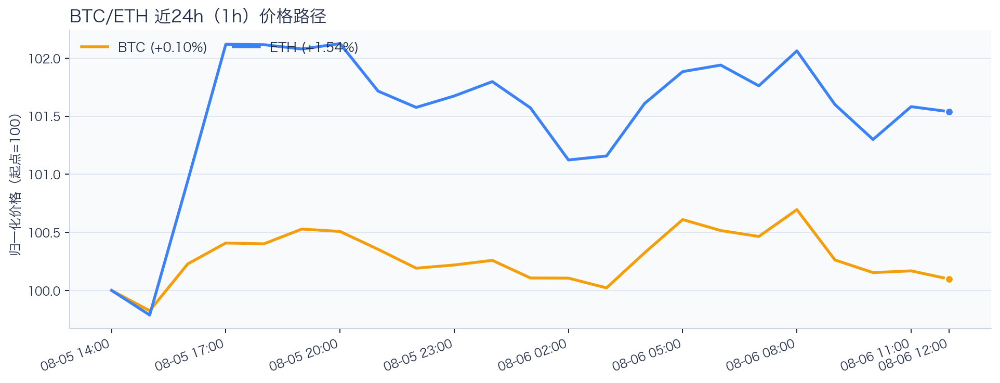
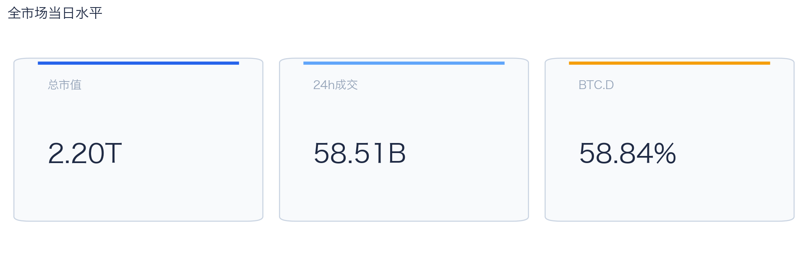
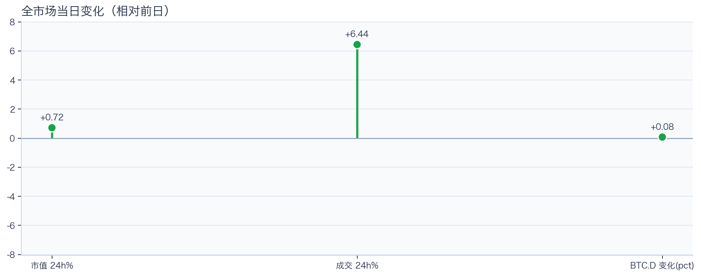
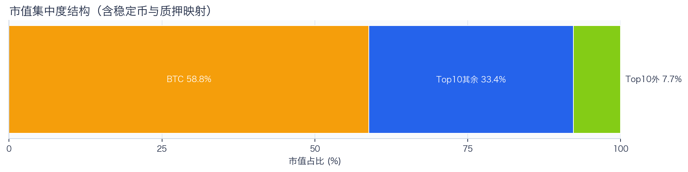
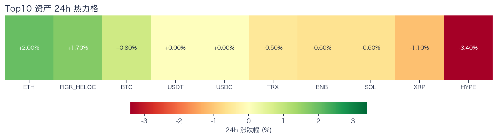
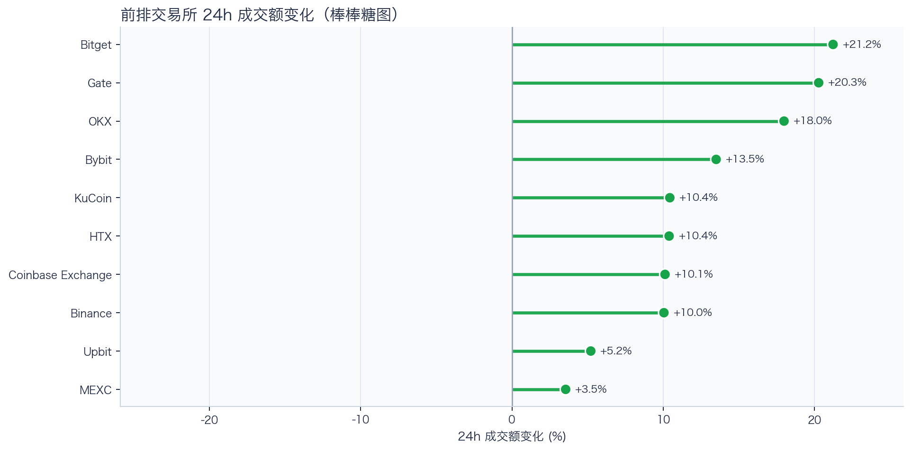
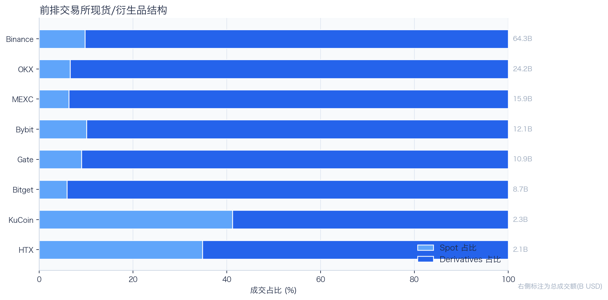
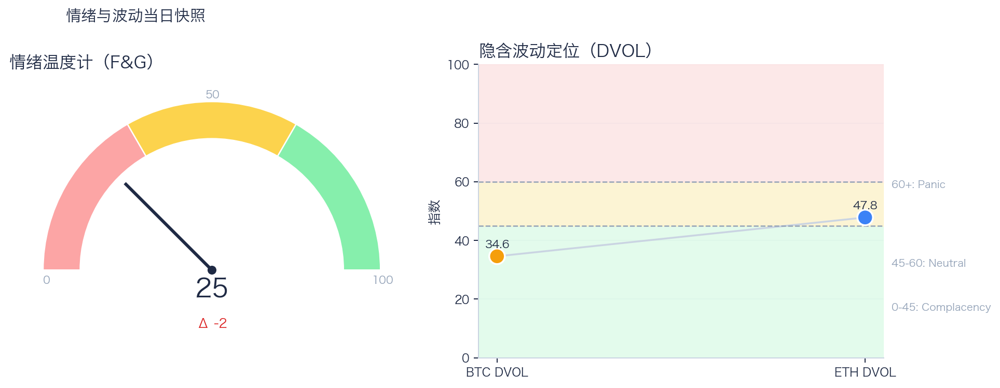

# 二级市场日报（2026-08-06）

## 快速结论
- 全市场指标当日：市值 $2.20T（24h +0.72%），成交额 $58.51B（24h +6.44%）。
- BTC 主导率 58.84%（+0.08pct），Top10 外市值占比（集中度口径）7.75%。
- 头部风险资产（排除稳定币、质押及信用映射）上涨 2 / 下跌 5 / 平盘 0，平均涨跌幅 -0.49%，首尾分化 5.40pct。
- 前排交易所样本成交普遍回升：上涨 10 家、下跌 0 家，24h 变化均值 +12.27%。
- Tokenized Stocks 类别规模约 $2.31B，7D +8.60%，为最近一次可得类别快照。

## 市场主线
今日市场状态为“区间交易”。价格与成交虽同步上行，但尚未形成趋势性突破；市场仍在区间内进行结构轮动。头部风险资产下跌覆盖率较高，风险参与度偏弱。当前证据尚不足以确认新一轮趋势启动。

交易所成交方面，多数平台样本成交回升，但盘口深度、报价连续性与滑点尚未验证，不能直接等同于流动性改善；杠杆方面，BTC/ETH 资金费率为正但接近中性，当前数据不足以确认杠杆拥挤，需警惕回撤时的资金费率反转；期权定价方面，隐含波动率处于相对低位，但单凭 DVOL 不足以判断期权保护成本是否便宜；情绪方面，情绪与价格修复节奏尚未完全同步。几项指标共同用于确认市场状态，但暂不足以归因于特定事件。

## BTC/ETH 24h 趋势

口径：文字涨跌来自交易所 rolling 24h ticker；图内路径为当前可得 23 个小时点，首尾变化 BTC +0.10%、ETH +1.54%，两者窗口不可混用。
- BTC（交易所 rolling 24h）：$64,577.82（+0.76%，区间 $63,906.74 - $65,009.01，当前位于区间 61%）=> 区间震荡。
- ETH（交易所 rolling 24h）：$1,906.48（+1.99%，区间 $1,856.01 - $1,928.05，当前位于区间 70%）=> 偏强震荡。
- 简评：BTC 与 ETH 均温和上涨，ETH 相对更强，但幅度尚未达到强趋势阈值。

## 市场结构与交易状态
### 市场脉冲

当日，全市场市值 $2.20T，24h 成交额 $58.51B，BTC 主导率 58.84%。
价格与成交同步上行，属于健康修复结构；若次日成交不掉队，修复延续概率更高。

相对前一观测日，市值 +0.72%、成交 +6.44%、BTC.D +0.08pct。
市值与成交是同步观测；缺少事件时点和资金路径证据时，暂不作特定事件归因。

### 市场广度与集中度

当前市值结构为 BTC 58.84% / Top10 其余 33.41% / Top10 外 7.75%。该图含稳定币与质押映射，只描述集中度，不证明风险偏好扩散。
方向样本为 7 个头部风险资产，已排除 USDT, USDC, FIGR_HELOC；Top10 外占比仅是市值集中度，不作为风险扩散代理。

### 资产与交易结构

按头部资产统一快照口径，领涨的是 ETH（+2.00%），跌幅最大的是 HYPE（-3.40%），均值 -0.49%，首尾相差 5.40pct。
下跌家数占优，风险偏好修复仍较脆弱，短线追高性价比一般。对交易而言，优先控制回撤并等待上涨覆盖率改善。

前排样本上涨 10 家、下跌 0 家，均值 +12.27%。Bitget 最强（+21.23%），MEXC 最弱（+3.55%）。
最强与最弱平台的 24h 变化差达到 17.68pct，说明平台间成交变化分化，但不能据此推断资金因果流向。报价连续性和滑点是否同步变化仍需盘口数据验证，执行层面应继续监控成交质量。

样本内衍生品成交占比 89.53%。该比例描述成交结构，不单独用于判断后续波动方向或幅度。
衍生品占比处于高位；该比例本身不说明波动方向。后续需用盘口深度、强平和事件窗口数据验证具体传导机制。

### 杠杆与风险定价
Deribit 样本的资金费率（Funding）接近中性，BTC/ETH 8h 费率分别为 +0.20bps / +1.17bps；隐含波动率指数（DVOL）位于 Complacency（低波动定价） / Neutral（中性波动定价）。
| 资产 | OKX 多头清算样本 | OKX 空头清算样本 | 近月年化基差 | 远月年化基差 | ATM IV | 25Δ 偏度 |
|---|---:|---:|---:|---:|---:|---:|
| BTC | N/A | N/A | +4.33% | +4.12% | 28.58% | 5.92 pp |
| ETH | N/A | N/A | +2.57% | +2.46% | 40.80% | 1.15 pp |
清算口径：仅为 OKX 公共接口返回的近期样本，不代表 OKX 或全市场清算总量；25Δ 偏度定义为 Put IV 减 Call IV。
资金费率为正但接近中性，DVOL 对应低波动定价与中性波动定价，组合信号不足以确认拥挤；因此更合适的做法不是激进追单边，而是围绕波动管理仓位和节奏。

恐惧与贪婪指数（F&G）当日 25（较前一观测日 -2）；BTC/ETH DVOL 为 34.58/47.82，对应 Complacency（低波动定价） / Neutral（中性波动定价）。
情绪仍在恐惧区但已脱离极端恐惧，是否修复仍需成交和广度确认。只有当情绪、广度和成交三者同时改善，市场才更可能从“反弹交易”切换到“趋势交易”。

### 关键价位与失效条件
| 资产 | 24h 支撑 | 24h 阻力 | ATR14(1h) | 向上触发 | 多头失效 | 向下触发 | 空头失效 |
|---|---:|---:|---:|---:|---:|---:|---:|
| BTC | 64306.08 | 65009.01 | 175.16 | 65073.59 | 64944.43 | 64241.50 | 64370.66 |
| ETH | 1869.64 | 1928.05 | 7.72 | 1929.98 | 1926.12 | 1867.71 | 1871.57 |
计算口径：以当前可得 23 个 1h 小时点的高低点作为支撑/阻力，触发缓冲取现价 0.1% 与 0.25×ATR14 的较大值；触发价用于观察确认，不是自动交易指令。

## 今日差异化重点
### 稳定币收益与资金成本
- 收益端：本期可得协议样本中，Compound-USDC（Base）的 Total APY 为 6.85%，需继续区分原生利率与奖励补贴。
- 资金需求：本期可得样本最高利用率 92.03%；高利用率意味着借款需求较强，也可能压缩退出流动性。
- 跨平台成本：本期可得报价中，USDC 借币年化样本差约 2.94pct，适合继续核对额度、期限和地区准入，不直接视为套利利差。

### RWA 与 24×7 映射交易
- 映射异动：AXTI 24h +11.33%，属于今日 RWA 观察池中幅度较大的标的。
- 类别结构：最近一次可得类别快照显示，Tokenized Stocks 规模约 $2.31B，7D +8.60%；该变化用于判断产品线活跃度，不直接外推大盘方向。
- 链上验证：公开聪明钱信号页在已覆盖标的中未命中活跃记录；这不等于不存在相关持仓或交易，异动仍需结合底层价格、成交与事件证据确认。

## 未来24小时观察
1. 若头部风险资产上涨覆盖率连续改善且 BTC.D 回落，再结合更广币种样本验证风险偏好是否扩散。
2. 若衍生品占比继续上升而 funding 仍中性，只能确认交易向杠杆侧集中；是否放大波动仍需结合 DVOL 与成交验证。
3. 若 F&G 回升而 DVOL 不降，代表情绪改善尚未获得风险定价确认，应降低对追涨信号的置信度。

## 交易与风控含义
- 仓位管理优先级高于方向押注，建议保持核心仓位稳定、战术仓位滚动。
- 若衍生品占比上升并伴随 Funding 快速偏离中性或 DVOL 抬升，再考虑降低杠杆并收紧风险参数。
- 关注情绪改善与广度扩散是否同步发生，二者背离时避免追逐单边。
