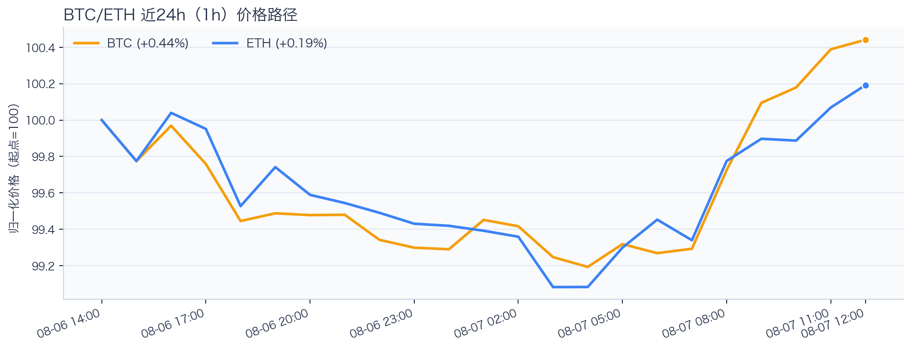
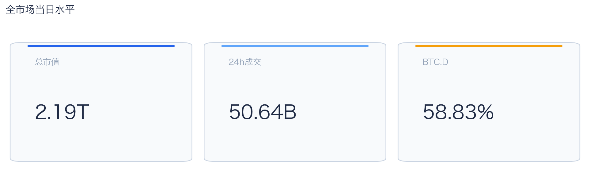
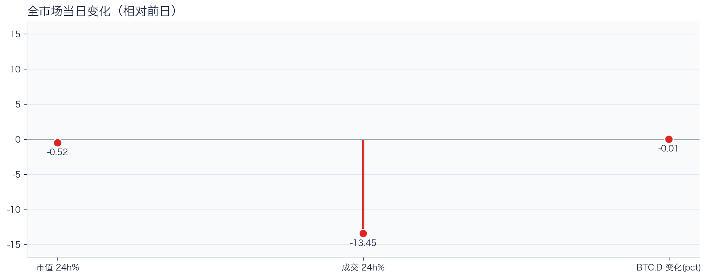
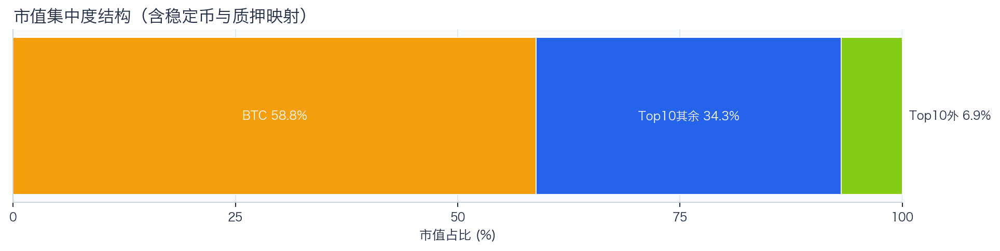
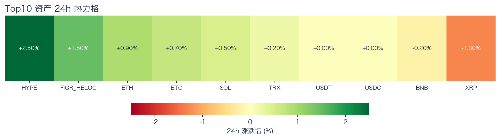
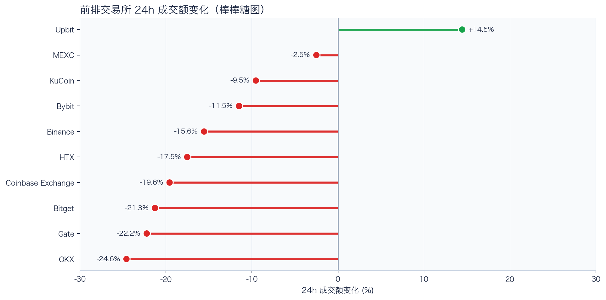
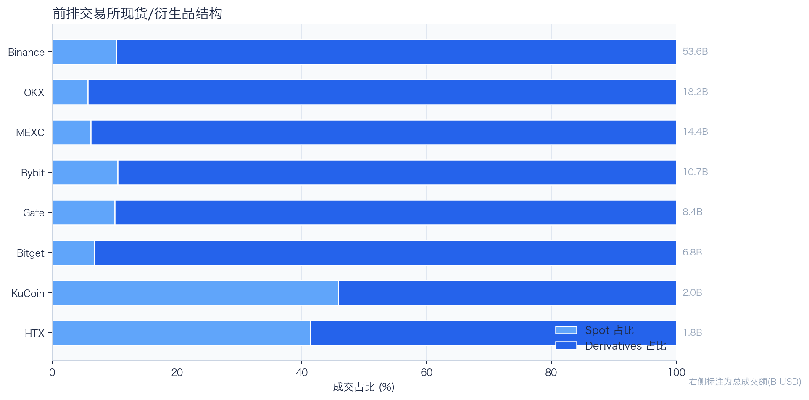
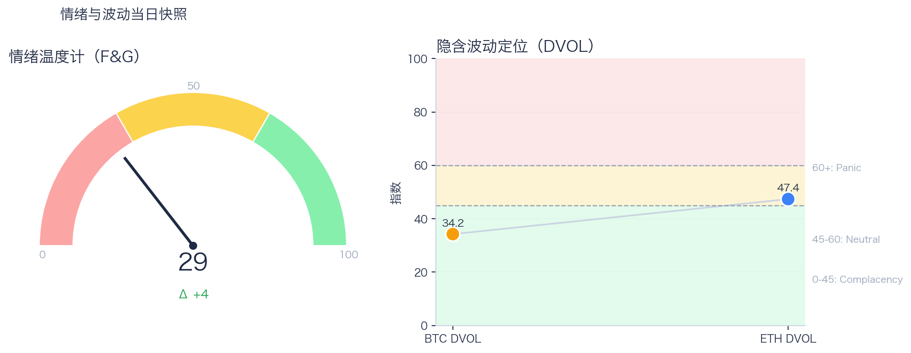

# 二级市场日报（2026-08-07）

## 快速结论
- 全市场指标当日：市值 $2.19T（24h -0.52%），成交额 $50.64B（24h -13.45%）。
- BTC 主导率 58.83%（-0.01pct），Top10 外市值占比（集中度口径）6.85%。
- 头部风险资产（排除稳定币、质押及信用映射）上涨 5 / 下跌 2 / 平盘 0，平均涨跌幅 +0.47%，首尾分化 3.80pct。
- 前排交易所样本成交普遍收缩：上涨 1 家、下跌 9 家，24h 变化均值 -13.00%。
- Tokenized Stocks 类别规模 $2.38B，7D +10.03%。

## 市场主线
今日市场状态为“防守下移”。全市场市值与成交额同步收缩，盘面偏防守；BTC、ETH及部分头部资产仍上涨，但尚未形成足够的广度扩散，短线以控制回撤为主。当前证据尚不足以确认新一轮趋势启动。

交易所成交多数走弱，但该样本仅支持成交收缩与降幅分化，不支持资金回流判断。Deribit资金费率未显示极端拥挤，但单一平台样本不足以概括整体杠杆状态。DVOL处于相对低位，但单凭该指标不足以判断期权保护成本。情绪与价格修复节奏也尚未完全同步。综合来看，相关指标可用于判断市场状态，但不足以归因于特定事件。

## BTC/ETH 24h 趋势

口径：文字涨跌来自交易所 rolling 24h ticker；图内路径为当前可得 23 个小时点，首尾变化 BTC +0.44%、ETH +0.19%，两者窗口不可混用。
- BTC（交易所 rolling 24h）：$65,064.00（+0.79%，区间 $64,166.00 - $65,213.33，当前位于区间 86%）=> 区间震荡。
- ETH（交易所 rolling 24h）：$1,918.69（+0.75%，区间 $1,892.04 - $1,921.00，当前位于区间 92%）=> 区间震荡。
- 简评：BTC 与 ETH 均温和上涨，BTC 相对更强，但幅度尚未达到强趋势阈值。

## 市场结构与交易状态
### 市场脉冲

当日，全市场市值 $2.19T，24h 成交额 $50.64B，BTC 主导率 58.83%。
全市场市值与成交额同步收缩，风险偏好仍在收缩，盘面更偏防守。

相对前一观测日，市值 -0.52%、成交 -13.45%、BTC.D -0.01pct。
市值与成交是同步观测；缺少事件时点和资金路径证据时，暂不作特定事件归因。

### 市场广度与集中度

当前市值结构为 BTC 58.83% / Top10 其余 34.32% / Top10 外 6.85%。该图含稳定币与质押映射，只描述集中度，不证明风险偏好扩散。
方向样本为 7 个头部风险资产，已排除 USDT, USDC, FIGR_HELOC；Top10 外占比仅是市值集中度，不作为风险扩散代理。

### 资产与交易结构

按头部资产统一快照口径，领涨的是 HYPE（+2.50%），跌幅最大的是 XRP（-1.30%），均值 +0.47%，首尾相差 3.80pct。
7个头部风险资产中上涨5个、下跌2个，上涨占多数但收益差仍有限，暂不足以外推为广泛扩散。对交易而言，继续比较相对强弱，但不把有限的单日收益差夸大为显著结构行情。

前排样本上涨 1 家、下跌 9 家，均值 -13.00%。Upbit 最强（+14.45%），OKX 最弱（-24.61%）。
最强与最弱平台的 24h 变化差达到 39.06pct，说明平台间成交变化分化，但不能据此推断资金因果流向。报价连续性和滑点是否同步变化仍需盘口数据验证，执行层面应继续监控成交质量。

样本内衍生品成交占比 88.93%。该比例描述成交结构，不单独用于判断后续波动方向或幅度。
衍生品占比处于高位；该比例本身不说明波动方向。后续需用盘口深度、强平和事件窗口数据验证具体传导机制。

### 杠杆与风险定价
Deribit 样本的资金费率（Funding）接近中性，BTC/ETH 8h 费率分别为 +0.02bps / +0.09bps；隐含波动率指数（DVOL）位于 Complacency（低波动定价） / Neutral（中性波动定价）。
| 资产 | OKX 多头清算样本 | OKX 空头清算样本 | 近月年化基差 | 远月年化基差 | 平值隐含波动率（ATM IV） | 25Δ偏度（Put IV 减 Call IV） |
|---|---:|---:|---:|---:|---:|---:|
| BTC | N/A | N/A | -0.18% | +4.13% | 27.93% | 6.76 pp |
| ETH | N/A | N/A | +1.68% | +2.14% | 40.02% | 3.26 pp |
清算口径：仅为 OKX 公共接口返回的近期样本，不代表 OKX 或全市场清算总量；25Δ 偏度定义为 Put IV 减 Call IV。
Funding 与 DVOL 暂未显示极端方向拥挤；当前读数本身不足以判断尾部风险是否重新抬升。因此更合适的做法不是激进追单边，而是围绕波动管理仓位和节奏。

恐惧与贪婪指数（F&G）当日 29（较前一观测日 +4）；BTC/ETH DVOL 为 34.23/47.35，对应 Complacency（低波动定价） / Neutral（中性波动定价）。
情绪仍在恐惧区但已脱离极端恐惧，是否修复仍需成交和广度确认。只有当情绪、广度和成交三者同时改善，市场才更可能从“反弹交易”切换到“趋势交易”。

### 关键价位与失效条件
| 资产 | 24h 支撑 | 24h 阻力 | ATR14(1h) | 向上触发 | 多头失效 | 向下触发 | 空头失效 |
|---|---:|---:|---:|---:|---:|---:|---:|
| BTC | 64166.00 | 65213.33 | 209.21 | 65278.39 | 65148.27 | 64100.94 | 64231.06 |
| ETH | 1892.04 | 1921.00 | 7.17 | 1922.92 | 1919.08 | 1890.12 | 1893.96 |
计算口径：以当前可得 23 个 1h 小时点的高低点作为支撑/阻力，触发缓冲取现价 0.1% 与 0.25×ATR14 的较大值；触发价用于观察确认，不是自动交易指令。

## 今日差异化重点
### 稳定币收益与资金成本
- 收益端：本期可得协议样本中，Compound-USDS 的 Total APY 为 6.01%，需继续区分原生利率与奖励补贴。
- 资金需求：本期可得样本最高利用率 91.60%；高利用率意味着借款需求较强，也可能压缩退出流动性。
- 跨平台成本：本期可得报价中，USDC 借币年化样本差约 2.22pct，适合继续核对额度、期限和地区准入，不直接视为套利利差。

### RWA 与 24×7 映射交易
- 映射异动：AXTI 24h +12.09%，属于今日 RWA 观察池中幅度较大的标的。
- 类别结构：最近一次可得类别快照显示，Tokenized Stocks 规模约 $2.38B，7D +10.03%；该变化用于判断产品线活跃度，不直接外推大盘方向。
- 链上验证：在核心Top5已覆盖标的中未命中活跃聪明钱信号；该结果不覆盖AXTI等特殊映射池，也不等于不存在相关持仓或交易，异动仍需结合底层价格、成交与事件证据确认。

### Binance Funding 与 Carry 快照
- Binance样本中，ETH Funding 年化约 10.95%，BTC约 7.30%。
- 当前同时具备Funding与basis记录的样本仅覆盖Binance BTC/ETH，暂不构成跨交易所价差或可执行carry结论；仍需检查手续费、滑点、保证金和持续性。

## 未来24小时观察
1. 若头部风险资产上涨覆盖率连续改善且 BTC.D 回落，再结合更广币种样本验证风险偏好是否扩散。
2. 若衍生品占比继续上升而 funding 仍中性，只能确认交易向杠杆侧集中；是否放大波动仍需结合 DVOL 与成交验证。
3. 若 F&G 回升而 DVOL 不降，代表情绪改善尚未获得风险定价确认，应降低对追涨信号的置信度。

## 交易与风控含义
- 仓位管理优先级高于方向押注，建议保持核心仓位稳定、战术仓位滚动。
- 若衍生品占比上升并伴随 Funding 快速偏离中性或 DVOL 抬升，再考虑降低杠杆并收紧风险参数。
- 关注情绪改善与广度扩散是否同步发生，二者背离时避免追逐单边。
