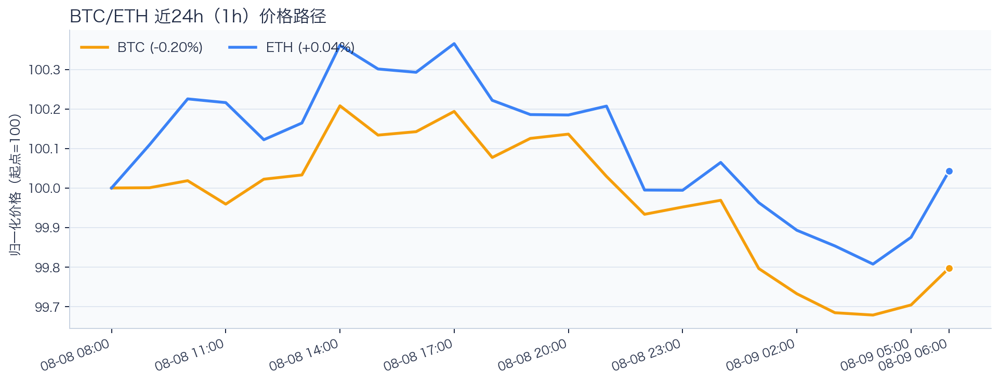
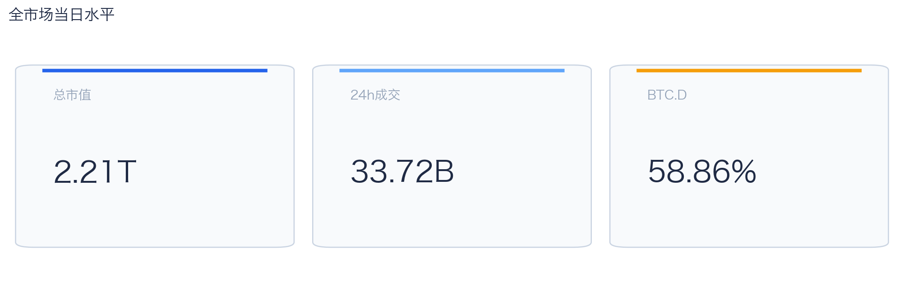
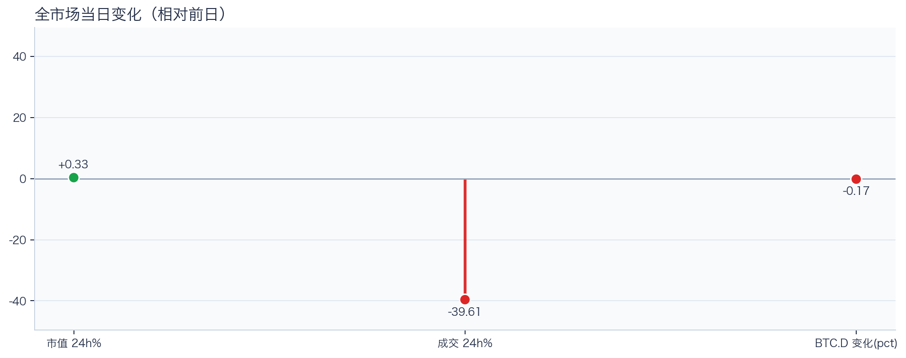
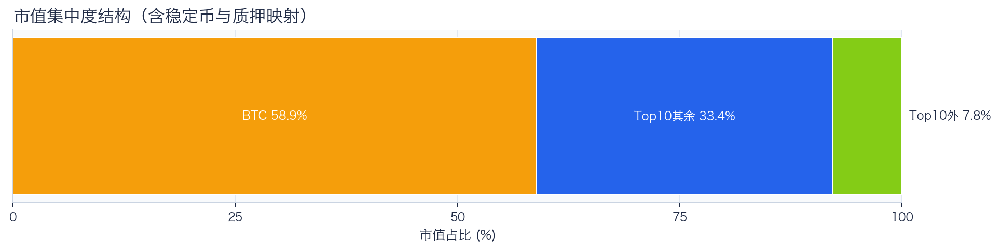
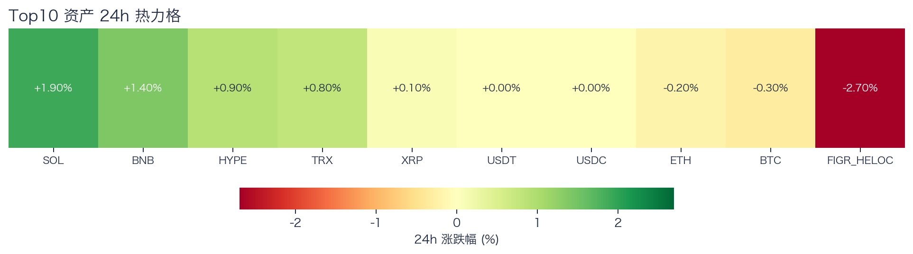
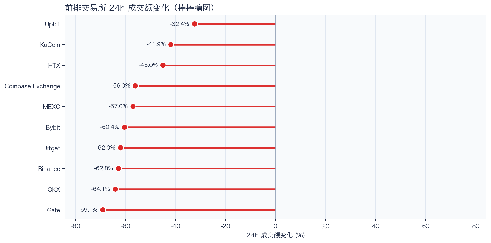
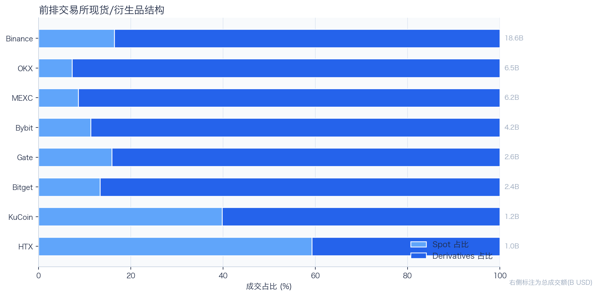
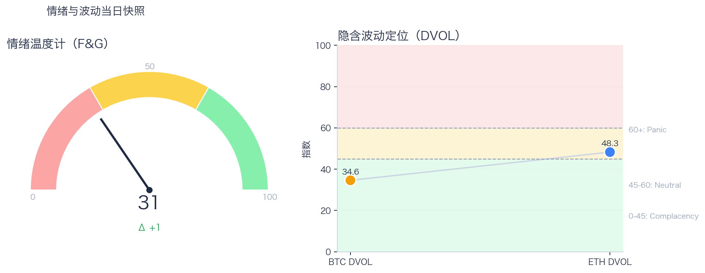

# 二级市场日报（2026-08-09）

## 快速结论
- 全市场指标当日：市值 $2.21T（24h +0.33%），成交额 $33.72B（24h -39.61%）。
- BTC 主导率 58.86%（-0.17pct），Top10 外市值占比（集中度口径）7.76%。
- 头部风险资产（排除稳定币、质押及信用映射）上涨 5 / 下跌 2 / 平盘 0，平均涨跌幅 +0.66%，首尾分化 2.20pct。
- 前排交易所样本成交普遍收缩：上涨 0 家、下跌 10 家，24h 变化均值 -55.05%。
- 最近一次可得 Tokenized Stocks 类别快照规模 $2.44B，7D +8.25%。

## 市场主线
今日市场状态为“缩量修复”。市值上升但成交下降，价格修复尚未得到交易活跃度确认。头部风险资产上涨覆盖率较高，但该样本不能外推为长尾扩散。当前证据尚不足以确认新一轮趋势启动。

交易所成交方面，多数平台成交走弱，样本只支持成交收缩及降幅分化，不支持资金回流判断；杠杆方面，Funding 接近中性，现有快照不足以确认杠杆已拥挤，仍需观察资金费率偏离与 DVOL 是否同步抬升；期权定价方面，隐含波动率处于相对低位，但单凭 DVOL 不足以判断期权保护成本是否便宜；情绪方面，情绪与价格修复节奏尚未完全同步。几项指标共同用于确认市场状态，但暂不足以归因于特定事件。

## BTC/ETH 24h 趋势

口径：文字涨跌来自交易所 rolling 24h ticker；图内路径为当前可得 23 个小时点，首尾变化 BTC -0.20%、ETH +0.04%，两者窗口不可混用。
- BTC（交易所 rolling 24h）：$64,862.29（-0.16%，区间 $64,730.08 - $65,192.54，当前位于区间 29%）=> 区间震荡。
- ETH（交易所 rolling 24h）：$1,917.68（+0.06%，区间 $1,912.36 - $1,926.72，当前位于区间 37%）=> 区间震荡。
- 简评：BTC 与 ETH 出现分化，短线以结构性机会为主。

## 市场结构与交易状态
### 市场脉冲

当日，全市场市值 $2.21T，24h 成交额 $33.72B，BTC 主导率 58.86%。
价格上涨但成交回落，反弹质量偏弱，需警惕高位回吐。

相对前一观测日，市值 +0.33%、成交 -39.61%、BTC.D -0.17pct。
市值与成交是同步观测；缺少事件时点和资金路径证据时，暂不作特定事件归因。

### 市场广度与集中度

当前市值结构为 BTC 58.86% / Top10 其余 33.38% / Top10 外 7.76%。该图含稳定币与质押映射，只描述集中度，不证明风险偏好扩散。
方向样本为 7 个头部风险资产，已排除 USDT, USDC, FIGR_HELOC；Top10 外占比仅是市值集中度，不作为风险扩散代理。

### 资产与交易结构

按头部资产统一快照口径（与下方 BTC/ETH rolling 24h 非同一数据源），领涨的是 SOL（+1.90%），跌幅最大的是 BTC（-0.30%），均值 +0.66%，首尾相差 2.20pct。
涨跌家数接近均衡，市场处于结构轮动阶段，方向一致性较弱。对交易而言，继续比较相对强弱，但不把有限的单日收益差夸大为显著结构行情。

前排样本上涨 0 家、下跌 10 家，均值 -55.05%。Upbit 最强（-32.40%），Gate 最弱（-69.07%）。
样本平台成交普遍收缩，最小与最大降幅相差 36.66pct；这只说明收缩幅度不同，不构成流动性回流或价格发现能力增强的证据。报价连续性和滑点是否同步变化仍需盘口数据验证，执行层面应继续监控成交质量。

样本内衍生品成交占比 83.62%。该比例描述成交结构，不单独用于判断后续波动方向或幅度。
衍生品仍是主导成交形态，但该占比不能单独证明价格由杠杆情绪驱动。后续需用盘口深度、强平和事件窗口数据验证具体传导机制。

### 杠杆与风险定价
Deribit 样本的资金费率（Funding）接近中性，BTC/ETH 8h 费率分别为 +0.00bps / +1.01bps；隐含波动率指数（DVOL）位于 Complacency（低波动定价） / Neutral（中性波动定价）。
| 资产 | OKX 多头清算样本 | OKX 空头清算样本 | 近月年化基差 | 远月年化基差 | ATM IV | 25Δ 偏度 |
|---|---:|---:|---:|---:|---:|---:|
| BTC | 未返回 | 未返回 | -2.37% | +3.94% | 28.75% | 5.09 pp |
| ETH | 未返回 | 未返回 | +0.83% | +1.83% | 40.97% | 2.92 pp |
清算口径：本轮清算样本未返回；该栏目仅为 OKX 公共接口近期样本，不代表 OKX 或全市场清算总量；25Δ 偏度定义为 Put IV 减 Call IV。
当前资金费率接近中性，DVOL 处于低波动定价 / 中性区间，现有快照不足以确认杠杆已拥挤；仍需观察资金费率偏离与 DVOL 是否同步抬升，再围绕波动管理仓位和节奏。

恐惧与贪婪指数（F&G）当日 31（较前一观测日 +1）；BTC/ETH DVOL 为 34.59/48.26，对应 Complacency（低波动定价） / Neutral（中性波动定价）。
情绪仍在恐惧区但已脱离极端恐惧，是否修复仍需成交和广度确认。只有当情绪、广度和成交三者同时改善，市场才更可能从“反弹交易”切换到“趋势交易”。

### 关键价位与失效条件
| 资产 | 24h 支撑 | 24h 阻力 | ATR14(1h) | 向上触发 | 多头失效 | 向下触发 | 空头失效 |
|---|---:|---:|---:|---:|---:|---:|---:|
| BTC | 64730.08 | 65192.54 | 71.17 | 65257.40 | 65127.68 | 64665.22 | 64794.94 |
| ETH | 1912.36 | 1926.72 | 3.37 | 1928.64 | 1924.80 | 1910.44 | 1914.28 |
计算口径：以当前可得 23 个 1h 小时点的高低点作为支撑/阻力，触发缓冲取现价 0.1% 与 0.25×ATR14 的较大值；触发价用于观察确认，不是自动交易指令。

## 今日差异化重点
### 稳定币收益与资金成本
- 收益端：本期可得协议样本中，Compound-USDS 的 Total APY 为 5.14%，需继续区分原生利率与奖励补贴。
- 资金需求：本期可得样本最高利用率 91.82%；高利用率意味着借款需求较强，也可能压缩退出流动性。
- 跨平台成本：本期可得报价中，USDC 借币年化样本差约 2.18pct，适合继续核对额度、期限和地区准入，不直接视为套利利差。

### 跨交易所 Funding 与 Carry
- Funding：样本高位为 Binance-BTC，年化约 8.69%。
- 平台分化：样本低位为 Binance-ETH，年化约 5.09%。
- 可执行性：Funding 与 basis 均有记录的样本可进入 carry 复核，但仍需检查手续费、滑点、保证金和持续性。

### RWA 与 24×7 映射交易
- 映射异动：PLTR 24h +9.82%，属于今日 RWA 观察池中幅度较大的标的；底层市场非连续交易时不作溢折价结论。
- 类别结构：最近一次可得类别快照显示，Tokenized Stocks 规模约 $2.44B，7D +8.25%；该变化用于判断产品线活跃度，不直接外推大盘方向。
- 链上验证：公开聪明钱信号页在已覆盖标的中未命中活跃记录；这不等于不存在相关持仓或交易，异动仍需结合底层价格、成交与事件证据确认。

## 未来24小时观察
1. 若头部风险资产上涨覆盖率连续改善且 BTC.D 回落，再结合更广币种样本验证风险偏好是否扩散。
2. 若衍生品占比继续上升而 funding 仍中性，只能确认交易向杠杆侧集中；是否放大波动仍需结合 DVOL 与成交验证。
3. 若 F&G 回升而 DVOL 不降，代表情绪改善尚未获得风险定价确认，应降低对追涨信号的置信度。

## 交易与风控含义
- 仓位管理优先级高于方向押注，建议保持核心仓位稳定、战术仓位滚动。
- 若衍生品占比上升并伴随 Funding 快速偏离中性或 DVOL 抬升，再考虑降低杠杆并收紧风险参数。
- 关注情绪改善与广度扩散是否同步发生，二者背离时避免追逐单边。
