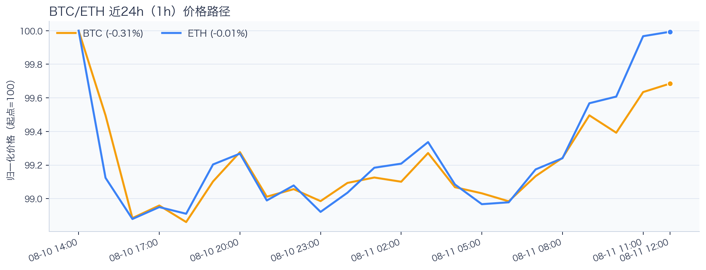
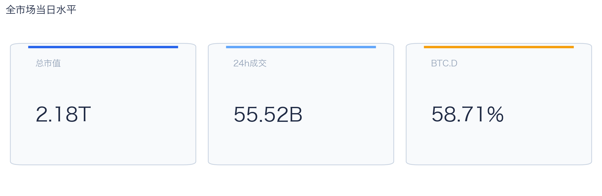
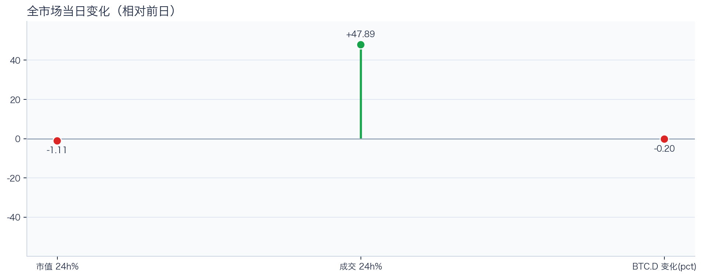
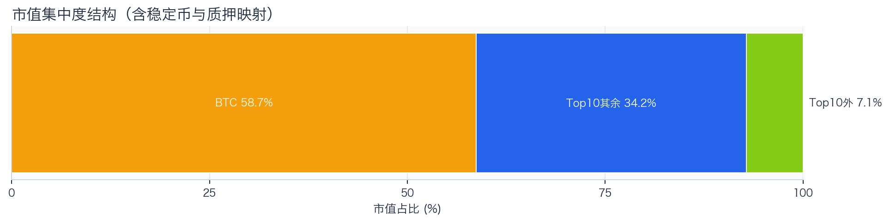
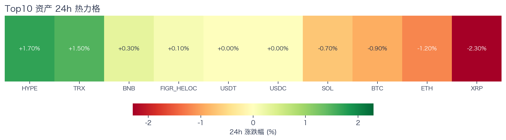
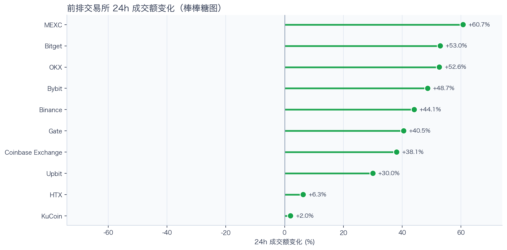
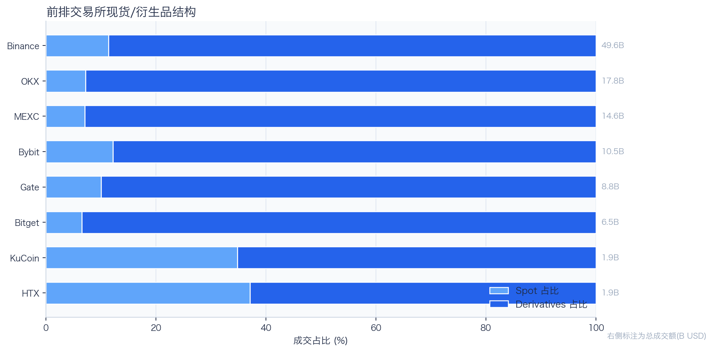
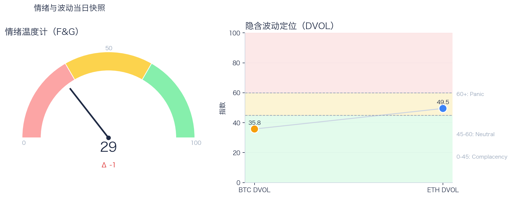

# 二级市场日报（2026-08-11）

## 快速结论
- 全市场指标当日：市值 $2.18T（24h -1.11%），成交额 $55.52B（24h +47.89%）。
- BTC 主导率 58.71%（-0.20pct），Top10 外市值占比（集中度口径）7.14%。
- 头部风险资产（排除稳定币、质押及信用映射）上涨 3 / 下跌 4 / 平盘 0，平均涨跌幅 -0.23%，首尾分化 4.00pct。
- 前排交易所样本成交普遍回升：上涨 10 家、下跌 0 家，24h 变化均值 +37.60%。
- Tokenized Stocks 类别规模 $2.49B，7D +11.77%。

## 市场主线
今日市场状态为“压力重定价”。价格回撤与成交放大同时出现，结合头部风险资产涨跌分化，当前更像交易分歧上升的压力重定价阶段；但是否出现更高波动，仍需盘口、未平仓合约或事件窗口数据验证。当前证据尚不足以确认新一轮趋势启动。

交易所成交回升，但盘口深度、报价连续性与滑点尚未验证，暂不等同于流动性改善。资金费率未显示极端拥挤，但单一平台样本不足以代表全市场杠杆状态。DVOL 处于相对低位，却不能单独判断期权保护成本；情绪修复也尚未与价格同步。综合来看，这些指标支持对市场状态的观察，但不足以归因于特定事件。

## BTC/ETH 24h 趋势

口径：文字涨跌来自交易所 rolling 24h ticker；图内路径为当前可得 23 个小时点，首尾变化 BTC -0.31%、ETH -0.01%，两者窗口不可混用。
- BTC（交易所 rolling 24h）：$64,422.24（-1.17%，区间 $63,806.27 - $65,209.99，当前位于区间 44%）=> 偏弱震荡。
- ETH（交易所 rolling 24h）：$1,893.89（-1.44%，区间 $1,867.96 - $1,923.34，当前位于区间 47%）=> 偏弱震荡。
- 简评：BTC 与 ETH 同步走弱，短线仍以防守为主。

## 市场结构与交易状态
### 市场脉冲

当日，全市场市值 $2.18T，24h 成交额 $55.52B，BTC 主导率 58.71%。
价格下行但换手放大，反映分歧加剧，通常伴随更高的日内波动。

相对前一观测日，市值 -1.11%、成交 +47.89%、BTC 主导率下降 0.20 个百分点。
市值与成交是同步观测；缺少事件时点和资金路径证据时，暂不作特定事件归因。

### 市场广度与集中度

当前市值结构为 BTC 58.71% / Top10 其余 34.15% / Top10 外 7.14%。该图含稳定币与质押映射，只描述集中度，不证明风险偏好扩散。
方向样本为 7 个头部风险资产，已排除 USDT, USDC, FIGR_HELOC；Top10 外占比仅是市值集中度，不作为风险扩散代理。

### 资产与交易结构

按头部资产统一快照口径，领涨的是 HYPE（+1.70%），跌幅最大的是 XRP（-2.30%），均值 -0.23%，首尾相差 4.00pct。
下跌家数占优，风险偏好修复仍较脆弱，短线追高性价比一般。对交易而言，优先控制回撤并等待上涨覆盖率改善。

前排样本上涨 10 家、下跌 0 家，均值 +37.60%。MEXC 最强（+60.70%），KuCoin 最弱（+2.02%）。
最强与最弱平台的 24h 变化差达到 58.69pct，说明平台间成交变化分化，但不能据此推断资金因果流向。报价连续性和滑点是否同步变化仍需盘口数据验证，执行层面应继续监控成交质量。

样本内衍生品成交占比 88.13%。该比例描述成交结构，不单独用于判断后续波动方向或幅度。
衍生品占比处于高位；该比例本身不说明波动方向。后续需用盘口深度、强平和事件窗口数据验证具体传导机制。

### 杠杆与风险定价
Deribit 样本的资金费率（Funding）接近中性，BTC/ETH 8h 费率分别为 +0.21bps / -0.02bps；隐含波动率指数（DVOL）位于 Complacency（低波动定价） / Neutral（中性波动定价）。
| 资产 | OKX 多头清算样本 | OKX 空头清算样本 | 近月年化基差 | 远月年化基差 | ATM IV | 25Δ 偏度 |
|---|---:|---:|---:|---:|---:|---:|
| BTC | N/A | N/A | +0.62% | +3.67% | 28.46% | 6.44 pp |
| ETH | N/A | N/A | -1.57% | +1.47% | 41.05% | 2.24 pp |
清算样本本期未形成有效数据，不据此判断 OKX 或全市场清算量；25Δ 偏度定义为 Put IV 减 Call IV。
资金费率未显示极端方向拥挤；DVOL 仅反映隐含波动率水平，当前处于 Complacency（低波动定价） / Neutral（中性波动定价），二者均不足以单独判断尾部风险是否重新抬升。因此更合适的做法不是激进追单边，而是围绕波动管理仓位和节奏。

恐惧与贪婪指数（F&G）当日 29（较前一观测日 -1）；BTC/ETH DVOL 为 35.77/49.50，对应 Complacency（低波动定价） / Neutral（中性波动定价）。
情绪仍在恐惧区但已脱离极端恐惧，是否修复仍需成交和广度确认。只有当情绪、广度和成交三者同时改善，市场才更可能从“反弹交易”切换到“趋势交易”。

### 关键价位与失效条件
| 资产 | 24h 支撑 | 24h 阻力 | ATR14(1h) | 向上触发 | 多头失效 | 向下触发 | 空头失效 |
|---|---:|---:|---:|---:|---:|---:|---:|
| BTC | 63806.27 | 64888.32 | 129.35 | 64952.74 | 64823.90 | 63741.85 | 63870.69 |
| ETH | 1867.96 | 1902.84 | 5.61 | 1904.73 | 1900.95 | 1866.07 | 1869.85 |
计算口径：以当前可得 23 个 1h 小时点的高低点作为支撑/阻力，触发缓冲取现价 0.1% 与 0.25×ATR14 的较大值；触发价用于观察确认，不是自动交易指令。

## 今日差异化重点
### 稳定币收益与资金成本
- 收益端：扩展样本中，Compound（Base）USDC 池 Total APY 为 7.15%，需与原生利率和奖励收益分开比较。
- 资金需求：扩展样本最高利用率为 91.22%（Compound（Base）USDC），安全优先 10 池最高为 90.85%（Aave（Ethereum）USDC）。高利用率意味着借款需求较强，也可能压缩退出流动性。
- 跨平台成本：本期可得报价中，USDC 借币年化样本差约 2.50pct，适合继续核对额度、期限和地区准入，不直接视为套利利差。

### RWA 与 24×7 映射交易
- 映射异动：AXTI 24h -18.71%，属于今日 RWA 观察池中幅度较大的标的。
- 类别结构：最近一次可得类别快照显示，Tokenized Stocks 规模约 $2.49B，7D +11.77%；该变化用于判断产品线活跃度，不直接外推大盘方向。
- 链上验证：公开聪明钱信号页在已覆盖标的中未命中活跃记录；这不等于不存在相关持仓或交易，异动仍需结合底层价格、成交与事件证据确认。

## 未来24小时观察
1. 若头部风险资产上涨覆盖率连续改善且 BTC.D 回落，再结合更广币种样本验证风险偏好是否扩散。
2. 若衍生品成交占比继续上升，只能确认成交结构向衍生品侧倾斜；即使资金费率仍接近中性，也不能据此确认杠杆集中或波动放大，仍需结合未平仓合约、DVOL 与成交验证。
3. 若 F&G 回升而 DVOL 不降，代表情绪改善尚未获得风险定价确认，应降低对追涨信号的置信度。

## 交易与风控含义
- 仓位管理优先级高于方向押注，建议保持核心仓位稳定、战术仓位滚动。
- 若衍生品占比上升并伴随 Funding 快速偏离中性或 DVOL 抬升，再考虑降低杠杆并收紧风险参数。
- 关注情绪改善与广度扩散是否同步发生，二者背离时避免追逐单边。
