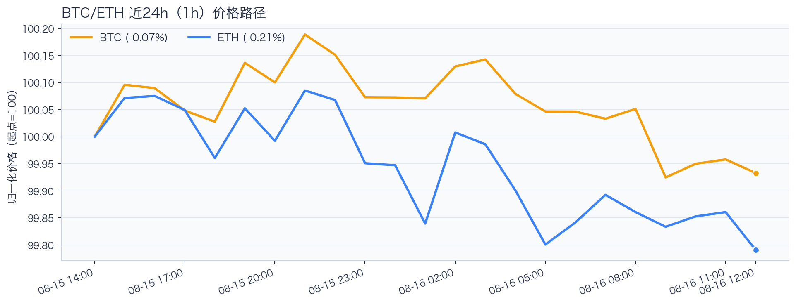
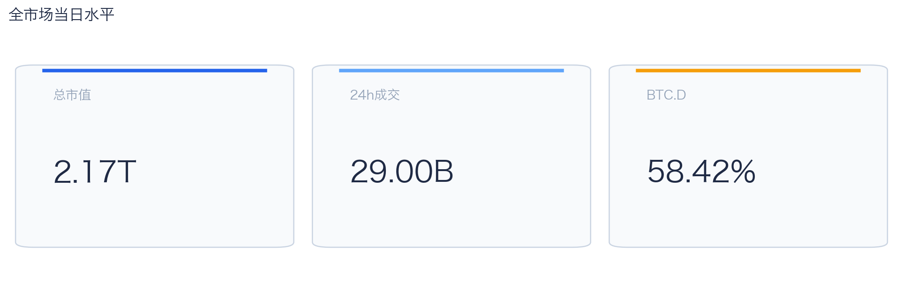
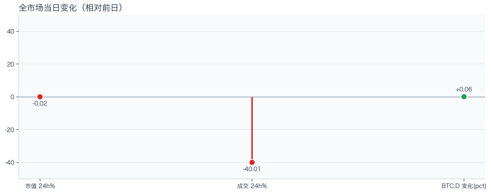
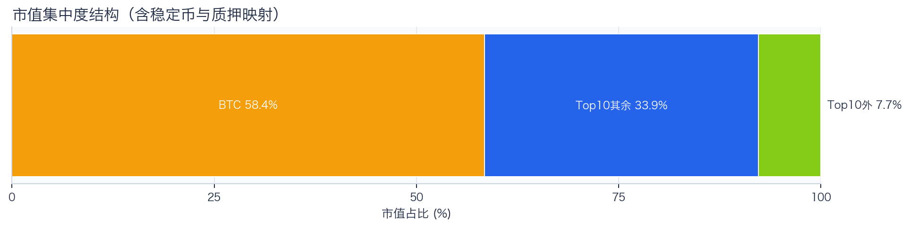
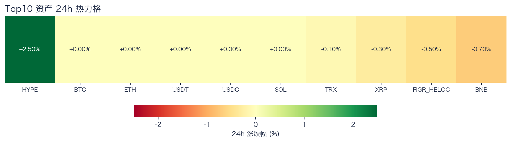
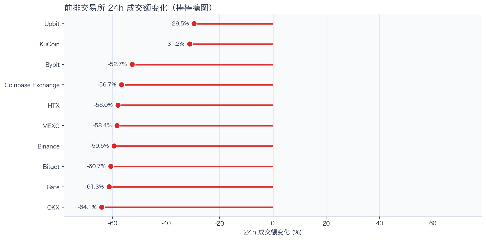
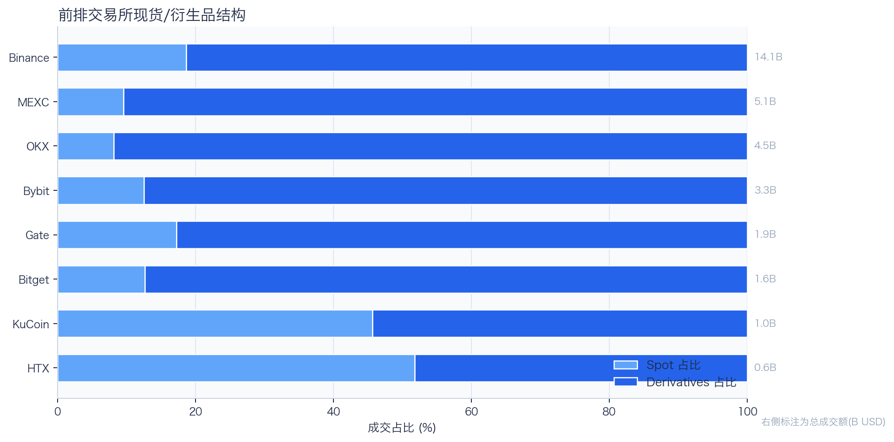
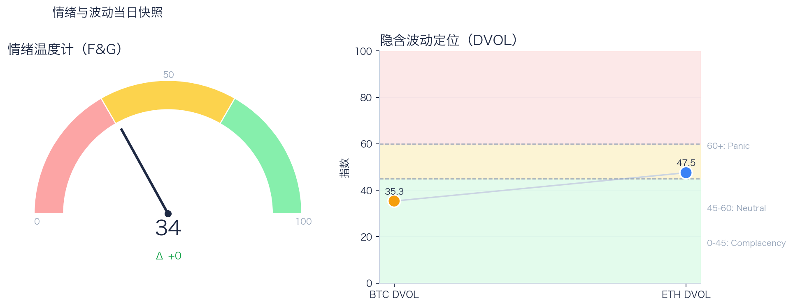

# 二级市场日报（2026-08-16）

## 快速结论
- 全市场指标当日：市值 $2.17T（24h -0.02%），成交额 $29.00B（24h -40.01%）。
- BTC 主导率 58.42%（+0.06pct），Top10 外市值占比（集中度口径）7.73%。
- 头部风险资产（排除稳定币、质押及信用映射）上涨 1 / 下跌 3 / 平盘 3，平均涨跌幅 +0.20%，首尾分化 3.20pct。
- 前排交易所样本成交普遍收缩：上涨 0 家、下跌 10 家，24h 变化均值 -53.20%。
- 最近一次可得类别快照显示，Tokenized Stocks 规模约 $2.38B，7D +5.05%。

## 市场主线
今日市场状态更接近“成交收缩下的窄幅分化”。全市场市值近乎持平、成交额明显回落，头部风险资产涨跌分化，方向一致性有限，短线仍以控制回撤为主。当前证据尚不足以确认新一轮趋势启动。

成交方面，多数平台收缩，现有样本只支持成交收缩及降幅分化，不支持资金回流判断。杠杆方面，资金费率未显示极端拥挤，但单一平台不能代表全市场。波动率方面，DVOL不能单独判断期权保护成本或尾部风险。情绪方面，F&G仍处于恐惧区，尚未与价格修复形成一致信号。以上指标用于刻画市场状态，暂不足以归因于特定事件。

## BTC/ETH 24h 趋势

口径：文字涨跌来自交易所 rolling 24h ticker；图内路径使用 23 个 1h 数据点，首尾变化 BTC -0.07%、ETH -0.21%，两者窗口不可混用。
- BTC（交易所 rolling 24h）：$62,997.77（+0.07%，区间 $62,946.58 - $63,175.00，当前位于区间 22%）=> 区间震荡。
- ETH（交易所 rolling 24h）：$1,879.62（+0.07%，区间 $1,877.01 - $1,886.58，当前位于区间 27%）=> 区间震荡。
- 简评：BTC 与 ETH 均温和上涨，BTC 相对更强，但幅度尚未达到强趋势阈值。

## 市场结构与交易状态
### 市场脉冲

当日市值近乎持平而成交额明显回落，当前主要变化在交易活跃度收缩，而非价格单边突破。BTC 主导率小幅上升，结合风险资产涨跌分化，市场仍缺少广泛的风险偏好确认。

相对前一观测日，市值 -0.02%、成交 -40.01%、BTC.D +0.06pct。
市值与成交是同步观测；缺少事件时点和资金路径证据时，暂不作特定事件归因。

### 市场广度与集中度

当前市值结构为 BTC 58.42% / Top10 其余 33.85% / Top10 外 7.73%。该图含稳定币与质押映射，只描述集中度，不证明风险偏好扩散。
方向样本为 7 个头部风险资产，已排除 USDT, USDC, FIGR_HELOC；Top10 外占比仅是市值集中度，不作为风险扩散代理。

### 资产与交易结构

按头部资产统一快照口径，领涨的是 HYPE（+2.50%），跌幅最大的是 BNB（-0.70%），均值 +0.20%，首尾相差 3.20pct。
下跌家数占优，风险偏好修复仍较脆弱，短线追高性价比一般。对交易而言，优先控制回撤并等待上涨覆盖率改善。

前排样本上涨 0 家、下跌 10 家，均值 -53.20%。Upbit 最强（-29.51%），OKX 最弱（-64.12%）。
样本平台成交普遍收缩，最小与最大降幅相差 34.61pct；这只说明收缩幅度不同，不构成流动性回流或价格发现能力增强的证据。报价连续性和滑点是否同步变化仍需盘口数据验证，执行层面应继续监控成交质量。

样本内衍生品成交占比 82.24%。该比例描述成交结构，不单独用于判断后续波动方向或幅度。
衍生品仍是主导成交形态，但该占比不能单独证明价格由杠杆情绪驱动。后续需用盘口深度、强平和事件窗口数据验证具体传导机制。

### 杠杆与风险定价
Deribit 样本的 8h 资金费率（Funding）接近中性，BTC/ETH 分别为 +0.00bps；DVOL 分别对应低波动与中性定价。
| 资产 | OKX 多头清算样本 | OKX 空头清算样本 | 近月年化基差 | 远月年化基差 | ATM IV | 25Δ 偏度 |
|---|---:|---:|---:|---:|---:|---:|
| BTC | $123,194 | $35,428 | +1.94% | +4.18% | 28.50% | 6.54 pp |
| ETH | $107,214 | $277,656 | +1.46% | +2.02% | 38.97% | 2.86 pp |
清算口径：仅为 OKX 公共接口返回的近期样本，不代表 OKX 或全市场清算总量；25Δ 偏度定义为 Put IV 减 Call IV。
Funding 与 DVOL 暂未显示极端方向拥挤；当前读数本身不足以判断尾部风险是否重新抬升。因此更合适的做法不是激进追单边，而是围绕波动管理仓位和节奏。

恐惧与贪婪指数（F&G）当日 34（较前一观测日 0）；BTC/ETH DVOL 为 35.32/47.54，对应 Complacency（低波动定价） / Neutral（中性波动定价）。
情绪仍在恐惧区但已脱离极端恐惧，是否修复仍需成交和广度确认。只有当情绪、广度和成交三者同时改善，市场才更可能从“反弹交易”切换到“趋势交易”。

### 关键价位与失效条件
| 资产 | 24h 支撑 | 24h 阻力 | ATR14(1h) | 向上触发 | 多头失效 | 向下触发 | 空头失效 |
|---|---:|---:|---:|---:|---:|---:|---:|
| BTC | 62968.45 | 63175.00 | 49.98 | 63238.00 | 63112.00 | 62905.45 | 63031.45 |
| ETH | 1877.01 | 1886.58 | 2.62 | 1888.46 | 1884.70 | 1875.13 | 1878.89 |
计算口径：以 23 个 1h 数据点的高低点作为支撑/阻力，触发缓冲取现价 0.1% 与 0.25×ATR14 的较大值；触发价用于观察确认，不是自动交易指令。

## 今日差异化重点
### 稳定币收益与资金成本
- 收益端：本期可得协议样本中，Aave-USDC 的 Total APY 为 4.82%，需继续区分原生利率与奖励补贴。
- 资金需求：本期可得样本最高利用率 91.69%；高利用率意味着借款需求较强，也可能压缩退出流动性。
- 跨平台成本：本期可得报价中，USDC 借币年化样本差约 3.12pct，适合继续核对额度、期限和地区准入，不直接视为套利利差。

### Binance 现货—永续 Funding 与 Carry 快照
- 在本期可用的 Binance BTC/ETH 现货—永续样本中，BTC 年化 funding 约 2.68%，ETH 约 2.58%；这是单平台快照，不代表跨交易所分化。
- Funding 与 basis 均有记录的样本可进入 carry 复核，但仍需检查手续费、滑点、保证金和持续性。

## 未来24小时观察
1. 若头部风险资产上涨覆盖率连续改善且 BTC.D 回落，再结合更广币种样本验证风险偏好是否扩散。
2. 若衍生品成交占比继续上升而 Funding 仍中性，只能确认成交结构进一步偏向衍生品，不能据此确认杠杆集中；是否放大波动仍需结合 DVOL、成交质量、持仓和强平等证据验证。
3. 若 F&G 回升而 DVOL 不降，代表情绪改善尚未获得风险定价确认，应降低对追涨信号的置信度。

## 交易与风控含义
- 仓位管理优先级高于方向押注，建议保持核心仓位稳定、战术仓位滚动。
- 若衍生品占比上升并伴随 Funding 快速偏离中性或 DVOL 抬升，再考虑降低杠杆并收紧风险参数。
- 关注情绪改善与广度扩散是否同步发生，二者背离时避免追逐单边。
