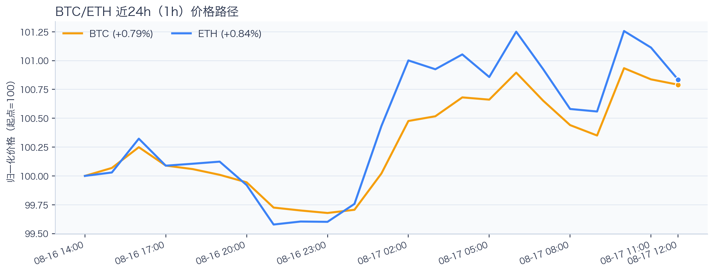
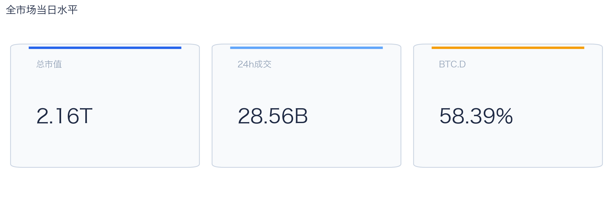
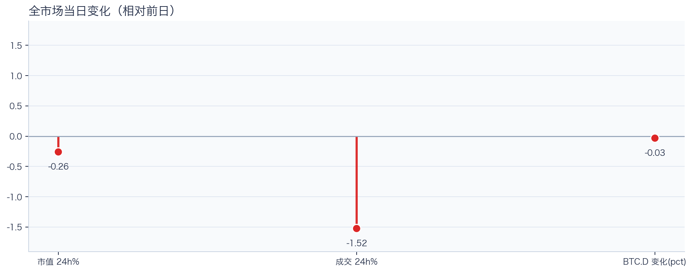
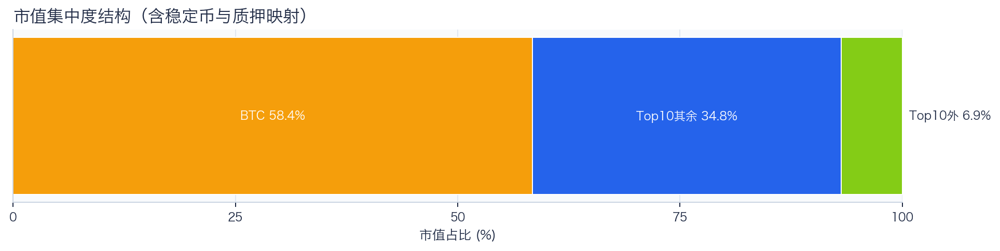
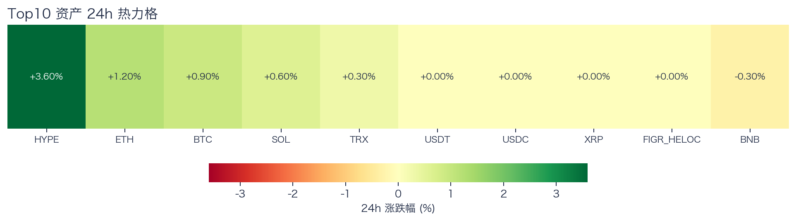
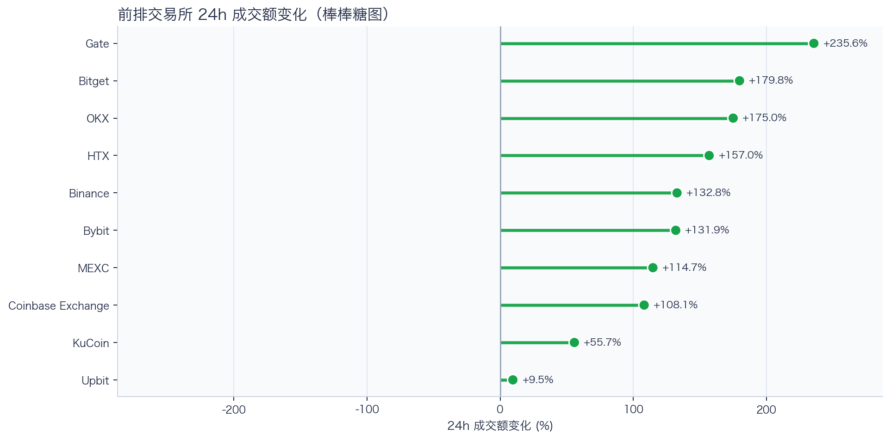
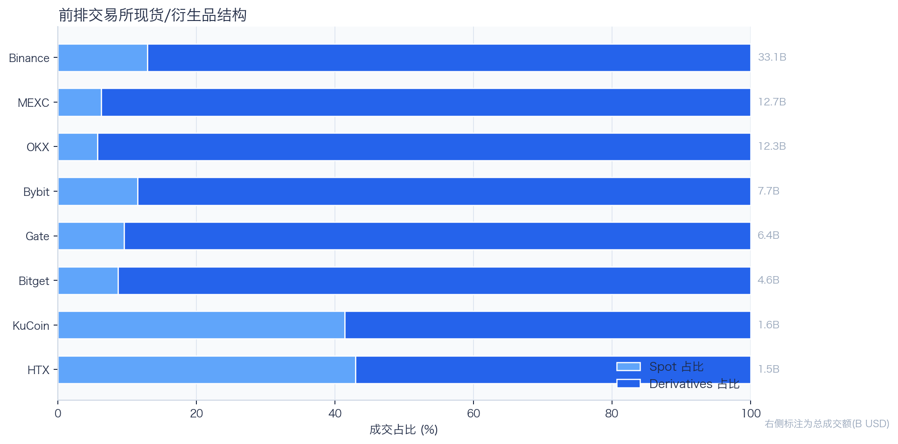
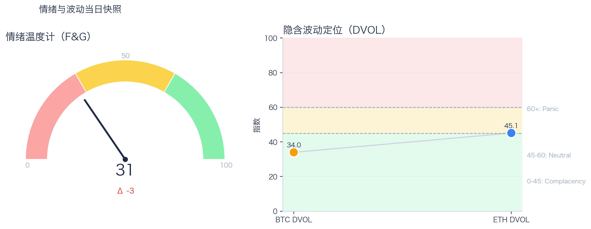

# 二级市场日报（2026-08-17）

## 快速结论
- 全市场指标当日：市值 $2.16T（24h -0.26%），成交额 $28.56B（24h -1.52%）。
- BTC 主导率 58.39%（-0.03pct），Top10 外市值占比（集中度口径）6.85%。
- 头部风险资产（排除稳定币、质押及信用映射）上涨 5 / 下跌 1 / 平盘 1，平均涨跌幅 +0.90%，首尾分化 3.90pct。
- 前排交易所样本成交普遍回升：上涨 10 家、下跌 0 家，24h 变化均值 +130.00%。
- Tokenized Stocks 类别规模 $2.33B，7D +4.01%。

## 市场主线
今日市场状态为“防守下移”。价格与成交同步走弱，属于防守型下移结构，短线以控制回撤为主。头部风险资产上涨覆盖率较高，但该样本不能外推为长尾扩散。当前证据尚不足以确认新一轮趋势启动。

交易所样本成交回升，但盘口深度、报价连续性和滑点尚未验证，不能等同于流动性改善。资金费率未见极端拥挤，但单一平台样本不足以概括整体杠杆状态。BTC 与 ETH 的 DVOL 分别处于低波动和中性定价，单凭该指标不能判断保护成本。情绪仍在恐惧区，尚未与头部资产的温和修复形成一致确认。几项指标共同用于确认市场状态，但暂不足以归因于特定事件。

## BTC/ETH 24h 趋势

口径：文字涨跌来自交易所 rolling 24h ticker；图内路径为当前可得 23 个小时点，首尾变化 BTC +0.79%、ETH +0.84%，两者窗口不可混用。
- BTC（交易所 rolling 24h）：$63,602.12（+0.92%，区间 $62,716.00 - $63,781.69，当前位于区间 83%）=> 区间震荡。
- ETH（交易所 rolling 24h）：$1,899.25（+0.99%，区间 $1,869.17 - $1,912.60，当前位于区间 69%）=> 区间震荡。
- 简评：BTC 与 ETH 均温和上涨，ETH 相对更强，但幅度尚未达到强趋势阈值。

## 市场结构与交易状态
### 市场脉冲

当日，全市场市值 $2.16T，24h 成交额 $28.56B，BTC 主导率 58.39%。
价格与成交同步走弱，风险偏好仍在收缩，盘面更偏防守。

相对前一观测日，市值 -0.26%、成交 -1.52%、BTC.D -0.03pct。
市值与成交是同步观测；缺少事件时点和资金路径证据时，暂不作特定事件归因。

### 市场广度与集中度

当前市值结构为 BTC 58.39% / Top10 其余 34.76% / Top10 外 6.85%。该图含稳定币与质押映射，只描述集中度，不证明风险偏好扩散。
方向样本为 7 个头部风险资产，已排除 USDT, USDC, FIGR_HELOC；Top10 外占比仅是市值集中度，不作为风险扩散代理。

### 资产与交易结构

按头部资产统一快照口径，领涨的是 HYPE（+3.60%），跌幅最大的是 BNB（-0.30%），均值 +0.90%，首尾相差 3.90pct。
样本内上涨 5、下跌 1、平盘 1，涨多跌少；但样本仅含 7 个头部风险资产，且涨幅主要集中于 HYPE，仍不足以确认广泛的趋势性扩散。对交易而言，继续比较相对强弱，但不把有限的单日收益差夸大为显著结构行情。

前排样本上涨 10 家、下跌 0 家，均值 +130.00%。Gate 最强（+235.60%），Upbit 最弱（+9.53%）。
最强与最弱平台的 24h 变化差达到 226.07pct，说明平台间成交变化分化，但不能据此推断资金因果流向。报价连续性和滑点是否同步变化仍需盘口数据验证，执行层面应继续监控成交质量。

样本内衍生品成交占比 87.70%。该比例描述成交结构，不单独用于判断后续波动方向或幅度。
衍生品占比处于高位；该比例本身不说明波动方向。后续需用盘口深度、强平和事件窗口数据验证具体传导机制。

### 杠杆与风险定价
Deribit 样本的资金费率（Funding）接近中性，BTC/ETH 8h 费率分别为 +0.86bps / +0.62bps；BTC DVOL 为 33.96，处于 Complacency（低波动定价），ETH DVOL 为 45.12，处于 Neutral（中性波动定价）。两者均未显示极端风险定价，但不能据此直接判断保护成本便宜或尾部风险已经消退。
| 资产 | OKX 多头清算样本 | OKX 空头清算样本 | 近月年化基差 | 远月年化基差 | ATM IV | 25Δ 偏度 |
|---|---:|---:|---:|---:|---:|---:|
| BTC | $1.90M | $3.02M | +5.70% | +4.83% | 26.41% | 4.52 pp |
| ETH | $1.96M | $5.50M | +3.01% | +2.11% | 35.60% | 3.36 pp |
清算口径：仅为 OKX 公共接口返回的近期样本，不代表 OKX 或全市场清算总量；25Δ 偏度定义为 Put IV 减 Call IV。
Funding 与 DVOL 暂未显示极端方向拥挤；当前读数本身不足以判断尾部风险是否重新抬升。因此更合适的做法不是激进追单边，而是围绕波动管理仓位和节奏。

恐惧与贪婪指数（F&G）当日 31（较前一观测日 -3）；BTC/ETH DVOL 为 33.96/45.12，对应 Complacency（低波动定价） / Neutral（中性波动定价）。
情绪仍在恐惧区但已脱离极端恐惧，是否修复仍需成交和广度确认。只有当情绪、广度和成交三者同时改善，市场才更可能从“反弹交易”切换到“趋势交易”。

### 关键价位与失效条件
| 资产 | 24h 支撑 | 24h 阻力 | ATR14(1h) | 向上触发 | 多头失效 | 向下触发 | 空头失效 |
|---|---:|---:|---:|---:|---:|---:|---:|
| BTC | 62716.00 | 63781.69 | 223.75 | 63845.29 | 63718.09 | 62652.40 | 62779.60 |
| ETH | 1869.17 | 1912.60 | 9.59 | 1915.00 | 1910.20 | 1866.77 | 1871.57 |
计算口径：以当前可得 23 个 1h 小时点的高低点作为支撑/阻力，触发缓冲取现价 0.1% 与 0.25×ATR14 的较大值；触发价用于观察确认，不是自动交易指令。

## 今日差异化重点
### 稳定币收益与资金成本
- 收益端：本期可得协议样本中，Aave-USDC 的 Total APY 为 4.82%，需继续区分原生利率与奖励补贴。
- 资金需求：本期可得样本最高利用率 91.85%；高利用率意味着借款需求较强，也可能压缩退出流动性。
- 跨平台成本：本期可得报价中，USDC 借币年化样本差约 3.13pct，适合继续核对额度、期限和地区准入，不直接视为套利利差。

### 跨交易所 Funding 与 Carry
- Funding：样本高位为 Binance-ETH，年化约 6.72%。
- 平台分化：样本低位为 OKX-BTC，年化约 3.76%。
- 可执行性：Funding 与 basis 均有记录的样本可进入 carry 复核，但仍需检查手续费、滑点、保证金和持续性。

## 未来24小时观察
1. 若头部风险资产上涨覆盖率连续改善且 BTC.D 回落，再结合更广币种样本验证风险偏好是否扩散。
2. 若衍生品占比继续上升而 funding 仍中性，只能确认交易向杠杆侧集中；是否放大波动仍需结合 DVOL 与成交验证。
3. 若 F&G 回升而 DVOL 不降，代表情绪改善尚未获得风险定价确认，应降低对追涨信号的置信度。

## 交易与风控含义
- 仓位管理优先级高于方向押注，建议保持核心仓位稳定、战术仓位滚动。
- 若衍生品占比上升并伴随 Funding 快速偏离中性或 DVOL 抬升，再考虑降低杠杆并收紧风险参数。
- 关注情绪改善与广度扩散是否同步发生，二者背离时避免追逐单边。
