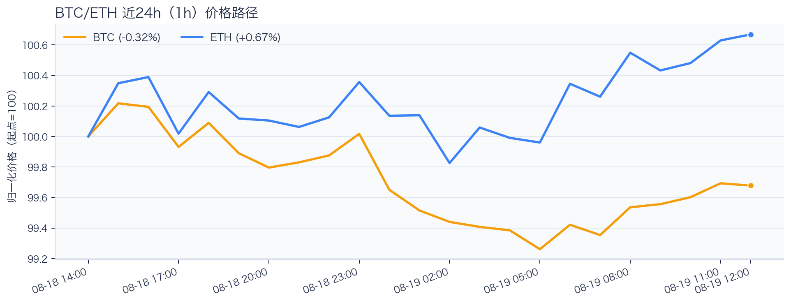
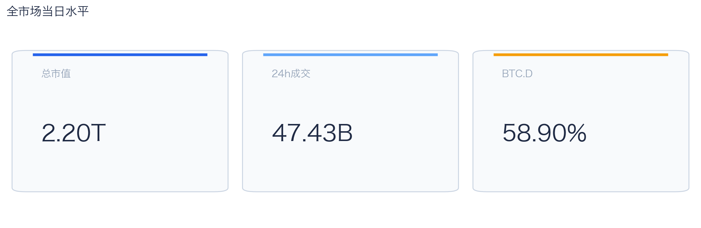
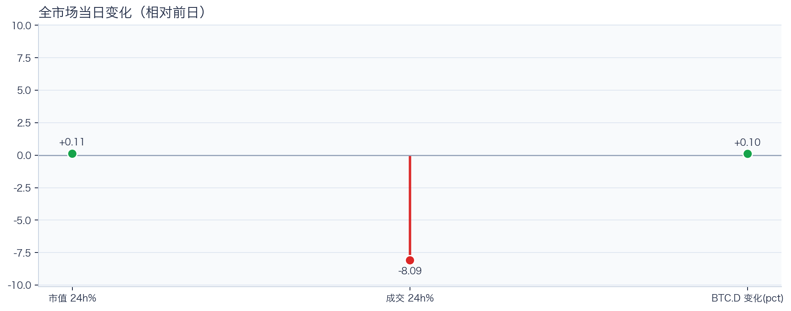
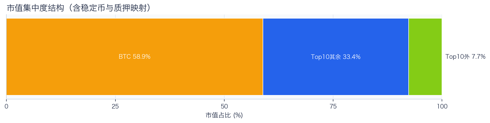
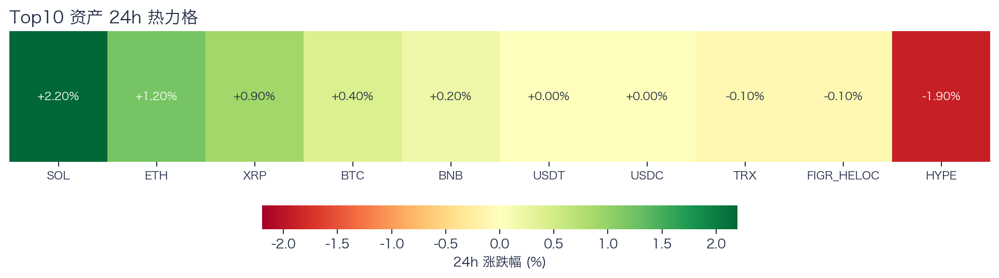
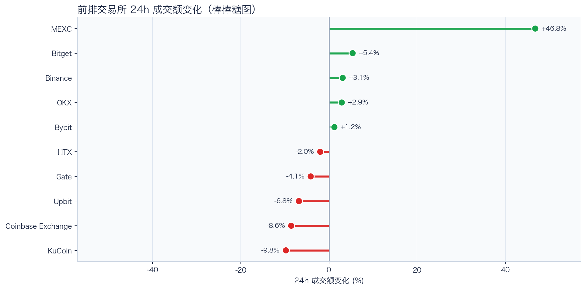
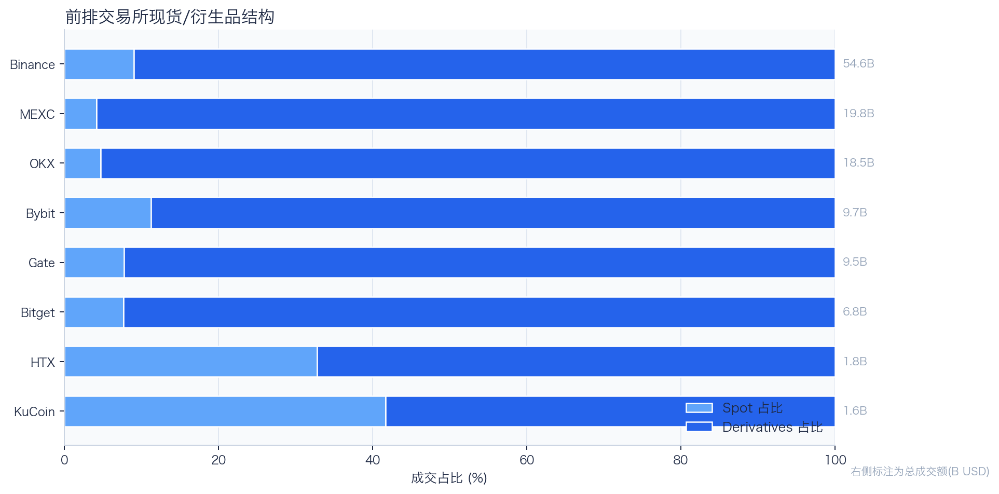
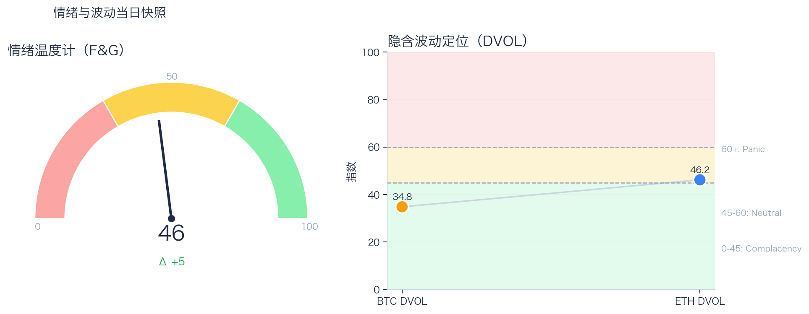

# 二级市场日报（2026-08-19）

## 快速结论
- 全市场指标当日：市值 $2.20T（24h +0.11%），成交额 $47.43B（24h -8.09%）。
- BTC 主导率 58.90%（+0.10pct），Top10 外市值占比（集中度口径）7.66%。
- 头部风险资产（排除稳定币、质押及信用映射）上涨 5 / 下跌 2 / 平盘 0，平均涨跌幅 +0.41%，首尾分化 4.10pct。
- 前排交易所样本成交涨跌分化：上涨 5 家、下跌 5 家，24h 变化均值 +2.81%。
- Tokenized Stocks 类别规模 $2.40B，7D +3.90%。

## 市场主线
今日市场状态为“缩量修复”。市值上升但成交下降，价格修复尚未得到交易活跃度确认。头部风险资产上涨覆盖率较高，但该样本不能外推为长尾扩散。当前证据尚不足以确认新一轮趋势启动。

交易所成交方面，平台流量呈分化状态，头部与非头部恢复节奏不一致。杠杆方面，资金费率未显示极端拥挤，但单一平台样本不足以概括整体杠杆状态。期权定价方面，隐含波动率处于相对低位；单凭 DVOL 不能判断期权保护成本是否偏低。情绪方面，情绪与价格修复节奏尚未完全同步。上述指标可共同用于确认市场状态，但暂不足以归因于特定事件。

## BTC/ETH 24h 趋势

口径：文字涨跌采用滚动 24 小时口径；图内路径使用 23 个小时点，首尾变化 BTC -0.32%、ETH +0.67%，两者窗口不可混用。
- BTC（交易所 rolling 24h）：$64,505.98（+0.26%，区间 $64,027.85 - $65,058.81，当前位于区间 46%）=> 区间震荡。
- ETH（交易所 rolling 24h）：$1,923.80（+1.12%，区间 $1,894.00 - $1,929.94，当前位于区间 83%）=> 偏强震荡。
- 简评：BTC 与 ETH 均温和上涨，ETH 相对更强，但幅度尚未达到强趋势阈值。

## 市场结构与交易状态
### 市场脉冲

当日，全市场市值 $2.20T，24h 成交额 $47.43B，BTC 主导率 58.90%。
价格上涨但成交回落，反弹质量偏弱，需警惕高位回吐。

相对前一观测日，市值 +0.11%、成交 -8.09%、BTC.D +0.10pct。
市值与成交是同步观测；缺少事件时点和资金路径证据时，暂不作特定事件归因。

### 市场广度与集中度

当前市值结构为 BTC 58.90% / Top10 其余 33.43% / Top10 外 7.66%。该图含稳定币与质押映射，只描述集中度，不证明风险偏好扩散。
方向样本为 7 个头部风险资产，已排除 USDT, USDC, FIGR_HELOC；Top10 外占比仅是市值集中度，不作为风险扩散代理。

### 资产与交易结构

按头部资产统一快照口径，领涨的是 SOL（+2.20%），跌幅最大的是 HYPE（-1.90%），均值 +0.41%，首尾相差 4.10pct。
涨跌家数接近均衡，市场处于结构轮动阶段，方向一致性较弱。对交易而言，继续比较相对强弱，但不把有限的单日收益差夸大为显著结构行情。

前排样本上涨 5 家、下跌 5 家，均值 +2.81%。MEXC 最强（+46.78%），KuCoin 最弱（-9.77%）。
最强与最弱平台的 24h 变化差达到 56.55pct，说明平台间成交变化分化，但不能据此推断资金因果流向。报价连续性和滑点是否同步变化仍需盘口数据验证，执行层面应继续监控成交质量。

样本内衍生品成交占比 90.73%，该比例仅描述成交结构，不单独说明后续波动方向或幅度；需结合盘口深度、强平和事件窗口数据验证具体传导机制。

### 杠杆与风险定价
Deribit 样本的资金费率（Funding）接近中性，BTC/ETH 8h 费率分别为 +0.65bps / +0.80bps；隐含波动率指数（DVOL）位于 Complacency（低波动定价） / Neutral（中性波动定价）。
| 资产 | OKX 多头清算样本 | OKX 空头清算样本 | 近月年化基差 | 远月年化基差 | ATM IV | 25Δ 偏度 |
|---|---:|---:|---:|---:|---:|---:|
| BTC | $505,717 | $21,314 | +7.38% | +5.02% | 26.24% | 5.27 pp |
| ETH | $154,119 | $1.40M | +3.08% | +1.94% | 36.47% | 1.34 pp |
清算口径：仅为 OKX 近期公开清算样本，不代表 OKX 或全市场清算总量；25Δ 偏度定义为 Put IV 减 Call IV。
Funding 未显示极端方向拥挤；DVOL 处于低波动或中性定价。两者当前读数均不足以判断尾部风险是否重新抬升，因此更适合围绕波动管理仓位和节奏。

恐惧与贪婪指数（F&G）当日 46（较前一观测日 +5）；BTC/ETH DVOL 为 34.83/46.20，对应 Complacency（低波动定价） / Neutral（中性波动定价）。
情绪处于中性区，后续需要成交和广度同步改善才能确认趋势。只有当情绪、广度和成交三者同时改善，市场才更可能从“反弹交易”切换到“趋势交易”。

### 关键价位与失效条件
| 资产 | 24h 支撑 | 24h 阻力 | ATR14(1h) | 向上触发 | 多头失效 | 向下触发 | 空头失效 |
|---|---:|---:|---:|---:|---:|---:|---:|
| BTC | 64166.00 | 65058.81 | 135.24 | 65123.32 | 64994.30 | 64101.49 | 64230.51 |
| ETH | 1897.31 | 1929.94 | 6.62 | 1931.86 | 1928.02 | 1895.39 | 1899.23 |
计算口径：以当前可得 23 个 1h 小时点的高低点作为支撑/阻力，触发缓冲取现价 0.1% 与 0.25×ATR14 的较大值；触发价用于观察确认，不是自动交易指令。

## 今日差异化重点
### 跨交易所 Funding 与 Carry
- Funding：样本高位为 Binance-ETH，年化约 9.34%。
- 平台分化：样本低位为 OKX-BTC，年化约 3.10%。
- 可执行性：Funding 与 basis 均有记录的样本可进入 carry 复核，但仍需检查手续费、滑点、保证金和持续性。

### 稳定币收益与资金成本
- 收益端：本期可得协议样本中，Compound（Base 链）USDC 池的 Total APY 为 4.91%，需继续区分原生利率与奖励补贴。
- 资金需求：本期可得样本最高利用率 91.65%；高利用率意味着借款需求较强，也可能压缩退出流动性。
- 跨平台成本：本期可得报价中，USDC 借币年化样本差约 3.04pct，适合继续核对额度、期限和地区准入，不直接视为套利利差。

### RWA 与 24×7 映射交易
- 映射异动：CRWV 24h -13.74%，属于今日 RWA 观察池中幅度较大的标的。
- 类别结构：最近一次可得类别快照显示，Tokenized Stocks 规模约 $2.40B，7D +3.90%；该变化用于判断产品线活跃度，不直接外推大盘方向。
- 链上验证：公开聪明钱信号页在已覆盖标的中未命中活跃记录；这不等于不存在相关持仓或交易，异动仍需结合底层价格、成交与事件证据确认。

## 未来24小时观察
1. 若头部风险资产上涨覆盖率连续改善且 BTC.D 回落，再结合更广币种样本验证风险偏好是否扩散。
2. 若衍生品成交占比继续上升而资金费率仍中性，只能确认成交结构向衍生品侧集中，不能单独确认杠杆使用增加；是否放大波动仍需结合 DVOL、成交和强平数据验证。
3. 若 F&G 回升而 DVOL 不降，代表情绪改善尚未获得风险定价确认，应降低对追涨信号的置信度。

## 交易与风控含义
- 仓位管理优先级高于方向押注，建议保持核心仓位稳定、战术仓位滚动。
- 若衍生品占比上升并伴随 Funding 快速偏离中性或 DVOL 抬升，再考虑降低杠杆并收紧风险参数。
- 关注情绪改善与广度扩散是否同步发生，二者背离时避免追逐单边。
