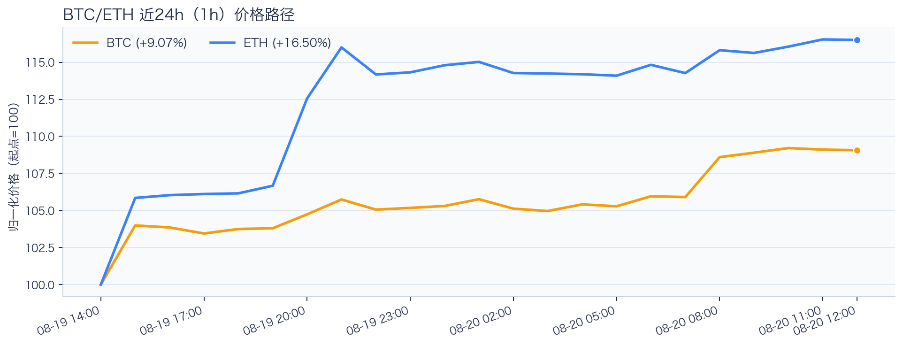
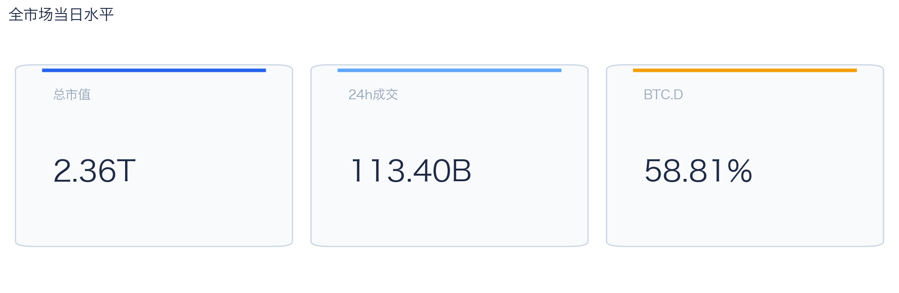
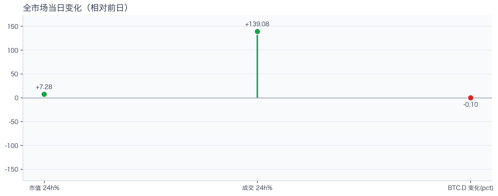
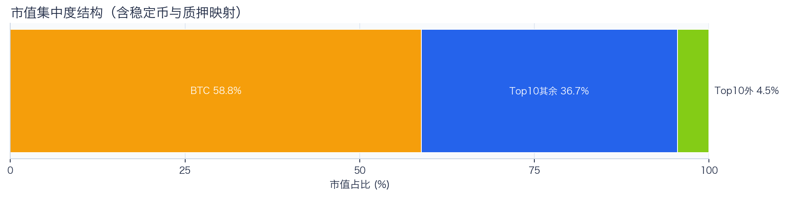
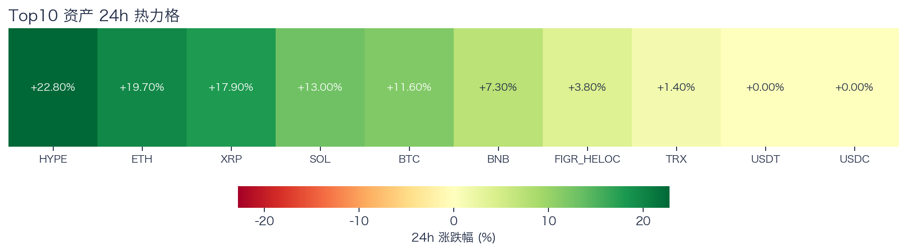
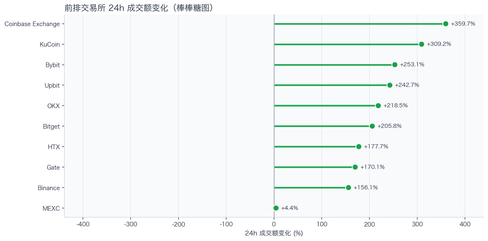
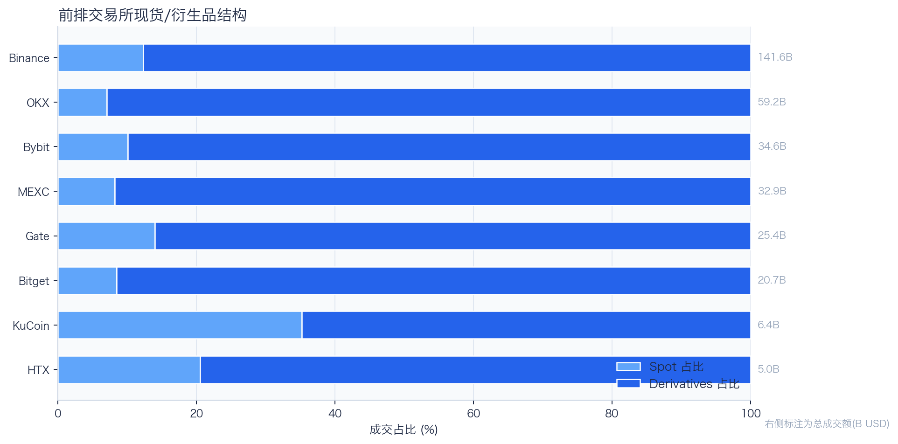
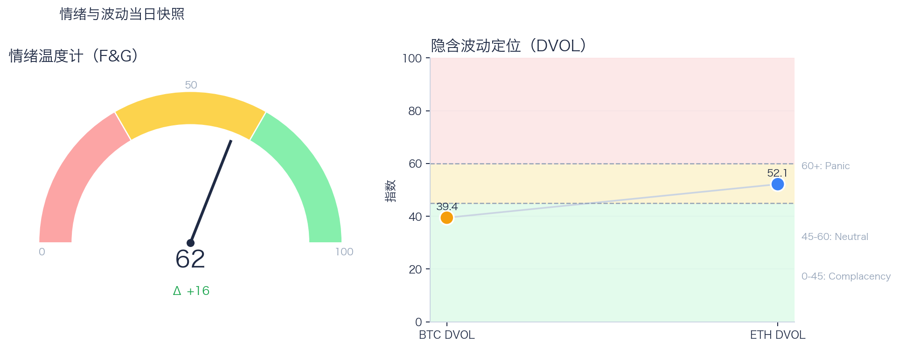

# 二级市场日报（2026-08-20）

## 快速结论
- 全市场指标当日：市值 $2.36T（24h +7.28%），成交额 $113.40B（24h +139.08%）。
- BTC 主导率 58.81%（-0.10pct），Top10 外市值占比（集中度口径）4.53%。
- 头部风险资产（排除稳定币、质押及信用映射）上涨 7 / 下跌 0 / 平盘 0，平均涨跌幅 +13.39%，首尾分化 21.40pct。
- 前排交易所样本成交普遍回升：上涨 10 家、下跌 0 家，24h 变化均值 +209.73%。
- 最近一次可得类别快照显示，代币化股票（Tokenized Stocks）类别规模约 $2.36B，7D -4.04%。

## 市场主线
今日市场状态为“交易性修复”。价格与成交共振上行；现有样本只覆盖头部风险资产，尚不足以证明长尾市场已扩散。头部风险资产上涨覆盖率较高，但该样本不能外推为长尾扩散。当前证据尚不足以确认新一轮趋势启动。

交易所成交方面，多数平台样本回升，但盘口深度、报价连续性和滑点尚未验证，不能直接等同于流动性改善。杠杆方面，资金费率未显示极端拥挤，但单一平台样本不足以概括整体杠杆状态。期权定价方面，DVOL 处于相对低位，但单凭 DVOL 不足以判断期权保护成本是否便宜。情绪方面，指标回到偏乐观区；若成交不跟随，需防止短线追高回撤。上述指标可共同描述市场状态，但暂不足以归因于特定事件。

## BTC/ETH 24h 趋势

口径：文字涨跌来自交易所 rolling 24h ticker；图内路径基于当前可得的 23 个小时级数据点，首尾变化 BTC +9.07%、ETH +16.50%，两者窗口不可混用。
- BTC（交易所 rolling 24h）：$71,900.01（+11.49%，区间 $64,474.86 - $72,490.00，当前位于区间 93%）=> 偏强，上行主导。
- ETH（交易所 rolling 24h）：$2,295.84（+19.36%，区间 $1,922.05 - $2,333.65，当前位于区间 91%）=> 偏强，上行主导。
- 简评：BTC 与 ETH 同步偏强，短线仍有上行动能。

## 市场结构与交易状态
### 市场脉冲

当日，全市场市值 $2.36T，24h 成交额 $113.40B，BTC 主导率 58.81%。
价格与成交同步回升，呈现交易性修复；流动性质量和修复能否延续，仍需结合盘口深度、报价连续性与后续成交确认。

相对前一观测日，市值 +7.28%、成交 +139.08%、BTC.D -0.10pct。
市值与成交是同步观测；缺少事件时点和资金路径证据时，暂不作特定事件归因。

### 市场广度与集中度

当前市值结构为 BTC 58.81% / Top10 其余 36.66% / Top10 外 4.53%。该图含稳定币与质押映射，只描述集中度，不证明风险偏好扩散。
方向样本为 7 个头部风险资产，已排除 USDT, USDC, FIGR_HELOC；Top10 外占比仅是市值集中度，不作为风险扩散代理。

### 资产与交易结构

按头部资产统一快照口径，领涨的是 HYPE（+22.80%），尾部的是 TRX（+1.40%），均值 +13.39%，首尾相差 21.40pct。
上涨家数明显占优，但资产间强弱仍有差异，反弹广度好于集中度信号。对交易而言，继续比较相对强弱，但不把有限的单日收益差夸大为显著结构行情。

前排样本上涨 10 家、下跌 0 家，均值 +209.73%。Coinbase Exchange 最强（+359.73%），MEXC 最弱（+4.35%）。
最强与最弱平台的 24h 变化差达到 355.38pct，说明平台间成交变化分化，但不能据此推断资金因果流向。报价连续性和滑点是否同步变化仍需盘口数据验证，执行层面应继续监控成交质量。

样本内衍生品成交占比 87.43%。该比例描述成交结构，不单独用于判断后续波动方向或幅度。
衍生品占比处于高位；该比例本身不说明波动方向。后续需用盘口深度、强平和事件窗口数据验证具体传导机制。

### 杠杆与风险定价
Deribit 样本的资金费率（Funding）接近中性，BTC/ETH 8h 费率分别为 +0.70bps / +0.92bps；隐含波动率指数（DVOL）位于 Complacency（低波动定价） / Neutral（中性波动定价）。
| 资产 | OKX 多头清算样本 | OKX 空头清算样本 | 近月年化基差 | 远月年化基差 | ATM IV | 25Δ 偏度 |
|---|---:|---:|---:|---:|---:|---:|
| BTC | $2.23M | $17.67M | -2.29% | +4.55% | 42.67% | -4.10 pp |
| ETH | $4.52M | $9.37M | +1.29% | +1.81% | 56.79% | -7.24 pp |
清算口径：仅为 OKX 公共接口返回的近期样本，不代表 OKX 或全市场清算总量；25Δ 偏度定义为 Put IV 减 Call IV。
资金费率未显示极端方向拥挤；DVOL 处于低/中性波动定价。两者的当前读数均不足以判断尾部风险是否重新抬升。因此更合适的做法不是激进追单边，而是围绕波动管理仓位和节奏。

恐惧与贪婪指数（F&G）当日 62（较前一观测日 +16）；BTC/ETH DVOL 为 39.44/52.15，对应 Complacency（低波动定价） / Neutral（中性波动定价）。
情绪进入偏乐观区，需关注是否出现过热信号与波动回摆。只有当情绪、广度和成交三者同时改善，市场才更可能从“反弹交易”切换到“趋势交易”。

### 关键价位与失效条件
| 资产 | 24h 支撑 | 24h 阻力 | ATR14(1h) | 向上触发 | 多头失效 | 向下触发 | 空头失效 |
|---|---:|---:|---:|---:|---:|---:|---:|
| BTC | 65012.11 | 72490.00 | 589.85 | 72637.46 | 72342.54 | 64864.65 | 65159.57 |
| ETH | 1932.79 | 2333.65 | 22.69 | 2339.32 | 2327.98 | 1927.12 | 1938.46 |
计算口径：以当前可得的 23 个小时级数据点的高低点作为支撑/阻力，触发缓冲取现价 0.1% 与 0.25×ATR14 的较大值；触发价用于观察确认，不是自动交易指令。

## 今日差异化重点
### 稳定币收益与资金成本
- 收益端：扩展样本中，Compound Base-USDC 的 Total APY 为 6.08%；仍需继续区分原生利率与奖励补贴。
- 资金需求：本期可得样本最高利用率 92.35%；高利用率意味着借款需求较强，也可能压缩退出流动性。
- 跨平台成本：本期可得报价中，USDC 借币年化样本差约 3.12pct，适合继续核对额度、期限和地区准入，不直接视为套利利差。

### RWA 与 24×7 映射交易
- 映射异动：MSTR 24h +22.74%，属于今日 RWA 观察池中幅度较大的标的；底层市场非连续交易时不作溢折价结论。
- 类别结构：最近一次可得类别快照显示 Tokenized Stocks 规模约 $2.36B，7D -4.04%；该变化用于判断产品线活跃度，不直接外推大盘方向。
- 链上验证：公开聪明钱信号页在已覆盖标的中未命中活跃记录；这不等于不存在相关持仓或交易，异动仍需结合底层价格、成交与事件证据确认。

## 未来24小时观察
1. 若头部风险资产上涨覆盖率连续改善且 BTC.D 回落，再结合更广币种样本验证风险偏好是否扩散。
2. 若衍生品占比继续上升而资金费率仍接近中性，只能确认交易向杠杆侧集中；是否放大波动仍需结合 DVOL 与成交验证。
3. 若 F&G 回升而 DVOL 不降，代表情绪改善尚未获得风险定价确认，应降低对追涨信号的置信度。

## 交易与风控含义
- 仓位管理优先级高于方向押注，建议保持核心仓位稳定、战术仓位滚动。
- 若衍生品占比上升并伴随资金费率快速偏离中性或 DVOL 抬升，再考虑降低杠杆并收紧风险参数。
- 关注情绪改善与广度扩散是否同步发生，二者背离时避免追逐单边。
