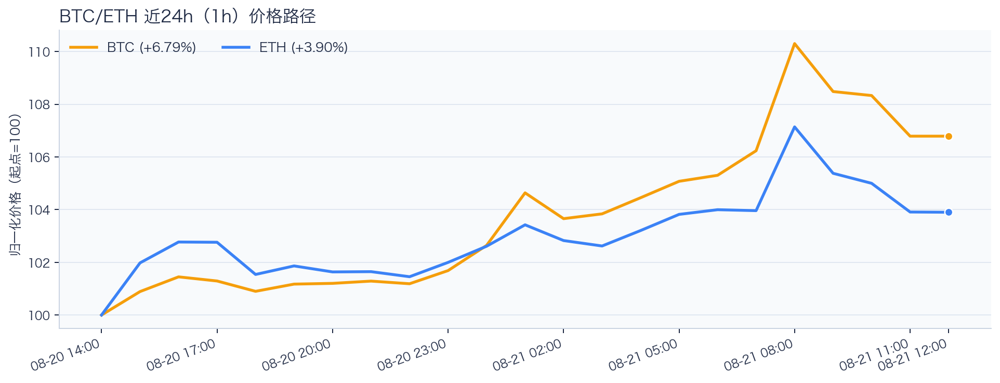
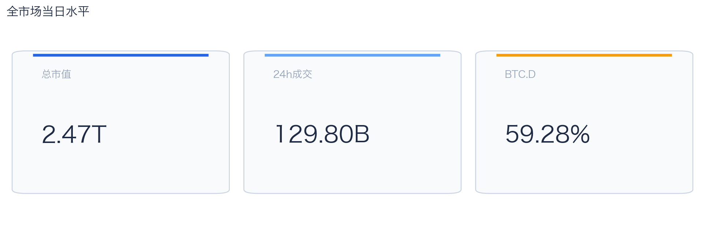
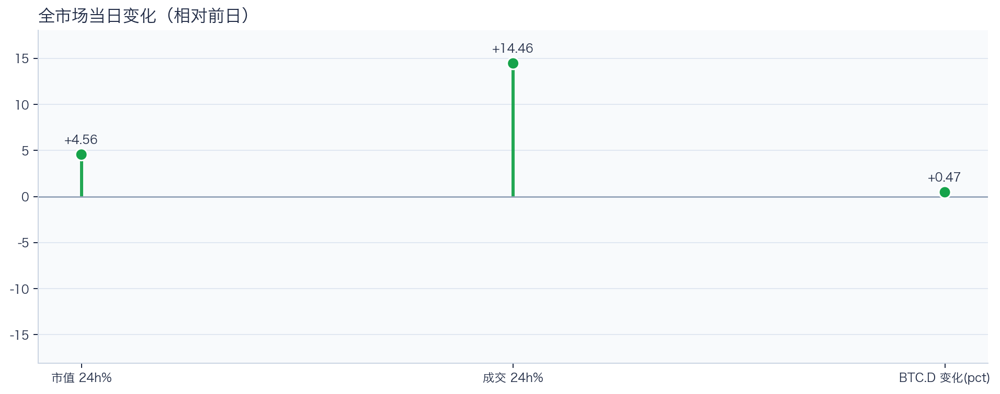
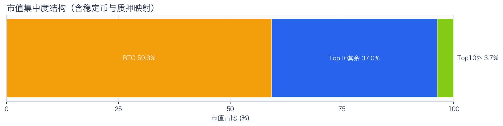
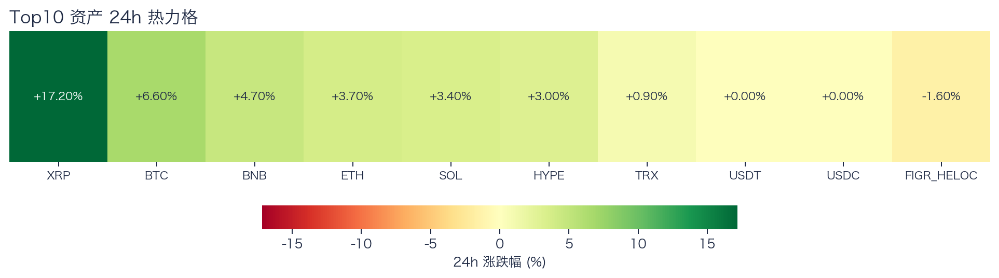
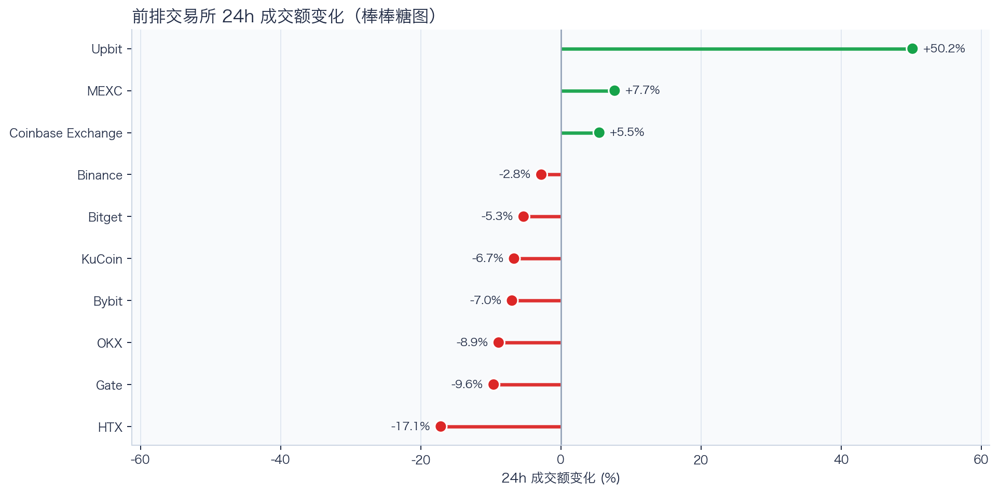
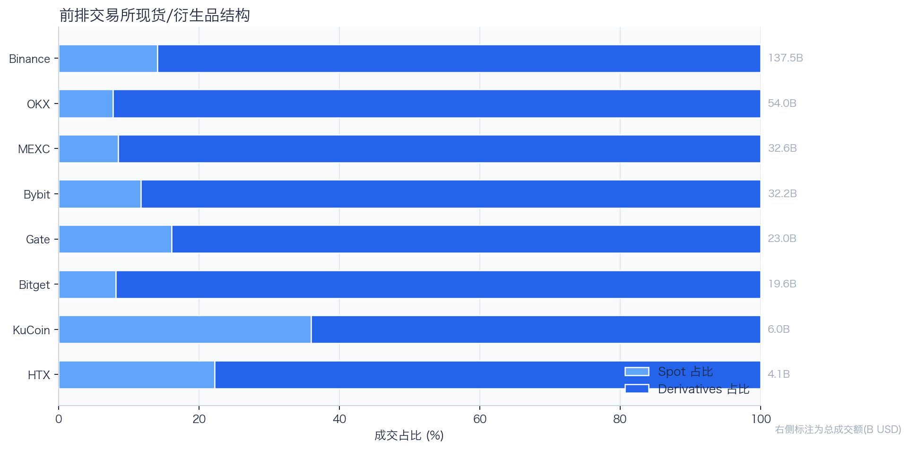
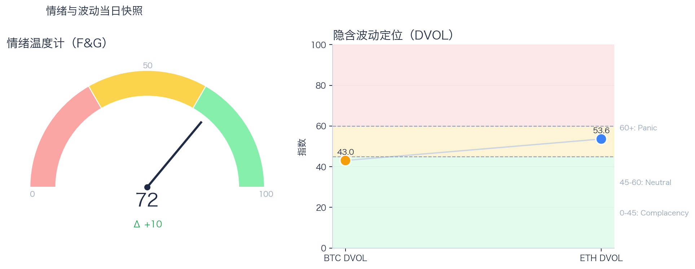

# 二级市场日报（2026-08-21）

## 快速结论
- 全市场指标当日：市值 $2.47T（24h +4.56%），成交额 $129.80B（24h +14.46%）。
- BTC 主导率 59.28%（+0.47 个百分点），Top10 外市值占比（集中度口径）3.72%。
- 头部风险资产（排除稳定币、质押及信用映射）上涨 7 / 下跌 0 / 平盘 0，平均涨跌幅 +5.64%，首尾分化 16.30 个百分点。
- 前排交易所样本成交普遍收缩：上涨 3 家、下跌 7 家，24h 变化均值 +0.60%。
- Tokenized Stocks 类别规模 $2.46B，7D +1.87%（最近一次可得类别快照）。

## 市场主线
今日市场状态为“交易性修复”：价格与成交共振上行，但样本仅覆盖头部风险资产，尚不足以判断长尾市场是否扩散或新一轮趋势是否启动。

交易所成交方面，多数平台成交走弱，样本只支持成交收缩及降幅分化，不支持资金回流判断；杠杆方面，多头付费抬升，杠杆侧开始拥挤，需警惕回撤时的资金费率反转；期权定价方面，隐含波动率处于相对低位，但单凭 DVOL 不足以判断期权保护成本是否便宜；情绪方面，情绪回到偏乐观区，若成交不跟随，需防止短线追高回撤。几项指标共同用于确认市场状态，但暂不足以归因于特定事件。

## BTC/ETH 24h 趋势

口径：文字涨跌来自交易所 rolling 24h ticker；图内路径为当前可得 23 个小时点，首尾变化 BTC +6.79%、ETH +3.90%，两者窗口不可混用。
- BTC（交易所 rolling 24h）：$76,718.00（+6.62%，区间 $71,132.00 - $79,500.00，当前位于区间 67%）=> 偏强，上行主导。
- ETH（交易所 rolling 24h）：$2,371.45（+3.14%，区间 $2,255.68 - $2,447.98，当前位于区间 60%）=> 偏强，上行主导。
- 简评：BTC 与 ETH 同步偏强，短线仍有上行动能。

## 市场结构与交易状态
### 市场脉冲

当日，全市场市值 $2.47T，24h 成交额 $129.80B，BTC 主导率 59.28%。
价格与成交同步上行，属于健康修复结构；若次日成交不掉队，修复延续概率更高。

相对前一观测日，市值 +4.56%、成交 +14.46%、BTC.D +0.47 个百分点。
市值与成交是同步观测；缺少事件时点和资金路径证据时，暂不作特定事件归因。

### 市场广度与集中度

当前市值结构为 BTC 59.28% / Top10 其余 37.00% / Top10 外 3.72%。该图含稳定币与质押映射，只描述集中度，不证明风险偏好扩散。
方向样本为 7 个头部风险资产，已排除 USDT, USDC, FIGR_HELOC；Top10 外占比仅是市值集中度，不作为风险扩散代理。

### 资产与交易结构

按头部资产统一快照口径，领涨的是 XRP（+17.20%），尾部的是 TRX（+0.90%），均值 +5.64%，首尾相差 16.30 个百分点。
上涨家数在 7 个头部风险资产样本中明显占优，但这一方向样本与包含稳定币、质押映射的集中度口径不可直接比较；可继续观察相对强弱，但不据此判断全市场广度已改善。

前排样本上涨 3 家、下跌 7 家，均值 +0.60%。Upbit 最强（+50.19%），HTX 最弱（-17.13%）。
最强与最弱平台的 24h 变化差达到 67.32 个百分点，说明平台间成交变化分化，但不能据此推断资金因果流向。报价连续性和滑点是否同步变化仍需盘口数据验证，执行层面应继续监控成交质量。

样本内衍生品成交占比 85.87%。该比例描述成交结构，不单独用于判断后续波动方向或幅度。
衍生品占比处于高位；该比例本身不说明波动方向。后续需用盘口深度、强平和事件窗口数据验证具体传导机制。

### 杠杆与风险定价
Deribit 样本的资金费率（Funding）接近中性，BTC/ETH 8h 费率分别为 +1.32bps / +1.60bps；隐含波动率指数（DVOL）位于 Complacency（低波动定价） / Neutral（中性波动定价）。
| 资产 | OKX 多头清算样本 | OKX 空头清算样本 | 近月年化基差 | 远月年化基差 | ATM IV | 25Δ 偏度 |
|---|---:|---:|---:|---:|---:|---:|
| BTC | $18.27M | $2.64M | +6.38% | +5.16% | 42.37% | -2.29 个百分点 |
| ETH | $17.96M | $3.29M | +8.33% | +2.20% | 53.15% | -6.48 个百分点 |
清算口径：仅为 OKX 公共接口返回的近期样本，不代表 OKX 或全市场清算总量；25Δ 偏度定义为 Put IV 减 Call IV。
资金费率略为正，且近期 OKX 清算样本中多头清算额高于空头；但 DVOL 处于低波动定价 / 中性区间，组合信号只提示回撤时可能存在杠杆反身性，不足以单独确认拥挤。因此更合适的做法不是激进追单边，而是围绕波动管理仓位和节奏。

恐惧与贪婪指数（F&G）当日 72（较前一观测日 +10）；BTC/ETH DVOL 为 43.03/53.60，对应 Complacency（低波动定价） / Neutral（中性波动定价）。
情绪进入偏乐观区，需关注是否出现过热信号与波动回摆。只有当情绪、广度和成交三者同时改善，市场才更可能从“反弹交易”切换到“趋势交易”。

### 关键价位与失效条件
| 资产 | 24h 支撑 | 24h 阻力 | ATR14(1h) | 向上触发 | 多头失效 | 向下触发 | 空头失效 |
|---|---:|---:|---:|---:|---:|---:|---:|
| BTC | 71386.43 | 79472.42 | 1111.69 | 79750.34 | 79194.50 | 71108.51 | 71664.35 |
| ETH | 2271.48 | 2447.98 | 32.33 | 2456.06 | 2439.90 | 2263.40 | 2279.56 |
计算口径：以当前可得 23 个 1h 小时点的高低点作为支撑/阻力，触发缓冲取现价 0.1% 与 0.25×ATR14 的较大值；触发价用于观察确认，不是自动交易指令。

## 今日差异化重点
### 稳定币收益与资金成本
- 收益端：本期可得协议样本中，Compound-USDC 的 Total APY 为 6.46%，需继续区分原生利率与奖励补贴。
- 资金需求：本期可得样本最高利用率 91.91%；高利用率意味着借款需求较强，也可能压缩退出流动性。
- 跨平台成本：本期可得报价中，USDC 借币年化样本差约 2.29 个百分点，适合继续核对额度、期限和地区准入，不直接视为套利利差。

### RWA 与 24×7 映射交易
- 映射异动：MARA 24h +14.31%，属于今日 RWA 观察池中幅度较大的标的；底层市场非连续交易时不作溢折价结论。
- 类别结构：最近一次可得类别快照显示，Tokenized Stocks 规模约 $2.46B，7D +1.87%；该变化用于判断产品线活跃度，不直接外推大盘方向。
- 链上验证：公开聪明钱信号页在已覆盖标的中未命中活跃记录；这不等于不存在相关持仓或交易，异动仍需结合底层价格、成交与事件证据确认。

## 未来24小时观察
1. 若头部风险资产上涨覆盖率连续改善且 BTC.D 回落，再结合更广币种样本验证风险偏好是否扩散。
2. 若衍生品占比继续上升而资金费率（Funding）仍接近中性，只能说明成交结构更偏向衍生品；是否意味着杠杆拥挤或放大波动，仍需结合未平仓合约、DVOL 与成交验证。
3. 若 F&G 回升而 DVOL 不降，代表情绪改善尚未获得风险定价确认，应降低对追涨信号的置信度。

## 交易与风控含义
- 仓位管理优先级高于方向押注，建议保持核心仓位稳定、战术仓位滚动。
- 若衍生品占比上升并伴随 Funding 快速偏离中性或 DVOL 抬升，再考虑降低杠杆并收紧风险参数。
- 关注情绪改善与广度扩散是否同步发生，二者背离时避免追逐单边。
