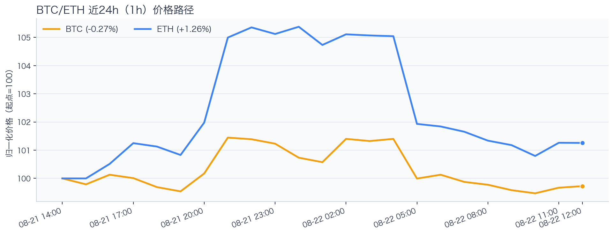
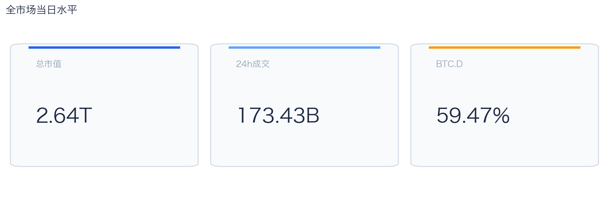
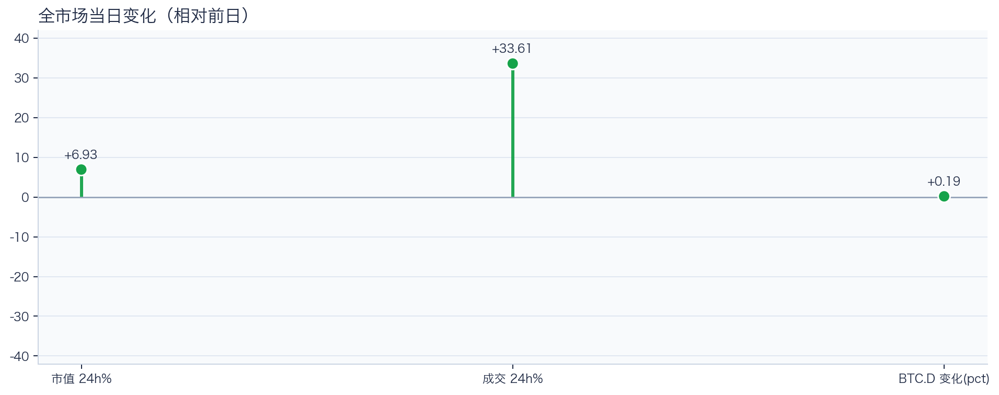
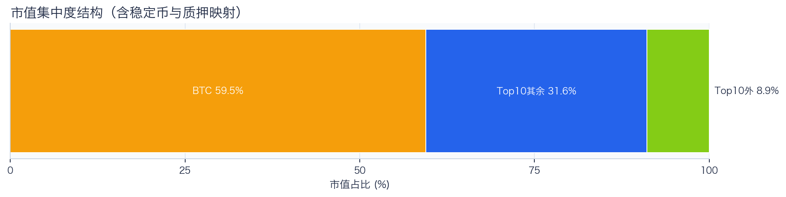
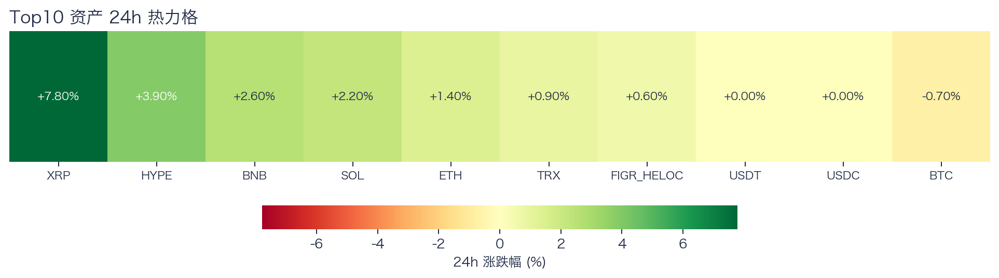
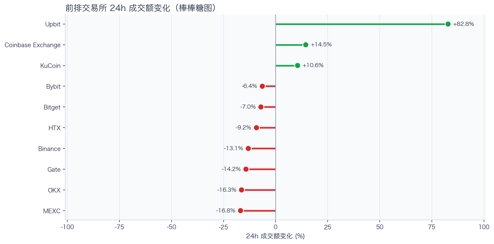
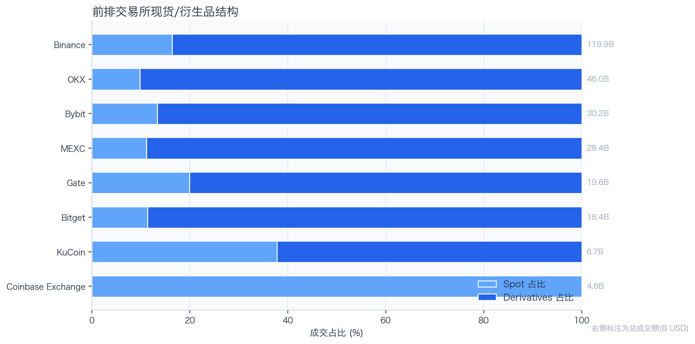
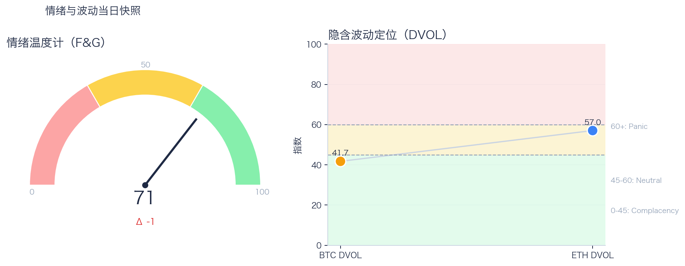

# 二级市场日报（2026-08-22）

## 快速结论
- 全市场指标当日：市值 $2.64T（24h +6.93%），成交额 $173.43B（24h +33.61%）。
- BTC 主导率 59.47%（+0.19pct），Top10 外市值占比（集中度口径）8.88%。
- 头部风险资产（排除稳定币、质押及信用映射）上涨 6 / 下跌 1 / 平盘 0，平均涨跌幅 +2.59%，首尾分化 8.50pct。
- 前排交易所样本多数成交收缩：上涨 3 家、下跌 7 家，24h 变化均值为 +2.47%；平台间变化分化明显。
- Tokenized Stocks 类别规模 $2.52B，7D +5.26%。

## 市场主线
今日市场状态为“交易性修复”。价格与成交共振上行，但现有头部风险资产样本不足以外推长尾扩散，当前证据也不足以确认新一轮趋势启动。

交易所成交方面，多数平台成交走弱，样本只支持成交收缩及降幅分化，不支持资金回流判断；杠杆方面，资金费率仍为正，清算样本中多头金额高于空头，回撤时需警惕杠杆反身性；期权定价方面，隐含波动率处于相对低位，但单凭 DVOL 不足以判断期权保护成本是否便宜；情绪方面，F&G 仍处偏乐观区，若成交不跟随，需防止短线追高回撤。几项指标共同用于确认市场状态，但暂不足以归因于特定事件。

## BTC/ETH 24h 趋势

口径：文字涨跌来自交易所 rolling 24h ticker；图内路径为当前可得 23 个小时点，首尾变化 BTC -0.27%、ETH +1.26%，两者窗口不可混用。
- BTC（交易所 rolling 24h）：$77,172.59（+0.66%，区间 $76,243.04 - $78,828.15，当前位于区间 36%）=> 区间震荡。
- ETH（交易所 rolling 24h）：$2,423.81（+2.30%，区间 $2,367.42 - $2,546.78，当前位于区间 31%）=> 偏强震荡。
- 简评：BTC 与 ETH 均温和上涨，ETH 相对更强，但幅度尚未达到强趋势阈值。

## 市场结构与交易状态
### 市场脉冲

当日，全市场市值 $2.64T，24h 成交额 $173.43B，BTC 主导率 59.47%。
价格与成交同步上行，属于健康修复结构；若次日成交不掉队，修复延续概率更高。

相对前一观测日，市值 +6.93%、成交 +33.61%、BTC.D +0.19pct。
市值与成交是同步观测；缺少事件时点和资金路径证据时，暂不作特定事件归因。

### 市场广度与集中度

当前市值结构为 BTC 59.47% / Top10 其余 31.65% / Top10 外 8.88%。该图含稳定币与质押映射，只描述集中度，不证明风险偏好扩散。
方向样本为 7 个头部风险资产，已排除 USDT, USDC, FIGR_HELOC；Top10 外占比仅是市值集中度，不作为风险扩散代理。

### 资产与交易结构

按头部资产统一快照口径，领涨的是 XRP（+7.80%），跌幅最大的是 BTC（-0.70%），均值 +2.59%，首尾相差 8.50pct。
涨跌家数接近均衡，市场处于结构轮动阶段，方向一致性较弱。对交易而言，继续比较相对强弱，但不把有限的单日收益差夸大为显著结构行情。

前排样本上涨 3 家、下跌 7 家，24h 变化均值为 +2.47%；Upbit 最强（+82.80%），MEXC 最弱（-16.83%）。
最强与最弱平台的 24h 变化差达到 99.63pct，说明平台间成交变化分化，但不能据此推断资金因果流向。报价连续性和滑点是否同步变化仍需盘口数据验证，执行层面应继续监控成交质量。

样本内衍生品成交占比 82.54%。该比例描述成交结构，不单独用于判断后续波动方向或幅度。
衍生品仍是主导成交形态，但该占比不能单独证明价格由杠杆情绪驱动。后续需用盘口深度、强平和事件窗口数据验证具体传导机制。

### 杠杆与风险定价
Deribit 样本的资金费率（Funding）接近中性，BTC/ETH 8h 费率分别为 +1.93bps / +0.90bps；隐含波动率指数（DVOL）位于 Complacency（低波动定价） / Neutral（中性波动定价）。
| 资产 | OKX 多头清算样本 | OKX 空头清算样本 | 近月年化基差 | 远月年化基差 | ATM IV | 25Δ 偏度 |
|---|---:|---:|---:|---:|---:|---:|
| BTC | $15.22M | $2.07M | +9.15% | +4.98% | 41.15% | -2.41 pp |
| ETH | $13.49M | $4.57M | +8.99% | +2.69% | 56.25% | -4.41 pp |
清算口径：仅为 OKX 公共接口返回的近期样本，不代表 OKX 或全市场清算总量；25Δ 偏度定义为 Put IV 减 Call IV。
资金费率为正，清算样本中多头金额高于空头，回撤时需警惕杠杆反身性。因此更合适的做法不是激进追单边，而是围绕波动管理仓位和节奏。

恐惧与贪婪指数（F&G）当日 71（较前一观测日 -1）；BTC/ETH DVOL 为 41.72/57.04，对应 Complacency（低波动定价） / Neutral（中性波动定价）。
F&G 位于偏乐观区，需关注是否出现过热信号与波动回摆。只有当情绪、广度和成交三者同时改善，市场才更可能从“反弹交易”切换到“趋势交易”。

### 关键价位与失效条件
| 资产 | 24h 支撑 | 24h 阻力 | ATR14(1h) | 向上触发 | 多头失效 | 向下触发 | 空头失效 |
|---|---:|---:|---:|---:|---:|---:|---:|
| BTC | 76500.00 | 78828.15 | 646.11 | 78989.68 | 78666.62 | 76338.47 | 76661.53 |
| ETH | 2369.41 | 2546.78 | 32.11 | 2554.81 | 2538.75 | 2361.38 | 2377.44 |
计算口径：以当前可得 23 个 1h 小时点的高低点作为支撑/阻力，触发缓冲取现价 0.1% 与 0.25×ATR14 的较大值；触发价用于观察确认，不是自动交易指令。

## 今日差异化重点
### 事件驱动与市场响应
- 事件主线：RWA 相关新闻在 6 条样本中出现，涉及 BTC、ETH。当前仅作为事件背景和验证线索，不单独解释价格或资金流。代表标题：韩国 KRX 拟 11 月启动新型证券市场，代币化证券待 2027 年法规落地；莱比特矿池江卓尔：ETH 本轮表现将超越 BTC，已于 2525 美元尝试摸顶
- 市场响应：ETH 在事件后 4 小时收益 -3.25%，相对基准异常收益 -2.03%；多信号关系为 inconclusive，归因等级 L2，不等同于因果证明。
- 归因纪律：事件窗口、异常收益和资金信号只用于验证相关性；不把同步波动写成已证明因果。

### 稳定币收益与资金成本
- 收益端：本期可得协议样本中，Aave-USDC 的 Total APY 为 4.83%，需继续区分原生利率与奖励补贴。
- 资金需求：本期可得样本最高利用率 91.73%；高利用率意味着借款需求较强，也可能压缩退出流动性。
- 跨平台成本：本期可得报价中，USDC 借币年化样本差约 2.31pct，适合继续核对额度、期限和地区准入，不直接视为套利利差。

### RWA 与 24×7 映射交易
- 映射异动：HOOD 24h +13.63%，属于今日 RWA 观察池中幅度较大的标的；底层市场非连续交易时不作溢折价结论。
- 类别结构：最近一次可得类别快照显示，Tokenized Stocks 规模约 $2.52B，7D +5.26%；该变化用于判断产品线活跃度，不直接外推大盘方向。
- 链上验证：公开聪明钱信号页在已覆盖标的中未命中活跃记录；这不等于不存在相关持仓或交易，异动仍需结合底层价格、成交与事件证据确认。

## 未来24小时观察
1. 若头部风险资产上涨覆盖率连续改善且 BTC.D 回落，再结合更广币种样本验证风险偏好是否扩散。
2. 若衍生品占比继续上升而 funding 仍中性，只能确认交易向杠杆侧集中；是否放大波动仍需结合 DVOL 与成交验证。
3. 若 F&G 回升而 DVOL 不降，代表情绪改善尚未获得风险定价确认，应降低对追涨信号的置信度。

## 交易与风控含义
- 仓位管理优先级高于方向押注，建议保持核心仓位稳定、战术仓位滚动。
- 若衍生品占比上升并伴随 Funding 快速偏离中性或 DVOL 抬升，再考虑降低杠杆并收紧风险参数。
- 关注情绪改善与广度扩散是否同步发生，二者背离时避免追逐单边。
