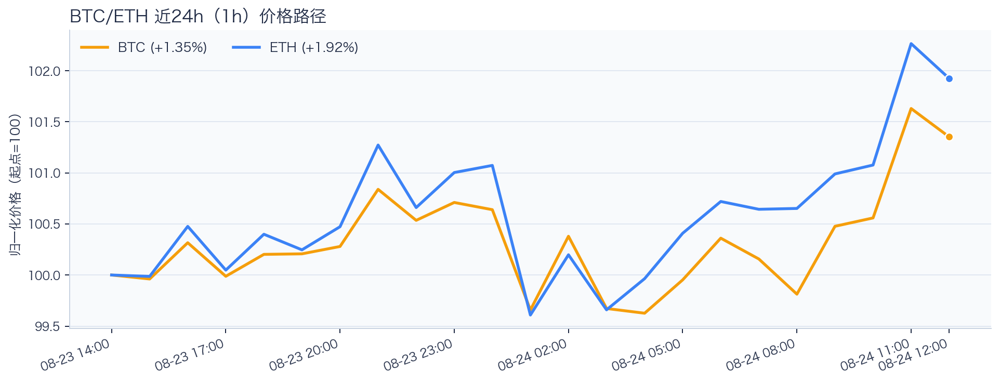
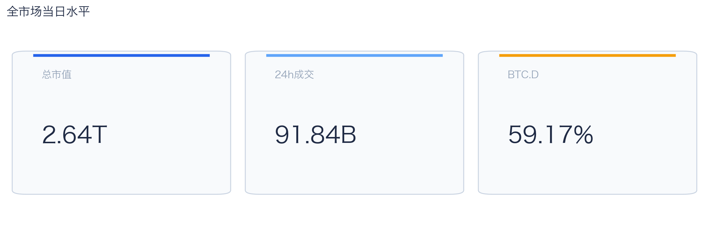
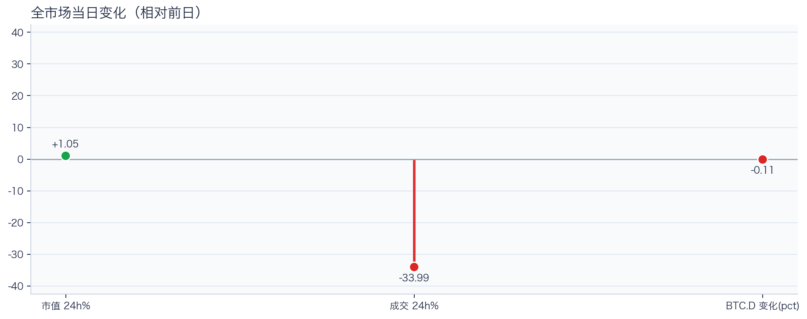
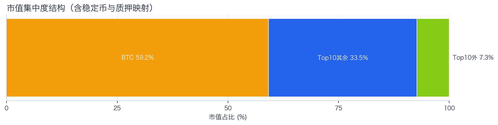
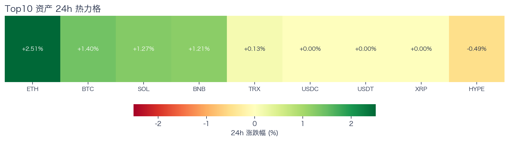
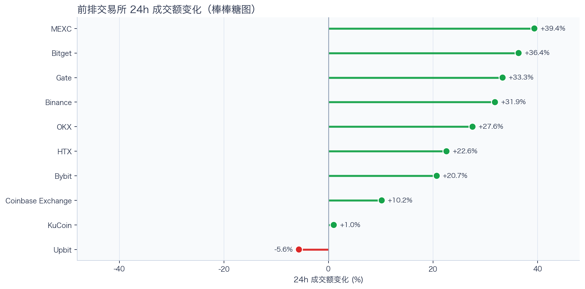
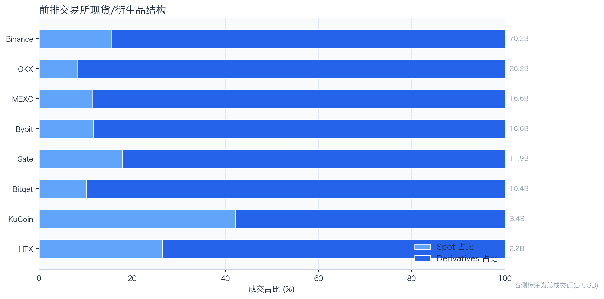
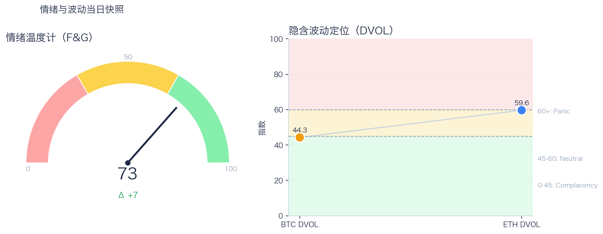

# 二级市场日报（2026-08-24）

## 快速结论
- 全市场指标当日：市值 $2.64T（24h +1.05%），成交额 $91.84B（24h -33.99%）。
- BTC 主导率 59.17%（-0.11个百分点），Top10 外市值占比（集中度口径）7.31%。
- 头部风险资产（排除稳定币、质押及信用映射）上涨 6 / 下跌 1 / 平盘 0，平均涨跌幅 +0.86%，首尾分化 3.01个百分点。
- 前排交易所样本成交普遍回升：上涨 9 家、下跌 1 家，24h 变化均值 +21.74%。
- RWA.xyz 最近一次公开类别快照显示，Tokenized Stocks 规模约 $2.48B，7D +5.18%；该数据用于观察类别活跃度，不直接外推当日大盘方向。

## 市场主线
今日市场状态为“缩量修复”。市值上升但成交下降，价格修复尚未得到交易活跃度确认。头部风险资产上涨覆盖率较高，但该样本不能外推为长尾扩散。当前证据尚不足以确认新一轮趋势启动。

交易所成交方面，多数平台样本回升，但盘口深度、报价连续性和滑点尚未验证，因此不能直接等同于流动性改善。杠杆方面，资金费率未显示极端拥挤，但单一平台样本不足以概括整体杠杆状态。期权定价方面，BTC/ETH 的 DVOL 分别处于 Complacency（低波动定价）和 Neutral（中性波动定价），单凭 DVOL 不足以判断期权保护成本是否便宜。情绪方面，情绪回到偏乐观区，若成交不跟随，需防止短线追高回撤。上述指标用于交叉判断市场状态，暂不足以归因于特定事件。

## BTC/ETH 24h 趋势

口径：文字涨跌来自交易所 rolling 24h ticker；图内路径为当前可得 23 个小时点，首尾变化 BTC +1.35%、ETH +1.92%，两者窗口不可混用。
- BTC（交易所 rolling 24h）：$78,222.00（+1.27%，区间 $76,670.01 - $78,600.00，当前位于区间 80%）=> 偏强震荡。
- ETH（交易所 rolling 24h）：$2,485.49（+2.27%，区间 $2,389.85 - $2,509.00，当前位于区间 80%）=> 偏强，上行主导。
- 简评：BTC 与 ETH 同步偏强，短线仍有上行动能。

## 市场结构与交易状态
### 市场脉冲

当日，全市场市值 $2.64T，24h 成交额 $91.84B，BTC 主导率 59.17%。
价格上涨但成交回落，反弹质量偏弱，需警惕高位回吐。

相对前一观测日，市值 +1.05%、成交 -33.99%、BTC.D -0.11个百分点。
市值与成交是同步观测；缺少事件时点和资金路径证据时，暂不作特定事件归因。

### 市场广度与集中度

当前市值结构为 BTC 59.17% / Top10 其余 33.52% / Top10 外 7.31%。该图含稳定币与质押映射，只描述集中度，不证明风险偏好扩散。
方向样本为 7 个头部风险资产，已排除 USDT, USDC, FIGR_HELOC；Top10 外占比仅是市值集中度，不作为风险扩散代理。

### 资产与交易结构

按排除稳定币、质押及信用映射后的7个头部风险资产样本，领涨的是 ETH（+2.51%），跌幅最大的是 HYPE（-0.49%），上涨6个、下跌1个，平均涨跌幅 +0.86%，首尾相差3.01个百分点。上涨覆盖率较高，但样本较窄，不能据此确认更广市场的方向一致性；交易上继续比较相对强弱，不把有限的单日收益差夸大为显著结构行情。

前排样本上涨 9 家、下跌 1 家，均值 +21.74%。MEXC 最强（+39.39%），Upbit 最弱（-5.64%）。
最强与最弱平台的 24h 变化差达到 45.03个百分点，说明平台间成交变化分化，但不能据此推断资金因果流向。报价连续性和滑点是否同步变化仍需盘口数据验证，执行层面应继续监控成交质量。

样本内衍生品成交占比 84.14%。该比例描述成交结构，不单独用于判断后续波动方向或幅度。
衍生品仍是主导成交形态，但该占比不能单独证明价格由杠杆情绪驱动。后续需用盘口深度、强平和事件窗口数据验证具体传导机制。

### 杠杆与风险定价
Deribit 样本的资金费率（Funding）接近中性，BTC/ETH 8h 费率分别为 +0.77bps / +0.30bps；隐含波动率指数（DVOL）位于 Complacency（低波动定价） / Neutral（中性波动定价）。
| 资产 | OKX 多头清算样本 | OKX 空头清算样本 | 近月年化基差（basis） | 远月年化基差（basis） | 平值隐含波动率（ATM IV） | 25Δ 偏度（Put IV−Call IV） |
|---|---:|---:|---:|---:|---:|---:|
| BTC | $2.43M | $6.95M | +9.78% | +5.34% | 44.26% | -4.49个百分点 |
| ETH | $2.57M | $9.68M | +7.00% | +2.86% | 61.51% | -7.63个百分点 |
清算口径：仅为 OKX 公共接口返回的近期样本，不代表 OKX 或全市场清算总量；25Δ 偏度定义为 Put IV 减 Call IV。
Funding 未显示极端方向拥挤；BTC/ETH DVOL 分别处于 Complacency（低波动定价）和 Neutral（中性波动定价），只能描述当前波动率定价，不能据此判断方向拥挤或尾部风险是否重新抬升。因此更合适的做法不是激进追单边，而是围绕波动管理仓位和节奏。

恐惧与贪婪指数（F&G）当日 73（较前一观测日 +7）；BTC/ETH DVOL 为 44.27/59.65，对应 Complacency（低波动定价） / Neutral（中性波动定价）。
情绪进入偏乐观区，需关注是否出现过热信号与波动回摆。只有当情绪、广度和成交三者同时改善，市场才更可能从“反弹交易”切换到“趋势交易”。

### 关键价位与失效条件
| 资产 | 24h 支撑 | 24h 阻力 | ATR14(1h) | 向上触发 | 多头失效 | 向下触发 | 空头失效 |
|---|---:|---:|---:|---:|---:|---:|---:|
| BTC | 76670.01 | 78600.00 | 581.21 | 78745.30 | 78454.70 | 76524.71 | 76815.31 |
| ETH | 2389.85 | 2509.00 | 25.09 | 2515.27 | 2502.73 | 2383.58 | 2396.12 |
计算口径：以当前可得 23 个 1h 小时点的高低点作为支撑/阻力，触发缓冲取现价 0.1% 与 0.25×ATR14 的较大值；触发价用于观察确认，不是自动交易指令。

## 今日差异化重点
### 稳定币收益与资金成本
- 收益端：本期可得协议样本中，Compound-USDC 的 Total APY 为 6.19%，需继续区分原生利率与奖励补贴。
- 资金需求：本期可得样本最高利用率 92.06%；高利用率意味着借款需求较强，也可能压缩退出流动性。
- 跨平台成本：本期可得报价中，USDC 借币年化样本差约 3.09个百分点，适合继续核对额度、期限和地区准入，不直接视为套利利差。

### 跨交易所 Funding 与 Carry
- Funding：样本高位为 Binance-BTC，年化约 10.95%。
- 可执行性：Funding 与基差（basis）均有记录的样本可进入 carry 复核，但仍需检查手续费、滑点、保证金和持续性。

## 未来24小时观察
1. 若头部风险资产上涨覆盖率连续改善且 BTC.D 回落，再结合更广币种样本验证风险偏好是否扩散。
2. 若衍生品占比继续上升而 Funding 仍中性，只能确认成交结构向衍生品侧集中；是否意味着杠杆使用增加或波动放大，仍需结合持仓、Funding、DVOL、强平和成交数据验证。
3. 若 F&G 回升而 DVOL 不降，代表情绪改善尚未获得风险定价确认，应降低对追涨信号的置信度。

## 交易与风控含义
- 仓位管理优先级高于方向押注，建议保持核心仓位稳定、战术仓位滚动。
- 若衍生品占比上升并伴随 Funding 快速偏离中性或 DVOL 抬升，再考虑降低杠杆并收紧风险参数。
- 关注情绪改善与广度扩散是否同步发生，二者背离时避免追逐单边。
