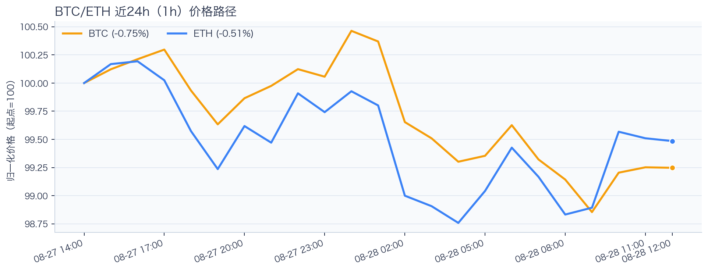
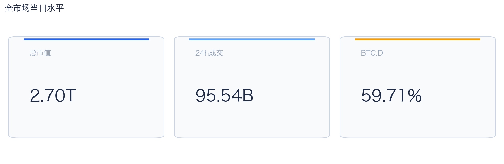
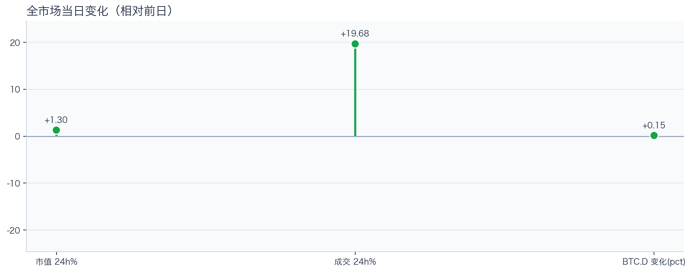
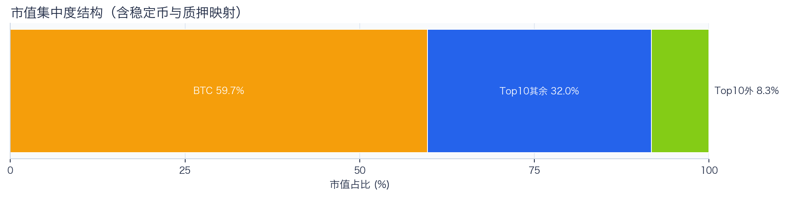
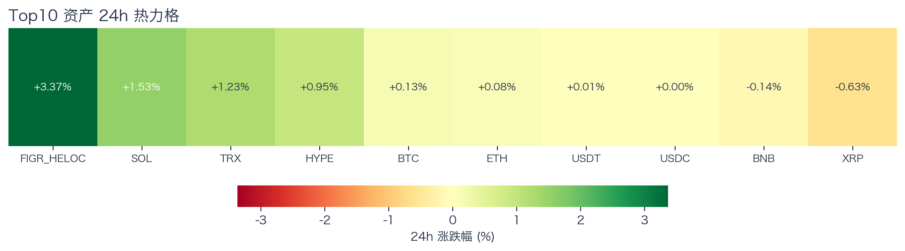
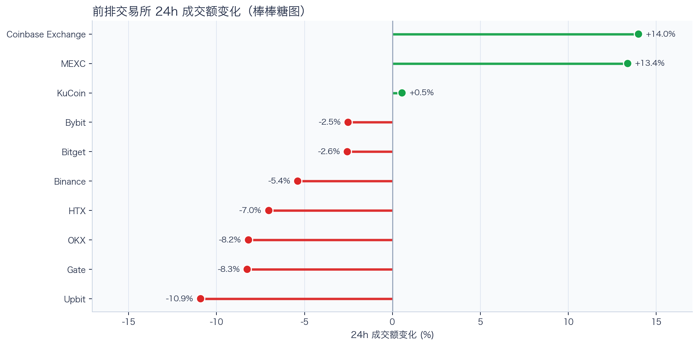
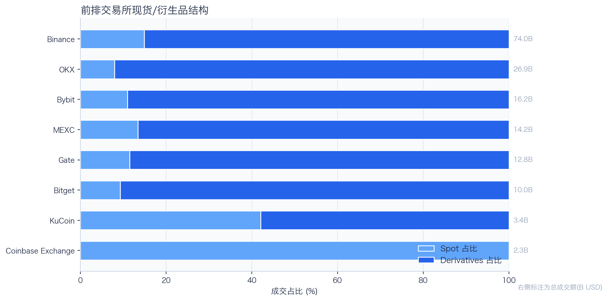
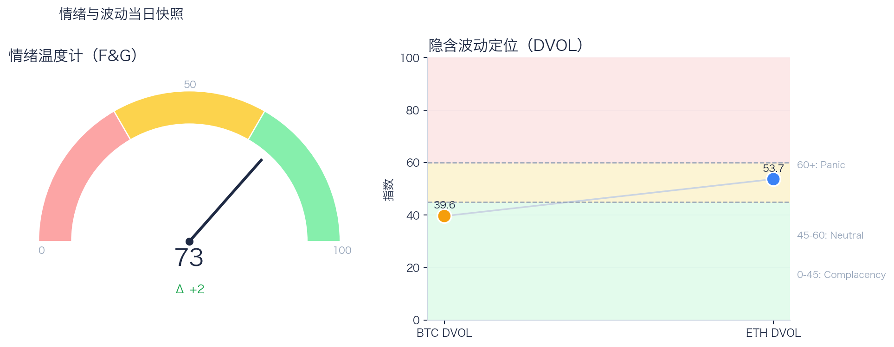

# 二级市场日报（2026-08-28）

## 快速结论
- 全市场指标当日：市值 $2.70T（24h +1.30%），成交额 $95.54B（24h +19.68%）。
- BTC 主导率 59.71%（+0.15pct），Top10 外市值占比（集中度口径）8.26%。
- 头部风险资产（排除稳定币、质押及信用映射）上涨 5 / 下跌 2 / 平盘 0，平均涨跌幅 +0.45%，首尾分化 2.16pct。
- 前排交易所样本成交普遍收缩：上涨 3 家、下跌 7 家，24h 变化均值 -1.69%。
- Tokenized Stocks 类别规模 $2.59B，7D +6.05%。

## 市场主线
今日市场状态为“交易性修复”。今日价格与成交同步回升，但样本仅覆盖头部风险资产，尚不足以判断长尾市场是否扩散；当前证据也不足以确认新一轮趋势启动。

交易所成交方面，多数平台成交走弱，样本只支持成交收缩及降幅分化，不支持资金回流判断；杠杆方面，资金费率为正但接近中性，缺少时序对比，暂不确认杠杆拥挤；期权定价方面，BTC/ETH DVOL 分别为 39.60/53.68，状态为 Complacency（低波动定价）/Neutral（中性波动定价），单一快照不足以判断相对历史高低或期权保护成本；情绪方面，情绪回到偏乐观区，若成交不跟随，需防止短线追高回撤。上述指标用于辅助判断市场状态，但暂不足以归因于特定事件。

## BTC/ETH 24h 趋势

口径：文字涨跌来自交易所滚动 24 小时行情（rolling 24h ticker）；图内路径为当前可得 23 个小时点，首尾变化 BTC -0.75%、ETH -0.51%，两者窗口不可混用。
- BTC（交易所滚动 24 小时行情）：$79,600.62（+0.13%，区间 $78,920.00 - $81,478.87，当前位于区间 27%）=> 区间震荡。
- ETH（交易所滚动 24 小时行情）：$2,504.48（+0.07%，区间 $2,477.49 - $2,535.05，当前位于区间 47%）=> 区间震荡。
- 简评：BTC 与 ETH 均温和上涨，BTC 相对更强，但幅度尚未达到强趋势阈值。

## 市场结构与交易状态
### 市场脉冲

当日，全市场市值 $2.70T，24h 成交额 $95.54B，BTC 主导率 59.71%。
价格与成交同步上行，可描述为修复型上涨；若后续成交继续维持，修复延续的条件更充分，但仍不足以确认趋势启动。

相对前一观测日，市值 +1.30%、成交 +19.68%、BTC.D +0.15pct。
市值与成交是同步观测；缺少事件时点和资金路径证据时，暂不作特定事件归因。

### 市场广度与集中度

当前市值结构为 BTC 59.71% / Top10 其余 32.03% / Top10 外 8.26%。该图含稳定币与质押映射，只描述集中度，不证明风险偏好扩散。
方向样本为 7 个头部风险资产，已排除 USDT, USDC, FIGR_HELOC；Top10 外占比仅是市值集中度，不作为风险扩散代理。

### 资产与交易结构

按头部资产统一快照口径，领涨的是 SOL（+1.53%），跌幅最大的是 XRP（-0.63%），均值 +0.45%，首尾相差 2.16pct。
涨跌家数接近均衡，市场处于结构轮动阶段，方向一致性较弱。对交易而言，继续比较相对强弱，但不把有限的单日收益差夸大为显著结构行情。

前排样本上涨 3 家、下跌 7 家，均值 -1.69%。Coinbase Exchange 最强（+13.99%），Upbit 最弱（-10.91%）。
最强与最弱平台的 24h 变化差达到 24.90pct，说明平台间成交变化分化，但不能据此推断资金因果流向。报价连续性和滑点是否同步变化仍需盘口数据验证，执行层面应继续监控成交质量。

样本内衍生品成交占比 84.71%。该比例描述成交结构，不单独用于判断后续波动方向或幅度。
衍生品仍是主导成交形态，但该占比不能单独证明价格由杠杆情绪驱动。后续需用盘口深度、强平和事件窗口数据验证具体传导机制。

### 杠杆与风险定价
Deribit 样本的资金费率（Funding）接近中性，BTC/ETH 8h 费率分别为 +0.08bps / +1.78bps；隐含波动率指数（DVOL）位于 Complacency（低波动定价） / Neutral（中性波动定价）。
| 资产 | OKX 多头清算样本 | OKX 空头清算样本 | 近月年化基差 | 远月年化基差 | 平值隐含波动率（ATM IV） | 25Δ 偏度 |
|---|---:|---:|---:|---:|---:|---:|
| BTC | $5.76M | $5.45M | +6.34% | +4.44% | 38.50% | -1.57 pp |
| ETH | $6.69M | $2.87M | +3.66% | +4.06% | 50.63% | -3.19 pp |
清算口径：仅为 OKX 公共接口返回的近期样本，不代表 OKX 或全市场清算总量；25Δ 偏度定义为 Put IV 减 Call IV。
资金费率为正但缺少时序对比，当前不足以确认组合信号已拥挤；因此更适合围绕波动管理仓位和节奏。

恐惧与贪婪指数（F&G）当日 73（较前一观测日 +2）；BTC/ETH DVOL 为 39.60/53.68，对应 Complacency（低波动定价） / Neutral（中性波动定价）。
情绪进入偏乐观区，需关注是否出现过热信号与波动回摆。只有当情绪、广度和成交三者同时改善，市场才更可能从“反弹交易”切换到“趋势交易”。

### 关键价位与失效条件
| 资产 | 24h 支撑 | 24h 阻力 | ATR14(1h) | 向上触发 | 多头失效 | 向下触发 | 空头失效 |
|---|---:|---:|---:|---:|---:|---:|---:|
| BTC | 79001.01 | 81478.87 | 407.28 | 81580.69 | 81377.05 | 78899.19 | 79102.83 |
| ETH | 2477.49 | 2535.05 | 14.62 | 2538.70 | 2531.40 | 2473.84 | 2481.14 |
计算口径：以当前可得 23 个 1h 小时点的高低点作为支撑/阻力，触发缓冲取现价 0.1% 与 0.25×ATR14 的较大值；触发价用于观察确认，不是自动交易指令。

## 今日差异化重点
### 稳定币收益与资金成本
- 收益端：本期可得协议样本中，Compound-USDC 的总年化收益率（Total APY）为 6.26%，需继续区分原生利率与奖励补贴。
- 资金需求：本期可得样本最高利用率 91.60%；高利用率意味着借款需求较强，也可能压缩退出流动性。
- 跨平台成本：本期可得报价中，USDC 借币年化样本差约 2.69 个百分点，适合继续核对额度、期限和地区准入，不直接视为套利利差。

### RWA 与 24×7 映射交易
- 映射异动：AXTI 24h -8.45%，属于今日 RWA 观察池中幅度较大的标的。
- 类别结构：最近一次可得类别快照显示，Tokenized Stocks 规模约 $2.59B，7D +6.05%；该变化用于判断产品线活跃度，不直接外推大盘方向。
- 链上验证：公开聪明钱信号页在已覆盖标的中未命中活跃记录；这不等于不存在相关持仓或交易，异动仍需结合底层价格、成交与事件证据确认。

### 跨交易所资金费率（Funding）与基差（basis）
- 资金费率（Funding）：样本高位为 OKX-BTC，年化约 10.95%。
- 平台分化：样本低位为 Binance-ETH，年化约 8.51%。
- 可执行性：资金费率与基差均有记录的样本可进入 Carry 复核，但仍需检查手续费、滑点、保证金和持续性。

## 未来24小时观察
1. 若头部风险资产上涨覆盖率连续改善且 BTC.D 回落，再结合更广币种样本验证风险偏好是否扩散。
2. 若衍生品成交占比继续上升，只能确认成交结构更偏向衍生品；是否意味着杠杆集中或放大波动，仍需结合未平仓合约、资金费率、DVOL 与成交验证。
3. 若 F&G 回升而 DVOL 不降，代表情绪改善尚未获得风险定价确认，应降低对追涨信号的置信度。

## 交易与风控含义
- 仓位管理优先级高于方向押注，建议保持核心仓位稳定、战术仓位滚动。
- 若衍生品占比上升并伴随 Funding 快速偏离中性或 DVOL 抬升，再考虑降低杠杆并收紧风险参数。
- 关注情绪改善与广度扩散是否同步发生，二者背离时避免追逐单边。
