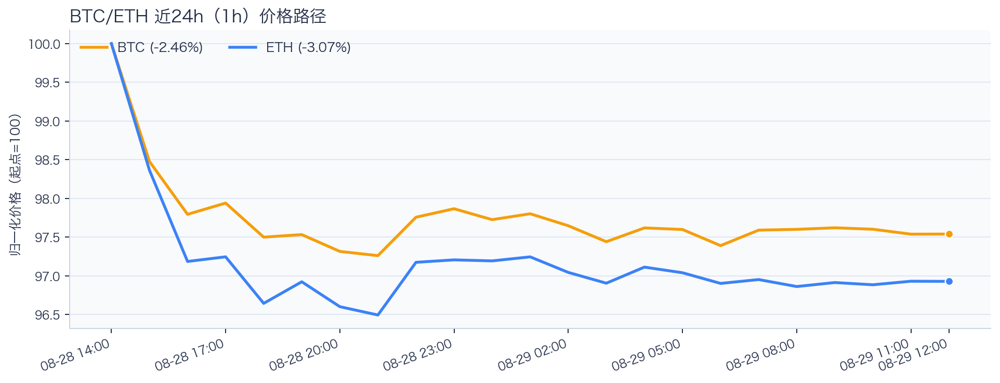
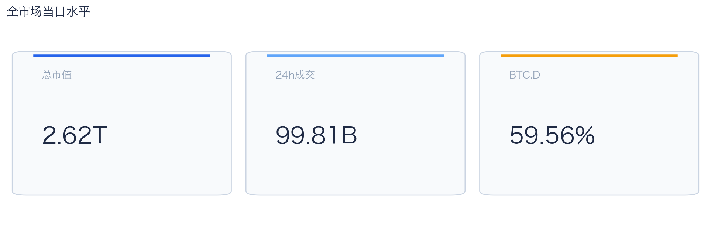
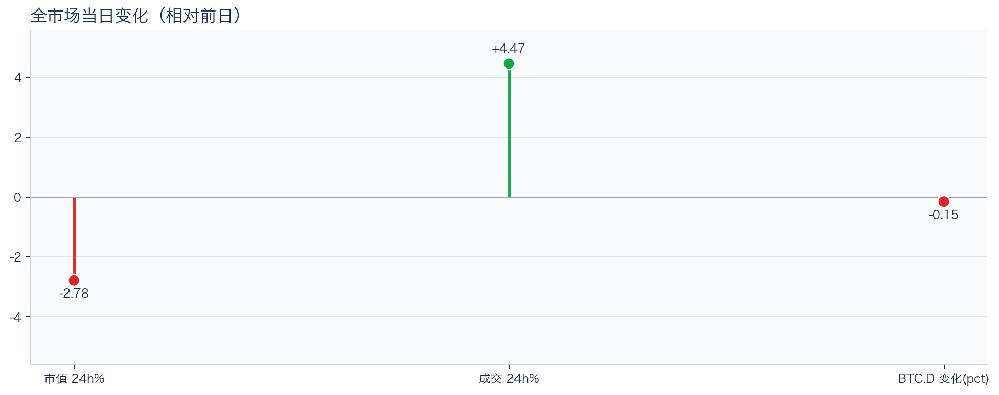
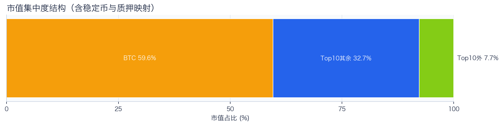
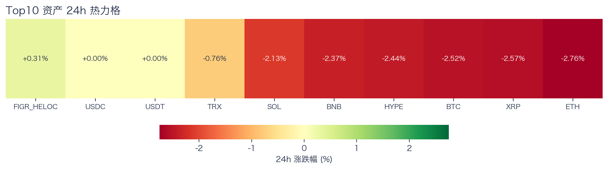
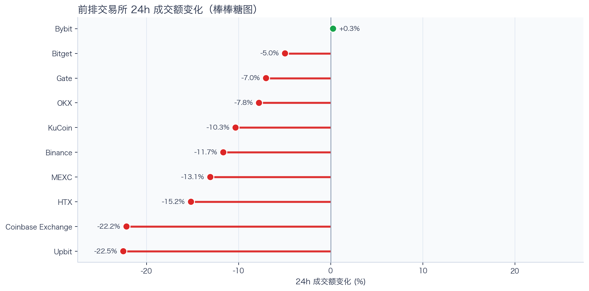
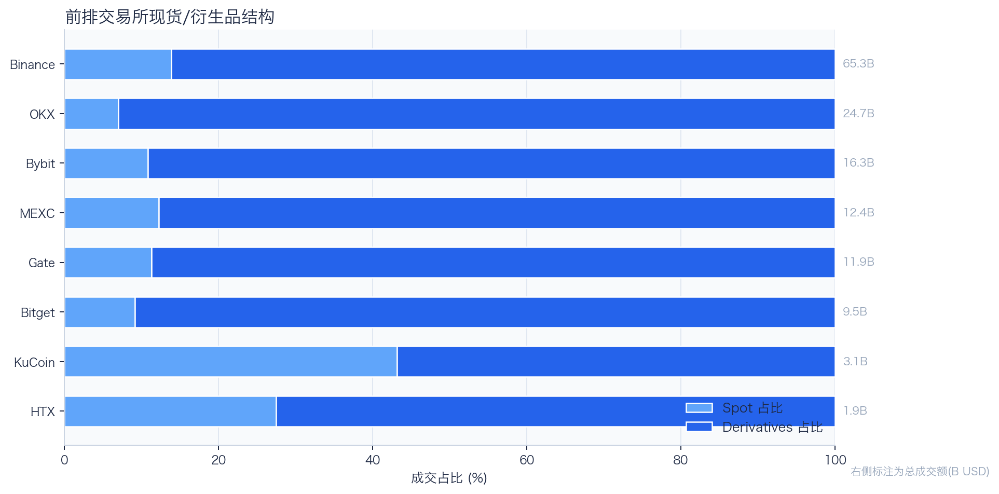
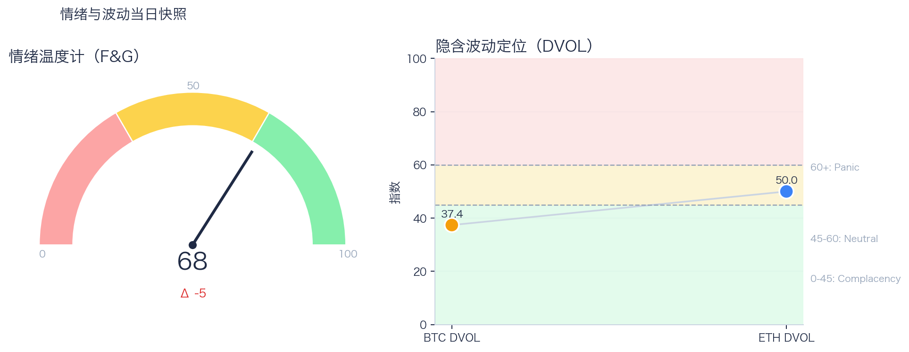

# 二级市场日报（2026-08-29）

## 快速结论
- 全市场指标当日：市值 $2.62T（24h -2.78%），成交额 $99.81B（24h +4.47%）。
- BTC 主导率 59.56%（-0.15pct），Top10 外市值占比（集中度口径）7.73%。
- 头部风险资产（排除稳定币、质押及信用映射）上涨 0 / 下跌 7 / 平盘 0，平均涨跌幅 -2.22%，首尾分化 2.00pct。
- 前排交易所样本成交普遍收缩：上涨 1 家、下跌 9 家，24h 变化均值 -11.44%。
- RWA 映射异动居前：MARA -10.69%、RIOT -9.49%、MSTR -5.70%；底层市场休市时仅作为链上价格变化观察，不作溢折价结论。

## 市场主线
今日市场状态偏向“压力重定价”。价格回撤但换手抬升，显示盘面分歧扩大，盘中波动风险值得关注；仅凭当前数据尚不足以确认风险重估或新一轮趋势启动。头部风险资产下跌覆盖率较高，风险参与度偏弱。

交易所成交方面，多数平台走弱，样本仅支持成交收缩及降幅分化，不支持资金回流判断。当前资金费率未显示极端拥挤，但单一平台样本不足以概括整体杠杆状态；隐含波动率处于相对低位，单凭 DVOL 也不足以判断期权保护成本是否便宜。情绪回到偏乐观区，若成交不跟随，需防止短线追高回撤。上述指标用于评估市场状态，但暂不足以归因于特定事件。

## BTC/ETH 24h 趋势

口径：文字涨跌来自交易所 rolling 24h ticker；图内路径为当前可得 23 个小时点，首尾变化 BTC -2.46%、ETH -3.07%，两者窗口不可混用。
- BTC（交易所 rolling 24h）：$77,585.78（-2.53%，区间 $76,888.00 - $79,838.73，当前位于区间 24%）=> 偏弱，下行主导。
- ETH（交易所 rolling 24h）：$2,435.81（-2.76%，区间 $2,405.97 - $2,526.64，当前位于区间 25%）=> 偏弱，下行主导。
- 简评：BTC 与 ETH 同步走弱，短线仍以防守为主。

## 市场结构与交易状态
### 市场脉冲

当日，全市场市值 $2.62T，24h 成交额 $99.81B，BTC 主导率 59.56%。
价格下行但换手放大，反映分歧加剧，通常伴随更高的日内波动。

相对前一观测日，市值 -2.78%、成交 +4.47%、BTC.D -0.15pct。
市值与成交是同步观测；缺少事件时点和资金路径证据时，暂不作特定事件归因。

### 市场广度与集中度

当前市值结构为 BTC 59.56% / Top10 其余 32.71% / Top10 外 7.73%。该图含稳定币与质押映射，只描述集中度，不证明风险偏好扩散。
方向样本为 7 个头部风险资产，已排除 USDT, USDC, FIGR_HELOC；Top10 外占比仅是市值集中度，不作为风险扩散代理。

### 资产与交易结构

按头部资产统一快照口径，跌幅最小的是 TRX（-0.76%），跌幅最大的是 ETH（-2.76%），均值 -2.22%，首尾相差 2.00pct。
下跌家数占优，风险偏好修复仍较脆弱，短线追高性价比一般。对交易而言，优先控制回撤并等待上涨覆盖率改善。

前排样本上涨 1 家、下跌 9 家，均值 -11.44%。Bybit 最强（+0.26%），Upbit 最弱（-22.51%）。
最强与最弱平台的 24h 变化差达到 22.77pct，说明平台间成交变化分化，但不能据此推断资金因果流向。报价连续性和滑点是否同步变化仍需盘口数据验证，执行层面应继续监控成交质量。

样本内衍生品成交占比 85.81%，仅描述成交结构，不单独说明杠杆集中或后续波动方向；具体传导机制仍需结合盘口深度、未平仓合约（OI）、强平和事件窗口验证。

### 杠杆与风险定价
Deribit 样本的资金费率（Funding）接近中性，BTC/ETH 8h 费率分别为 +0.22bps / +0.02bps；隐含波动率指数（DVOL）位于 Complacency（低波动定价） / Neutral（中性波动定价）。
| 资产 | OKX 多头清算样本 | OKX 空头清算样本 | 近月年化基差 | 远月年化基差 | ATM IV | 25Δ 偏度 |
|---|---:|---:|---:|---:|---:|---:|
| BTC | $15.96M | $1.65M | +5.75% | +4.21% | 33.56% | 2.95 pp |
| ETH | $13.38M | $2.73M | +4.39% | +4.51% | 44.42% | 0.81 pp |
清算口径：仅为 OKX 公共接口返回的近期样本，不代表 OKX 或全市场清算总量；25Δ 偏度定义为 Put IV 减 Call IV。
Funding 未显示极端方向拥挤；BTC/ETH DVOL 分别处于低波动与中性波动定价。当前读数不足以判断尾部风险是否重新抬升。因此，更合适的做法不是激进追单边，而是围绕波动管理仓位和节奏。

恐惧与贪婪指数（F&G）当日 68（较前一观测日 -5）；BTC/ETH DVOL 为 37.38/50.01，对应 Complacency（低波动定价） / Neutral（中性波动定价）。
情绪进入偏乐观区，需关注是否出现过热信号与波动回摆。只有当情绪、广度和成交三者同时改善，市场才更可能从“反弹交易”切换到“趋势交易”。

### 关键价位与失效条件
| 资产 | 24h 支撑 | 24h 阻力 | ATR14(1h) | 向上触发 | 多头失效 | 向下触发 | 空头失效 |
|---|---:|---:|---:|---:|---:|---:|---:|
| BTC | 76888.00 | 79838.73 | 185.45 | 79916.32 | 79761.14 | 76810.41 | 76965.59 |
| ETH | 2405.97 | 2526.64 | 5.74 | 2529.08 | 2524.20 | 2403.53 | 2408.41 |
计算口径：以当前可得 23 个 1h 小时点的高低点作为支撑/阻力，触发缓冲取现价 0.1% 与 0.25×ATR14 的较大值；触发价用于观察确认，不是自动交易指令。

## 今日差异化重点
### 跨交易所资金费率与基差套利（Funding/Carry）
- 资金费率：样本最高为 OKX-ETH，年化约 10.95%。
- 平台分化：样本最低为 OKX-BTC，年化约 2.84%。
- 可执行性：仅在同一策略所需的资金费率与基差（basis）均有记录时进入 Carry 复核，仍需检查手续费、滑点、保证金和持续性。

### 稳定币收益与资金成本
- 收益端：本期可得协议样本中，Aave-PYUSD 的 Total APY 为 5.05%，需继续区分原生利率与奖励补贴。
- 资金需求：本期可得样本最高利用率 91.64%；高利用率意味着借款需求较强，也可能压缩退出流动性。
- 跨平台成本：本期可得报价中，USDC 借币年化样本差约 2.71pct，适合继续核对额度、期限和地区准入，不直接视为套利利差。

## 未来24小时观察
1. 若头部风险资产上涨覆盖率连续改善且 BTC.D 回落，再结合更广币种样本验证风险偏好是否扩散。
2. 若衍生品成交占比继续上升而 Funding 仍中性，只能确认成交结构继续偏向衍生品；是否代表杠杆或波动风险上升，仍需结合未平仓合约（OI）、DVOL、保证金与强平数据验证。
3. 若 F&G 回升而 DVOL 不降，代表情绪改善尚未获得风险定价确认，应降低对追涨信号的置信度。

## 交易与风控含义
- 仓位管理优先级高于方向押注，建议保持核心仓位稳定、战术仓位滚动。
- 若衍生品占比上升并伴随 Funding 快速偏离中性或 DVOL 抬升，再考虑降低杠杆并收紧风险参数。
- 关注情绪改善与广度扩散是否同步发生，二者背离时避免追逐单边。
