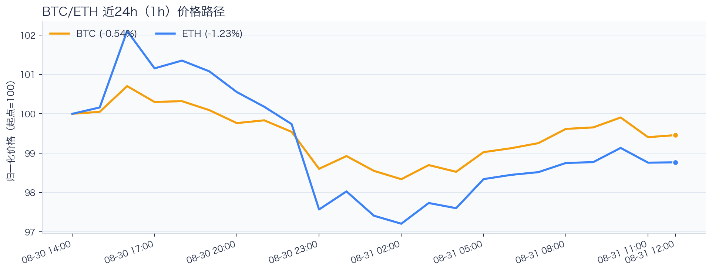
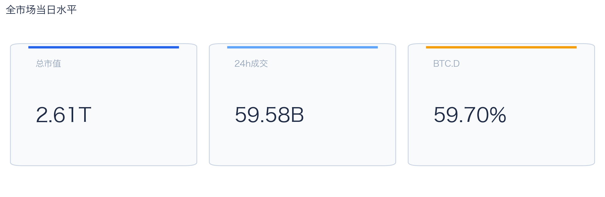
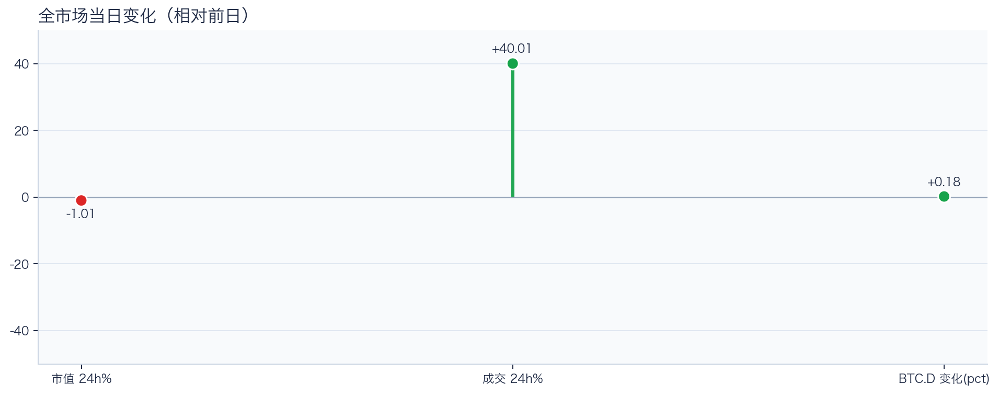
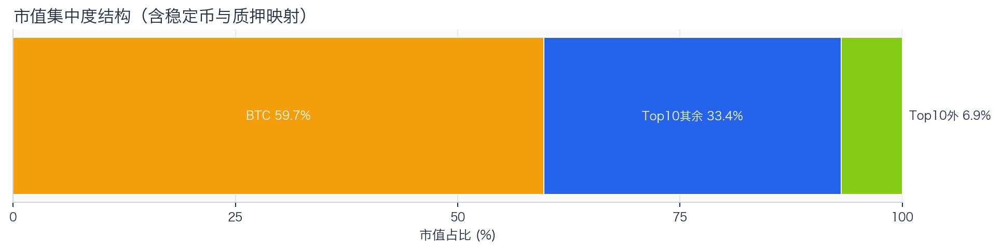
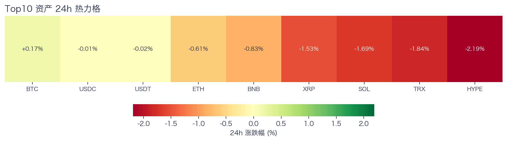
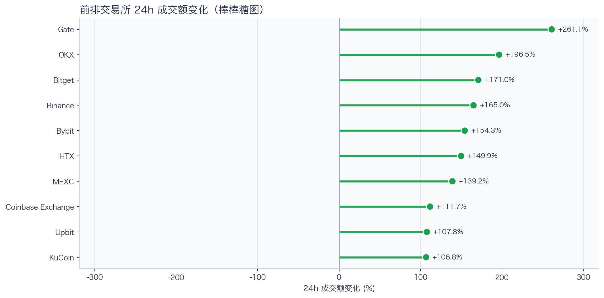
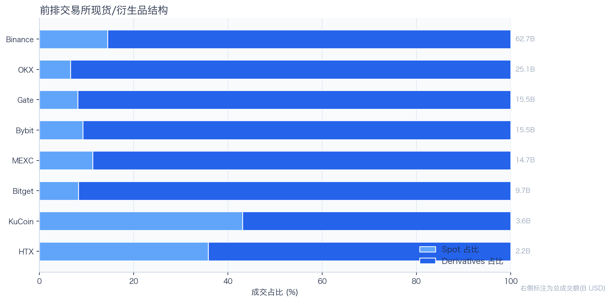
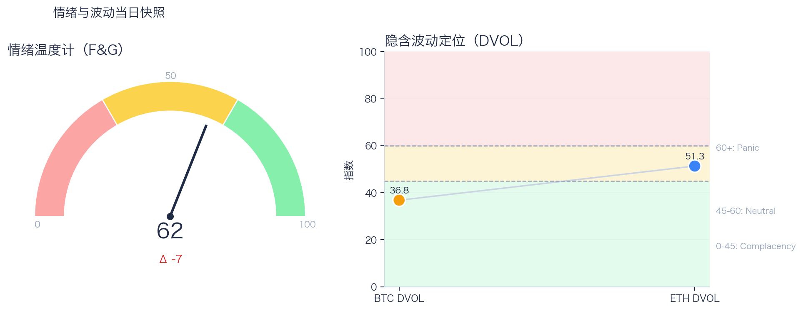

# 二级市场日报（2026-08-31）

## 快速结论
- 全市场指标当日：市值 $2.61T（24h -1.01%），成交额 $59.58B（24h +40.01%）。
- BTC 主导率 59.70%（+0.18pct），Top10 外市值占比（集中度口径）6.86%。
- 头部风险资产（排除稳定币、质押及信用映射）上涨 1 / 下跌 6 / 平盘 0，平均涨跌幅 -1.22%，首尾分化 2.36pct。
- 前排交易所样本成交普遍回升：上涨 10 家、下跌 0 家，24h 变化均值 +156.33%。
- 核心美股映射观察池中，TSLA -1.50%、MSFT -1.40%、MARA +1.18%；底层市场休市或参考价冻结时，仅作为链上价格变化观察，不作溢折价结论。

## 市场主线
今日市场状态为“压力重定价”。价格回撤但换手抬升，说明市场在高分歧下重估风险，波动脉冲概率偏高。头部风险资产下跌覆盖率较高，风险参与度偏弱。当前证据尚不足以确认新一轮趋势启动。

交易所成交方面，多数平台样本成交回升，但盘口深度、报价连续性与滑点尚未验证，不能直接等同于流动性改善。杠杆方面，资金费率仍接近中性，暂不足以单凭快照确认拥挤，需警惕回撤时的资金费率反转。期权定价方面，DVOL 处于低位或中性区间，单凭 DVOL 不足以判断期权保护成本是否便宜。情绪方面，F&G 处于偏乐观区，但较前一观测日回落；若成交不跟随，需防止短线追高回撤。上述指标用于交叉确认市场状态，暂不足以归因于特定事件。

## BTC/ETH 24h 趋势

口径：文字涨跌来自交易所 rolling 24h ticker；图内路径为当前可得 23 个小时点，首尾变化 BTC -0.54%、ETH -1.23%，两者窗口不可混用。
- BTC（交易所 rolling 24h）：$78,353.79（+0.18%，区间 $77,000.00 - $79,400.00，当前位于区间 56%）=> 区间震荡。
- ETH（交易所 rolling 24h）：$2,446.56（-0.59%，区间 $2,387.28 - $2,534.98，当前位于区间 40%）=> 区间震荡。
- 简评：BTC 与 ETH 出现分化，短线以结构性机会为主。

## 市场结构与交易状态
### 市场脉冲

当日，全市场市值 $2.61T，24h 成交额 $59.58B，BTC 主导率 59.70%。
价格下行但换手放大，反映分歧加剧，通常伴随更高的日内波动。

相对前一观测日，市值 -1.01%、成交 +40.01%、BTC.D +0.18pct。
市值与成交是同步观测；缺少事件时点和资金路径证据时，暂不作特定事件归因。

### 市场广度与集中度

当前市值结构为 BTC 59.70% / Top10 其余 33.44% / Top10 外 6.86%。该图含稳定币与质押映射，只描述集中度，不证明风险偏好扩散。
方向样本为 7 个头部风险资产，已排除 USDT, USDC, FIGR_HELOC；Top10 外占比仅是市值集中度，不作为风险扩散代理。

### 资产与交易结构

按头部资产统一快照口径，领涨的是 BTC（+0.17%），跌幅最大的是 HYPE（-2.19%），均值 -1.22%，首尾相差 2.36pct。
下跌家数占优，风险偏好修复仍较脆弱，短线追高性价比一般。对交易而言，优先控制回撤并等待上涨覆盖率改善。

前排样本上涨 10 家、下跌 0 家，均值 +156.33%。Gate 最强（+261.06%），KuCoin 最弱（+106.84%）。
最强与最弱平台的 24h 变化差达到 154.22pct，说明平台间成交变化分化，但不能据此推断资金因果流向。报价连续性和滑点是否同步变化仍需盘口数据验证，执行层面应继续监控成交质量。

样本内衍生品成交占比 85.93%。该比例描述成交结构，不单独用于判断后续波动方向或幅度。
衍生品占比处于高位；该比例本身不说明波动方向。后续需用盘口深度、强平和事件窗口数据验证具体传导机制。

### 杠杆与风险定价
Deribit 样本的资金费率（Funding）接近中性，BTC/ETH 8h 费率分别为 +1.02bps / +1.03bps；隐含波动率指数（DVOL）位于 Complacency（低波动定价） / Neutral（中性波动定价）。
| 资产 | OKX 多头清算样本 | OKX 空头清算样本 | 近月年化基差 | 远月年化基差 | ATM IV | 25Δ 偏度 |
|---|---:|---:|---:|---:|---:|---:|
| BTC | $11.98M | $6.03M | +5.73% | +3.74% | 33.69% | -0.15 pp |
| ETH | $22.09M | $3.27M | +8.32% | +5.02% | 46.78% | -0.38 pp |
清算口径：仅为 OKX 公共接口返回的近期样本，不代表 OKX 或全市场清算总量；25Δ 偏度定义为 Put IV 减 Call IV。
资金费率仍接近中性，DVOL 对应低波动定价与中性波动定价；清算样本中多头金额高于空头，提示回撤时仍需防范杠杆反身性，但单凭该快照不足以确认市场已经拥挤。因此更适合围绕波动管理仓位和节奏，避免激进追逐单边。

恐惧与贪婪指数（F&G）当日 62（较前一观测日 -7）；BTC/ETH DVOL 为 36.80/51.33，对应 Complacency（低波动定价） / Neutral（中性波动定价）。
情绪仍处于偏乐观区，需关注是否出现过热信号与波动回摆。只有当情绪、广度和成交三者同时改善，市场才更可能从“反弹交易”切换到“趋势交易”。

### 关键价位与失效条件
| 资产 | 24h 支撑 | 24h 阻力 | ATR14(1h) | 向上触发 | 多头失效 | 向下触发 | 空头失效 |
|---|---:|---:|---:|---:|---:|---:|---:|
| BTC | 77000.00 | 79400.00 | 507.59 | 79526.90 | 79273.10 | 76873.10 | 77126.90 |
| ETH | 2387.28 | 2534.98 | 21.90 | 2540.46 | 2529.50 | 2381.80 | 2392.76 |
计算口径：以当前可得 23 个 1h 小时点的高低点作为支撑/阻力，触发缓冲取现价 0.1% 与 0.25×ATR14 的较大值；触发价用于观察确认，不是自动交易指令。

## 今日差异化重点
### 稳定币收益与资金成本
- 收益端：本期可得协议样本中，Compound-USDC 的 Total APY 为 8.38%，需继续区分原生利率与奖励补贴。
- 资金需求：本期可得样本最高利用率 91.58%；高利用率意味着借款需求较强，也可能压缩退出流动性。
- 跨平台成本：本期可得报价中，USDC 借币年化样本差约 2.97pct，适合继续核对额度、期限和地区准入，不直接视为套利利差。

### 跨交易所 Funding 与 Carry
- Funding：样本高位为 Binance-BTC，年化约 10.95%。
- 平台分化：样本低位为 OKX-ETH，年化约 1.51%。
- 可执行性：Funding 与 basis 均有记录的样本可进入 carry 复核，但仍需检查手续费、滑点、保证金和持续性。

## 未来24小时观察
1. 若头部风险资产上涨覆盖率连续改善且 BTC.D 回落，再结合更广币种样本验证风险偏好是否扩散。
2. 若衍生品占比继续上升而资金费率仍接近中性，只能确认交易向杠杆侧集中；是否放大波动仍需结合 DVOL 与成交验证。
3. 若 F&G 回升而 DVOL 不降，代表情绪改善尚未获得风险定价确认，应降低对追涨信号的置信度。

## 交易与风控含义
- 仓位管理优先级高于方向押注，建议保持核心仓位稳定、战术仓位滚动。
- 若衍生品占比上升并伴随 Funding 快速偏离中性或 DVOL 抬升，再考虑降低杠杆并收紧风险参数。
- 关注情绪改善与广度扩散是否同步发生，二者背离时避免追逐单边。
