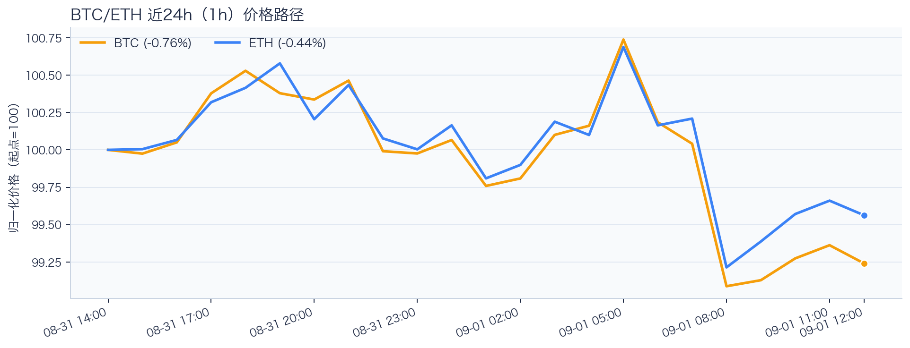
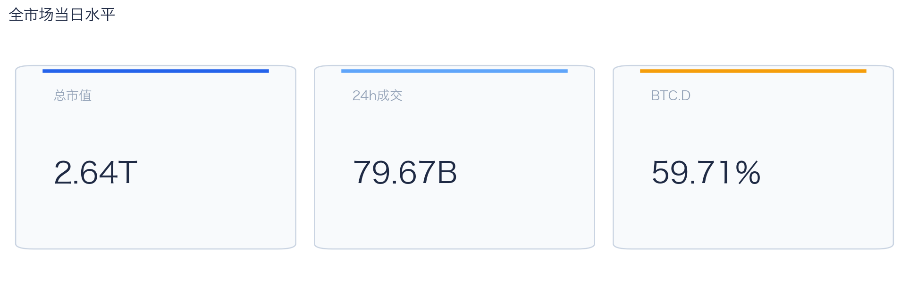
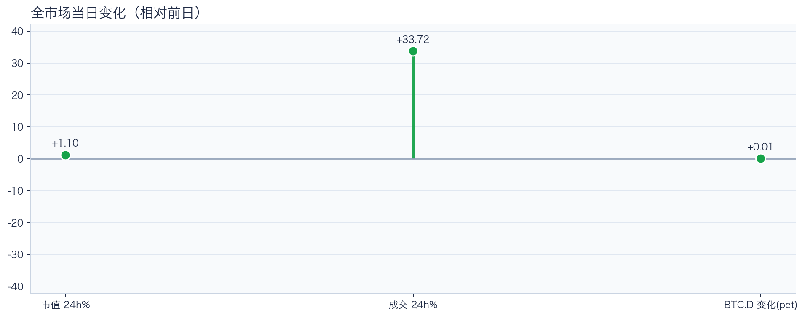
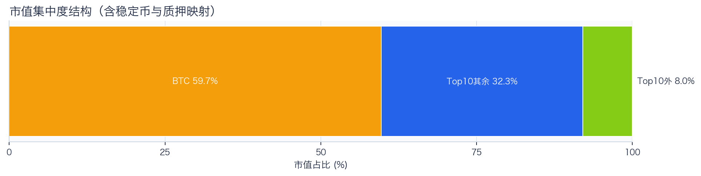
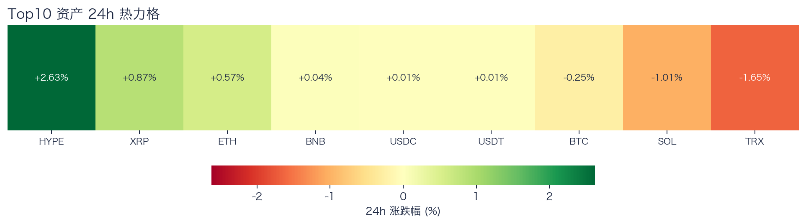
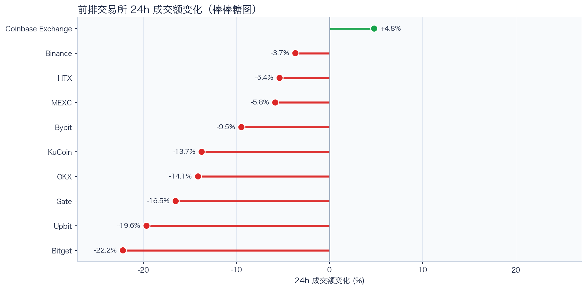
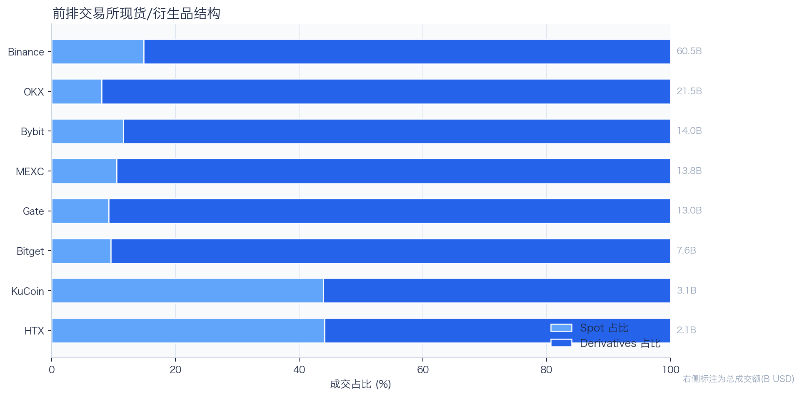
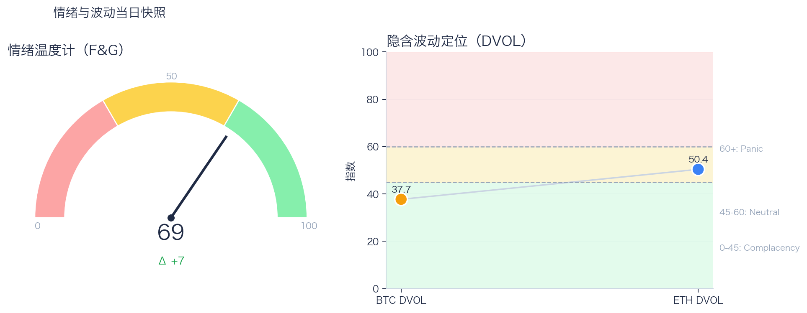

# 二级市场日报（2026-09-01）

## 快速结论
- 全市场指标当日：市值 $2.64T（24h +1.10%），成交额 $79.67B（24h +33.72%）。
- BTC 主导率 59.71%（+0.01pct），Top10 外市值占比（集中度口径）7.97%。
- 头部风险资产（排除稳定币、质押及信用映射）上涨 4 / 下跌 3 / 平盘 0，平均涨跌幅 +0.17%，首尾分化 4.28pct。
- 前排交易所样本成交普遍收缩：上涨 1 家、下跌 9 家，24h 变化均值 -10.57%。
- Tokenized Stocks 类别规模 $2.53B，7D +15.13%。

## 市场主线
今日市场状态为“交易性修复”：全市场市值与成交额同步回升，但 BTC/ETH 及头部风险资产方向分化；现有样本尚不足以证明长尾市场扩散或新趋势启动。

交易所成交方面，多数平台走弱，样本仅支持成交收缩及降幅分化，不支持资金回流判断。杠杆方面，当前资金费率仍接近中性，需结合持续性、持仓和清算变化判断拥挤程度。期权定价方面，DVOL 处于相对低位，但单凭 DVOL 不能判断期权保护成本是否便宜。情绪方面，F&G 回到偏乐观区；若成交不跟随，需防范短线追高后的回撤。上述指标用于描述市场状态，暂不足以归因于特定事件。

## BTC/ETH 24h 趋势

口径：文字涨跌来自交易所 rolling 24h ticker；图内路径为当前可得 23 个小时级点，首尾变化 BTC -0.76%、ETH -0.44%，两者窗口不可混用。
- BTC（交易所 rolling 24h）：$78,003.72（-0.58%，区间 $77,675.04 - $79,250.00，当前位于区间 21%）=> 区间震荡。
- ETH（交易所 rolling 24h）：$2,456.77（+0.24%，区间 $2,437.05 - $2,489.95，当前位于区间 37%）=> 区间震荡。
- 简评：BTC 与 ETH 出现分化，短线以结构性机会为主。

## 市场结构与交易状态
### 市场脉冲

当日，全市场市值 $2.64T，24h 成交额 $79.67B，BTC 主导率 59.71%。
市值与成交额同步回升，呈现修复特征；若成交保持，可作为修复延续的观察条件，但单日共振不足以确认趋势延续。

相对前一观测日，市值 +1.10%、成交 +33.72%、BTC.D +0.01pct。
市值与成交是同步观测；缺少事件时点和资金路径证据时，暂不作特定事件归因。

### 市场广度与集中度

当前市值结构为 BTC 59.71% / Top10 其余 32.32% / Top10 外 7.97%。该图含稳定币与质押映射，只描述集中度，不证明风险偏好扩散。
方向样本为 7 个头部风险资产，已排除 USDT, USDC, FIGR_HELOC；Top10 外占比仅是市值集中度，不作为风险扩散代理。

### 资产与交易结构

按头部资产统一快照口径，领涨的是 HYPE（+2.63%），跌幅最大的是 TRX（-1.65%），均值 +0.17%，首尾相差 4.28pct。
涨跌家数接近均衡，当前样本显示方向一致性较弱，尚不足以确认市场进入结构轮动阶段。对交易而言，继续比较相对强弱，但不把有限的单日收益差夸大为显著结构行情。

前排样本上涨 1 家、下跌 9 家，均值 -10.57%。Coinbase Exchange 最强（+4.79%），Bitget 最弱（-22.18%）。
最强与最弱平台的 24h 变化差达到 26.98pct，说明平台间成交变化分化，但不能据此推断资金因果流向。报价连续性和滑点是否同步变化仍需盘口数据验证，执行层面应继续监控成交质量。

样本内衍生品成交占比 84.85%。该比例描述成交结构，不单独用于判断后续波动方向或幅度。
衍生品仍是主导成交形态，但该占比不能单独证明价格由杠杆情绪驱动。后续需用盘口深度、强平和事件窗口数据验证具体传导机制。

### 杠杆与风险定价
Deribit 样本的资金费率（Funding）接近中性，BTC/ETH 8h 费率分别为 +1.00bps / +0.31bps；隐含波动率指数（DVOL）位于 Complacency（低波动定价） / Neutral（中性波动定价）。
| 资产 | OKX 多头清算样本 | OKX 空头清算样本 | 近月年化基差 | 远月年化基差 | ATM IV | 25Δ 偏度 |
|---|---:|---:|---:|---:|---:|---:|
| BTC | $859,065 | $8,195 | +4.72% | +3.78% | 33.61% | -0.45 pp |
| ETH | $556,288 | $1.04M | +5.09% | +4.78% | 44.32% | -1.13 pp |
清算口径：仅为 OKX 公共接口返回的近期样本，不代表 OKX 或全市场清算总量；25Δ 偏度定义为 Put IV 减 Call IV。
当前 BTC/ETH 资金费率为 +1.00bps / +0.31bps，DVOL 处于相对低位；现有快照不足以确认杠杆已明显拥挤，仓位上应围绕波动管理节奏。因此更合适的做法不是激进追单边，而是围绕波动管理仓位和节奏。

恐惧与贪婪指数（F&G）当日 69（较前一观测日 +7）；BTC/ETH DVOL 为 37.72/50.39，对应 Complacency（低波动定价） / Neutral（中性波动定价）。
情绪进入偏乐观区，需关注是否出现过热信号与波动回摆。只有当情绪、广度和成交三者同时改善，市场才更可能从“反弹交易”切换到“趋势交易”。

### 关键价位与失效条件
| 资产 | 24h 支撑 | 24h 阻力 | ATR14(1h) | 向上触发 | 多头失效 | 向下触发 | 空头失效 |
|---|---:|---:|---:|---:|---:|---:|---:|
| BTC | 77746.60 | 79250.00 | 371.02 | 79342.76 | 79157.24 | 77653.84 | 77839.36 |
| ETH | 2437.75 | 2489.95 | 13.64 | 2493.36 | 2486.54 | 2434.34 | 2441.16 |
计算口径：以当前可得 23 个小时级点的高低点作为支撑/阻力，触发缓冲取现价 0.1% 与 0.25×ATR14 的较大值；触发价用于观察确认，不是自动交易指令。

## 今日差异化重点
### 稳定币收益与资金成本
- 收益端：本期可得协议样本中，Compound-USDC 的 Total APY 为 5.74%，需继续区分原生利率与奖励补贴。
- 资金需求：本期可得样本最高利用率 91.63%；高利用率意味着借款需求较强，也可能压缩退出流动性。
- 跨平台成本：本期可得报价中，USDC 借币年化样本差约 3.06pct，适合继续核对额度、期限和地区准入，不直接视为套利利差。

### 跨交易所资金费率与 Carry
- 资金费率（Funding）：样本高位为 OKX-ETH，年化约 7.50%。
- 平台分化：样本低位为 Binance-ETH，年化约 2.61%。
- 可执行性：资金费率与基差均有记录的样本可进入 Carry 复核，但仍需检查手续费、滑点、保证金和持续性。

### RWA 与 24×7 映射交易
- 映射异动：INTW 24h -5.90%，属于今日 RWA 观察池中幅度较大的标的。
- 类别结构：最近一次可得类别快照显示，Tokenized Stocks 规模约 $2.53B，7D +15.13%；该变化用于判断产品线活跃度，不直接外推大盘方向。
- 链上验证：公开聪明钱信号页在已覆盖标的中未命中活跃记录；这不等于不存在相关持仓或交易，异动仍需结合底层价格、成交与事件证据确认。

## 未来24小时观察
1. 若头部风险资产上涨覆盖率连续改善且 BTC.D 回落，再结合更广币种样本验证风险偏好是否扩散。
2. 若衍生品占比继续上升而资金费率仍中性，只能确认交易向杠杆侧集中；是否放大波动仍需结合 DVOL 与成交验证。
3. 若 F&G 回升而 DVOL 不降，代表情绪改善尚未获得风险定价确认，应降低对追涨信号的置信度。

## 交易与风控含义
- 仓位管理优先级高于方向押注，建议保持核心仓位稳定、战术仓位滚动。
- 若衍生品占比上升并伴随资金费率快速偏离中性或 DVOL 抬升，再考虑降低杠杆并收紧风险参数。
- 关注情绪改善与广度扩散是否同步发生，二者背离时避免追逐单边。
