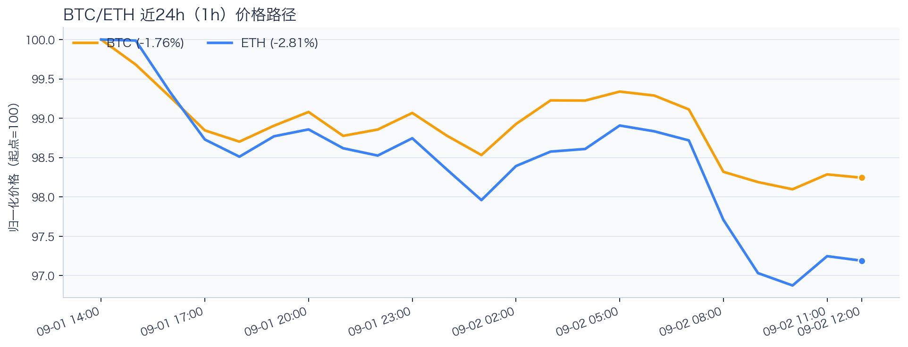
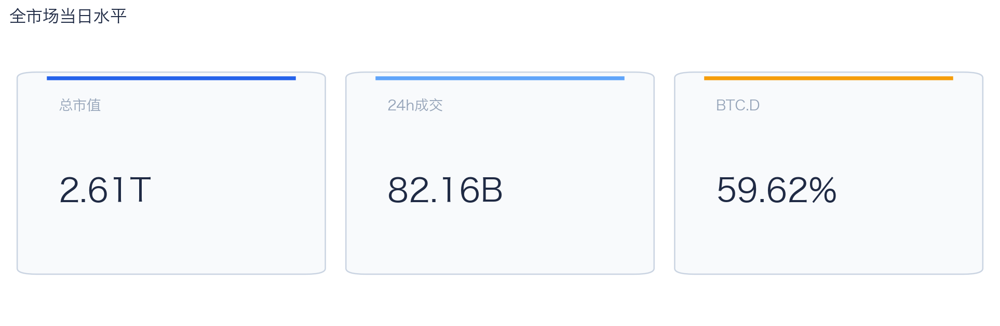
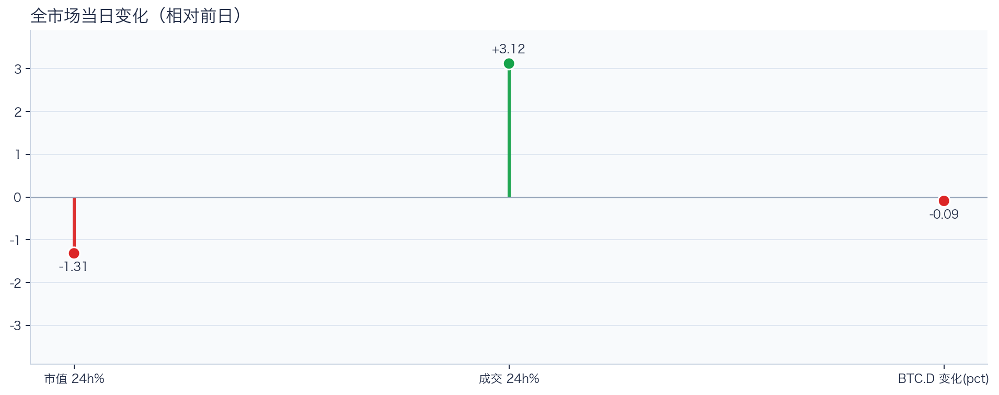
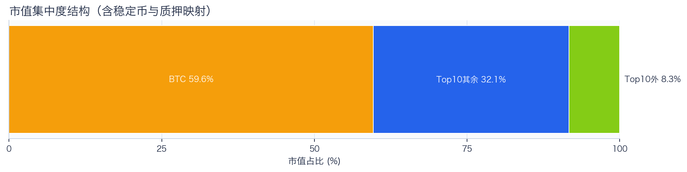
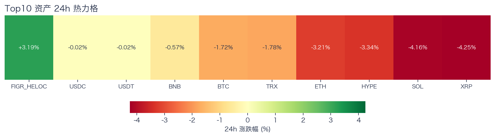
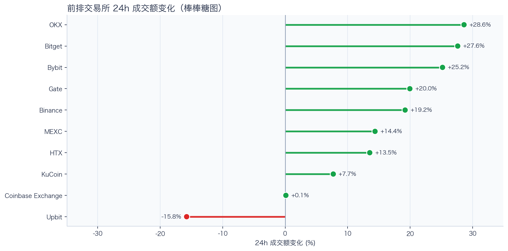
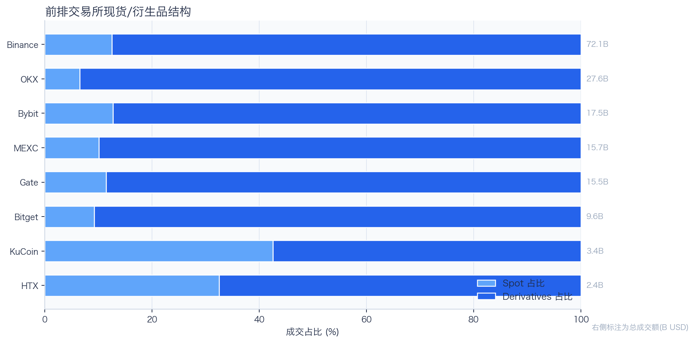
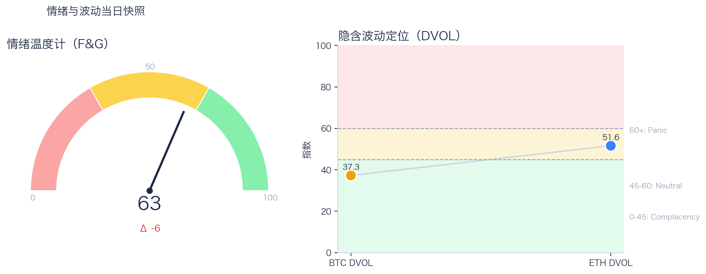

# 二级市场日报（2026-09-02）

## 快速结论
- 全市场指标当日：市值 $2.61T（24h -1.31%），成交额 $82.16B（24h +3.12%）。
- BTC 主导率 59.62%（-0.09pct），Top10 外市值占比（集中度口径）8.28%。
- 头部风险资产（排除稳定币、质押及信用映射）上涨 0 / 下跌 7 / 平盘 0，平均涨跌幅 -2.72%，首尾分化 3.68pct。
- 前排交易所样本成交普遍回升：上涨 9 家、下跌 1 家，24h 变化均值 +14.05%。
- Tokenized Stocks 类别规模 $2.60B，7D +12.74%。

## 市场主线
今日市场状态为“压力重定价”。价格回撤但换手抬升，说明市场在高分歧下重估风险，波动脉冲概率偏高。头部风险资产下跌覆盖率较高，风险参与度偏弱。当前证据尚不足以确认新一轮趋势启动。

交易所成交多数回升，但盘口深度、报价连续性与滑点尚未验证，暂不能等同于流动性改善。资金费率未显示极端拥挤，DVOL 也不足以单独判断保护成本；情绪虽回到偏乐观区，若成交未能跟随，仍需防范短线追高后的回撤。几项指标共同用于确认市场状态，但暂不足以归因于特定事件。

## BTC/ETH 24h 趋势

口径：文字涨跌来自交易所 rolling 24h ticker；图内路径为当前可得 23 个小时点，首尾变化 BTC -1.76%、ETH -2.81%，两者窗口不可混用。
- BTC（交易所 rolling 24h）：$76,795.76（-1.53%，区间 $76,264.00 - $78,424.00，当前位于区间 25%）=> 偏弱震荡。
- ETH（交易所 rolling 24h）：$2,380.48（-3.03%，区间 $2,356.41 - $2,459.09，当前位于区间 23%）=> 偏弱，下行主导。
- 简评：BTC 偏弱震荡下行，ETH 相对更弱。

## 市场结构与交易状态
### 市场脉冲

当日，全市场市值 $2.61T，24h 成交额 $82.16B，BTC 主导率 59.62%。
价格下行但换手放大，反映分歧加剧，通常伴随更高的日内波动。

相对前一观测日，市值 -1.31%、成交 +3.12%、BTC.D -0.09pct。
市值与成交是同步观测；缺少事件时点和资金路径证据时，暂不作特定事件归因。

### 市场广度与集中度

当前市值结构为 BTC 59.62% / Top10 其余 32.10% / Top10 外 8.28%。该图含稳定币与质押映射，只描述集中度，不证明风险偏好扩散。
方向样本为 7 个头部风险资产，已排除 USDT, USDC, FIGR_HELOC；Top10 外占比仅是市值集中度，不作为风险扩散代理。

### 资产与交易结构

按头部资产统一快照口径，跌幅最小的是 BNB（-0.57%），跌幅最大的是 XRP（-4.25%），均值 -2.72%，首尾相差 3.68pct。
下跌家数占优，风险偏好修复仍较脆弱，短线追高性价比一般。对交易而言，优先控制回撤并等待上涨覆盖率改善。

前排样本上涨 9 家、下跌 1 家，均值 +14.05%。OKX 最强（+28.62%），Upbit 最弱（-15.77%）。
最强与最弱平台的 24h 变化差达到 44.40pct，说明平台间成交变化分化，但不能据此推断资金因果流向。报价连续性和滑点是否同步变化仍需盘口数据验证，执行层面应继续监控成交质量。

样本内衍生品成交占比 86.65%。该比例描述成交结构，不单独用于判断后续波动方向或幅度。
衍生品占比处于高位；该比例本身不说明波动方向。后续需用盘口深度、强平和事件窗口数据验证具体传导机制。

### 杠杆与风险定价
Deribit 样本的资金费率（Funding）接近中性，BTC/ETH 8h 费率分别为 +0.93bps / +0.36bps；隐含波动率指数（DVOL）位于 Complacency（低波动定价） / Neutral（中性波动定价）。
| 资产 | OKX 多头清算样本 | OKX 空头清算样本 | 近月年化基差 | 远月年化基差 | ATM IV | 25Δ 偏度 |
|---|---:|---:|---:|---:|---:|---:|
| BTC | $532,749 | $42,630 | +6.34% | +3.49% | 32.85% | 2.91 pp |
| ETH | $190,685 | $289,828 | +6.44% | +4.97% | 46.50% | 4.29 pp |
清算口径：仅为 OKX 近期公开清算样本，不代表 OKX 或全市场清算总量；25Δ 偏度定义为 Put IV 减 Call IV。
Funding 与 DVOL 暂未显示极端方向拥挤；当前读数本身不足以判断尾部风险是否重新抬升。因此更合适的做法不是激进追单边，而是围绕波动管理仓位和节奏。

恐惧与贪婪指数（F&G）当日 63（较前一观测日 -6）；BTC/ETH DVOL 为 37.27/51.58，对应 Complacency（低波动定价） / Neutral（中性波动定价）。
情绪进入偏乐观区，需关注是否出现过热信号与波动回摆。只有当情绪、广度和成交三者同时改善，市场才更可能从“反弹交易”切换到“趋势交易”。

### 关键价位与失效条件
| 资产 | 24h 支撑 | 24h 阻力 | ATR14(1h) | 向上触发 | 多头失效 | 向下触发 | 空头失效 |
|---|---:|---:|---:|---:|---:|---:|---:|
| BTC | 76264.00 | 78424.00 | 423.40 | 78529.85 | 78318.15 | 76158.15 | 76369.85 |
| ETH | 2356.41 | 2457.64 | 17.35 | 2461.98 | 2453.30 | 2352.07 | 2360.75 |
计算口径：以当前可得 23 个 1h 小时点的高低点作为支撑/阻力，触发缓冲取现价 0.1% 与 0.25×ATR14 的较大值；触发价用于观察确认，不是自动交易指令。

## 今日差异化重点
### 跨交易所资金费率与套利持有收益（Carry）
- Funding：样本高位为 OKX-BTC，年化约 10.95%。
- 平台分化：样本低位为 Binance-ETH，年化约 1.65%。
- 可执行性：Funding 与 basis 均有记录的样本可进入套利持有收益复核，但仍需检查手续费、滑点、保证金和持续性。

### 稳定币收益与资金成本
- 收益端：本期可得协议样本中，Aave-USDC 的 Total APY 为 5.10%，需继续区分原生利率与奖励补贴。
- 资金需求：本期可得样本最高利用率 92.92%；高利用率意味着借款需求较强，也可能压缩退出流动性。
- 跨平台成本：本期可得报价中，USDC 借币年化样本差约 2.82pct，适合继续核对额度、期限和地区准入，不直接视为套利利差。

### RWA 与 24×7 映射交易
- 映射异动：RIOT 24h -5.39%，属于今日 RWA 观察池中幅度较大的标的；底层市场非连续交易时不作溢折价结论。
- 类别结构：最近一次可得类别快照显示，Tokenized Stocks 规模约 $2.60B，7D +12.74%；该变化用于判断产品线活跃度，不直接外推大盘方向。
- 链上验证：公开聪明钱信号页在已覆盖标的中未命中活跃记录；这不等于不存在相关持仓或交易，异动仍需结合底层价格、成交与事件证据确认。

## 未来24小时观察
1. 若头部风险资产上涨覆盖率连续改善且 BTC.D 回落，再结合更广币种样本验证风险偏好是否扩散。
2. 若衍生品占比继续上升而 funding 仍中性，只能确认交易向杠杆侧集中；是否放大波动仍需结合 DVOL 与成交验证。
3. 若 F&G 回升而 DVOL 不降，代表情绪改善尚未获得风险定价确认，应降低对追涨信号的置信度。

## 交易与风控含义
- 仓位管理优先级高于方向押注，建议保持核心仓位稳定、战术仓位滚动。
- 若衍生品占比上升并伴随 Funding 快速偏离中性或 DVOL 抬升，再考虑降低杠杆并收紧风险参数。
- 关注情绪改善与广度扩散是否同步发生，二者背离时避免追逐单边。
