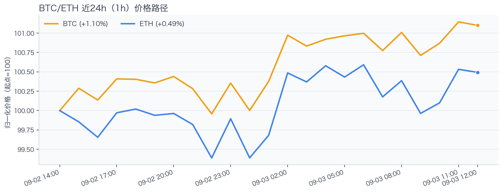
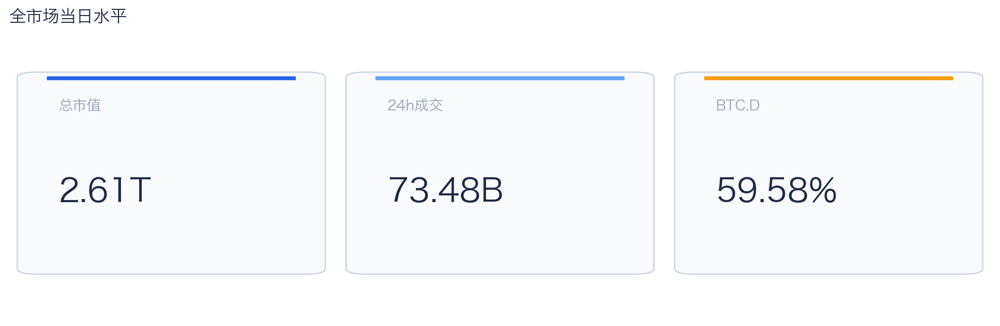
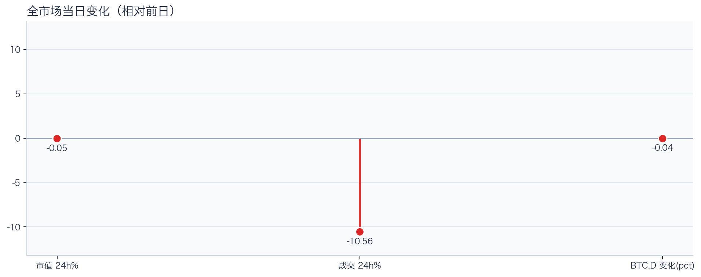
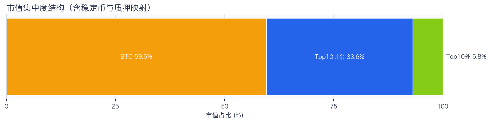
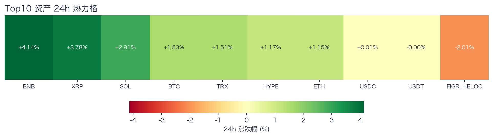
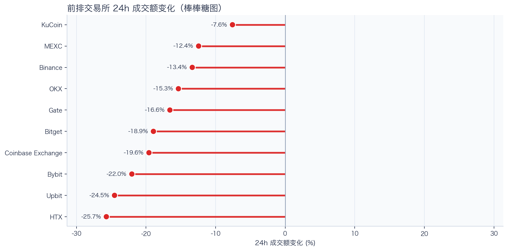
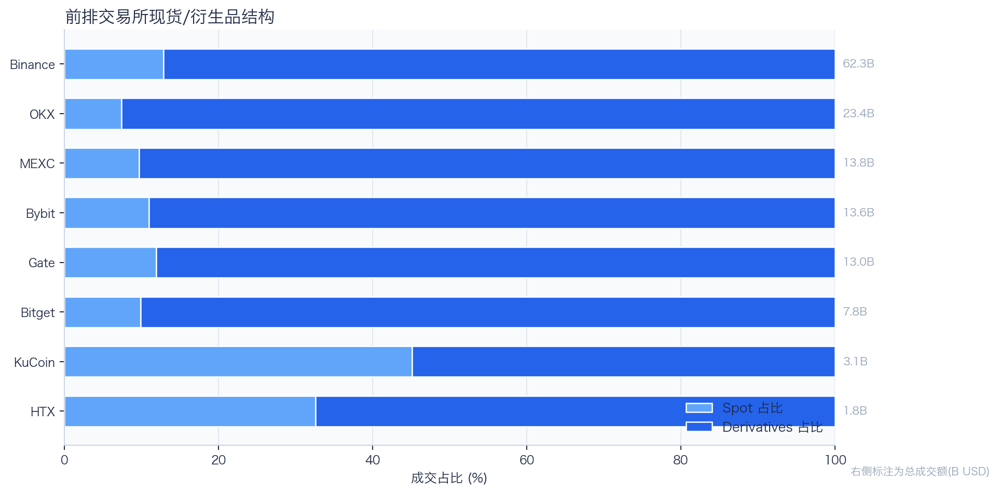
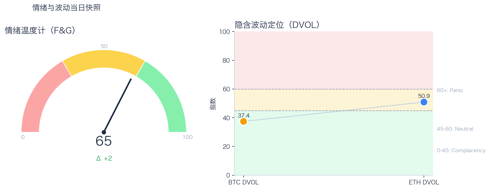

# 二级市场日报（2026-09-03）

## 快速结论
- 全市场指标当日：市值 $2.61T（24h -0.05%），成交额 $73.48B（24h -10.56%）。
- BTC 主导率 59.58%（-0.04pct），Top10 外市值占比（集中度口径）6.84%。
- 头部风险资产（排除稳定币、质押及信用映射）上涨 7 / 下跌 0 / 平盘 0，平均涨跌幅 +2.31%，首尾分化 2.99pct。
- 前排交易所样本成交普遍收缩：上涨 0 家、下跌 10 家，24h 变化均值 -17.61%。
- Tokenized Stocks 类别规模 $2.55B，7D +0.39%。

## 市场主线
今日市场状态为“核心资产偏强、全市场量能偏弱”。全市场日度快照显示市值与成交额较前一观测日分别下降 0.05% 和 10.56%；同时，BTC/ETH 滚动 24 小时涨幅分别为 1.48% 和 1.10%。这一组合显示核心资产偏强、全市场量能偏弱，短线仍应优先控制回撤。头部风险资产上涨覆盖率较高，但该样本不能外推为长尾扩散。当前证据尚不足以确认新一轮趋势启动。

交易所样本只支持成交收缩及降幅分化，不能据此判断资金回流。资金费率未显示极端拥挤，但单一平台样本不足以代表全市场杠杆；DVOL 反映波动率定价，不能单独判断期权保护成本。F&G 回到偏乐观区，若成交未跟随，需防范短线追高后的回撤。上述指标共同刻画市场状态，但不足以归因于特定事件。

## BTC/ETH 24h 趋势

口径：文字涨跌来自交易所 rolling 24h ticker；图内路径为当前可得 23 个小时点，首尾变化 BTC +1.10%、ETH +0.49%，两者窗口不可混用。
- BTC（交易所 rolling 24h）：$77,914.01（+1.48%，区间 $76,611.67 - $78,183.91，当前位于区间 83%）=> 偏强震荡。
- ETH（交易所 rolling 24h）：$2,406.26（+1.10%，区间 $2,370.14 - $2,419.72，当前位于区间 73%）=> 偏强震荡。
- 简评：BTC 与 ETH 同步偏强，短线仍有上行动能。

## 市场结构与交易状态
### 市场脉冲

当日，全市场市值 $2.61T，24h 成交额 $73.48B，BTC 主导率 59.58%。
日度快照中的市值与成交额同步回落，风险偏好仍需量能确认；这与 BTC/ETH 滚动 24 小时偏强并不矛盾，反映的是不同窗口下的结构差异。

相对前一观测日，市值 -0.05%、成交 -10.56%、BTC 主导率 -0.04pct。
市值与成交是同步观测；缺少事件时点和资金路径证据时，暂不作特定事件归因。

### 市场广度与集中度

当前市值结构为 BTC 59.58% / Top10 其余 33.58% / Top10 外 6.84%。该图含稳定币与质押映射，只描述集中度，不证明风险偏好扩散。
方向样本为 7 个头部风险资产，已排除 USDT, USDC, FIGR_HELOC；Top10 外占比仅是市值集中度，不作为风险扩散代理。

### 资产与交易结构

按头部资产统一快照口径，领涨的是 BNB（+4.14%），尾部的是 ETH（+1.15%；与前文交易所 rolling 24h 的 +1.10% 为不同口径），均值 +2.31%，首尾相差 2.99pct。
头部风险资产温和同涨，首尾差有限，当前更接近普涨而非显著结构分化。后续重点观察成交能否确认上涨覆盖率，而不是仅凭当日小幅收益差进行选币。

前排样本上涨 0 家、下跌 10 家，均值 -17.61%。KuCoin 最强（-7.58%），HTX 最弱（-25.70%）。
样本平台成交普遍收缩，最小与最大降幅相差 18.13pct；这只说明收缩幅度不同，不构成流动性回流或价格发现能力增强的证据。报价连续性和滑点是否同步变化仍需盘口数据验证，执行层面应继续监控成交质量。

样本内衍生品成交占比 86.50%。该比例描述成交结构，不单独用于判断后续波动方向或幅度。
衍生品占比处于高位；该比例本身不说明波动方向。后续需用盘口深度、强平和事件窗口数据验证具体传导机制。

### 杠杆与风险定价
Deribit 样本的资金费率（Funding）接近中性，BTC/ETH 8h 费率分别为 +0.02bps / +0.64bps；隐含波动率指数（DVOL）位于 Complacency（低波动定价） / Neutral（中性波动定价）。
| 资产 | OKX 多头清算样本 | OKX 空头清算样本 | 近月年化基差 | 远月年化基差 | 平值隐含波动率（ATM IV） | 25Δ 偏度 |
|---|---:|---:|---:|---:|---:|---:|
| BTC | $141,812 | $161,712 | +4.02% | +4.06% | 31.47% | -1.53 pp |
| ETH | $247,470 | $149,555 | +6.38% | +3.55% | 43.65% | 0.40 pp |
清算口径：仅为 OKX 近期公开清算样本，不代表 OKX 或全市场清算总量；25Δ 偏度定义为看跌期权隐含波动率减看涨期权隐含波动率。
资金费率未显示极端方向拥挤；BTC/ETH 的 DVOL 分别处于低波动与中性定价。二者均不足以单独判断尾部风险是否重新抬升。因此更合适的做法不是激进追单边，而是围绕波动管理仓位和节奏。

恐惧与贪婪指数（F&G）当日 65（较前一观测日 +2）；BTC/ETH DVOL 为 37.42/50.90，对应 Complacency（低波动定价） / Neutral（中性波动定价）。
情绪进入偏乐观区，需关注是否出现过热信号与波动回摆。只有当情绪、广度和成交三者同时改善，市场才更可能从“反弹交易”切换到“趋势交易”。

### 关键价位与失效条件
| 资产 | 24h 支撑 | 24h 阻力 | ATR14(1h) | 向上触发 | 多头失效 | 向下触发 | 空头失效 |
|---|---:|---:|---:|---:|---:|---:|---:|
| BTC | 76748.01 | 78183.91 | 387.18 | 78280.71 | 78087.12 | 76651.21 | 76844.80 |
| ETH | 2370.14 | 2419.33 | 16.04 | 2423.34 | 2415.32 | 2366.13 | 2374.15 |
计算口径：以当前可得 23 个 1h 小时点的高低点作为支撑/阻力，触发缓冲取现价 0.1% 与 0.25×ATR14 的较大值；触发价用于观察确认，不是自动交易指令。

## 今日差异化重点
### 稳定币收益与资金成本
- 收益端：本期可得协议样本中，Aave-PYUSD 的 Total APY 为 30.90%，需继续区分原生利率与奖励补贴。
- 资金需求：本期可得样本最高利用率为 95.28%；高利用率通常与借款需求较强或供给偏紧相伴，但单凭该指标不能区分二者，也可能压缩退出流动性。
- 跨平台成本：本期可得报价中，USDC 借币年化样本差约 2.99pct，适合继续核对额度、期限和地区准入，不直接视为套利利差。

### RWA 与 24×7 映射交易
- 映射异动：HOOD 24h +6.97%，属于今日 RWA 观察池中幅度较大的标的；底层市场非连续交易时不作溢折价结论。
- 类别结构：最近一次可得类别快照显示，Tokenized Stocks 规模约 $2.55B，7D +0.39%；该变化用于判断产品线活跃度，不直接外推大盘方向。
- 链上验证：公开聪明钱信号页在已覆盖标的中未命中活跃记录；这不等于不存在相关持仓或交易，异动仍需结合底层价格、成交与事件证据确认。

## 未来24小时观察
1. 若头部风险资产上涨覆盖率连续改善且 BTC 主导率回落，再结合更广币种样本验证风险偏好是否扩散。
2. 若衍生品占比继续上升而 Funding 仍中性，只能确认成交结构中衍生品占比提高；是否代表杠杆交易规模扩大或波动放大，仍需结合现货、衍生品绝对成交额、DVOL 与盘口数据验证。
3. 若 F&G 回升而 DVOL 不降，代表情绪改善尚未获得风险定价确认，应降低对追涨信号的置信度。

## 交易与风控含义
- 仓位管理优先级高于方向押注，建议保持核心仓位稳定、战术仓位滚动。
- 若衍生品占比上升并伴随 Funding 快速偏离中性或 DVOL 抬升，再考虑降低杠杆并收紧风险参数。
- 关注情绪改善与广度扩散是否同步发生，二者背离时避免追逐单边。
