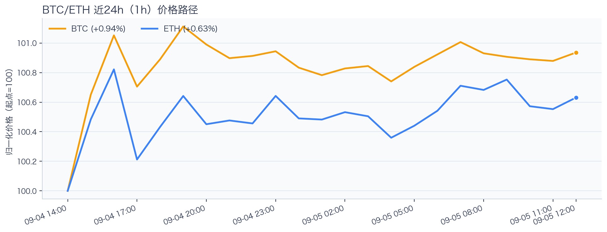
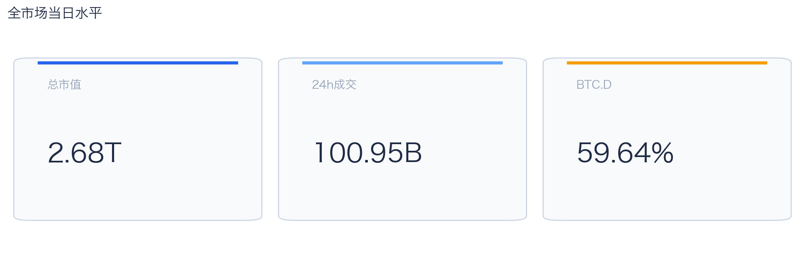
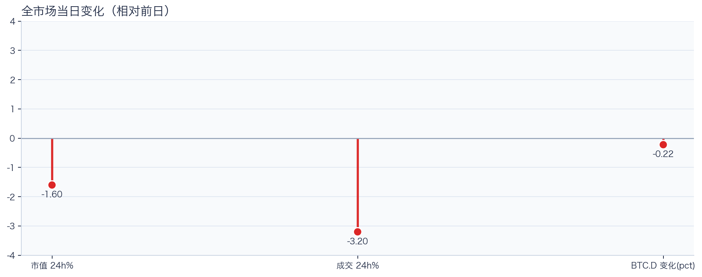
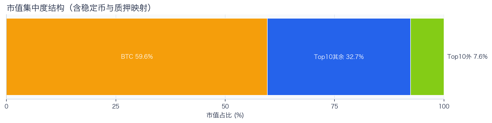
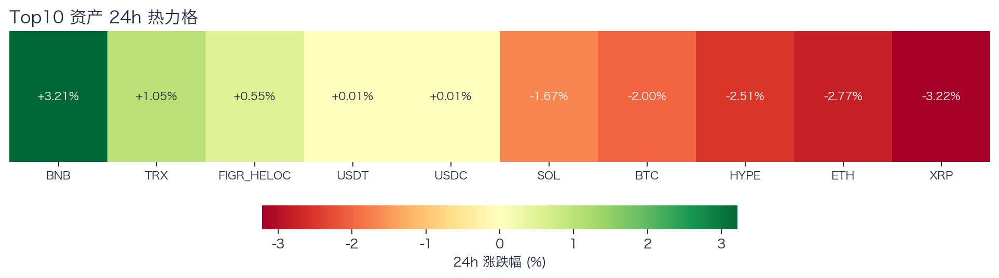
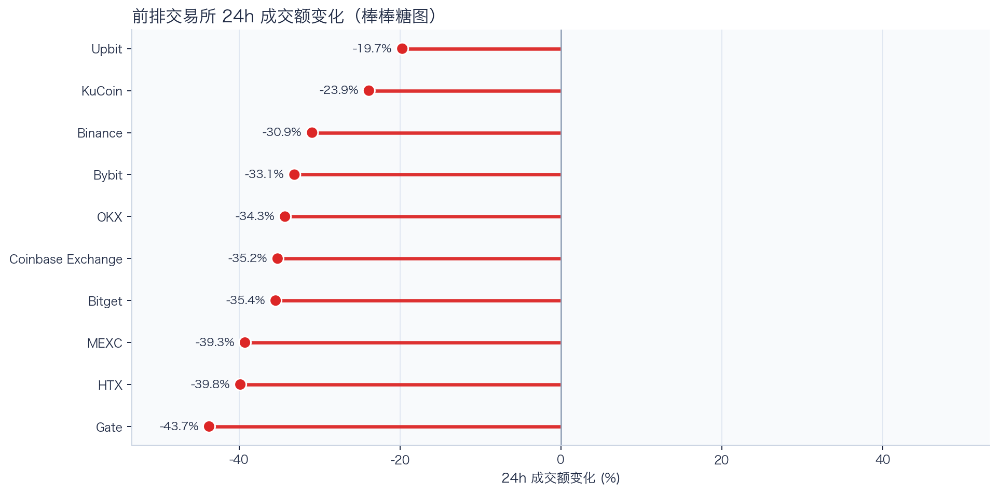
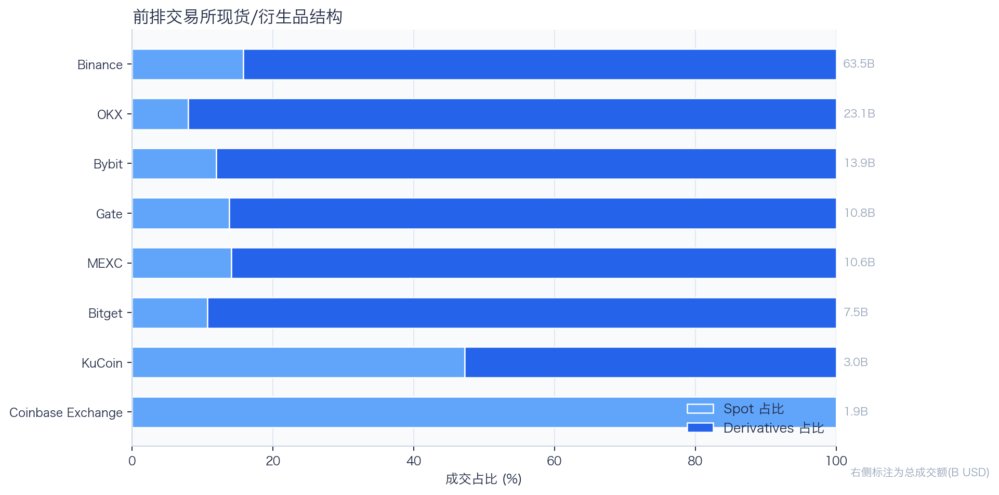
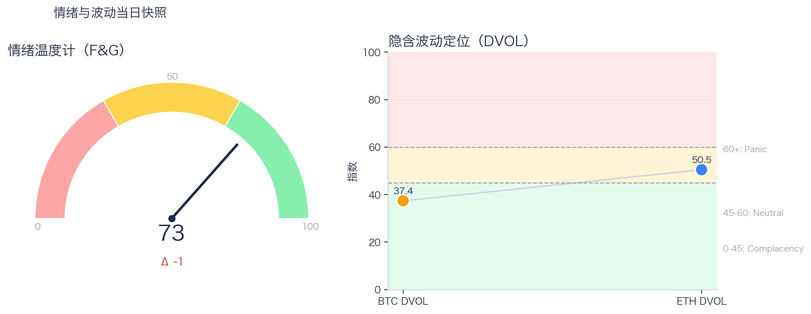

# 二级市场日报（2026-09-05）

## 快速结论
- 全市场指标当日：市值 $2.68T（24h -1.60%），成交额 $100.95B（24h -3.20%）。
- BTC 主导率 59.64%（-0.22 个百分点），Top10 外市值占比（集中度口径）7.65%。
- 头部风险资产（排除稳定币、质押及信用映射）上涨 2 / 下跌 5 / 平盘 0，平均涨跌幅 -1.13%，首尾分化 6.43 个百分点。
- 前排交易所样本成交普遍收缩：上涨 0 家、下跌 10 家，24h 变化均值 -33.53%。
- Tokenized Stocks 类别规模 $2.91B，7D +14.44%。

## 市场主线
今日市场状态偏向“防守下移”：价格与成交同步走弱，短线以控制回撤为主。头部风险资产下跌覆盖率较高，风险参与度偏弱，当前证据尚不足以确认新一轮趋势启动。

交易所成交方面，多数平台成交走弱，样本只支持成交收缩及降幅分化，不支持资金回流判断；杠杆方面，当前资金费率未显示极端拥挤，但单一平台样本不足以概括整体杠杆状态；期权定价方面，BTC 隐含波动率处于低波动定价、ETH 处于中性波动定价，单凭 DVOL 不足以判断期权保护成本是否便宜；情绪方面，情绪回到偏乐观区，若成交不跟随，需防止短线追高回撤。几项指标共同用于确认市场状态，但暂不足以归因于特定事件。

## BTC/ETH 24h 趋势

口径：文字涨跌来自交易所 rolling 24h ticker；图内路径为当前可得 23 个小时点，首尾变化 BTC +0.94%、ETH +0.63%，两者窗口不可混用。
- BTC（交易所 rolling 24h）：$79,654.20（-1.86%，区间 $78,660.00 - $81,350.00，当前位于区间 37%）=> 偏弱震荡。
- ETH（交易所 rolling 24h）：$2,455.58（-2.63%，区间 $2,431.61 - $2,532.21，当前位于区间 24%）=> 偏弱，下行主导。
- 简评：BTC 偏弱震荡下行，ETH 相对更弱。

## 市场结构与交易状态
### 市场脉冲

当日，全市场市值 $2.68T，24h 成交额 $100.95B，BTC 主导率 59.64%。
价格与成交同步走弱，风险偏好仍在收缩，盘面更偏防守。

相对前一观测日，市值 -1.60%、成交 -3.20%、BTC.D -0.22 个百分点。
市值与成交是同步观测；缺少事件时点和资金路径证据时，暂不作特定事件归因。

### 市场广度与集中度

当前市值结构为 BTC 59.64% / Top10 其余 32.71% / Top10 外 7.65%。该图含稳定币与质押映射，只描述集中度，不证明风险偏好扩散。
方向样本为 7 个头部风险资产，已排除 USDT, USDC, FIGR_HELOC；Top10 外占比仅是市值集中度，不作为风险扩散代理。

### 资产与交易结构

按头部资产统一快照口径，领涨的是 BNB（+3.21%），跌幅最大的是 XRP（-3.22%），均值 -1.13%，首尾相差 6.43 个百分点。
下跌家数占优，风险偏好修复仍较脆弱，短线追高性价比一般。对交易而言，优先控制回撤并等待上涨覆盖率改善。

前排样本上涨 0 家、下跌 10 家，均值 -33.53%。Upbit 最强（-19.71%），Gate 最弱（-43.72%）。
样本平台成交普遍收缩，最小与最大降幅相差 24.01 个百分点；这只说明收缩幅度不同，不构成流动性回流或价格发现能力增强的证据。报价连续性和滑点是否同步变化仍需盘口数据验证，执行层面应继续监控成交质量。

样本内衍生品成交占比 83.66%。该比例描述成交结构，不单独用于判断后续波动方向或幅度。
衍生品仍是主导成交形态，但该占比不能单独证明价格由杠杆情绪驱动。后续需用盘口深度、强平和事件窗口数据验证具体传导机制。

### 杠杆与风险定价
Deribit 样本的资金费率（Funding）接近中性，BTC/ETH 8h 费率分别为 -0.43bps / +0.21bps；隐含波动率指数（DVOL）位于 Complacency（低波动定价） / Neutral（中性波动定价）。
| 资产 | OKX 多头清算样本 | OKX 空头清算样本 | 近月年化基差 | 远月年化基差 | ATM IV | 25Δ 偏度 |
|---|---:|---:|---:|---:|---:|---:|
| BTC | $58,151 | $270,428 | -5.55% | +1.27% | 34.52% | -1.31 个百分点 |
| ETH | $255,262 | $216,027 | +1.21% | +3.52% | 44.92% | -1.53 个百分点 |
清算口径：仅为 OKX 公共接口返回的近期样本，不代表 OKX 或全市场清算总量；25Δ 偏度定义为 Put IV 减 Call IV。
Funding 未显示极端方向拥挤；DVOL 处于低波动定价或中性波动定价，二者均不足以单独判断尾部风险是否重新抬升。因此更合适的做法不是激进追单边，而是围绕波动管理仓位和节奏。

恐惧与贪婪指数（F&G）当日 73（较前一观测日 -1）；BTC/ETH DVOL 为 37.35/50.47，对应 Complacency（低波动定价） / Neutral（中性波动定价）。
情绪进入偏乐观区，需关注是否出现过热信号与波动回摆。只有当情绪、广度和成交三者同时改善，市场才更可能从“反弹交易”切换到“趋势交易”。

### 关键价位与失效条件
| 资产 | 24h 支撑 | 24h 阻力 | ATR14(1h) | 向上触发 | 多头失效 | 向下触发 | 空头失效 |
|---|---:|---:|---:|---:|---:|---:|---:|
| BTC | 78660.00 | 79877.07 | 124.28 | 79956.72 | 79797.42 | 78580.35 | 78739.65 |
| ETH | 2431.61 | 2464.49 | 4.61 | 2466.95 | 2462.03 | 2429.15 | 2434.07 |
计算口径：以当前可得 23 个 1h 小时点的高低点作为支撑/阻力，触发缓冲取现价 0.1% 与 0.25×ATR14 的较大值；触发价用于观察确认，不是自动交易指令。

## 今日差异化重点
### 稳定币收益与资金成本
- 收益端：本期可得协议样本中，Aave-PYUSD 的 Total APY 为 9.73%，需继续区分原生利率与奖励补贴。
- 资金需求：本期可得样本最高利用率 94.32%；高利用率意味着借款需求较强，也可能压缩退出流动性。
- 跨平台成本：本期可得报价中，Binance 与 Backpack 的 USDC 借币年化相差约 2.47 个百分点；仍需核对额度、期限和地区准入，不直接视为套利利差。

### 跨交易所 Funding 与 Carry
- Funding：样本高位为 Binance-ETH，年化约 3.55%。
- 平台分化：样本低位为 OKX-BTC，年化约 -3.64%。
- 可执行性：Funding 与 basis 均有记录的样本可进入 carry 复核，但仍需检查手续费、滑点、保证金和持续性。

### RWA 与 24×7 映射交易
- 映射异动：Binance bStocks/特殊映射池中的 AXTI 24h +7.90%，属于该池中涨幅较大的标的。
- 类别结构：最近一次可得类别快照显示，Tokenized Stocks 规模约 $2.91B，7D +14.44%；该变化用于判断产品线活跃度，不直接外推大盘方向。
- 链上验证：公开聪明钱信号页在已覆盖标的中未命中活跃记录；这不等于不存在相关持仓或交易，异动仍需结合底层价格、成交与事件证据确认。

## 未来24小时观察
1. 若头部风险资产上涨覆盖率连续改善且 BTC.D 回落，再结合更广币种样本验证风险偏好是否扩散。
2. 若衍生品成交占比继续上升而 Funding 仍中性，只能确认衍生品在样本成交结构中的占比上升；是否伴随杠杆集中或放大波动，仍需结合未平仓合约、DVOL 与成交验证。
3. 若 F&G 回升而 DVOL 不降，代表情绪改善尚未获得风险定价确认，应降低对追涨信号的置信度。

## 交易与风控含义
- 仓位管理优先级高于方向押注，建议保持核心仓位稳定、战术仓位滚动。
- 若衍生品占比上升并伴随 Funding 快速偏离中性或 DVOL 抬升，再考虑降低杠杆并收紧风险参数。
- 关注情绪改善与广度扩散是否同步发生，二者背离时避免追逐单边。
