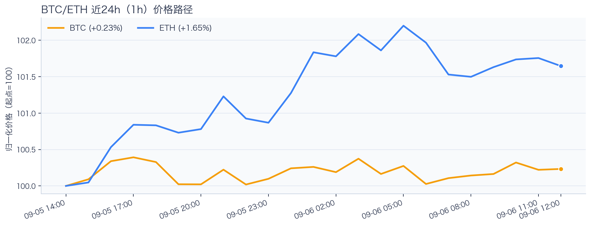
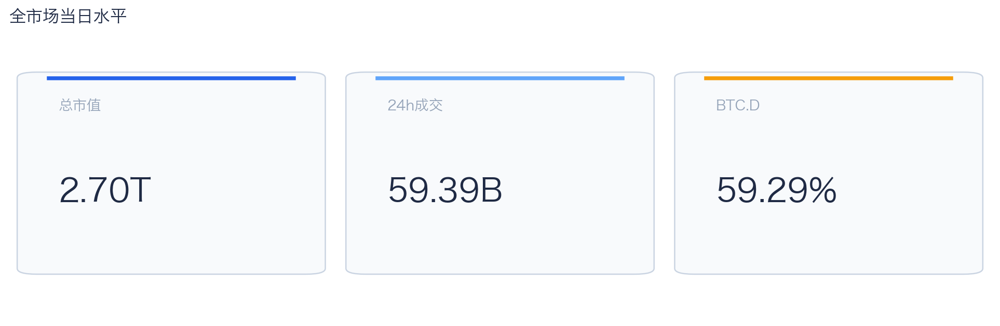
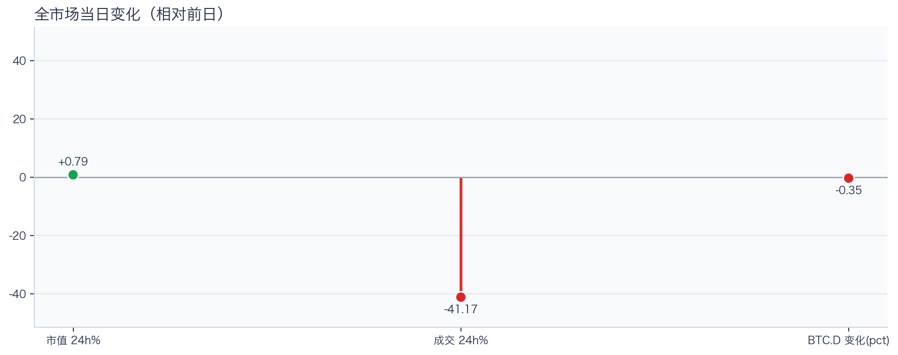
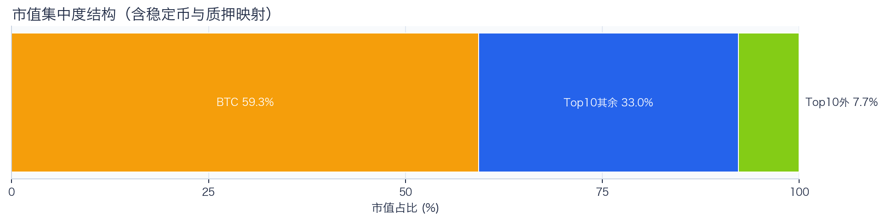
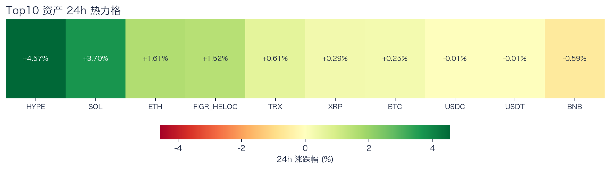
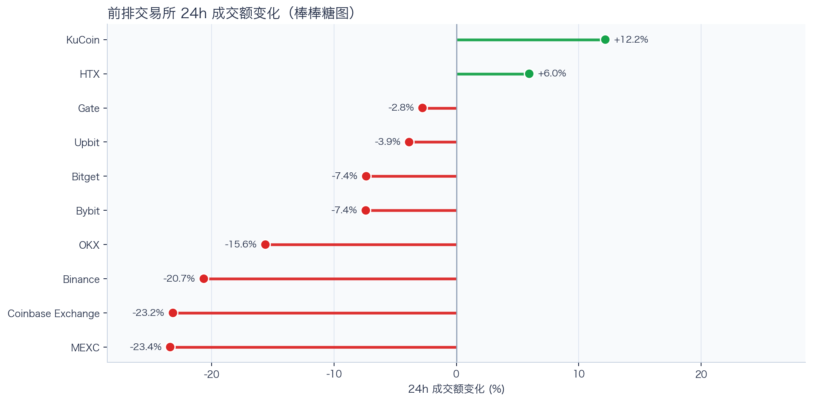
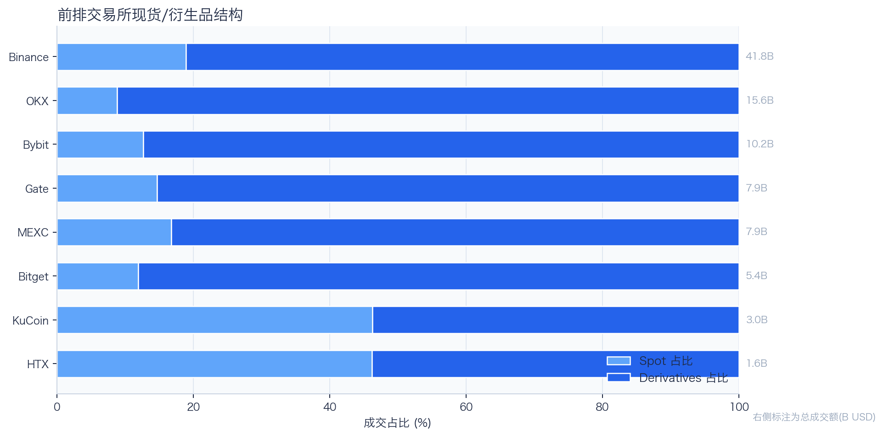
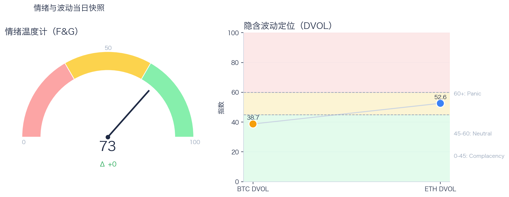

# 二级市场日报（2026-09-06）

## 快速结论
- 全市场指标当日：市值 $2.70T（24h +0.79%），成交额 $59.39B（24h -41.17%）。
- BTC 主导率 59.29%（-0.35 个百分点），Top10 外市值占比（集中度口径）7.72%。
- 头部风险资产（排除稳定币、质押及信用映射）上涨 6 / 下跌 1 / 平盘 0，平均涨跌幅 +1.49%，首尾相差 5.16 个百分点。
- 前排交易所样本成交普遍收缩：上涨 2 家、下跌 8 家，24h 变化均值 -8.61%。
- 代币化股票（Tokenized Stocks）类别规模 $2.92B，7D +12.01%。

## 市场主线
今日市场状态为“缩量修复”。市值上升但成交下降，价格修复尚未得到交易活跃度确认。头部风险资产上涨覆盖率较高，但该样本不能外推为长尾扩散。当前证据尚不足以确认新一轮趋势启动。

成交方面，多数平台样本走弱，当前只支持成交收缩和降幅分化，不支持资金回流判断。资金费率未显示极端拥挤，但单一平台样本不能代表全市场杠杆状态。DVOL 处于相对低位，但不能单凭该指标判断期权保护成本。情绪处于偏乐观区，且较前一观测日持平；若成交不跟随，需防止短线追高回撤。几项指标共同用于确认市场状态，但暂不足以归因于特定事件。

## BTC/ETH 24h 趋势

口径：价格涨跌采用滚动24小时口径；图表路径仅用于观察盘中节奏，图内首尾变化 BTC +0.23%、ETH +1.65%，不能与滚动24小时涨跌直接比较，两者窗口不可混用。
- BTC（滚动24小时）：$79,971.99（+0.31%，区间 $79,545.96 - $80,200.00，当前位于区间 65%）=> 区间震荡。
- ETH（滚动24小时）：$2,501.14（+1.73%，区间 $2,450.00 - $2,523.97，当前位于区间 69%）=> 偏强震荡。
- 简评：BTC 与 ETH 均温和上涨，ETH 相对更强，但幅度尚未达到强趋势阈值。

## 市场结构与交易状态
### 市场脉冲

当日，全市场市值 $2.70T，24h 成交额 $59.39B，BTC 主导率 59.29%。
价格上涨但成交回落，反弹质量偏弱，需警惕高位回吐。

相对前一观测日，市值 +0.79%、成交 -41.17%、BTC.D -0.35 个百分点。
市值与成交是同步观测；缺少事件时点和资金路径证据时，暂不作特定事件归因。

### 市场广度与集中度

当前市值结构为 BTC 59.29% / Top10 其余 32.99% / Top10 外 7.72%。该图含稳定币与质押映射，只描述集中度，不证明风险偏好扩散。
方向样本为 7 个头部风险资产，已排除稳定币、质押资产及信用映射；Top10 外占比仅是市值集中度，不作为风险扩散代理。

### 资产与交易结构

按头部资产统一快照口径，领涨的是 HYPE（+4.57%），跌幅最大的是 BNB（-0.59%），均值 +1.49%，首尾相差 5.16 个百分点。
上涨占多数，但该方向样本仅覆盖 7 个头部风险资产，不能据此判断风险偏好已扩散或市场进入结构轮动阶段。对交易而言，继续比较相对强弱，不把有限的单日收益差夸大为显著结构行情。

前排样本上涨 2 家、下跌 8 家，均值 -8.61%。KuCoin 最强（+12.18%），MEXC 最弱（-23.40%）。
最强与最弱平台的 24h 变化差达到 35.58 个百分点，说明平台间成交变化分化，但不能据此推断资金因果流向。报价连续性和滑点是否同步变化仍需盘口数据验证，执行层面应继续监控成交质量。

样本内衍生品成交占比 81.26%。该比例描述成交结构，不单独用于判断后续波动方向或幅度。
衍生品仍是主导成交形态，但该占比不能单独证明价格由杠杆情绪驱动。后续需用盘口深度、强平和事件窗口数据验证具体传导机制。

### 杠杆与风险定价
Deribit 样本的资金费率（Funding）接近中性，BTC/ETH 8h 费率分别为 +0.00bps / +0.19bps；隐含波动率指数（DVOL）位于 Complacency（低波动定价） / Neutral（中性波动定价）。
| 资产 | OKX 多头清算样本 | OKX 空头清算样本 | 近月年化基差 | 远月年化基差 | ATM IV | 25Δ 偏度 |
|---|---:|---:|---:|---:|---:|---:|
| BTC | $1.14M | $1.12M | -1.20% | +2.75% | 37.58% | -1.42 个百分点 |
| ETH | $2.30M | $851,940 | +4.96% | +4.79% | 49.06% | -4.27 个百分点 |
清算口径：仅为 OKX 近期样本，不代表 OKX 或全市场清算总量；25Δ 偏度定义为 Put IV 减 Call IV。
Funding 未显示明显的方向性拥挤；BTC/ETH DVOL 分别处于低波动定价与中性波动定价，主要反映波动水平而非方向。两者均不足以判断尾部风险是否重新抬升。因此，更适合围绕波动管理仓位和节奏，而非激进追逐单边。

恐惧与贪婪指数（F&G）当日 73（较前一观测日持平）；BTC/ETH DVOL 为 38.72/52.58，对应 Complacency（低波动定价） / Neutral（中性波动定价）。
情绪处于偏乐观区，较前一观测日持平，需关注是否出现过热信号与波动回摆。只有当情绪、广度和成交三者同时改善，市场才更可能从“反弹交易”切换到“趋势交易”。

### 关键价位与失效条件
| 资产 | 24h 支撑 | 24h 阻力 | ATR14(1h) | 向上触发 | 多头失效 | 向下触发 | 空头失效 |
|---|---:|---:|---:|---:|---:|---:|---:|
| BTC | 79578.23 | 80207.28 | 180.78 | 80287.20 | 80127.36 | 79498.31 | 79658.15 |
| ETH | 2454.12 | 2522.98 | 10.90 | 2525.70 | 2520.26 | 2451.40 | 2456.84 |
计算口径：以近24小时内可得的 23 个 1h 价格点的高低点作为支撑/阻力，触发缓冲取现价 0.1% 与 0.25×ATR14 的较大值；触发价用于观察确认，不是自动交易指令。

## 今日差异化重点
### 稳定币收益与资金成本
- 收益端：本期可得协议样本中，Aave-USDC 的总年化收益率（Total APY）为 5.33%，需继续区分原生利率与奖励补贴。
- 资金需求：本期可得样本最高利用率 93.51%；高利用率意味着借款需求较强，也可能压缩退出流动性。
- 跨平台成本：本期可得报价中，USDC 借币年化样本差约 0.95 个百分点，适合继续核对额度、期限和地区准入，不直接视为套利利差。

### RWA 与 24×7 映射交易
- 映射异动：NFLX 24h -4.89%，属于今日 RWA 观察池中幅度较大的标的；底层市场非连续交易时不作溢折价结论。
- 类别结构：最近一次可得类别快照显示，代币化股票规模约 $2.92B，7D +12.01%；该变化用于判断产品线活跃度，不直接外推大盘方向。
- 链上验证：本期观察范围内未发现活跃聪明钱信号；这不等于不存在相关持仓或交易，异动仍需结合底层价格、成交与事件证据确认。

## 未来24小时观察
1. 若头部风险资产上涨覆盖率连续改善且 BTC.D 回落，再结合更广币种样本验证风险偏好是否扩散。
2. 若衍生品占比继续上升而 Funding 仍中性，只能确认成交结构进一步偏向衍生品；是否放大波动，仍需结合 DVOL、持仓、强平与成交验证。
3. 若 F&G 回升而 DVOL 不降，代表情绪改善尚未获得风险定价确认，应降低对追涨信号的置信度。

## 交易与风控含义
- 仓位管理优先级高于方向押注，建议保持核心仓位稳定、战术仓位滚动。
- 若衍生品占比上升并伴随 Funding 快速偏离中性或 DVOL 抬升，再考虑降低杠杆并收紧风险参数。
- 关注情绪改善与广度扩散是否同步发生，二者背离时避免追逐单边。
