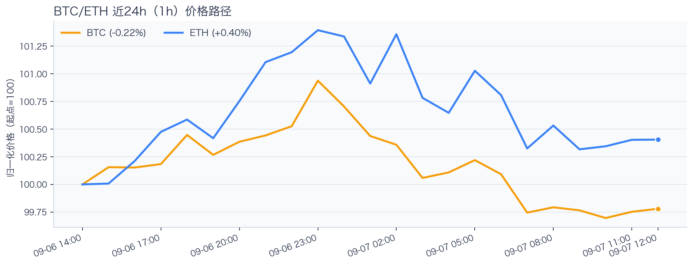
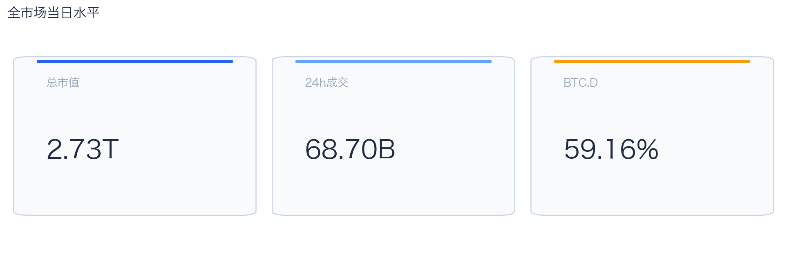
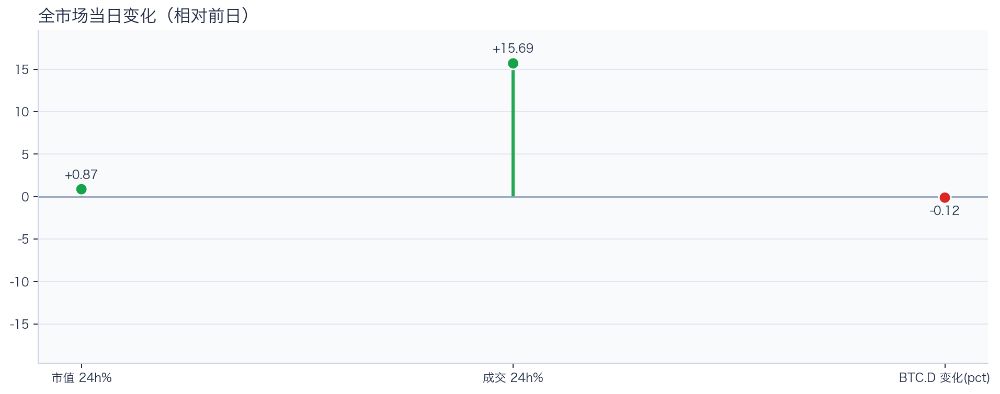
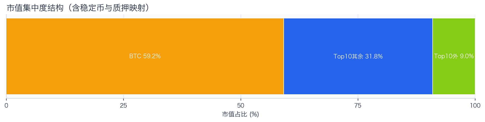
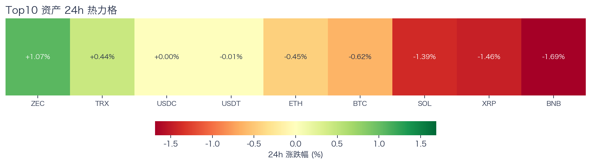
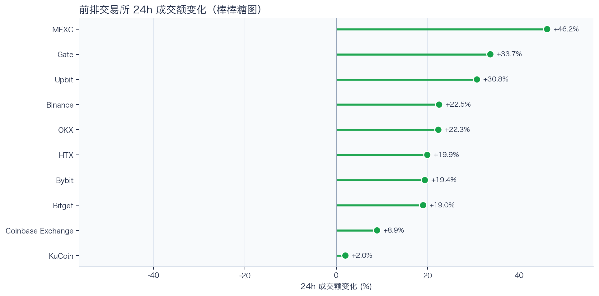
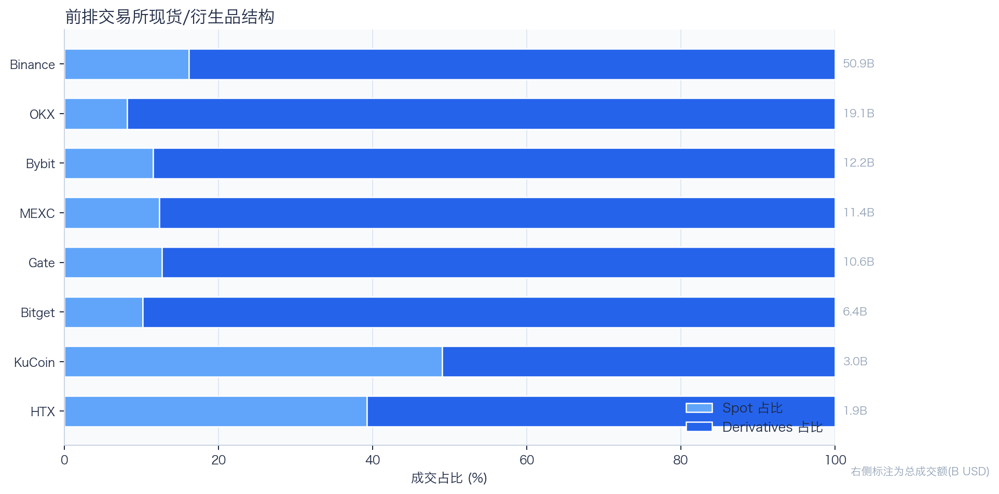
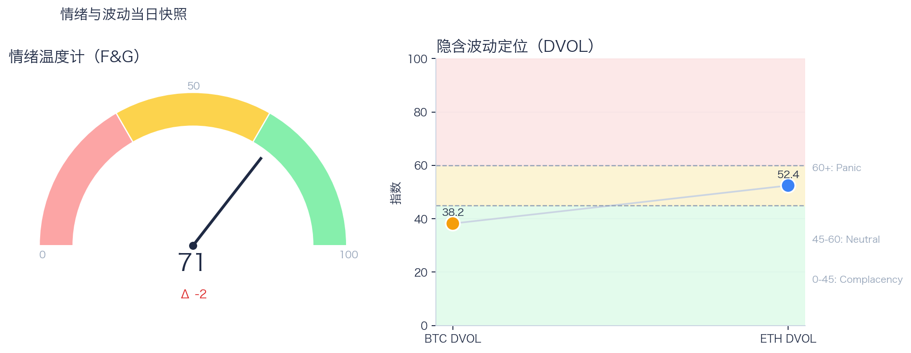

# 二级市场日报（2026-09-07）

## 快速结论
- 全市场指标当日：市值 $2.73T（24h +0.87%），成交额 $68.70B（24h +15.69%）。
- BTC 主导率（BTC.D）59.16%（-0.12pct），Top10 外市值占比（集中度口径）9.05%。
- 头部风险资产（排除稳定币、质押及信用映射）上涨 2 / 下跌 5 / 平盘 0，平均涨跌幅 -0.59%，首尾分化 2.76pct。
- 前排交易所样本成交普遍回升：上涨 10 家、下跌 0 家，24h 变化均值 +22.48%。
- Tokenized Stocks 类别规模 $2.88B，7D +13.62%。

## 市场主线
今日市场状态为“区间交易”：全市场市值与成交额较前一观测日分别上升 0.87% 和 15.69%，但 BTC、ETH 24h 价格分别下跌 0.62% 和 0.44%，头部风险资产均值为 -0.59%，尚未形成可确认的趋势突破。市场仍在区间内进行结构轮动，头部风险资产下跌覆盖率较高，风险参与度偏弱。

交易所样本成交额多数回升，但盘口深度、报价连续性和滑点尚未验证，不能直接等同于流动性改善。Deribit 资金费率未显示极端拥挤，DVOL 处于低/中性波动定价；单一平台和单一指标不足以概括全市场杠杆或期权保护成本。情绪处于偏乐观区，若成交和广度不跟随，需防范短线追高回撤。上述指标用于确认市场状态，不足以归因于特定事件。

## BTC/ETH 24h 趋势

口径：文字涨跌来自交易所 rolling 24h ticker；图内路径为当前可得 23 个小时点，首尾变化 BTC -0.22%、ETH +0.40%，两者窗口不可混用。
- BTC（交易所 rolling 24h）：$79,423.93（-0.62%，区间 $79,016.91 - $80,534.51，当前位于区间 27%）=> 区间震荡。
- ETH（交易所 rolling 24h）：$2,489.65（-0.44%，区间 $2,463.97 - $2,535.73，当前位于区间 36%）=> 区间震荡。
- 简评：BTC 与 ETH 出现分化，短线以结构性机会为主。

## 市场结构与交易状态
### 市场脉冲

当日，全市场市值 $2.73T，24h 成交额 $68.70B，BTC 主导率 59.16%。
市值与成交额同步上行，显示交易活跃度回升；但价格和上涨覆盖率尚未确认修复延续，仍需观察后续价格表现。

相对前一观测日，市值 +0.87%、成交 +15.69%、BTC 主导率 -0.12pct。
市值与成交是同步观测；缺少事件时点和资金路径证据时，暂不作特定事件归因。

### 市场广度与集中度

当前市值结构为 BTC 59.16% / Top10 其余 31.79% / Top10 外 9.05%。该图含稳定币与质押映射，只描述集中度，不证明风险偏好扩散。
方向样本为 7 个头部风险资产，已排除稳定币、质押资产及信用映射；Top10 外占比仅是市值集中度，不作为风险扩散代理。

### 资产与交易结构

按头部资产统一快照口径，领涨的是 ZEC（+1.07%），跌幅最大的是 BNB（-1.69%），均值 -0.59%，首尾相差 2.76pct。
下跌家数占优，风险偏好修复仍较脆弱，短线追高性价比一般。对交易而言，优先控制回撤并等待上涨覆盖率改善。

前排样本上涨 10 家、下跌 0 家，均值 +22.48%。MEXC 最强（+46.16%），KuCoin 最弱（+2.00%）。
最强与最弱平台的 24h 变化差约为 44 个百分点，说明平台间成交变化分化，但不能据此推断资金因果流向。报价连续性和滑点是否同步变化仍需盘口数据验证，执行层面应继续监控成交质量。

样本内衍生品成交占比 83.67%。该比例描述成交结构，不单独用于判断后续波动方向或幅度。
衍生品仍是主导成交形态，但该占比不能单独证明价格由杠杆情绪驱动。后续需用盘口深度、强平和事件窗口数据验证具体传导机制。

### 杠杆与风险定价
Deribit 样本的资金费率（Funding）接近中性，BTC/ETH 8h 费率分别为 +0.00bps / +0.04bps；隐含波动率指数（DVOL）位于 Complacency（低波动定价） / Neutral（中性波动定价）。
| 资产 | OKX 多头清算样本 | OKX 空头清算样本 | 近月年化基差 | 远月年化基差 | ATM IV | 25Δ 偏度 |
|---|---:|---:|---:|---:|---:|---:|
| BTC | $1.24M | $549 | -0.33% | +2.68% | 37.15% | -1.49 pp |
| ETH | $2.29M | $15,904 | +2.38% | +4.27% | 48.62% | -2.40 pp |
清算口径：仅为 OKX 公共接口返回的近期样本，不代表 OKX 或全市场清算总量；25Δ 偏度定义为 Put IV 减 Call IV。
Deribit 样本资金费率未显示极端方向拥挤，DVOL 仅反映期权隐含波动率定价，当前处于低/中性区间；两者均不足以判断全市场方向性拥挤或尾部风险是否重新抬升。因此，更合适的做法不是激进追单边，而是围绕波动管理仓位和节奏。

恐惧与贪婪指数（F&G）当日 71（较前一观测日 -2）；BTC/ETH DVOL 为 38.19/52.43，对应 Complacency（低波动定价） / Neutral（中性波动定价）。
情绪进入偏乐观区，需关注是否出现过热信号与波动回摆。只有当情绪、广度和成交三者同时改善，市场才更可能从“反弹交易”切换到“趋势交易”。

### 关键价位与失效条件
| 资产 | 24h 支撑 | 24h 阻力 | ATR14(1h) | 向上触发 | 多头失效 | 向下触发 | 空头失效 |
|---|---:|---:|---:|---:|---:|---:|---:|
| BTC | 79016.91 | 80534.51 | 292.34 | 80613.93 | 80455.09 | 78937.49 | 79096.33 |
| ETH | 2463.97 | 2535.73 | 13.01 | 2538.98 | 2532.48 | 2460.72 | 2467.22 |
计算口径：以当前可得 23 个 1h 小时点的高低点作为支撑/阻力，触发缓冲取现价 0.1% 与 0.25×ATR14 的较大值；触发价用于观察确认，不是自动交易指令。

## 今日差异化重点
### 稳定币收益与资金成本
- 收益端：本期可得协议样本中，Compound-USDC 的 Total APY 为 6.92%，需继续区分原生利率与奖励补贴。
- 资金需求：本期可得样本最高利用率为 93.26%；高利用率通常与借款需求较强或可用流动性较低相关，可能增加退出压力，但单一快照不能确认其原因或实际退出流动性。
- 跨平台成本：本期可得报价中，USDC 借币年化样本差约 2.61pct，适合继续核对额度、期限和地区准入，不直接视为套利利差。

### RWA 与 24×7 映射交易
- 映射异动：NFLX 24h -4.89%，属于今日 RWA 观察池中幅度较大的标的；底层市场非连续交易时不作溢折价结论。
- 类别结构：Tokenized Stocks 规模约 $2.88B、7D +13.62%，只能说明该类别规模变化；在缺少成交额或周转率数据时，不将其直接解释为产品线交易活跃度，也不外推大盘方向。
- 链上验证：公开聪明钱信号页在已覆盖标的中未命中活跃记录；这不等于不存在相关持仓或交易，异动仍需结合底层价格、成交与事件证据确认。

## 未来24小时观察
1. 若头部风险资产上涨覆盖率连续改善且 BTC 主导率回落，再结合更广币种样本验证风险偏好是否扩散。
2. 若衍生品占比继续上升而 funding 仍中性，只能确认交易向杠杆侧集中；是否放大波动仍需结合 DVOL 与成交验证。
3. 若 F&G 回升而 DVOL 不降，代表情绪改善尚未获得风险定价确认，应降低对追涨信号的置信度。

## 交易与风控含义
- 仓位管理优先级高于方向押注，建议保持核心仓位稳定、战术仓位滚动。
- 若衍生品占比上升并伴随 Funding 快速偏离中性或 DVOL 抬升，再考虑降低杠杆并收紧风险参数。
- 关注情绪改善与广度扩散是否同步发生，二者背离时避免追逐单边。
