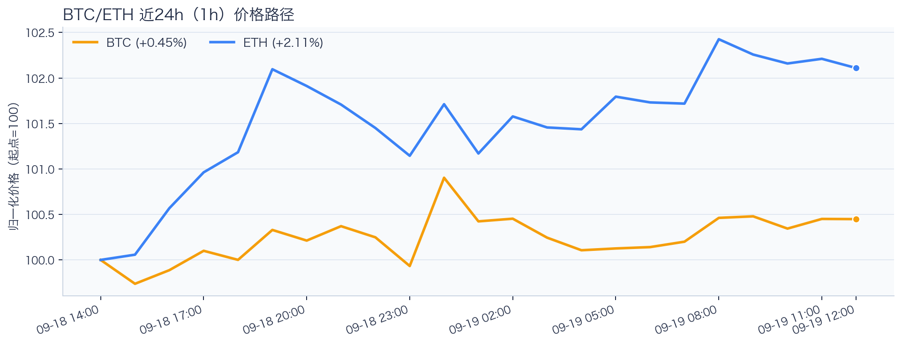
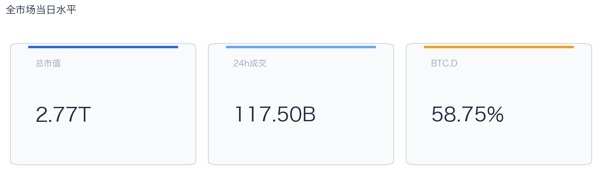
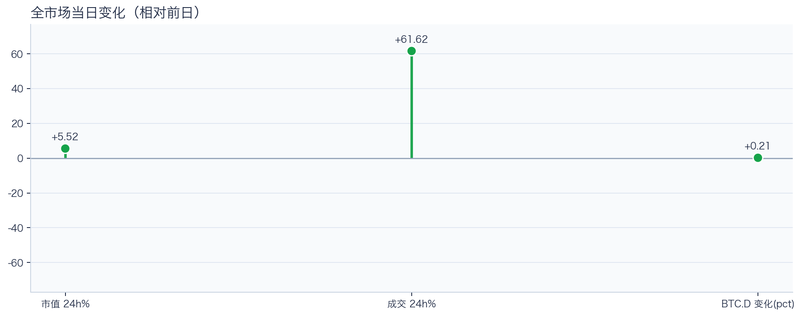
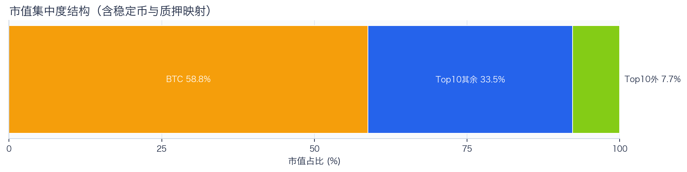
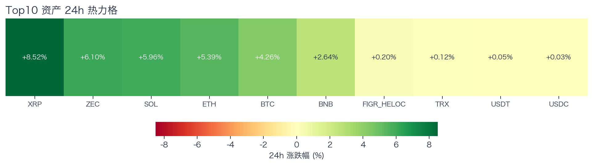
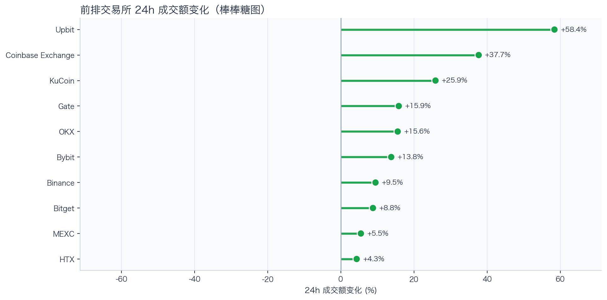
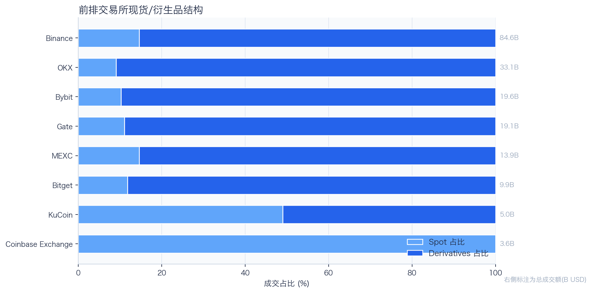
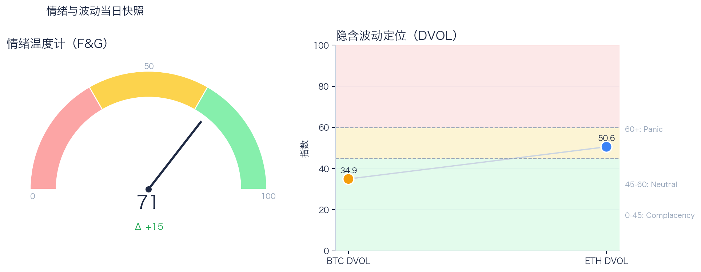

# 二级市场日报（2026-09-19）

## 快速结论
- 全市场指标当日：市值 $2.77T（24h +5.52%），成交额 $117.50B（24h +61.62%）。
- BTC 主导率 58.75%（+0.21pct），Top10 外市值占比（集中度口径）7.71%。
- 头部风险资产（排除稳定币、质押及信用映射）上涨 7 / 下跌 0 / 平盘 0，平均涨跌幅 +4.71%，首尾分化 8.40pct。
- 前排交易所样本成交普遍回升：上涨 10 家、下跌 0 家，24h 变化均值 +19.54%。
- Tokenized Stocks 类别规模 $3.06B，7D +15.89%。

## 市场主线
今日市场状态为“交易性修复”：价格与成交同步上行，头部风险资产样本普涨；但样本未覆盖长尾，暂不足以判断涨势扩散或新趋势启动。

前排平台样本成交回升，但盘口深度、报价连续性与滑点尚未验证，不能直接视为流动性改善。资金费率为正但接近中性，当前快照不足以确认杠杆拥挤；应继续观察费率、未平仓量和 DVOL 是否共同变化。DVOL 不足以单独判断期权保护成本；F&G 回到偏乐观区，若成交转弱，需警惕短线追高。上述信号用于描述盘面状态，尚不足以归因于特定事件。

## BTC/ETH 24h 趋势

口径：文字涨跌来自交易所 rolling 24h ticker；图内路径为当前可得 23 个小时点，首尾变化 BTC +0.45%、ETH +2.11%，两者窗口不可混用。
- BTC（交易所 rolling 24h）：$81,301.04（+4.16%，区间 $77,972.30 - $81,741.00，当前位于区间 88%）=> 偏强，上行主导。
- ETH（交易所 rolling 24h）：$2,639.70（+5.30%，区间 $2,494.37 - $2,662.85，当前位于区间 86%）=> 偏强，上行主导。
- 简评：BTC 与 ETH 同步偏强，短线仍有上行动能。

## 市场结构与交易状态
### 市场脉冲

当日，全市场市值 $2.77T，24h 成交额 $117.50B，BTC 主导率 58.75%。
价格与成交同步上行，属于健康修复结构；若次日成交不掉队，修复延续概率更高。

相对前一观测日，市值 +5.52%、成交 +61.62%、BTC.D +0.21pct。
市值与成交是同步观测；缺少事件时点和资金路径证据时，暂不作特定事件归因。

### 市场广度与集中度

当前市值结构为 BTC 58.75% / Top10 其余 33.53% / Top10 外 7.71%。该图含稳定币与质押映射，只描述集中度，不证明风险偏好扩散。
方向样本为 7 个头部风险资产，已排除 USDT, USDC, FIGR_HELOC；Top10 外占比仅是市值集中度，不作为风险扩散代理。

### 资产与交易结构

按头部资产统一快照口径，领涨的是 XRP（+8.52%），尾部的是 TRX（+0.12%），均值 +4.71%，首尾相差 8.40pct。
上涨家数明显占优，但资产间强弱仍有差异，反弹广度好于集中度信号。对交易而言，继续比较相对强弱，但不把有限的单日收益差夸大为显著结构行情。

前排样本上涨 10 家、下跌 0 家，均值 +19.54%。Upbit 最强（+58.42%），HTX 最弱（+4.35%）。
最强与最弱平台的 24h 变化差达到 54.08pct，说明平台间成交变化分化，但不能据此推断资金因果流向。报价连续性和滑点是否同步变化仍需盘口数据验证，执行层面应继续监控成交质量。

样本内衍生品成交占比 83.63%。该比例描述成交结构，不单独用于判断后续波动方向或幅度。
衍生品仍是主导成交形态，但该占比不能单独证明价格由杠杆情绪驱动。后续需用盘口深度、强平和事件窗口数据验证具体传导机制。

### 杠杆与风险定价
Deribit 样本的资金费率（Funding）接近中性，BTC/ETH 8h 费率分别为 +0.36bps / +1.33bps；隐含波动率指数（DVOL）位于 Complacency（低波动定价） / Neutral（中性波动定价）。
| 资产 | OKX 多头清算样本 | OKX 空头清算样本 | 近月年化基差 | 远月年化基差 | ATM IV | 25Δ 偏度 |
|---|---:|---:|---:|---:|---:|---:|
| BTC | $1,033 | $996,679 | +6.75% | +4.96% | 33.62% | -1.25 pp |
| ETH | $428,736 | $48,581 | +8.26% | +4.63% | 46.94% | -3.39 pp |
清算口径：仅为 OKX 公共接口返回的近期样本，不代表 OKX 或全市场清算总量；25Δ 偏度定义为 Put IV 减 Call IV。
价格上行与资金费率接近中性并存，当前快照未显示明显追多拥挤。OKX 近期样本中，BTC 空头清算量高于多头，ETH 则相反；样本只覆盖约 2 小时，不代表全市场。交易上优先围绕波动管理仓位和节奏。

恐惧与贪婪指数（F&G）当日 71（较前一观测日 +15）；BTC/ETH DVOL 为 34.93/50.56，对应 Complacency（低波动定价） / Neutral（中性波动定价）。
情绪进入偏乐观区，需关注是否出现过热信号与波动回摆。只有当情绪、广度和成交三者同时改善，市场才更可能从“反弹交易”切换到“趋势交易”。

### 关键价位与失效条件
| 资产 | 24h 支撑 | 24h 阻力 | ATR14(1h) | 向上触发 | 多头失效 | 向下触发 | 空头失效 |
|---|---:|---:|---:|---:|---:|---:|---:|
| BTC | 80073.09 | 81741.00 | 292.30 | 81822.30 | 81659.70 | 79991.79 | 80154.39 |
| ETH | 2554.47 | 2662.85 | 15.67 | 2666.77 | 2658.93 | 2550.55 | 2558.39 |
计算口径：以当前可得 23 个 1h 小时点的高低点作为支撑/阻力，触发缓冲取现价 0.1% 与 0.25×ATR14 的较大值；触发价用于观察确认，不是自动交易指令。

## 今日差异化重点
### 稳定币收益与资金成本
- 收益端：Compound-USDS 样本 APY 为 8.04%，但该池 TVL 约 $1.76M、利用率约 91.50%，适用容量与退出流动性需单独评估。
- 资金需求：本期可得样本最高利用率 92.50%；高利用率意味着借款需求较强，也可能压缩退出流动性。
- 跨平台成本：本期可得报价中，USDC 借币年化样本差约 2.92pct，适合继续核对额度、期限和地区准入，不直接视为套利利差。

### RWA 与 24×7 映射交易
- 映射异动：MSTR 24h +15.03%，属于今日 RWA 观察池中幅度较大的标的；底层市场非连续交易时不作溢折价结论。
- 类别结构：最近一次可得类别快照显示，Tokenized Stocks 规模约 $3.06B，7D +15.89%；该变化用于判断产品线活跃度，不直接外推大盘方向。
- 链上验证：公开聪明钱信号页在已覆盖标的中未命中活跃记录；这不等于不存在相关持仓或交易，异动仍需结合底层价格、成交与事件证据确认。

### 事件驱动与市场响应
- 事件背景：RWA 新闻样本中有 5 条涉及 COIN，其中 Coinbase CEO 回应 CLARITY 法案延误报道对应的 COIN 事件后 4 小时收益为 +0.40%；缺少有效基准，无法判断异常收益或事件影响。
- 市场观察：ETH 的事件窗口收益对应另一条 HYPE 杠杆交易报道，不与上述 COIN 新闻配对。事件时点附近的价格变化只能作为观察线索，现有数据不足以证明事件导致行情变化。

## 未来24小时观察
1. 若头部风险资产上涨覆盖率连续改善且 BTC.D 回落，再结合更广币种样本验证风险偏好是否扩散。
2. 若衍生品占比继续上升而 funding 仍中性，只能确认交易向杠杆侧集中；是否放大波动仍需结合 DVOL 与成交验证。
3. 若 F&G 回升而 DVOL 不降，代表情绪改善尚未获得风险定价确认，应降低对追涨信号的置信度。

## 交易与风控含义
- 仓位管理优先级高于方向押注，建议保持核心仓位稳定、战术仓位滚动。
- 若衍生品占比上升并伴随 Funding 快速偏离中性或 DVOL 抬升，再考虑降低杠杆并收紧风险参数。
- 关注情绪改善与广度扩散是否同步发生，二者背离时避免追逐单边。
