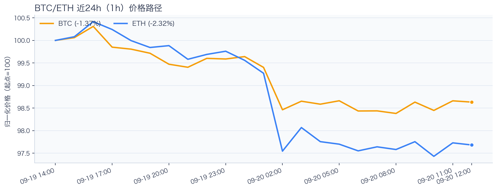
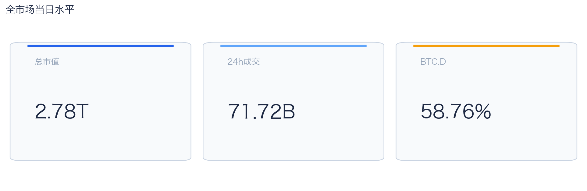
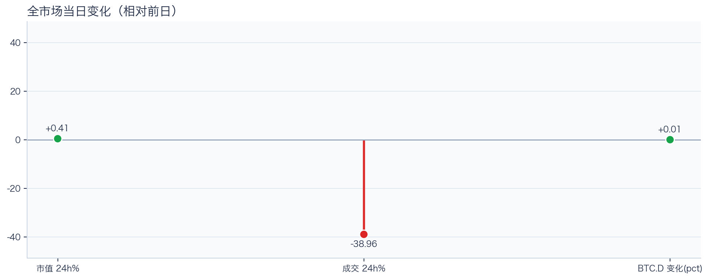
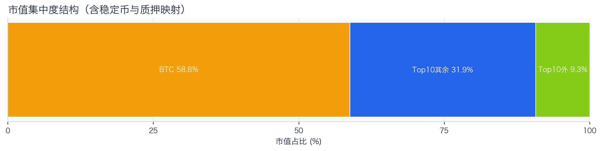
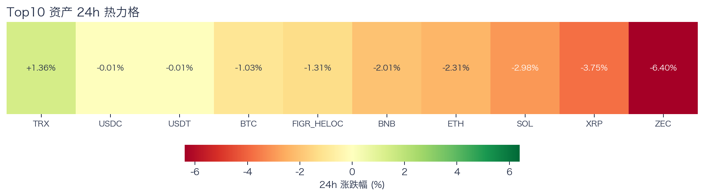
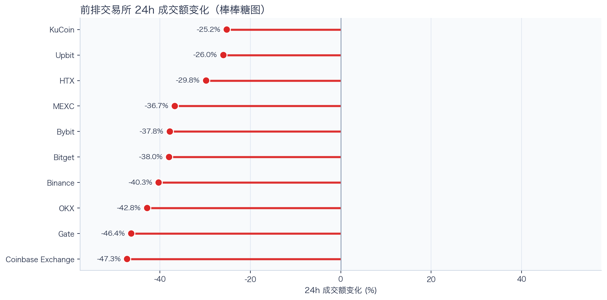
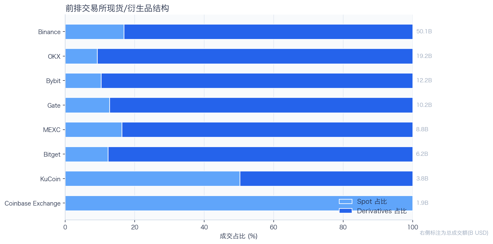
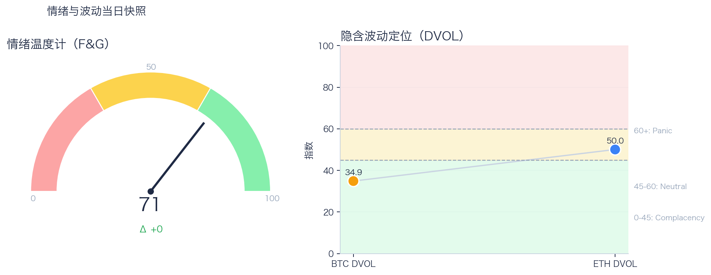

# 二级市场日报（2026-09-20）

## 快速结论
- 全市场指标当日：市值 $2.78T（24h +0.41%），成交额 $71.72B（24h -38.96%）。
- BTC 主导率 58.76%（+0.01pct），Top10 外市值占比（集中度口径）9.29%。
- 头部风险资产（排除稳定币、质押及信用映射）上涨 1 / 下跌 6 / 平盘 0，平均涨跌幅 -2.45%，首尾分化 7.76pct。
- 前排交易所样本成交普遍收缩：上涨 0 家、下跌 10 家，24h 变化均值 -37.03%。
- Tokenized Stocks 类别规模 $3.01B，7D +12.43%。

## 市场主线
今日市场呈现“总市值微升、风险资产偏弱”的分化：全市场市值（24h）上升 0.41%，成交额（24h）下降 38.96%；BTC/ETH 24h 分别下跌 1.02%/2.34%，头部风险资产样本为 1 涨 6 跌。市值回升尚未得到价格广度与成交配合，现有证据不足以确认新一轮趋势启动。

交易所样本显示成交普遍收缩，但不足以判断资金回流。BTC/ETH 8h 资金费率分别为 +0.70bps/+1.12bps，接近中性；DVOL 分别处于低波动定价与中性区，单凭 DVOL 不足以判断期权保护成本。F&G 为 71、较前一观测日持平，处于偏乐观区；若成交未跟进，短线回撤风险仍需关注。上述观测暂不足以归因于特定事件。

## BTC/ETH 24h 趋势

口径：文字涨跌来自交易所 rolling 24h ticker；图内路径为当前可得 23 个小时点，首尾变化 BTC -1.37%、ETH -2.32%，两者窗口不可混用。
- BTC（交易所 rolling 24h）：$80,470.03（-1.02%，区间 $80,126.04 - $81,951.00，当前位于区间 19%）=> 偏弱震荡。
- ETH（交易所 rolling 24h）：$2,577.83（-2.34%，区间 $2,564.33 - $2,668.00，当前位于区间 13%）=> 偏弱，下行主导。
- 简评：BTC 偏弱震荡下行，ETH 相对更弱。

## 市场结构与交易状态
### 市场脉冲

当日，全市场市值 $2.78T，24h 成交额 $71.72B，BTC 主导率 58.76%。
全市场市值小幅上升、成交额明显回落；头部风险资产多数下跌，反弹广度偏弱。

相对前一观测日，市值 +0.41%、成交 -38.96%、BTC.D +0.01pct。
市值与成交是同步观测；缺少事件时点和资金路径证据时，暂不作特定事件归因。

### 市场广度与集中度

当前市值结构为 BTC 58.76% / Top10 其余 31.95% / Top10 外 9.29%。该图含稳定币与质押映射，只描述集中度，不证明风险偏好扩散。
方向样本为 7 个头部风险资产，已排除 USDT, USDC, FIGR_HELOC；Top10 外占比仅是市值集中度，不作为风险扩散代理。

### 资产与交易结构

按头部资产统一快照口径，领涨的是 TRX（+1.36%），跌幅最大的是 ZEC（-6.40%），均值 -2.45%，首尾相差 7.76pct。
下跌家数占优，风险偏好修复仍较脆弱，短线追高性价比一般。对交易而言，优先控制回撤并等待上涨覆盖率改善。

前排样本上涨 0 家、下跌 10 家，均值 -37.03%。KuCoin 最强（-25.23%），Coinbase Exchange 最弱（-47.28%）。
样本平台成交普遍收缩，最小与最大降幅相差 22.06pct；这只说明收缩幅度不同，不构成流动性回流或价格发现能力增强的证据。报价连续性和滑点是否同步变化仍需盘口数据验证，执行层面应继续监控成交质量。

样本内衍生品成交占比 81.65%。该比例描述成交结构，不单独用于判断后续波动方向或幅度。
衍生品仍是主导成交形态，但该占比不能单独证明价格由杠杆情绪驱动。后续需用盘口深度、强平和事件窗口数据验证具体传导机制。

### 杠杆与风险定价
Deribit 样本的资金费率（Funding）接近中性，BTC/ETH 8h 费率分别为 +0.70bps / +1.12bps；隐含波动率指数（DVOL）位于 Complacency（低波动定价） / Neutral（中性波动定价）。
| 资产 | OKX 多头清算样本 | OKX 空头清算样本 | 近月年化基差 | 远月年化基差 | ATM IV | 25Δ 偏度 |
|---|---:|---:|---:|---:|---:|---:|
| BTC | $989,405 | $573,752 | +8.19% | +5.63% | 32.70% | -0.28 pp |
| ETH | $668,739 | $271,755 | +11.96% | +5.29% | 46.17% | -1.48 pp |
清算口径：仅为 OKX 公共接口返回的近期样本，不代表 OKX 或全市场清算总量；25Δ 偏度定义为 Put IV 减 Call IV。
该表列出 OKX 近期清算样本，不代表全市场流量；结合接近中性的费率及分化的 DVOL，现有快照不足以确认杠杆拥挤或波动放大方向。执行上以既定风险预算管理仓位，不依据单期费率或清算样本追单边。

恐惧与贪婪指数（F&G）当日 71（较前一观测日 +0）；BTC/ETH DVOL 为 34.86/50.05，对应 Complacency（低波动定价） / Neutral（中性波动定价）。
情绪进入偏乐观区，需关注是否出现过热信号与波动回摆。只有当情绪、广度和成交三者同时改善，市场才更可能从“反弹交易”切换到“趋势交易”。

### 关键价位与失效条件
| 资产 | 24h 支撑 | 24h 阻力 | ATR14(1h) | 向上触发 | 多头失效 | 向下触发 | 空头失效 |
|---|---:|---:|---:|---:|---:|---:|---:|
| BTC | 80126.04 | 81951.00 | 283.94 | 82031.47 | 81870.53 | 80045.57 | 80206.51 |
| ETH | 2564.33 | 2668.00 | 15.43 | 2671.86 | 2664.14 | 2560.47 | 2568.19 |
计算口径：以当前可得 23 个 1h 小时点的高低点作为支撑/阻力，触发缓冲取现价 0.1% 与 0.25×ATR14 的较大值；触发价用于观察确认，不是自动交易指令。

## 今日差异化重点
### 跨交易所 Funding 与 Carry
- Funding：样本高位为 Binance-BTC，年化约 10.95%。
- 平台分化：样本低位为 Binance-ETH，年化约 2.49%。
- 可执行性：Funding 与 basis 均有记录的样本可进入 carry 复核，但仍需检查手续费、滑点、保证金和持续性。

### 稳定币收益与资金成本
- 收益端：本期可得协议样本中，Aave-USDT 的 Total APY 为 5.44%，需继续区分原生利率与奖励补贴。
- 资金需求：本期可得样本最高利用率 93.17%；高利用率意味着借款需求较强，也可能压缩退出流动性。
- 跨平台成本：本期可得报价中，USDC 借币年化样本差约 3.01pct，适合继续核对额度、期限和地区准入，不直接视为套利利差。

### RWA 与 24×7 映射交易
- 映射异动：MARA 24h +13.96%，属于今日 RWA 观察池中幅度较大的标的；底层市场非连续交易时不作溢折价结论。
- 类别结构：最近一次可得类别快照显示，Tokenized Stocks 规模约 $3.01B，7D +12.43%；该变化用于判断产品线活跃度，不直接外推大盘方向。
- 链上验证：公开聪明钱信号页在已覆盖标的中未命中活跃记录；这不等于不存在相关持仓或交易，异动仍需结合底层价格、成交与事件证据确认。

## 未来24小时观察
1. 若头部风险资产上涨覆盖率连续改善且 BTC.D 回落，再结合更广币种样本验证风险偏好是否扩散。
2. 若衍生品占比继续上升而 funding 仍中性，只能确认交易向杠杆侧集中；是否放大波动仍需结合 DVOL 与成交验证。
3. 若 F&G 回升而 DVOL 不降，代表情绪改善尚未获得风险定价确认，应降低对追涨信号的置信度。

## 交易与风控含义
- 仓位管理优先级高于方向押注，建议保持核心仓位稳定、战术仓位滚动。
- 若衍生品占比上升并伴随 Funding 快速偏离中性或 DVOL 抬升，再考虑降低杠杆并收紧风险参数。
- 关注情绪改善与广度扩散是否同步发生，二者背离时避免追逐单边。
