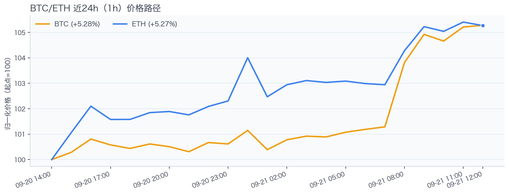
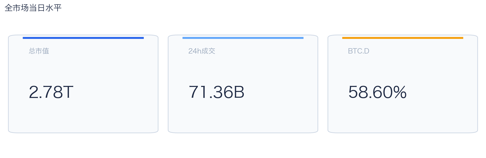
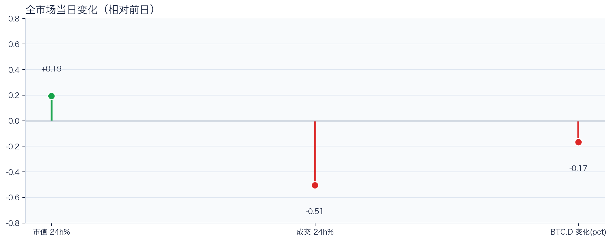
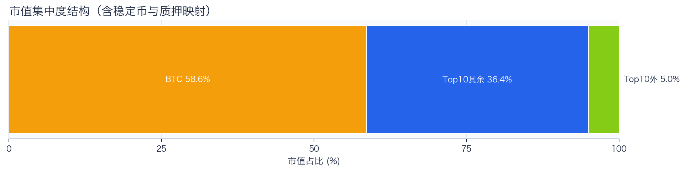
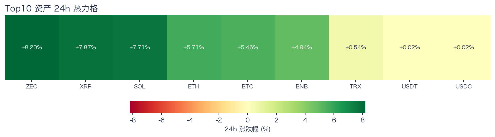
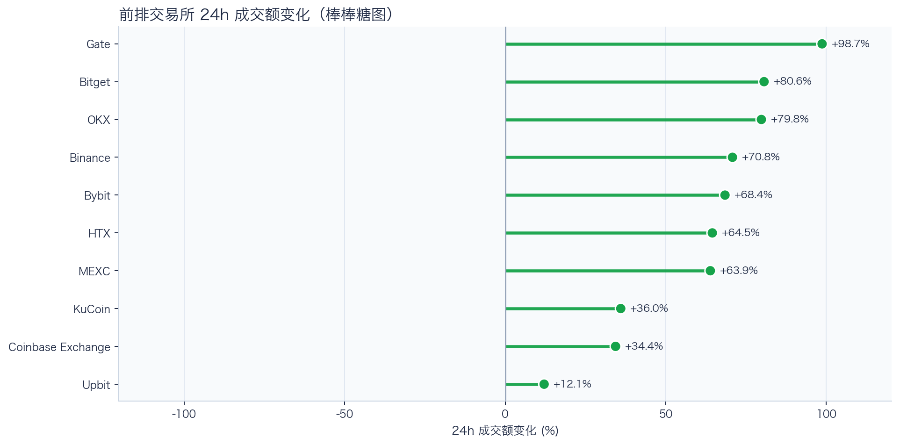
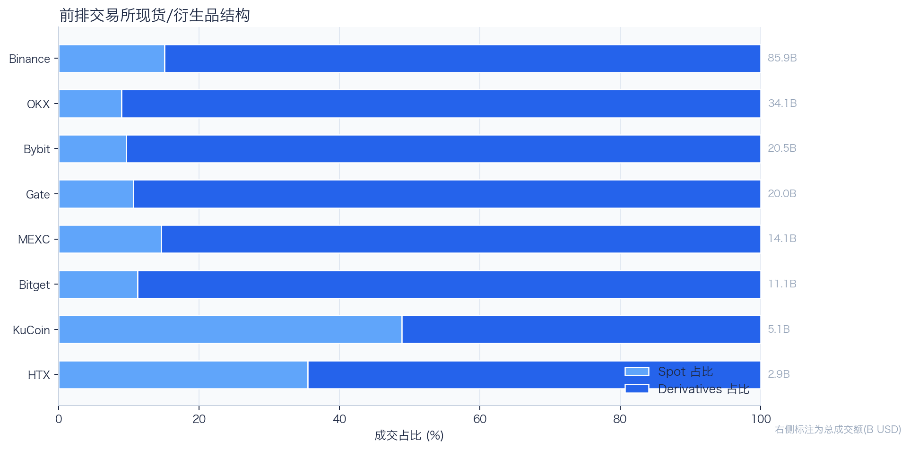
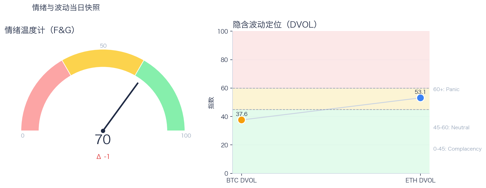

# 二级市场日报（2026-09-21）

## 快速结论
- 全市场指标当日：市值 $2.78T（24h +0.19%），成交额 $71.36B（24h -0.51%）。
- BTC 主导率 58.60%（-0.17pct），Top10 外市值占比（集中度口径）5.02%。
- 头部风险资产（排除稳定币、质押及信用映射）上涨 7 / 下跌 0 / 平盘 0，平均涨跌幅 +5.77%，首尾分化 7.66pct。
- 前排交易所样本成交普遍回升：上涨 10 家、下跌 0 家，24h 变化均值 +60.90%。
- 最新可得快照显示，Tokenized Stocks 类别规模 $3.01B，7D +14.09%。

## 市场主线
今日市场状态为“缩量修复”。市值上升但成交下降，价格修复尚未得到交易活跃度确认。头部风险资产上涨覆盖率较高，但该样本不能外推为长尾扩散。当前证据尚不足以确认新一轮趋势启动。

交易所样本成交普遍回升，但尚无盘口深度、报价连续性和滑点证据，不能等同于流动性改善。Deribit 的 BTC/ETH 8h 资金费率仍接近中性，现有快照不足以确认杠杆拥挤；应结合费率变化和持仓变化再评估回撤风险。DVOL 处于低波动/中性定价区，单凭该指标不足以判断期权保护成本是否便宜。情绪回到偏乐观区，若成交不跟随，需防范短线追高回撤。上述观测用于确认市场状态，暂不足以归因于特定事件。

## BTC/ETH 24h 趋势

口径：文字涨跌来自交易所 rolling 24h ticker；图内路径为当前可得 23 个小时点，首尾变化 BTC +5.28%、ETH +5.27%，两者窗口不可混用。
- BTC（交易所 rolling 24h）：$84,941.18（+5.55%，区间 $80,327.64 - $85,299.87，当前位于区间 93%）=> 偏强，上行主导。
- ETH（交易所 rolling 24h）：$2,721.83（+5.57%，区间 $2,571.96 - $2,749.98，当前位于区间 84%）=> 偏强，上行主导。
- 简评：BTC 与 ETH 同步偏强，短线仍有上行动能。

## 市场结构与交易状态
### 市场脉冲

当日，全市场市值 $2.78T，24h 成交额 $71.36B，BTC 主导率 58.60%。
价格上涨但成交回落，反弹质量偏弱，需警惕高位回吐。

相对前一观测日，市值 +0.19%、成交 -0.51%、BTC.D -0.17pct。
市值与成交是同步观测；缺少事件时点和资金路径证据时，暂不作特定事件归因。

### 市场广度与集中度

当前市值结构为 BTC 58.60% / Top10 其余 36.38% / Top10 外 5.02%。该图含稳定币与质押映射，只描述集中度，不证明风险偏好扩散。
方向样本为 7 个头部风险资产，已排除 USDT, USDC, FIGR_HELOC；Top10 外占比仅是市值集中度，不作为风险扩散代理。

### 资产与交易结构

按头部资产统一快照口径，领涨的是 ZEC（+8.20%），尾部的是 TRX（+0.54%），均值 +5.77%，首尾相差 7.66pct。
上涨家数明显占优，但资产间强弱仍有差异，反弹广度好于集中度信号。对交易而言，继续比较相对强弱，但不把有限的单日收益差夸大为显著结构行情。

前排样本上涨 10 家、下跌 0 家，均值 +60.90%。Gate 最强（+98.68%），Upbit 最弱（+12.11%）。
最强与最弱平台的 24h 变化差达到 86.57pct，说明平台间成交变化分化，但不能据此推断资金因果流向。报价连续性和滑点是否同步变化仍需盘口数据验证，执行层面应继续监控成交质量。

样本内衍生品成交占比 84.24%。该比例描述成交结构，不单独用于判断后续波动方向或幅度。
衍生品仍是主导成交形态，但该占比不能单独证明价格由杠杆情绪驱动。后续需用盘口深度、强平和事件窗口数据验证具体传导机制。

### 杠杆与风险定价
Deribit 样本的资金费率（Funding）接近中性，BTC/ETH 8h 费率分别为 +2.41bps / +1.25bps；隐含波动率指数（DVOL）位于 Complacency（低波动定价） / Neutral（中性波动定价）。
| 资产 | OKX 多头清算样本 | OKX 空头清算样本 | 近月年化基差 | 远月年化基差 | ATM IV | 25Δ 偏度 |
|---|---:|---:|---:|---:|---:|---:|
| BTC | $3,383 | $394,726 | +7.30% | +5.80% | 39.50% | -0.79 pp |
| ETH | $272,857 | $215,601 | +9.72% | +5.12% | 52.63% | -1.56 pp |
清算口径：仅为 OKX 公共接口返回的近期样本，不代表 OKX 或全市场清算总量；25Δ 偏度定义为 Put IV 减 Call IV。
BTC/ETH 8h 资金费率分别为 +2.41bps / +1.25bps，仍接近中性；BTC/ETH DVOL 分别处于低波动定价与中性区。结合 OKX 近期清算样本，现有快照不足以确认杠杆拥挤或波动方向。风险管理宜围绕仓位与失效价位，不依据单期费率或清算样本追单边。

恐惧与贪婪指数（F&G）当日 70（较前一观测日 -1）；BTC/ETH DVOL 为 37.56/53.11，对应 Complacency（低波动定价） / Neutral（中性波动定价）。
情绪进入偏乐观区，需关注是否出现过热信号与波动回摆。只有当情绪、广度和成交三者同时改善，市场才更可能从“反弹交易”切换到“趋势交易”。

### 关键价位与失效条件
| 资产 | 24h 支撑 | 24h 阻力 | ATR14(1h) | 向上触发 | 多头失效 | 向下触发 | 空头失效 |
|---|---:|---:|---:|---:|---:|---:|---:|
| BTC | 80414.00 | 85299.87 | 711.92 | 85477.85 | 85121.89 | 80236.02 | 80591.98 |
| ETH | 2573.78 | 2749.98 | 29.26 | 2757.30 | 2742.66 | 2566.46 | 2581.10 |
计算口径：以当前可得 23 个 1h 小时点的高低点作为支撑/阻力，触发缓冲取现价 0.1% 与 0.25×ATR14 的较大值；触发价用于观察确认，不是自动交易指令。

## 今日差异化重点
### 稳定币收益与资金成本
- 收益端：扩展样本中，Compound-USDC（Base）的 Total APY 为 5.55%，需继续区分原生利率与奖励补贴。
- 资金需求：本期可得样本最高利用率 93.12%；高利用率意味着借款需求较强，也可能压缩退出流动性。
- 跨平台成本：本期可得报价中，USDC 借币年化样本差约 3.26pct，适合继续核对额度、期限和地区准入，不直接视为套利利差。

### RWA 与 24×7 映射交易
- 映射异动：CRCL 24h +7.86%，属于今日 RWA 观察池中幅度较大的标的；底层市场非连续交易时不作溢折价结论。
- 类别结构：最近一次可得类别快照显示，Tokenized Stocks 规模约 $3.01B，7D +14.09%；该变化用于判断产品线活跃度，不直接外推大盘方向。
- 链上验证：公开聪明钱信号页在已覆盖标的中未命中活跃记录；这不等于不存在相关持仓或交易，异动仍需结合底层价格、成交与事件证据确认。

### 跨交易所 Funding 与 Carry
- Funding：样本高位为 Binance-BTC，年化约 10.95%。
- 平台分化：样本低位为 OKX-ETH，年化约 6.71%。
- 可执行性：Funding 与 basis 均有记录的样本可进入 carry 复核，但仍需检查手续费、滑点、保证金和持续性。

## 未来24小时观察
1. 若头部风险资产上涨覆盖率连续改善且 BTC.D 回落，再结合更广币种样本验证风险偏好是否扩散。
2. 若衍生品占比继续上升而 funding 仍中性，只能确认交易向杠杆侧集中；是否放大波动仍需结合 DVOL 与成交验证。
3. 若 F&G 回升而 DVOL 不降，代表情绪改善尚未获得风险定价确认，应降低对追涨信号的置信度。

## 交易与风控含义
- 仓位管理优先级高于方向押注，建议保持核心仓位稳定、战术仓位滚动。
- 若衍生品占比上升并伴随 Funding 快速偏离中性或 DVOL 抬升，再考虑降低杠杆并收紧风险参数。
- 关注情绪改善与广度扩散是否同步发生，二者背离时避免追逐单边。
