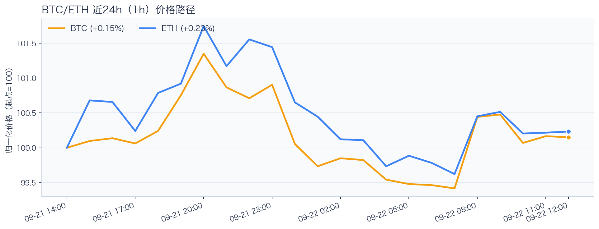
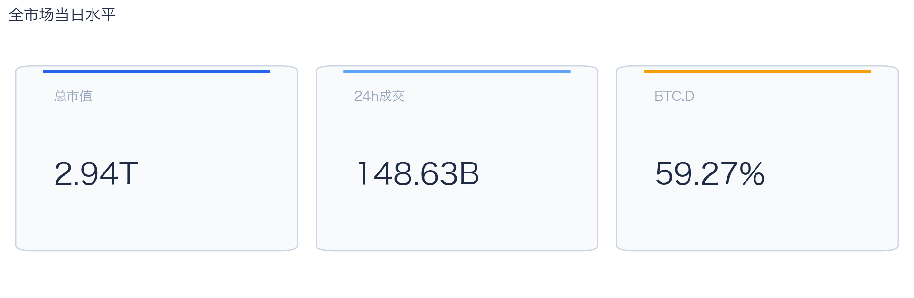
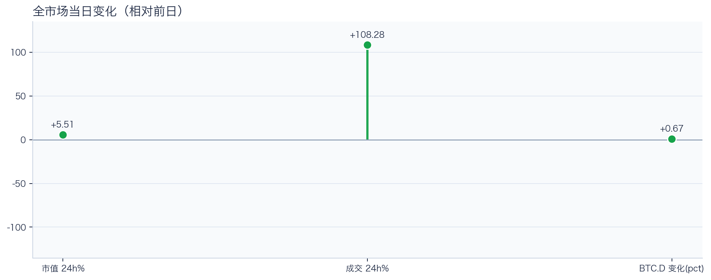
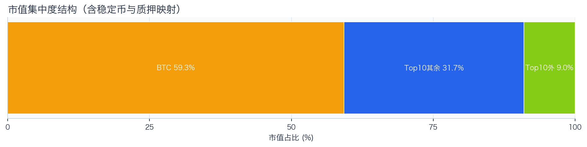
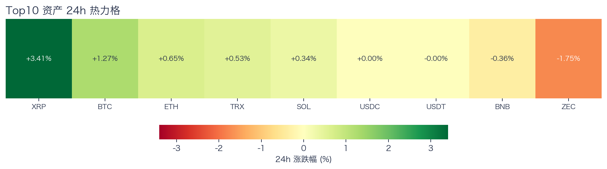
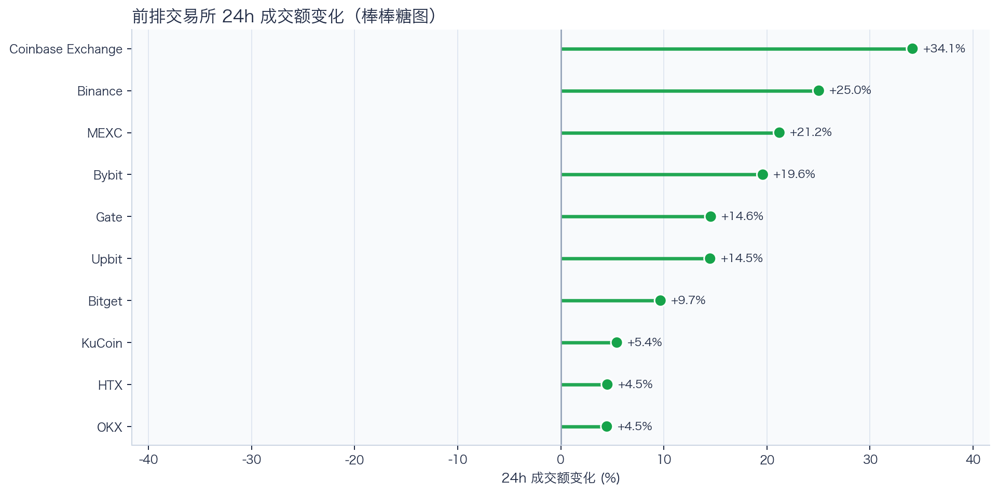
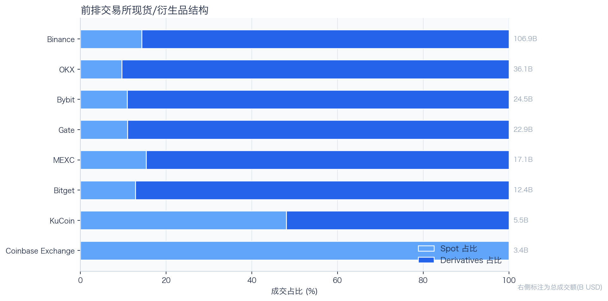
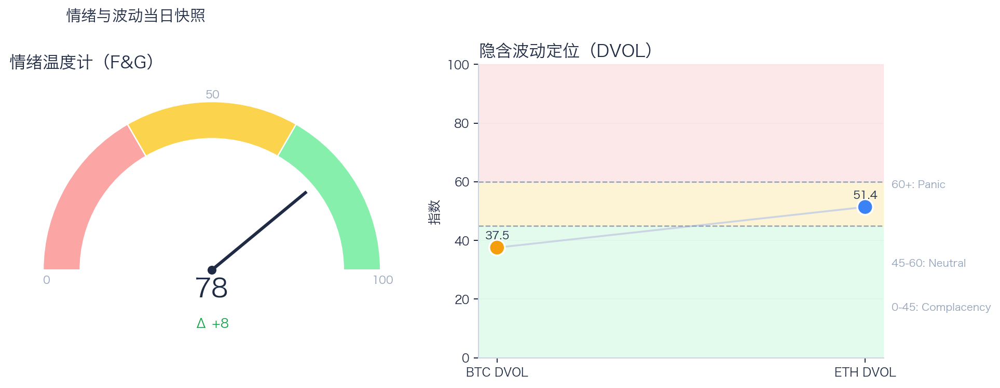

# 二级市场日报（2026-09-22）

## 快速结论
- 全市场指标当日：市值 $2.94T（24h +5.51%），成交额 $148.63B（24h +108.28%）。
- BTC 主导率 59.27%（+0.67pct），Top10 外市值占比（集中度口径）9.00%。
- 头部风险资产（排除稳定币、质押及信用映射）上涨 5 / 下跌 2 / 平盘 0，平均涨跌幅 +0.59%，首尾分化 5.17pct。
- 前排交易所样本成交普遍回升：上涨 10 家、下跌 0 家，24h 变化均值 +15.31%。
- Tokenized Stocks 类别规模 $3.15B，7D +19.21%。

## 市场主线
今日市场状态为“交易性修复”。价格与成交共振上行，头部风险资产多数上涨；但观察样本仍偏头部，尚不足以确认长尾扩散或新一轮趋势启动。

交易所成交方面，多数平台样本成交回升，但盘口深度、报价连续性与滑点尚未验证，不能直接等同于流动性改善；杠杆方面，BTC/ETH 8h 资金费率接近中性，现有证据不足以确认杠杆拥挤；期权定价方面，BTC DVOL处于低波动定价区间、ETH处于中性区间，单凭 DVOL 不足以判断期权保护成本是否便宜；情绪方面，情绪回到偏乐观区，若成交不跟随，需防止短线追高回撤。几项指标共同用于确认市场状态，但暂不足以归因于特定事件。

## BTC/ETH 24h 趋势

口径：文字涨跌来自交易所 rolling 24h ticker；图内路径为当前可得 23 个小时点，首尾变化 BTC +0.15%、ETH +0.23%，两者窗口不可混用。
- BTC（交易所 rolling 24h）：$85,974.00（+1.36%，区间 $84,778.00 - $87,395.67，当前位于区间 46%）=> 偏强震荡。
- ETH（交易所 rolling 24h）：$2,743.05（+0.87%，区间 $2,712.20 - $2,807.34，当前位于区间 32%）=> 区间震荡。
- 简评：BTC 与 ETH 均温和上涨，BTC 相对更强，但幅度尚未达到强趋势阈值。

## 市场结构与交易状态
### 市场脉冲

当日，全市场市值 $2.94T，24h 成交额 $148.63B，BTC 主导率 59.27%。
价格与成交同步上行，属于健康修复结构；若次日成交不掉队，修复延续概率更高。

相对前一观测日，市值 +5.51%、成交 +108.28%、BTC.D +0.67pct。
市值与成交是同步观测；缺少事件时点和资金路径证据时，暂不作特定事件归因。

### 市场广度与集中度

当前市值结构为 BTC 59.27% / Top10 其余 31.73% / Top10 外 9.00%。该图含稳定币与质押映射，只描述集中度，不证明风险偏好扩散。
方向样本为 7 个头部风险资产，已排除 USDT, USDC, FIGR_HELOC；Top10 外占比仅是市值集中度，不作为风险扩散代理。

### 资产与交易结构

按头部资产统一快照口径，领涨的是 XRP（+3.41%），跌幅最大的是 ZEC（-1.75%），均值 +0.59%，首尾相差 5.17pct。
涨跌家数接近均衡，市场处于结构轮动阶段，方向一致性较弱。对交易而言，继续比较相对强弱，但不把有限的单日收益差夸大为显著结构行情。

前排样本上涨 10 家、下跌 0 家，均值 +15.31%。Coinbase Exchange 最强（+34.12%），OKX 最弱（+4.46%）。
最强与最弱平台的 24h 变化差达到 29.66pct，说明平台间成交变化分化，但不能据此推断资金因果流向。报价连续性和滑点是否同步变化仍需盘口数据验证，执行层面应继续监控成交质量。

样本内衍生品成交占比 84.06%。该比例描述成交结构，不单独用于判断后续波动方向或幅度。
衍生品仍是主导成交形态，但该占比不能单独证明价格由杠杆情绪驱动。后续需用盘口深度、强平和事件窗口数据验证具体传导机制。

### 杠杆与风险定价
Deribit 样本的资金费率（Funding）接近中性，BTC/ETH 8h 费率分别为 +1.54bps / +0.54bps；隐含波动率指数（DVOL）位于 Complacency（低波动定价） / Neutral（中性波动定价）。
| 资产 | OKX 多头清算样本 | OKX 空头清算样本 | 近月年化基差 | 远月年化基差 | ATM IV | 25Δ 偏度 |
|---|---:|---:|---:|---:|---:|---:|
| BTC | $331,538 | $102,602 | +9.88% | +5.80% | 36.62% | -0.26 pp |
| ETH | $384,685 | $99,727 | +11.14% | +4.87% | N/A | N/A pp |
清算口径：仅为 OKX 公共接口返回的近期样本，不代表 OKX 或全市场清算总量；25Δ 偏度定义为 Put IV 减 Call IV。
当前 BTC/ETH 8h 资金费率接近中性，BTC DVOL处于低波动定价区间、ETH处于中性区间，现有数据不足以确认杠杆拥挤或波动走高。执行上仍应以预设价位和仓位管理为主，等待资金费率、持仓和波动的后续变化再调整风险参数。

恐惧与贪婪指数（F&G）当日 78（较前一观测日 +8）；BTC/ETH DVOL 为 37.54/51.39，对应 Complacency（低波动定价） / Neutral（中性波动定价）。
情绪进入偏乐观区，需关注是否出现过热信号与波动回摆。只有当情绪、广度和成交三者同时改善，市场才更可能从“反弹交易”切换到“趋势交易”。

### 关键价位与失效条件
| 资产 | 24h 支撑 | 24h 阻力 | ATR14(1h) | 向上触发 | 多头失效 | 向下触发 | 空头失效 |
|---|---:|---:|---:|---:|---:|---:|---:|
| BTC | 85050.00 | 87395.67 | 486.47 | 87517.29 | 87274.05 | 84928.38 | 85171.62 |
| ETH | 2712.20 | 2807.34 | 17.95 | 2811.83 | 2802.85 | 2707.71 | 2716.69 |
计算口径：以当前可得 23 个 1h 小时点的高低点作为支撑/阻力，触发缓冲取现价 0.1% 与 0.25×ATR14 的较大值；触发价用于观察确认，不是自动交易指令。

## 今日差异化重点
### RWA 与 24×7 映射交易
- 映射异动：INTW 24h +8.94%，属于今日 RWA 观察池中幅度较大的标的。
- 类别结构：最近一次可得类别快照显示，Tokenized Stocks 规模约 $3.15B，7D +19.21%；该变化用于判断产品线活跃度，不直接外推大盘方向。
- 链上验证：公开聪明钱信号页在已覆盖标的中未命中活跃记录；这不等于不存在相关持仓或交易，异动仍需结合底层价格、成交与事件证据确认。

### 稳定币收益与资金成本
- 收益端：本期可得协议样本中，Aave-USDC 的 Total APY 为 6.46%，需继续区分原生利率与奖励补贴。
- 资金需求：本期可得样本最高利用率 94.65%；高利用率意味着借款需求较强，也可能压缩退出流动性。
- 跨平台成本：本期可得报价中，USDC 借币年化样本差约 2.70pct，适合继续核对额度、期限和地区准入，不直接视为套利利差。

### 跨交易所 Funding 与 Carry
- Funding：样本高位为 OKX-BTC，年化约 10.95%。
- 平台分化：样本低位为 Binance-BTC，年化约 5.99%。
- 可执行性：Funding 与 basis 均有记录的样本可进入 carry 复核，但仍需检查手续费、滑点、保证金和持续性。

## 未来24小时观察
1. 若头部风险资产上涨覆盖率连续改善且 BTC.D 回落，再结合更广币种样本验证风险偏好是否扩散。
2. 若衍生品成交占比继续上升而资金费率仍接近中性，只能确认样本成交结构向衍生品倾斜；是否意味着杠杆使用或风险增加，仍需结合持仓、强平与波动数据验证。
3. 若 F&G 回升而 DVOL 不降，代表情绪改善尚未获得风险定价确认，应降低对追涨信号的置信度。

## 交易与风控含义
- 仓位管理优先级高于方向押注，建议保持核心仓位稳定、战术仓位滚动。
- 若衍生品占比上升并伴随 Funding 快速偏离中性或 DVOL 抬升，再考虑降低杠杆并收紧风险参数。
- 关注情绪改善与广度扩散是否同步发生，二者背离时避免追逐单边。
