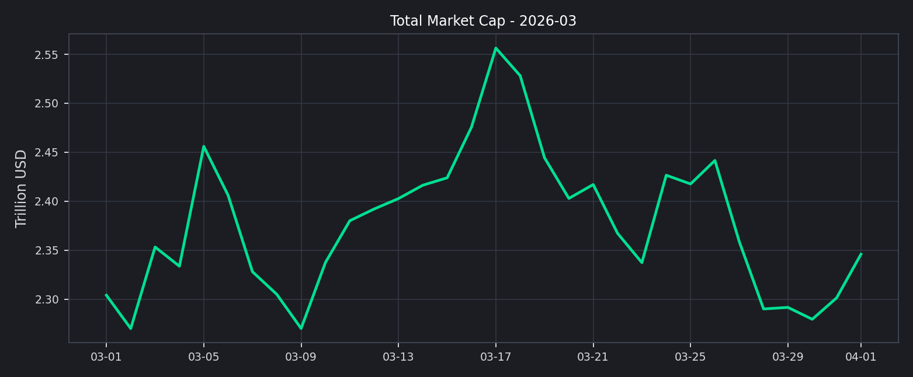
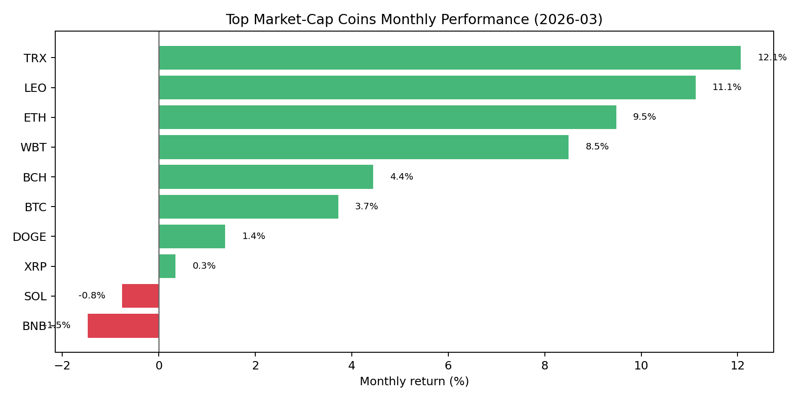
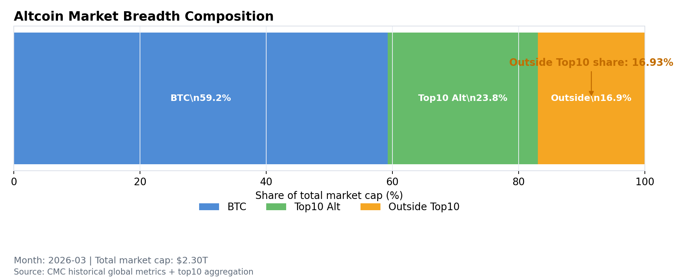
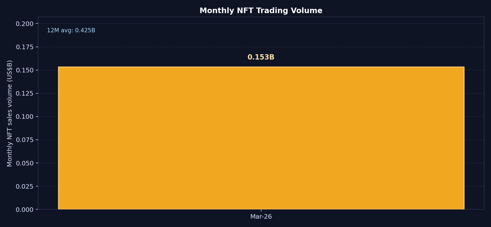
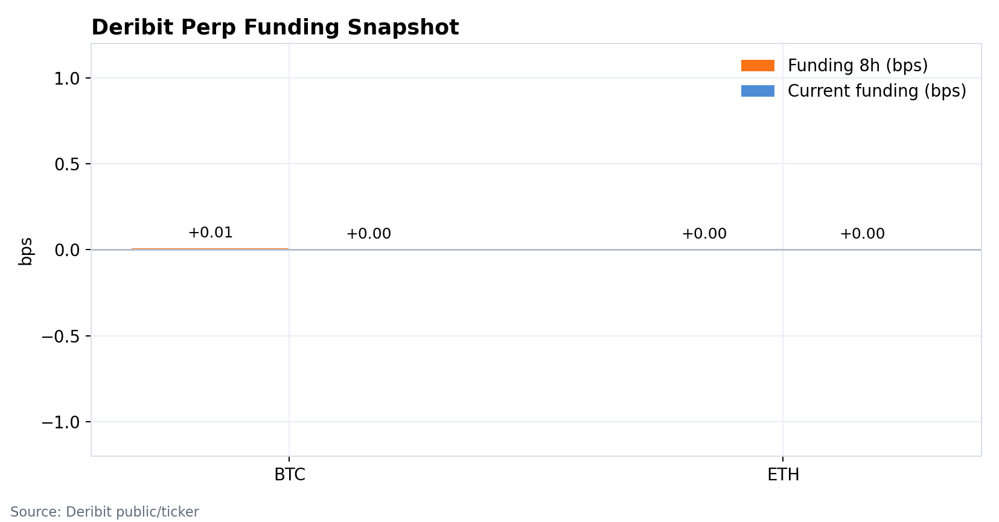
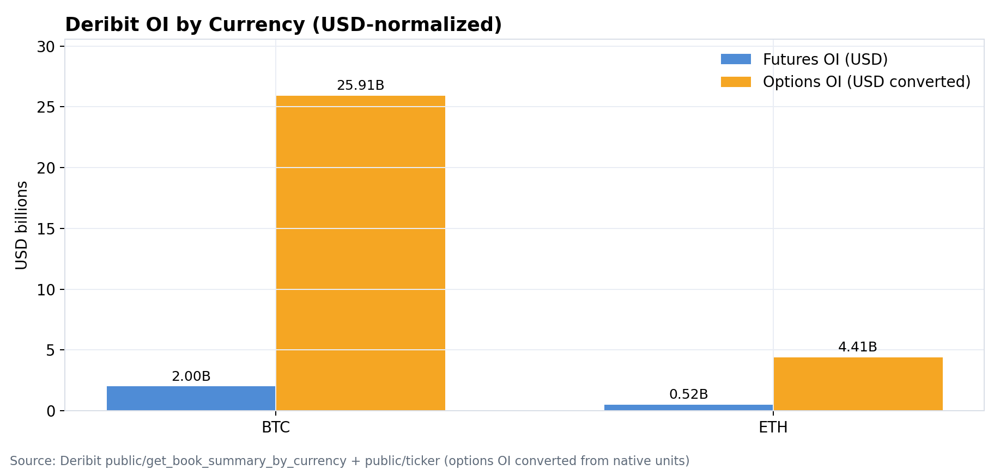
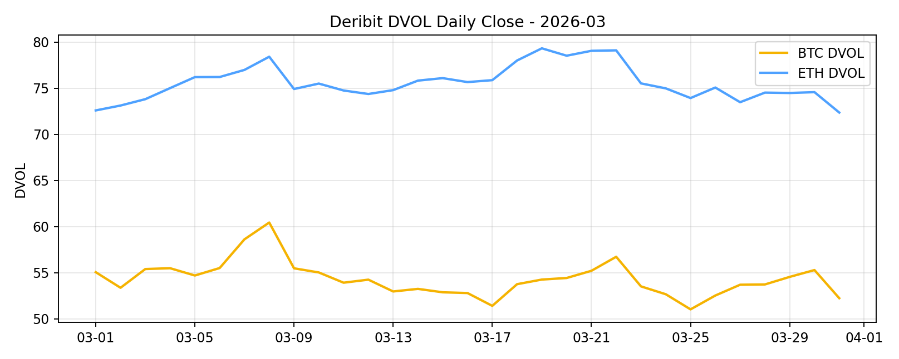
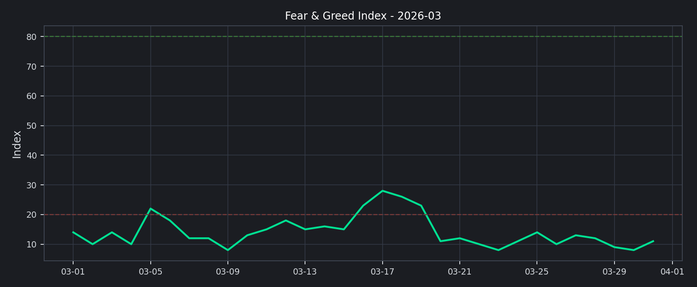

# 2026 年 3 月二级市场月报

3 月的市场更像一次修复，而不是一轮真正意义上的风险偏好回归。总市值较月初回升，但资金并没有明显扩散到长尾资产，交易与仓位仍然集中在 BTC 和少数头部标的上。情绪层面也没有跟上，恐惧与贪婪指数在月末仍停留在极度恐惧区间，这意味着反弹有延续的可能，但还谈不上进入顺畅的进攻阶段。

## 先看结论

- 全市场总市值从 `2.30T` 回到 `2.35T`，3 月月内上涨 `1.82%`，但高位回吐也很明显。
- BTC 主导率月末在 `58.20%`，基本和月初持平，说明资金仍优先停留在核心资产。
- Top 资产里有 `8` 个收涨、`2` 个收跌，修复是存在的，但扩散并不充分。
- Top10 外市值占比只有 `16.93%`，长尾资产依然缺少持续承接。
- 衍生品端资金费率接近零轴，说明杠杆并不拥挤；但情绪依然偏冷，市场对波动的警惕还在。

## 市场在修复，但没有进入全面进攻

总市值在 3 月从 `2.30T` 回升到 `2.35T`，月内一度冲到更高位置，之后又出现回吐，最后以温和修复收尾。这个走势更像“反弹过程中反复确认支撑”，而不是资金毫不犹豫地重新追风险。

BTC 主导率月末为 `58.20%`，与月初相比只增加了 `0.05pct`，但始终维持在高位。这说明市场虽然没有继续向 BTC 明显集中，但资金也没有真正离开核心资产去追逐更高弹性的长尾币种。

## 交易恢复了，但主要发生在头部平台

从前排交易所的 30 日成交变化看，恢复并不均衡。Binance、OKX、Bitget 这类头部平台仍然有韧性，但 KuCoin 这样的样本回落很明显。市场不是没有交易，只是交易更集中在流动性更强、产品更全的平台上，这通常意味着资金仍然偏谨慎。

## 主流币修复明显，长尾依旧偏弱

3 月头部资产整体表现不差。TRX 以 `+12.07%` 领跑，LEO 和 ETH 也有双位数附近的修复，BNB 则是样本里最弱的一档，月内 `-1.47%`。这组分布说明市场并不是全面转强，而是优先回补“确定性更高”的核心资产。

真正值得注意的是广度。Top10 外市值占比月末只有 `16.93%`，意味着绝大多数增量交易仍围绕核心资产展开。只要这个比例没有明显抬升，市场就更像“核心资产修复”，而不是“全面做多的风险扩散”。

## 链上风险偏好还没有真正回来

DeFi 总 TVL 月末在 `92.29B`，结构上依然由以太坊主导，ETH 链份额 `56.88%`。这说明链上流动性并没有出现新的大规模再分配，资金仍更愿意停留在成熟的流动性中心。

NFT 3 月成交额约 `153.42M`，仍在相对低位。高波动题材没有重新成为市场主线，这和长尾资产没有明显扩散是同一件事: 风险偏好在修复，但离全面回暖还有距离。

## 衍生品不拥挤，但情绪还是冷的

BTC 和 ETH 的资金费率都贴近零轴，说明杠杆端没有出现很明显的单边拥挤。对市场来说，这是一件中性的好事: 短期不容易因为杠杆过热而立刻失控。

未平仓合约依旧主要集中在期货，期权更多承担对冲和事件交易的功能。仓位结构本身没有出现失控的迹象，但也看不到“强趋势行情已经被资金确认”的状态。

3 月 BTC DVOL 区间大致在 `51.04` 到 `60.45`，ETH 在 `72.37` 到 `79.33`。月末两者都回到了区间偏低位置，说明市场对极端波动的定价在收敛，情绪没有进一步恶化，但也谈不上乐观。

恐惧与贪婪指数月末只有 `11`，依然处在极度恐惧区。这是 3 月最值得警惕的地方: 价格修复了，但情绪没有修复，意味着这轮反弹更像仓位修补，而不是新一轮风险偏好扩张。

已实现波动率在月末也明显回落，BTC 约 `46.00%`，ETH 约 `58.79%`。波动率降下来有利于市场企稳，但如果情绪、广度和成交不能继续改善，这种平静也可能只是下一轮方向选择之前的过渡。

## 4 月怎么看

如果 4 月 BTC 主导率开始回落、Top10 外占比明显抬升，同时成交继续恢复，那么市场就有机会从“头部资产修复”切换到“更广泛的风险偏好回暖”。反过来看，如果情绪继续停留在恐惧区，长尾资产也没有承接，那么 3 月这轮上行更可能只是一次有限度的修复，后面仍然会反复。

眼下更合理的判断不是“牛回来了”，而是“市场正在试探更高的位置，但还没给出足够强的确认”。这也是为什么 3 月最强的信号来自头部资产的韧性，而不是来自全面扩散的赚钱效应。
