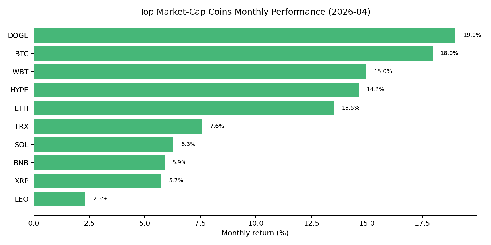
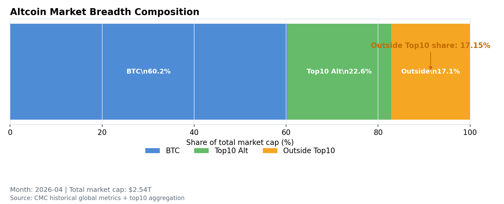
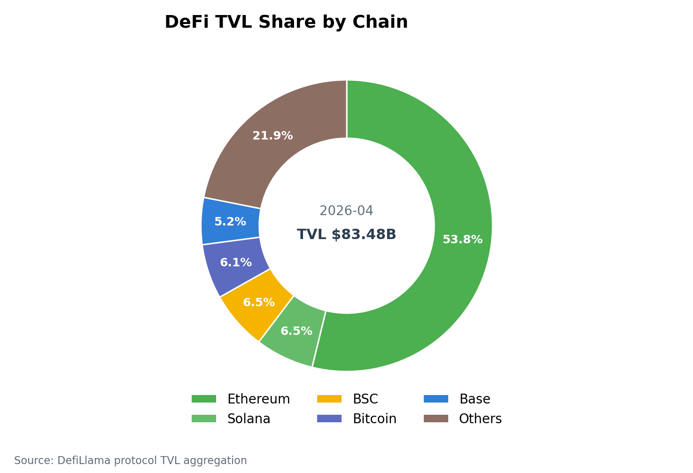
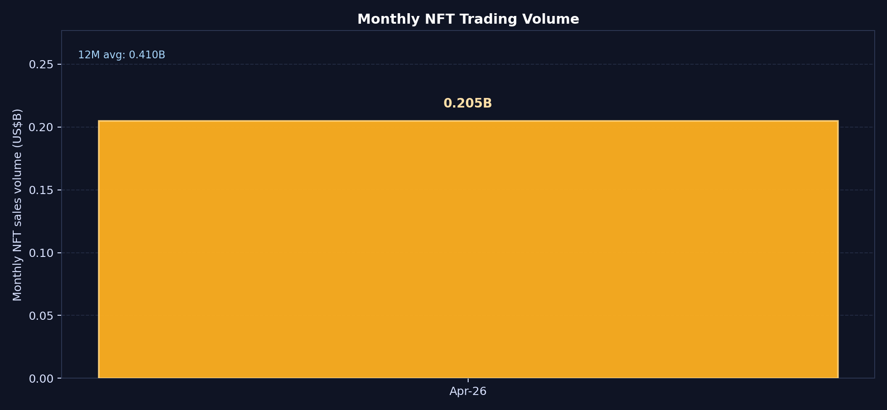
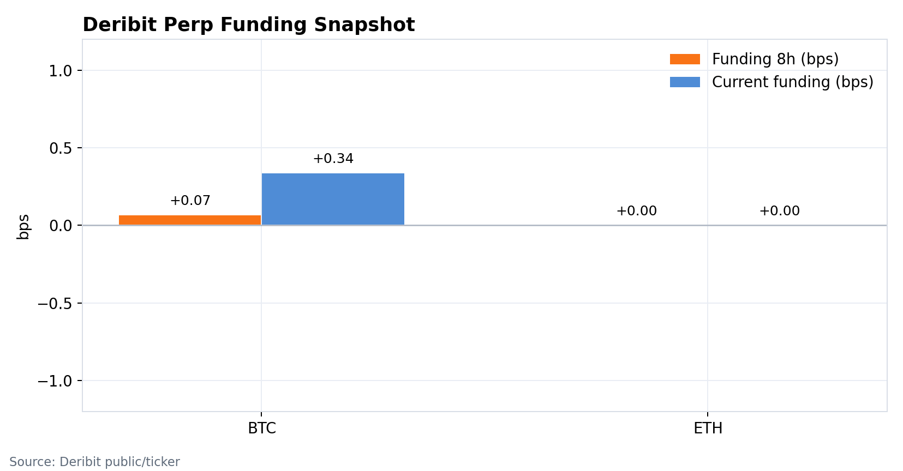
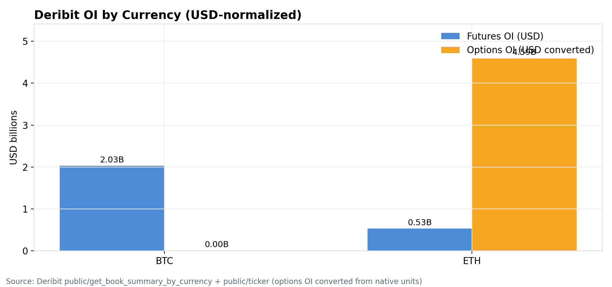
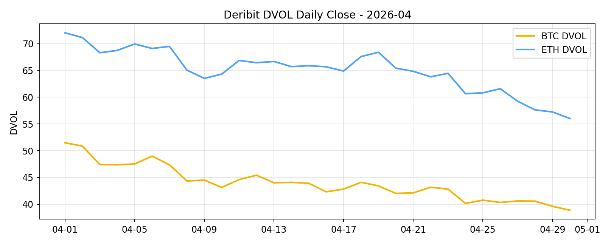
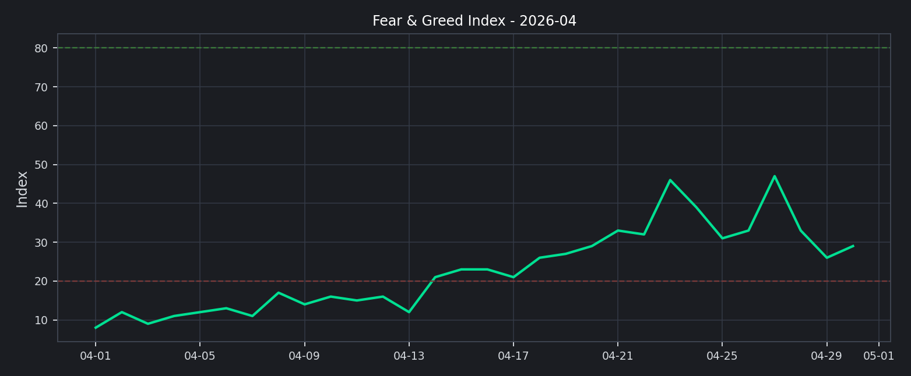

# 2026 年 4 月二级市场月报

4 月加密市场从防守状态切回修复状态：全市场市值由 $2.35T 升至 $2.54T，月内上涨 +8.49%。但这不是一轮完整的风险扩张，BTC 主导率同步上行 +1.84pct，Top10 外市值占比仍只有 17.15%，说明资金主要回到高流动性的核心资产，而不是全面扩散到长尾资产。

## Key Takeaways
- 市场状态：4 月从防守转向修复，但尚未进入全面进攻。总市值回升 +8.49%，说明风险偏好改善；BTC 主导率同步上行，说明资金仍偏向核心资产。
- 领导结构：本月是 majors-led repair，而不是 altseason。Top10 外市值占比仅 17.15%，长尾资产还没有形成持续承接。
- 资产分化：Top10 样本全部上涨，中位数收益 +10.55%；DOGE 领涨 +19.00%，LEO 最弱但仍上涨 +2.33%。这代表头部资产赚钱效应修复，但收益仍集中在少数强势币。
- 杠杆温度：Deribit BTC/ETH 8h 资金费率为 +0.07bps / +0.00bps，接近零轴。价格修复没有伴随明显多头拥挤，短线挤仓风险低于趋势狂热阶段。
- 情绪确认：月末恐惧与贪婪指数为 29，月均约 22.8，仍处于恐惧区间。情绪没有确认价格修复，意味着本轮上涨更像仓位修补，而非一致性追涨。
- 链上风险偏好：DeFi TVL 约 $83.48B，Ethereum 占比 53.82%；NFT 月成交额约 $205.01M。链上资金结构偏稳，非同质化资产没有成为本轮风险扩张主线。

## 宏观代理与市场状态
总市值和 BTC 主导率同时上行，是本月最重要的结构信号。它说明市场不再是单纯的去风险状态，但资金重新进场时优先选择 BTC 和头部资产，风险预算仍然集中。

下月能否从“修复”切到“趋势”，关键看成交额和广度是否跟上。如果市值继续上行但 Top10 外占比不抬升，行情更可能维持核心资产轮动；只有成交放大且长尾占比同步回升，才更接近全面风险扩张。

## 交易所流量与资金活跃度
前排交易所样本 30d 成交额合计约 $3.64T，估算环比 -26.56%。Upbit 增幅靠前（+12.79%），Coinbase Exchange 回落最明显（-45.84%），说明本月交易活跃度并没有和价格修复同步扩张。

这组数据降低了对行情连续性的判断强度。价格可以先于成交修复，但如果后续成交额不能回升，市场更容易变成存量资金在核心币之间切换，而不是新增资金推动的趋势行情。

## 主流资产表现与市场广度
头部资产表现整体偏强：Top10 样本 10 个全部上涨，中位数收益 +10.55%。DOGE 领涨 +19.00%，LEO 最弱但仍上涨 +2.33%，收益差约 16.67pct，说明本月赚钱效应已经回到头部资产，但内部强弱仍然明显。

广度仍然是短板。Top10 外市值占比月末为 17.15%，这意味着长尾资产并没有充分承接风险偏好，市场仍处在“核心资产修复优先”的阶段。

## 链上风险偏好：DeFi 稳定，NFT 仍弱
DeFi TVL 月末约 $83.48B，Ethereum 占比 53.82%，Solana 与 BSC 分别为 6.48% / 6.54%。链上资金仍高度集中在 Ethereum 生态，Others 占比 21.88%，这更像稳态配置，而不是跨链高 beta 的快速轮动。

NFT 月成交额约 $205.01M，体量相对主流币修复明显偏弱。换句话说，流动性较低、弹性更高的非同质化资产没有跟上本轮修复，因此不能把 4 月定义为链上风险偏好的全面回归。

## 衍生品仓位温度
BTC 与 ETH 的资金费率都接近零轴，分别为 +0.07bps / +0.00bps。这个结构偏中性：多头没有明显拥挤，空头也没有形成一致性压制，衍生品市场更像在等待方向确认。

OI 与波动率给出的信号也偏克制。DVOL 月末降至 BTC 38.88 / ETH 56.02，较月内高点 BTC 51.49 / ETH 72.02 明显回落；波动率回落叠加 funding 中性，意味着下月更需要防范低波动后的重新定价，而不是立即押注高杠杆单边趋势。

## 情绪与波动定价
情绪没有确认价格修复。恐惧与贪婪指数月末为 29，处于恐惧区间，月均约 22.8；这说明市场已经开始回补价格，但参与者的风险偏好仍然偏谨慎。

这种背离对交易很关键：它降低了短期过热风险，也意味着上涨需要更多成交和广度确认。若情绪快速修复但波动率不再下降，反而要关注追涨拥挤和回撤放大的风险。

## 下月交易框架（基准情景）
1. 基准情景：维持核心资产优先。只要 funding 接近中性、DVOL 不重新上冲、Top10 外占比仍低，主要风险预算应继续放在 BTC/ETH/SOL 等高流动性资产上，回撤更适合看作仓位再平衡窗口。
2. 上行情景：提高 beta 暴露需要至少两个确认信号同时出现：Top10 外占比连续抬升、前排交易所成交额回升、F&G 回到中性区间以上、DVOL 维持回落且 funding 不拥挤。满足这些条件后，可以逐步扩展到流动性较好的头部 alt。
3. 风险情景：如果价格继续上行但成交和广度不确认，或 DVOL 重新抬升且 funding 快速转正，应降低追涨仓位。执行层面优先提高保证金缓冲、收紧长尾币流动性阈值，并对前期强势资产分批止盈。
