# 2026 年 5 月二级市场月报

5 月市场从 4 月修复转入防守整理：全市场市值由约 $2.54T 回落至 $2.49T，按月下降约 -1.70%。BTC 主导率同步回落约 -0.81pct，但 Top10 外市值占比只升至 18.11%，说明资金并未形成顺畅的长尾扩散；成交放大、情绪仍处恐惧区间与资金费率中性偏弱之间的错位，是本月最重要的交易背景。

## Key Takeaways
- 市场状态：5 月从修复转入防守整理。总市值较 4 月末回落约 -1.70%，成交额放大没有转化为广泛上涨，说明资金更像在波动中调仓，而不是一致性追涨。
- 领导结构：BTC 主导率回落约 -0.81pct，但长尾承接仍不足。Top10 外市值占比升至 18.11%，改善幅度有限，尚不足以定义为全面风险扩张。
- 资产分化：Top10 样本 2 涨 8 跌，中位数收益 -15.59%；RAIN 领涨 +82.49%，ETH 最弱 -30.49%。赚钱效应高度集中，主流资产内部承压更明显。
- 杠杆温度：Deribit BTC/ETH 8h 资金费率为 -0.50bps / +0.02bps，整体接近中性但 BTC 偏空。价格回落没有伴随明显多头拥挤，强制去杠杆压力相对可控。
- 情绪确认：月末恐惧与贪婪指数为 28，月均约 34.4，仍处恐惧区间。情绪没有给出趋势扩张确认，市场更接近谨慎防守后的再定价。

## 宏观代理与市场状态
总市值按月回落约 -1.70%，BTC 主导率也小幅下降，说明市场不是单纯向 BTC 集中防守，而是在主流资产普遍回撤中重新分配风险预算。Top10 外占比略有回升，但绝对水平仍低，长尾资产还没有形成足够强的持续承接。

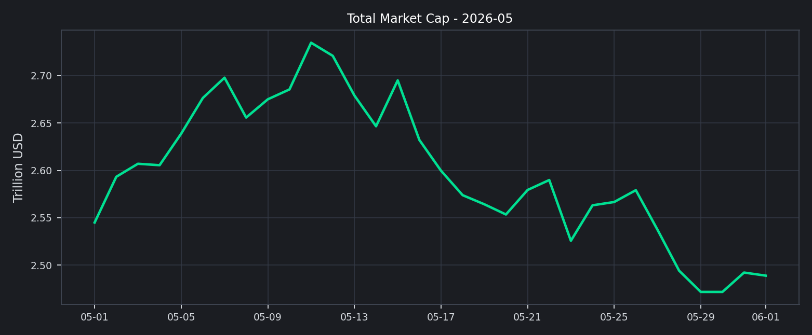

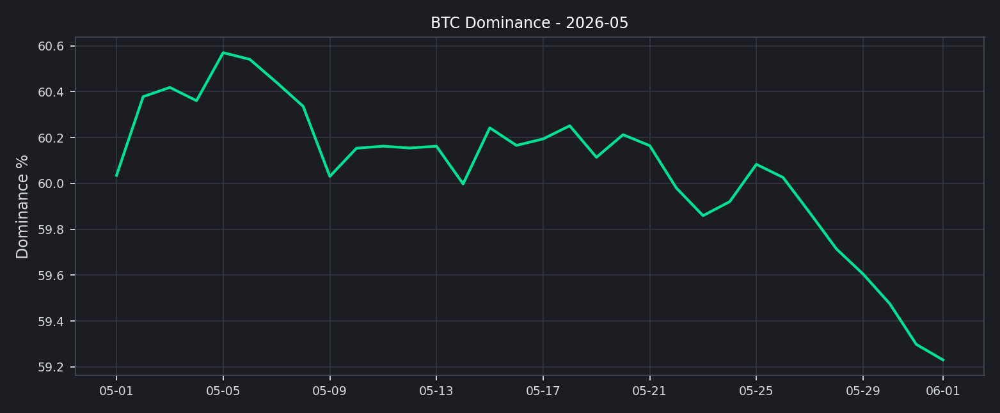

接下来需要确认的是成交额放大能否转化为广度改善。如果成交继续增加但市值和头部资产仍承压，市场更可能维持高换手整理；只有长尾占比、头部资产中位数收益和情绪同步修复，才更接近新一轮风险扩张。

## 交易所流量与资金活跃度
前排交易所样本 30d 成交额合计约 $5.14T，样本平均 30d 变化约 +47.32%。Coinbase Exchange 增幅靠前（+84.47%），MEXC 回落最明显（-30.72%），说明交易活跃度恢复较快，但交易所之间分化仍然明显。

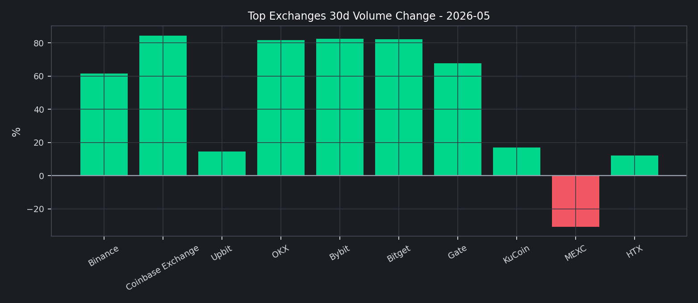

成交扩张没有带来对应的价格广度，是本月需要谨慎解读的地方。它更像波动放大后的再定价和仓位切换，而不是新增资金稳定推动的趋势行情。

## 主流资产表现与市场广度
头部资产中，表现最强的是 RAIN（+82.49%），最弱的是 ETH（-30.49%），收益差约 112.97pct。
上涨资产 2 个、下跌资产 8 个，头部样本中位数收益为 -15.59%。这说明本月不是普涨行情，而是少数标的强势与多数主流资产回撤并存。
Top10 外市值占比月末为 18.11%，较 4 月末回升约 +0.96pct，但仍低于健康 altseason 通常需要的广度水平。长尾风险偏好有边际改善，却还没有强到可以抵消主流资产的整体压力。

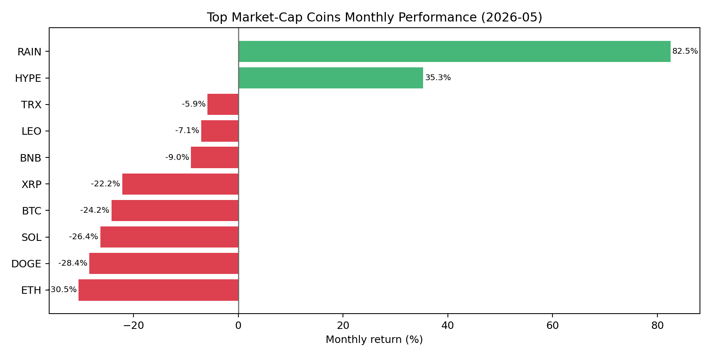

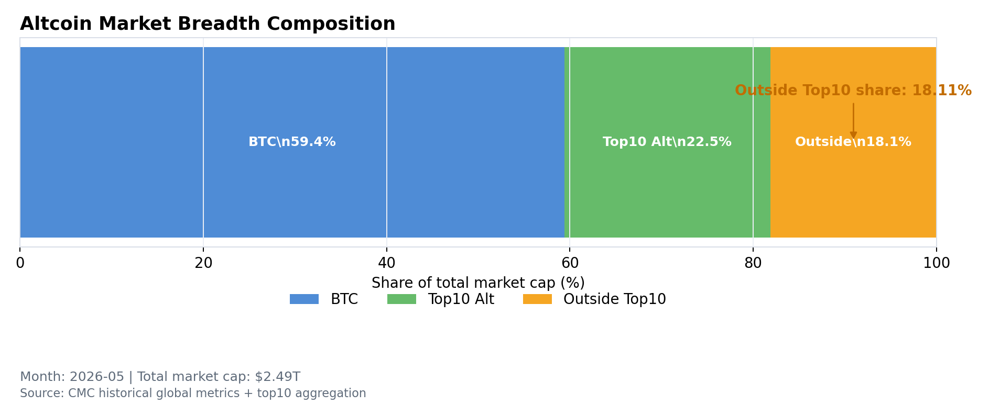

## 链上风险偏好：DeFi 稳定，NFT 仍弱
DeFi TVL 月末约 $80.33B，Ethereum 占比 52.26%，Solana 与 BSC 分别为 6.71% / 7.22%。链上资金仍高度集中在 Ethereum 生态，Others 占比 22.30%，更像稳态配置，而不是高风险链上 beta 的快速扩张。
NFT 月成交额约 $246.29M（约 0.25B 美元），较低体量决定了它只能作为风险偏好的辅助观察项。该数据没有显示非同质化资产成为本月主线，因此链上风险扩张仍缺少强确认。

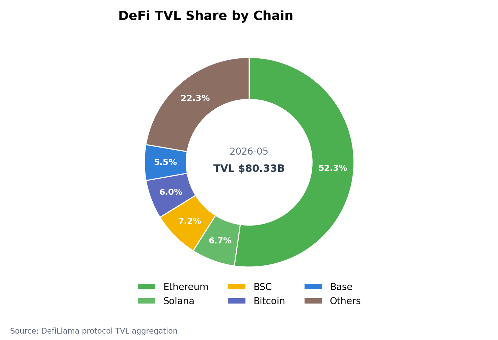

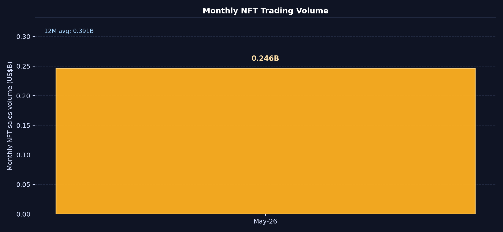

## 衍生品仓位温度
BTC 与 ETH 的资金费率并不一致（-0.50bps / +0.02bps），说明衍生品仓位更多体现结构分化，而不是单边多头或空头共识。BTC funding 偏负意味着下跌后追空并不极端，但多头风险偏好也没有恢复。
DVOL 月末降至 BTC 36.40 / ETH 49.63，较月内高点 BTC 41.00 / ETH 55.86 明显回落。波动率回落与资金费率中性偏弱共存，意味着市场短期更像“回撤后的再定价”，而不是高杠杆趋势行情。

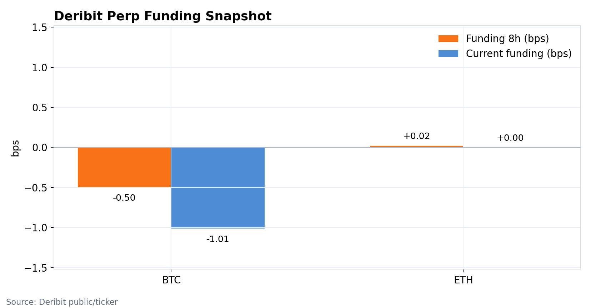

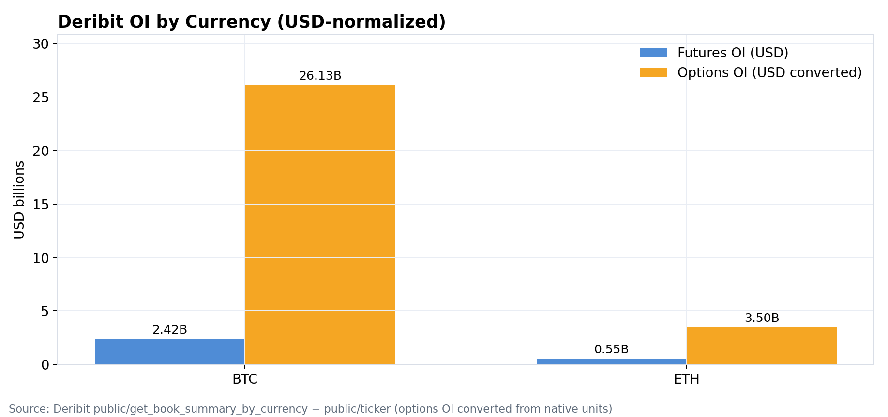

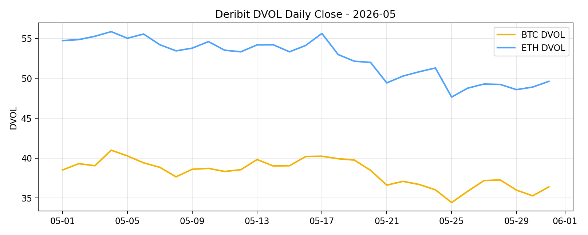

## 情绪与波动定价
恐惧与贪婪指数月末为 28，处于恐惧区间；月均约 34.4。情绪没有跟随成交放大转向中性以上，说明投资者仍在用防守心态处理波动，而不是主动提高风险预算。

波动定价也没有给出趋势行情信号。已实现波动率与 DVOL 均处在回落状态，这有利于市场企稳，但如果情绪和广度继续缺席，低波动更可能对应区间整理，而不是单边突破。

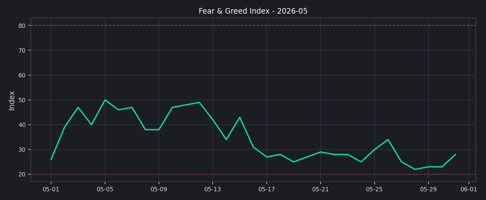

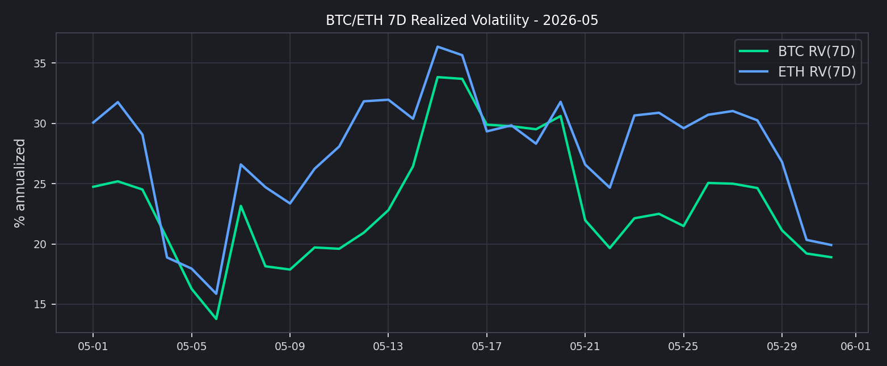

## 下月交易框架（基准情景）
1. 基准情景：维持核心资产优先，BTC/ETH/SOL 等高流动性资产仍是主要风险预算承载。只要 funding 保持中性附近、DVOL 不重新上冲、Top10 外占比只是温和改善，仓位应以防守和再平衡为主。
2. 上行情景：若 Top10 外占比连续抬升、头部资产中位数收益转正、成交额维持高位且 F&G 回到中性区间以上，可以逐步提高 beta 暴露，重点选择流动性充足且相对强势的头部 alt。
3. 风险情景：若成交放大但价格和广度继续走弱，或 DVOL 重新抬升而 funding 快速转正，应降低追涨仓位。执行层面优先提高保证金缓冲、收紧长尾币流动性阈值，并对单月涨幅过大的资产分批止盈。
