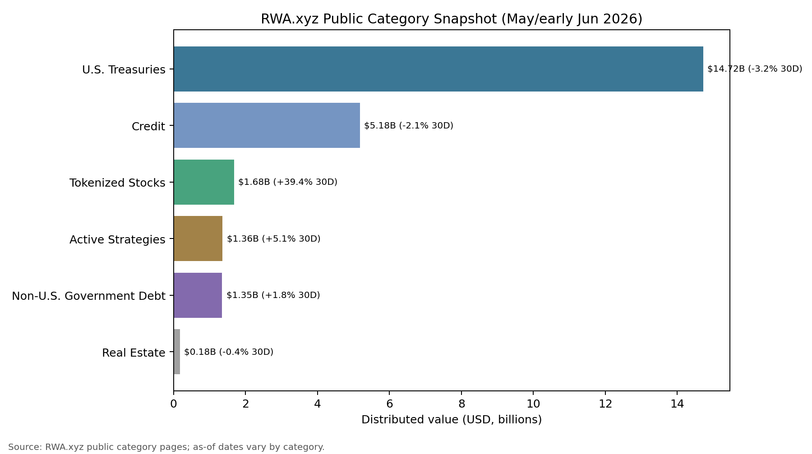

# 2026 年 5 月二级市场月报

5 月市场从 4 月修复转入防守整理：全市场市值由约 $2.54T 回落至 $2.49T，按月下降约 -1.70%。BTC 主导率同步回落约 -0.81pct，但 Top10 外市值占比只升至 18.11%，说明资金并未形成顺畅的长尾扩散；成交放大、情绪仍处恐惧区间与资金费率中性偏弱之间的错位，是本月最重要的交易背景。

## Key Takeaways
- 市场状态：5 月从修复转入防守整理。总市值较 4 月末回落约 -1.70%，成交额放大没有转化为广泛上涨，说明资金更像在波动中调仓，而不是一致性追涨。
- 领导结构：BTC 主导率回落约 -0.81pct，但长尾承接仍不足。Top10 外市值占比升至 18.11%，改善幅度有限，尚不足以定义为全面风险扩张。
- 资产分化：主流非稳定币篮子 4 涨 6 跌，中位数收益 -2.27%；HYPE 领涨 +77.19%，ETH 最弱 -12.31%。赚钱效应集中在交易/基础设施叙事，BTC 与 ETH 没有给出强趋势确认。
- 杠杆温度：Deribit BTC/ETH 8h 资金费率为 -0.50bps / +0.02bps，整体接近中性但 BTC 偏空。价格回落没有伴随明显多头拥挤，强制去杠杆压力相对可控。
- 情绪确认：月末恐惧与贪婪指数为 28，月均约 34.4，仍处恐惧区间。情绪没有给出趋势扩张确认，市场更接近谨慎防守后的再定价。
- RWA 结构：RWA.xyz 公开分类页显示，U.S. Treasuries 仍是最大板块，分布规模约 $14.72B；Tokenized Stocks 30D 增速约 +39.37%，说明 RWA 的增量叙事开始从链上美债扩展到证券化交易品类。
- Web3 主线：交易所竞争从现货撮合延伸到衍生品、RWA perps、稳定币支付和链上入口。对二级市场而言，这意味着交易量不再只反映币价 beta，也越来越反映产品上线、资产类别扩张和 CEX/DEX 份额迁移。

## 宏观代理与市场状态
总市值按月回落约 -1.70%，BTC 主导率也小幅下降，说明市场不是单纯向 BTC 集中防守，而是在主流资产普遍回撤中重新分配风险预算。Top10 外占比略有回升，但绝对水平仍低，长尾资产还没有形成足够强的持续承接。

接下来需要确认的是成交额放大能否转化为广度改善。如果成交继续增加但市值和头部资产仍承压，市场更可能维持高换手整理；只有长尾占比、头部资产中位数收益和情绪同步修复，才更接近新一轮风险扩张。

## 交易所流量与资金活跃度
前排交易所样本 30d 成交额合计约 $5.14T，样本平均 30d 变化约 +47.32%。Coinbase Exchange 增幅靠前（+84.47%），MEXC 回落最明显（-30.72%），说明交易活跃度恢复较快，但交易所之间分化仍然明显。

成交扩张没有带来对应的价格广度，是本月需要谨慎解读的地方。它更像波动放大后的再定价和仓位切换，而不是新增资金稳定推动的趋势行情。

## 主流资产表现与市场广度
主流非稳定币篮子中，表现最强的是 HYPE（+77.19%），其次是 XLM（+60.24%）；最弱的是 ETH（-12.31%），收益差约 89.51pct。
上涨资产 4 个、下跌资产 6 个，样本中位数收益为 -2.27%。这说明本月不是普涨行情，而是交易/基础设施和少数高弹性标的更强，BTC、ETH、DOGE 等高流动性资产仍偏弱。
Top10 外市值占比月末为 18.11%，较 4 月末回升约 +0.96pct，但仍低于健康 altseason 通常需要的广度水平。长尾风险偏好有边际改善，却还没有强到可以抵消主流资产的整体压力。

## 链上风险偏好：DeFi 稳定，NFT 仍弱
DeFi TVL 月末约 $80.33B，Ethereum 占比 52.26%，Solana 与 BSC 分别为 6.71% / 7.22%。链上资金仍高度集中在 Ethereum 生态，Others 占比 22.30%，更像稳态配置，而不是高风险链上 beta 的快速扩张。
NFT 月成交额约 $246.29M（约 0.25B 美元），较低体量决定了它只能作为风险偏好的辅助观察项。该数据没有显示非同质化资产成为本月主线，因此链上风险扩张仍缺少强确认。

## RWA 板块：美债仍是底座，股票与 Perps 抬升交易属性
截至 6 月初的 RWA.xyz 公开分类页快照显示，U.S. Treasuries 仍是 RWA 资产端的核心底座，分布规模约 $14.72B，但 30D 变化为 -3.23%；Credit 约 $5.18B，30D 变化为 -2.07%。这说明传统“链上收益资产”并没有在 5 月形成全面扩张，资金对利率型和信用型 RWA 的配置更接近存量再平衡。

增长更快的部分来自交易属性更强的品类。RWA.xyz 的 Tokenized Stocks 页面显示，股票类 RWA 分布规模约 $1.68B，30D 增速约 +39.37%；Active Strategies 约 $1.36B，30D 增速约 +5.10%；Non-U.S. Government Debt 约 $1.35B，30D 增速约 +1.76%。这意味着 RWA 的市场叙事正在从“链上美债收益”扩展为“可交易资产映射”，对 CEX 来说更接近新品类成交额和衍生品扩容机会。

新闻面也支持这个方向。CMC Research 的 5 月 RWA perps 报告显示，RWA perpetuals 在 2025 年 12 月 29 日至 2026 年 5 月 20 日累计成交 $821.8B，最近一完整周成交 $55.9B，CEX 仍占 72% 流量；Binance 单独占 48.6%，Top3（Binance、HIP-3、Bitget）合计 73.5%。这对二级市场的含义是：RWA 不再只是低波动收益资产，它正在变成交易所争夺新增成交和用户留存的产品线，尤其会影响 Binance、OKX、Bitget 等平台在非加密资产 perps 上的竞争。

对下月的观察重点不应只看 RWA 总规模，而要拆成三类：第一，美债和信用类 RWA 是否重新恢复净流入；第二，股票/RWA perps 是否继续提升成交占比；第三，稳定币与链上结算入口是否带动 RWA 从“持有型资产”转为“交易型资产”。如果这三者同时改善，RWA 才会从边缘叙事变成影响 CEX 交易结构的核心变量。

## 衍生品仓位温度
BTC 与 ETH 的资金费率并不一致（-0.50bps / +0.02bps），说明衍生品仓位更多体现结构分化，而不是单边多头或空头共识。BTC funding 偏负意味着下跌后追空并不极端，但多头风险偏好也没有恢复。
DVOL 月末降至 BTC 36.40 / ETH 49.63，较月内高点 BTC 41.00 / ETH 55.86 明显回落。波动率回落与资金费率中性偏弱共存，意味着市场短期更像“回撤后的再定价”，而不是高杠杆趋势行情。

## 情绪与波动定价
恐惧与贪婪指数月末为 28，处于恐惧区间；月均约 34.4。情绪没有跟随成交放大转向中性以上，说明投资者仍在用防守心态处理波动，而不是主动提高风险预算。

波动定价也没有给出趋势行情信号。已实现波动率与 DVOL 均处在回落状态，这有利于市场企稳，但如果情绪和广度继续缺席，低波动更可能对应区间整理，而不是单边突破。

## 当月 Web3 事件与市场影响
机构需求有改善，但仍没有扩散成全面 altseason。Coinbase 5 月市场定位报告指出，BTC ETF 资金流在 4 月下旬至 5 月初转为持续正流入，7 日流入重新超过 $1B；同时，altcoin OI dominance 降至多年低位附近，说明资金更偏向 BTC/majors，而不是广泛高 beta 加杠杆。这与本月“成交放大但广度不足”的结论一致：市场并非没有需求，而是需求集中在更高流动性和更容易被机构承接的资产上。

交易所竞争的主线正在从单一现货成交转向“综合交易与链上入口”。Coinbase 5 月 7 日披露 Q1 结果时提到，其 crypto trading volume market share 升至 8.6% 的新高，衍生品 TTM 成交量同比增长 169%，同时 Base 承载了 62% 的全球链上稳定币交易量。对市场的影响是，CEX 估值和交易活跃度越来越受衍生品、稳定币支付、DEX 聚合和链上应用入口驱动，而不是只看现货手续费周期。

稳定币、RWA 与 DeFi 风险定价仍是跨月主线。Binance Research 的月度报告把稳定币净发行、RWA 增长、DeFi exploit 损失、pre-IPO perps 和 vault-style borrowing 放在同一框架下讨论，说明大型交易所研究已经不再只写币价涨跌，而是把“链上信用、现实资产映射、协议安全和交易所新品类”作为市场结构变量。对本月报告而言，这意味着 DeFi TVL 和 NFT 成交只能说明链上风险偏好的一部分；更重要的是稳定币流动性、RWA perps 和安全事件如何改变资金愿意承担的风险溢价。

## 下月交易框架（基准情景）
1. 基准情景：维持核心资产优先，BTC/ETH/SOL 等高流动性资产仍是主要风险预算承载。只要 funding 保持中性附近、DVOL 不重新上冲、Top10 外占比只是温和改善，仓位应以防守和再平衡为主。
2. 上行情景：若 Top10 外占比连续抬升、主流资产篮子中位数收益转正、成交额维持高位且 F&G 回到中性区间以上，可以逐步提高 beta 暴露，重点选择流动性充足且相对强势的头部 alt。
3. 风险情景：若成交放大但价格和广度继续走弱，或 DVOL 重新抬升而 funding 快速转正，应降低追涨仓位。执行层面优先提高保证金缓冲、收紧长尾币流动性阈值，并对单月涨幅过大的资产分批止盈。
