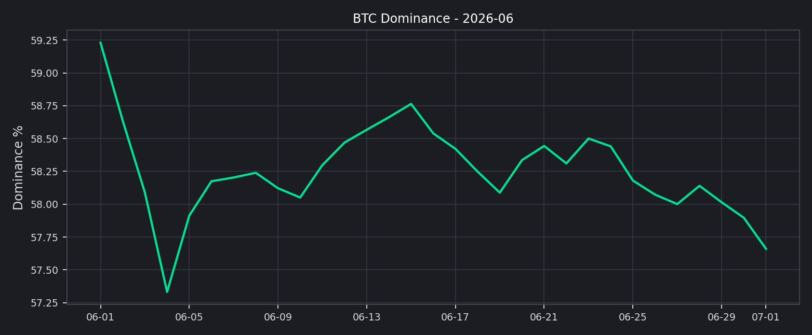
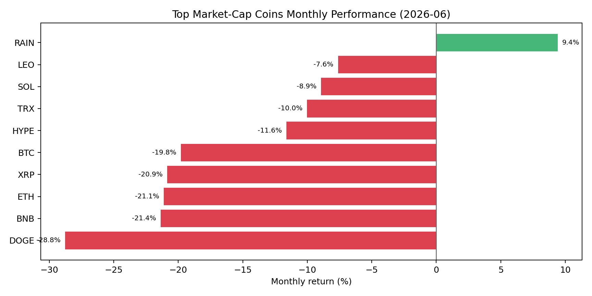
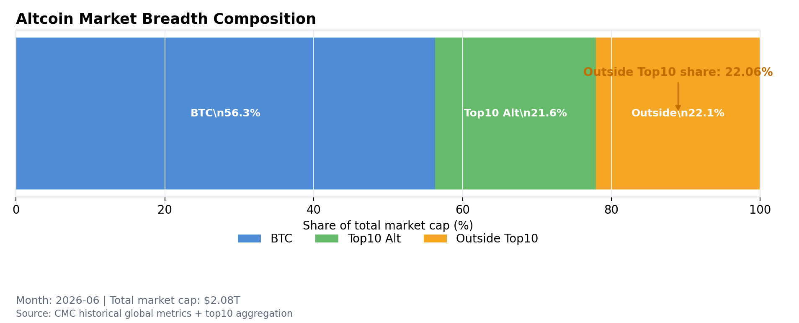
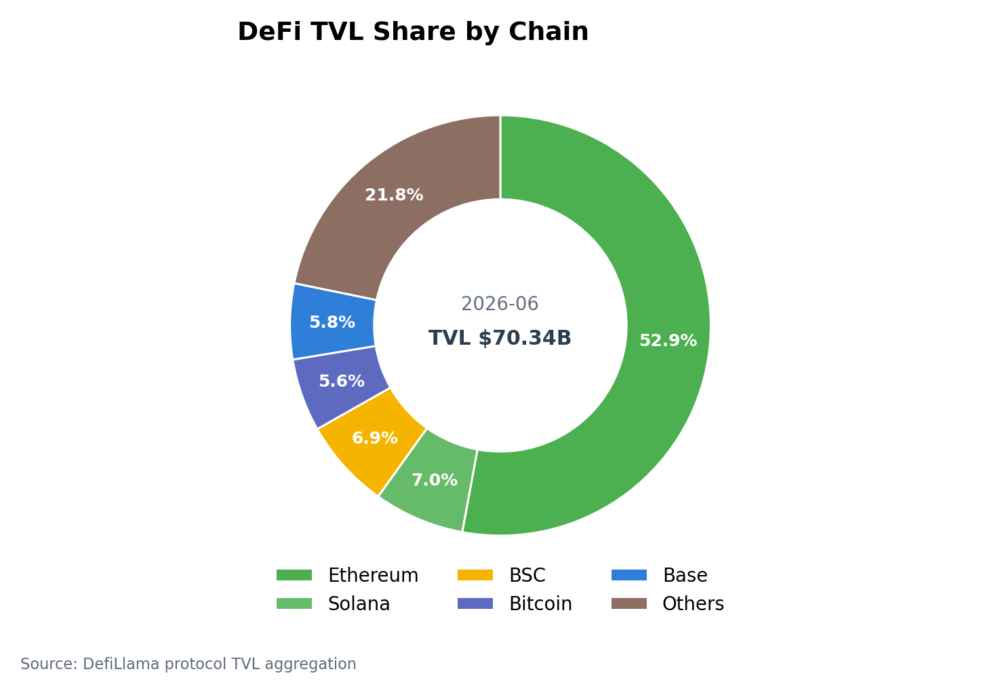
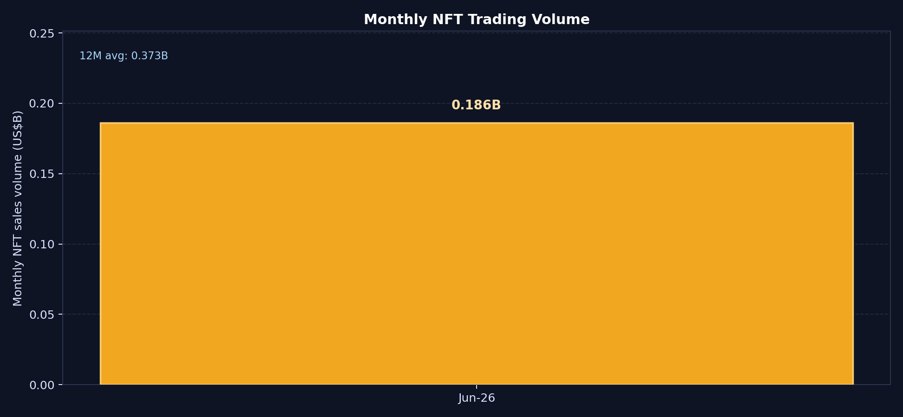
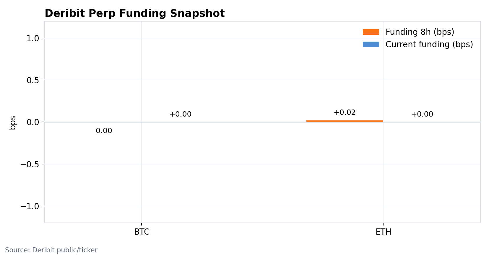
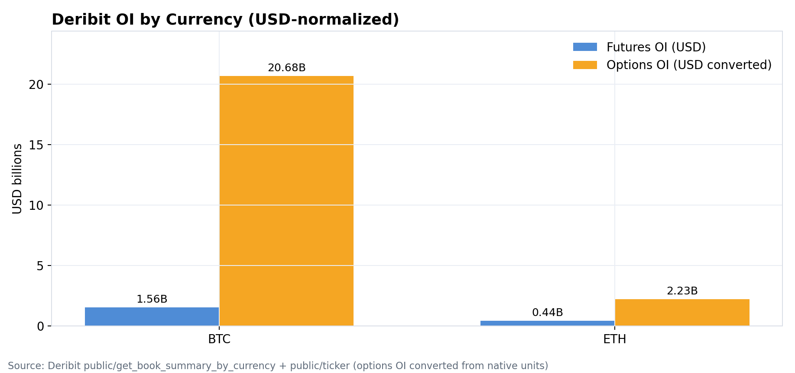
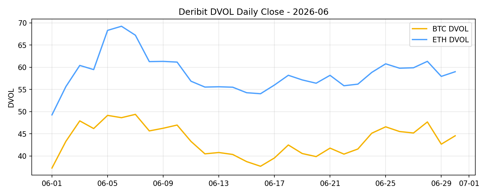
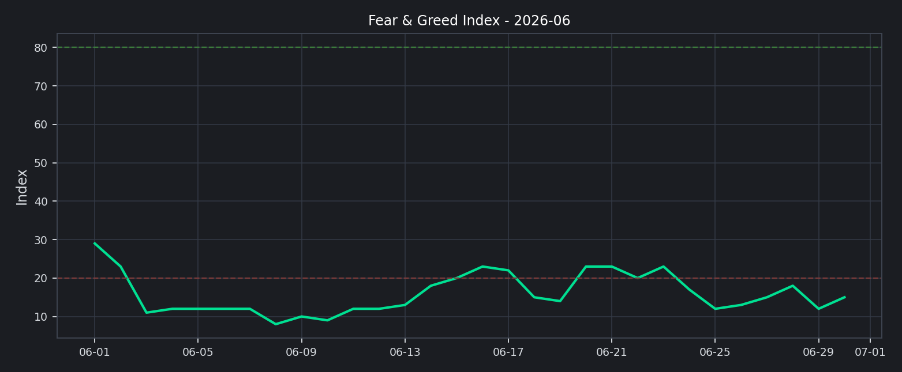

# 2026 年 6 月二级市场月报

6 月市场从 5 月的防守整理进一步切入压力再定价：全市场市值由约 $2.49T 回落至约 $2.04T，按月下降约 -18.19%。但这不是流动性完全枯竭的月份，前排交易所 30d 成交额样本反而环比上升约 +35.18%；真正的矛盾在于成交活跃与价格承压并存，说明市场更多是在高分歧中换手、去杠杆和重配风险，而不是形成顺畅的趋势扩张。

## Key Takeaways
- 市场状态：6 月是压力再定价，而不是趋势修复。总市值较 5 月末回落约 -18.19%，价格中枢下移，但成交额放大说明风险并未完全退出市场。
- 领导结构：BTC 主导率由 59.23% 降至 57.66%，但这不等于长尾风险全面扩散。Top10 外市值占比月末约 22.06%，更多体现为头部资产同步回撤后的结构再平衡。
- 资产分化：主流非稳定币篮子 1 涨 9 跌，中位数收益 -15.71%；RAIN 逆势上涨 +9.40%，DOGE 最弱 -28.76%。赚钱效应高度集中，头部资产没有给出普遍修复信号。
- 杠杆温度：Deribit BTC/ETH 8h 资金费率约 -0.00bps / +0.02bps，整体接近零轴。价格回撤没有伴随明显单边拥挤，杠杆风险更像阶段性再定价，而不是已经进入极端挤仓。
- 情绪确认：月末恐惧与贪婪指数为 15，月均约 15.9，处于极度恐惧区间。情绪明显落后于成交活跃度，说明新增交易更多是事件驱动和防守换手，而非一致性追涨。
- 主题结构：外部大所研究的共同线索是“杠杆修复快于现货信心、机构资金走弱、叙事轮动仍在”。RWA、tokenized equities、稳定币支付和事件型小盘资产仍有关注度，但不足以抵消主流资产的压力。

## 宏观代理与市场状态
总市值从约 $2.49T 下行至约 $2.04T，是本月最直接的风险信号。BTC 主导率同步回落约 -1.57pct，说明资金并非简单回到 BTC 防守；但主流资产大面积下跌、情绪维持极度恐惧，决定了这更像系统性降风险后的结构再平衡，而不是长尾资产主动接棒。

下月需要观察的是“成交放大”能否转化为“价格企稳”。如果市值继续下行而成交维持高位，市场仍是压力换手；只有总市值止跌、BTC/ETH 资金费率保持中性、Top10 外占比不再被动抬升，才更接近可持续修复。

## 交易所流量与资金活跃度
前排交易所样本 30d 成交额合计约 $3.31T，估算环比 +35.18%。Gate 增幅靠前（+51.06%），Binance、OKX、Coinbase Exchange 也分别录得 +41.60%、+40.12%、+38.59%；Upbit 是样本中主要回落项（-24.22%）。

这组数据说明，6 月不是没人交易，而是交易动机偏向风控、对冲和事件轮动。Coinbase 6 月 positioning 报告也强调，仓位修复快于流动性改善，未平仓合约（OI）回升，但现货、永续合约、定期期货和期权成交并未形成一致扩张；这和本月“价格弱、成交强、情绪冷”的结构吻合。

## 主流资产表现与市场广度
主流非稳定币篮子中，表现最强的是 RAIN（+9.40%），其次是 LEO（-7.62%）和 SOL（-8.92%）；最弱的是 DOGE（-28.76%）、BNB（-21.36%）和 ETH（-21.11%）。样本中只有 1 个上涨、9 个下跌，中位数收益 -15.71%，说明本月不是普遍修复，而是少数标的逆势、主流资产整体承压。

Top10 外市值占比月末约 22.06%，表面上高于前两个月，但需要谨慎解释。它并没有伴随头部资产普遍上涨，也没有伴随情绪回到中性区间，因此更像 BTC 与头部资产回撤后形成的比例变化，而不是健康 altseason。

## 链上风险偏好：DeFi 稳定，NFT 继续弱化
DeFi TVL 月末约 $70.34B，Ethereum 占比 52.90%，Solana 与 BSC 分别为 6.97% / 6.93%。链上资金仍高度集中在 Ethereum 生态，Others 占比 21.78%，结构上更像存量资金维持核心协议敞口，而不是跨链高 beta 快速扩散。

NFT 月成交额约 $186.14M，低于 5 月约 $246.29M。NFT 没有跟随交易所成交回暖，说明风险偏好并未外溢到更低流动性的非同质化资产；链上风险扩张仍缺少强确认。

## RWA、支付与事件叙事：有亮点，但还不是主导 beta
Binance Research 6 月月报把 RWA、tokenized equities 和加密卡支付放在重要位置：其公开摘要提到，活跃 tokenized RWA 自 2025 年初至 2026 年 6 月增长约 589%，其中债券和货币市场基金贡献最大，public equities 增速更快。这说明现实资产映射正在从“链上美债收益”扩展到“可交易证券化资产”。

但从二级市场角度看，RWA 与支付叙事更多改善的是产品边界和交易所长期资产货架，并没有在 6 月直接带来广泛 beta 修复。KuCoin 6 月底日度报告也把市场描述为“macro wait-and-see + event-driven rotation”，并列举 USDC、XAUT-backed lending、监管框架、SOL 鲸鱼累积、SYN/ENA 等事件型线索；这意味着资金仍会追逐局部催化，但难以自动扩散为全市场上涨。

世界杯带来的影响更偏“流量事件”，而不是“资产定价主线”。Kraken 成为 2026 FIFA World Cup 官方加密交易所支持方，叠加 fan tokens、预测市场和体育交易合约的活跃，使体育场景成为 6 月零售流量入口之一；但这类需求更容易体现在 CHZ/球迷代币、预测市场、交易所营销转化和支付场景上，对 BTC/ETH 大盘方向的传导有限。

ETHBeijing 则更像开发者生态信号。2026 年 ETH Beijing Hackathon 于 6 月 5-7 日在北京举行，主题聚焦 AI Agent x Blockchain，由 PKU Blockchain DAO 与 WTF Academy 主办，奖金池 26,250 元，并设置 Public Good、Security / Risk Agent、AI for Transparency、xAPI 等方向。它对二级市场的直接影响不大，但强化了 6 月“AI Agent + Web3 基础设施 + 公共物品/风控工具”的开发者叙事，适合作为 ETH 生态活跃度和本土 builder 供给的观察项。

## 衍生品仓位温度
BTC 与 ETH 的资金费率接近零轴（-0.00bps / +0.02bps），说明衍生品仓位没有形成明显单边多头拥挤。结合 Coinbase 对“leverage-led recovery still meeting visible supply”的判断，本月更像杠杆尝试修复、但现货信心和订单簿供给仍在压制上行。

DVOL 月末为 BTC 44.54 / ETH 58.98，较月内高点 BTC 49.37 / ETH 69.23 回落，但仍明显高于 6 月中旬低位。波动率没有失控，但也没有回到低波动顺趋势环境；下月如果 funding 快速转正而 DVOL 同步上行，需要防范反弹追多后的再度回撤。

## 情绪与波动定价
恐惧与贪婪指数月末为 15，处于极度恐惧区间；月均约 15.9。情绪没有确认成交回暖，说明市场参与者仍在用防守心态处理波动，新增换手更多来自再定价和事件交易。

已实现波动率与 DVOL 给出的信号是“风险仍被定价，但未进入恐慌失控”。这对交易的含义是，短线反弹可以出现，但要把它定义为趋势反转，仍需要情绪、广度和现货流入共同确认。

## 当月 Web3 事件与市场影响
机构资金线索偏负面。KuCoin 转引的 6 月末 ETF 数据显示，美国现货 BTC ETF 在 6 月出现上市以来最大月度赎回，13 只 ETF 合计净流出超过 $4.1B，其中 BlackRock IBIT 约 $3B。这解释了为什么交易量可以放大，但 BTC 上方仍持续遇到供给压力。

宏观与政策线索仍在牵引风险偏好。KuCoin 6 月 30 日报告把美伊谈判、英国 FCA 加密监管框架、BNY Mellon 与 Circle 合作、Chainalysis 地址追踪标准草案等并列为行业事件，说明市场关注点已经从单一价格修复转向监管、稳定币结算、链上风控和地缘风险。

叙事轮动仍存在，但更偏局部交易。Binance 6 月月报强调量子抗性、RWA、tokenized equities 与加密卡支付；KuCoin 日度报告提到 SOL 鲸鱼累积、ANSEM 空投、SYN 动量、ENA 与 BlackRock Aladdin 集成等事件；世界杯和 ETHBeijing 则分别对应零售流量入口与开发者供给。对二级市场而言，这类线索适合解释单币弹性和产品机会，但不能替代总市值、ETF 流向和情绪修复这些更高阶确认。

## 下月交易框架（基准情景）
1. 基准情景：维持防守型核心资产优先。只要恐惧与贪婪指数（F&G）仍在恐惧区间、Top10 样本中位数收益未转正、ETF/现货流入没有修复，主要风险预算应继续放在 BTC/ETH/SOL 等高流动性资产上，长尾仓位以事件驱动和短周期为主。
2. 上行情景：提高 beta 暴露需要至少两个确认信号同时出现：总市值止跌并重新站回 6 月下旬压力区间上沿、Top10 外占比稳定抬升且不是由 BTC 下跌被动造成、交易所成交额维持高位、F&G 回到 25 以上并向中性区间修复、资金费率（Funding）不出现快速拥挤。
3. 风险情景：如果成交继续放大但总市值和头部资产中位数收益走弱，或隐含波动率指数（DVOL）重新上冲且资金费率快速转正，应降低追涨仓位。执行层面优先提高保证金缓冲、收紧长尾币流动性阈值，并对单日事件驱动涨幅过大的资产分批止盈。
