# 2026 年 7 月二级市场月报｜核心资产修复与风险偏好分化

7 月二级市场完成了一轮由核心资产带动的价格修复：全市场总市值由 $2.04T 升至 $2.21T（+8.45%），BTC 主导率上升 1.14pct。当前 Top10 资产 6 涨 4 跌、中位数收益 +1.63%，说明修复并非全面同步；长尾资产参与度仍偏低，风险偏好尚未明显外溢。7 月全市场日均成交额约 $63.10B，DeFi TVL 月末约 $75.31B；Deribit BTC/ETH 月均资金费率为正、DVOL 从高位回落，整体杠杆情绪并不拥挤。情绪月末仍为恐惧（25）。RWA 市场扩张主要由美债和信用类资产带动，代币化股票（Tokenized Stocks）增长相对温和；因此本月更接近“核心资产修复与结构性扩张”，还不是全面风险偏好回归。

## 核心结论
- 市场状态为核心资产修复：总市值由 $2.04T 变为 $2.21T，月内变化 +8.45%；BTC 主导率上升 1.14pct，修复仍偏向核心资产。
- 头部资产表现分化：6 个上涨、4 个下跌，中位数收益 +1.63%；ETH 最强（+14.84%），HYPE 最弱（-17.13%）。
- 市场广度仍待确认：当前 Top10 资产 6 个上涨、4 个下跌，Top10 外市值占比为 20.26%，长尾资产尚未形成普遍上涨。
- 杠杆情绪整体平稳：Deribit BTC/ETH 月均资金费率为 +0.40bps / +0.22bps，DVOL 从月内高位回落，暂未出现明显的过度拥挤。
- RWA 结构分化：美债和信用类资产规模增幅约 10.8% 和 18.9%，明显高于代币化股票（Tokenized Stocks）的约 1.3%。
- 情绪落后于价格：月末恐惧与贪婪指数为 25，月均约 25.3；价格修复尚未转化为广泛的情绪确认。

## 宏观代理与市场状态
总市值月内上行 +8.45%，BTC 主导率提高 1.14pct。这个组合更接近“核心资产修复”，而不是“全市场进攻”：上涨首先集中在流动性最好、共识最强的资产，资金全面回流仍有待确认。

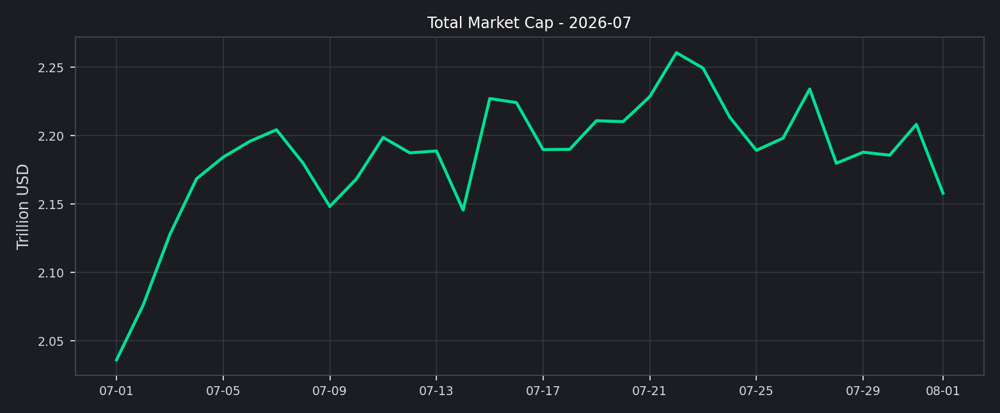

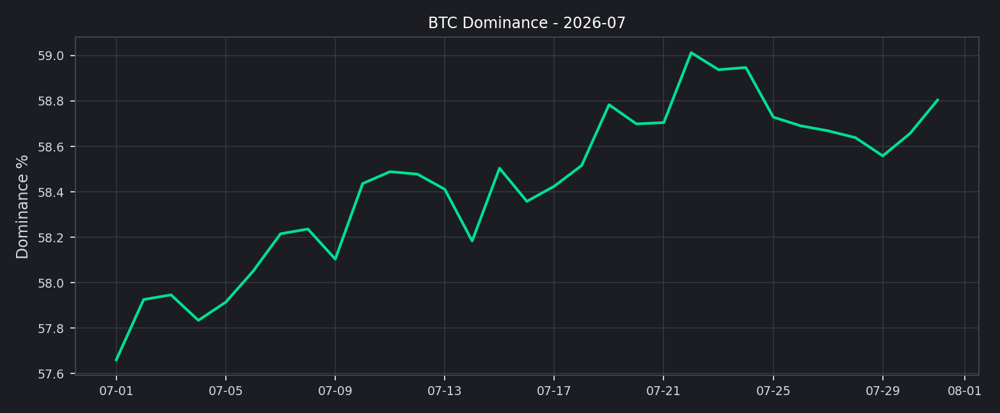

修复能否延续，取决于成交和市场广度是否跟上。若市值继续上行但成交不放大、Top10 外占比不扩张，行情更像估值回补；若成交和广度同步改善，趋势延续的可信度才会提高。

## 交易所流量与资金活跃度
7 月全市场日均成交额约 $63.10B，峰值约 $88.27B。成交活跃度仍有改善空间，平台之间也尚未出现清晰的流量轮动。

对下月而言，成交是否继续放大比单一价格涨幅更重要：成交扩张将为修复提供参与度确认，成交回落则会提高“低广度反弹”的风险。

## 主流资产表现与市场广度
头部资产本月分化明显。由于统计采用当前市场排名，结果更偏向仍具流动性的资产，存在一定幸存者偏差；表现最强的是 ETH（+14.84%），最弱的是 HYPE（-17.13%），收益差约 31.97pct。6 个上涨、4 个下跌，中位数收益为 +1.63%，说明核心资产的修复并不同步，长尾资产也尚未形成普遍上涨。

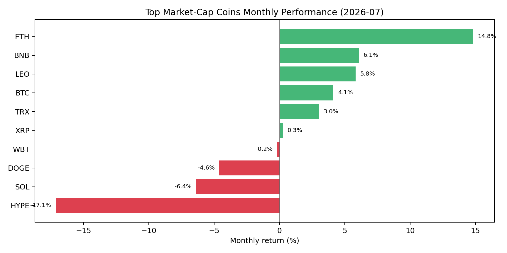

月末 Top10 外市值占比为 20.26%，长尾资产参与度仍偏低。下月若 Top10 外资产的上涨覆盖率和成交同步改善，才能确认风险偏好正在向外扩散。

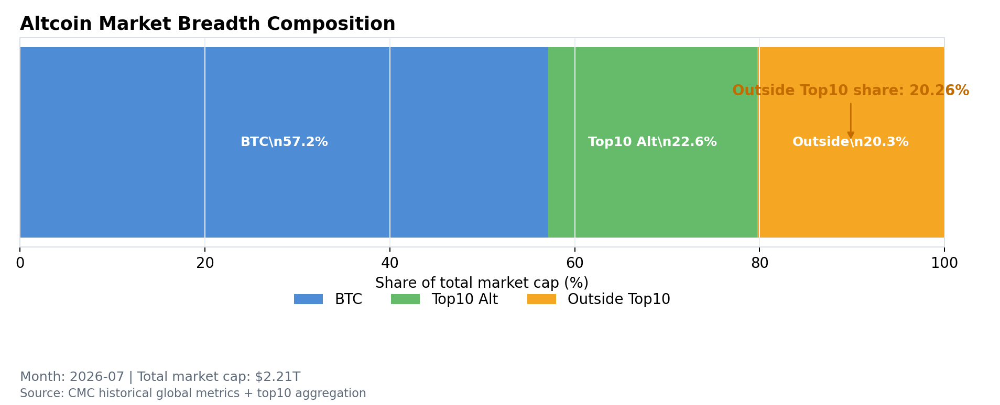

## 链上资金与风险偏好
DeFi TVL 月末约 $75.31B，Ethereum 占比 54.97%，Solana 与 BSC 分别为 6.39% / 6.51%。链上资金仍以 Ethereum 生态为主，资产结构尚未出现明显切换。

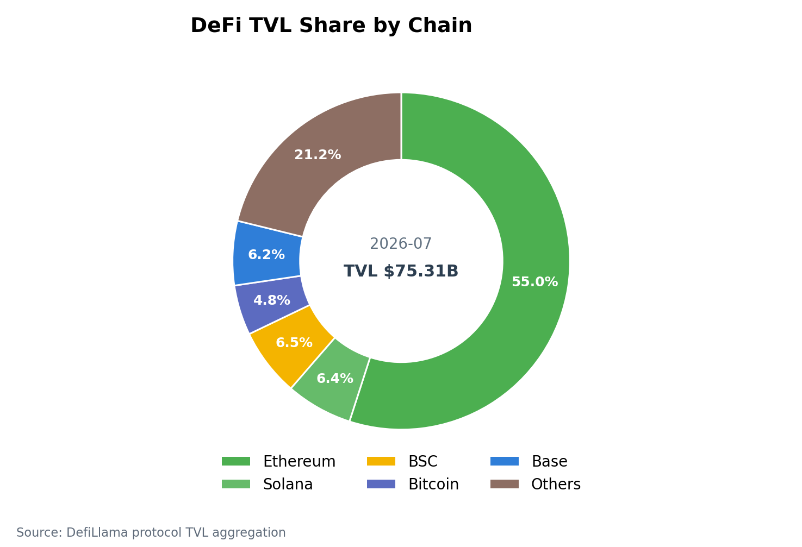

NFT 月成交额约 $220.58M，市场热度仍处于相对低位，尚未成为本轮风险偏好修复的主线。

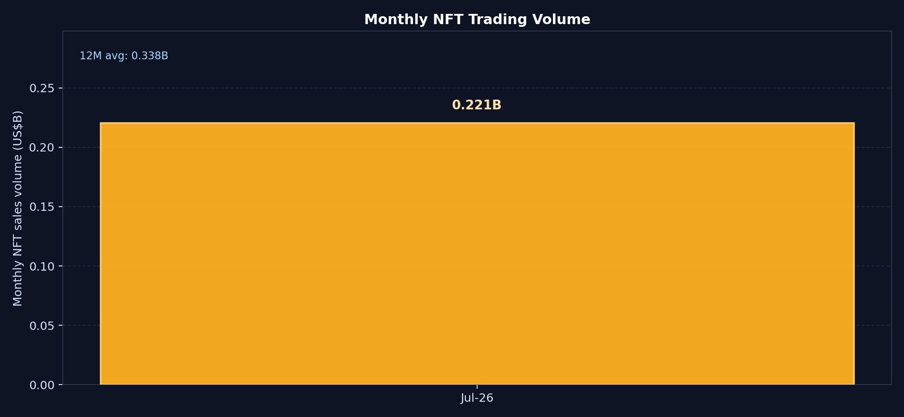

## RWA 与代币化资产
7 月 RWA 市场扩张主要由美债和信用类资产带动：美债规模由约 $14.60B 升至 $16.17B，信用类资产（Credit）由约 $5.88B 升至 $6.99B；收益和信用类资产仍是 RWA 市场的主要支撑。

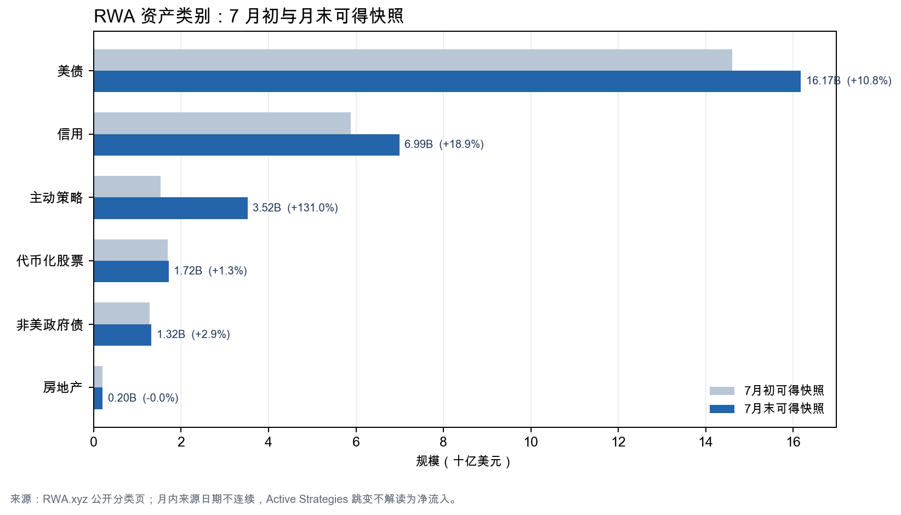

代币化股票（Tokenized Stocks）规模由约 $1.69B 升至 $1.72B，最近 7D 变化为 -5.18%，仍未跟随核心加密资产同步扩张。Active Strategies 月内波动较大，暂未形成清晰的增长趋势；Binance Web3 观察池的异动更适合作为 24×7 价格发现和 CEX 新品类线索，而不是月度主线。

下月重点观察三个变量：美债与信用类资产规模是否继续扩张，代币化股票（Tokenized Stocks）是否重新恢复增长，以及 RWA 永续合约（perps）和稳定币结算能否把“持有型资产”转化为“交易型产品”。

## 衍生品仓位温度
Deribit BTC/ETH 月均资金费率（Funding）均为正（+0.40bps / +0.22bps）；结合 DVOL 月末降至 BTC 35.64 / ETH 50.21、低于月内高点 BTC 42.91 / ETH 56.89，杠杆情绪整体可控。未平仓合约（OI）没有与资金费率和波动率同步上冲，当前市场更像修复后的再定价，而不是高杠杆趋势行情。

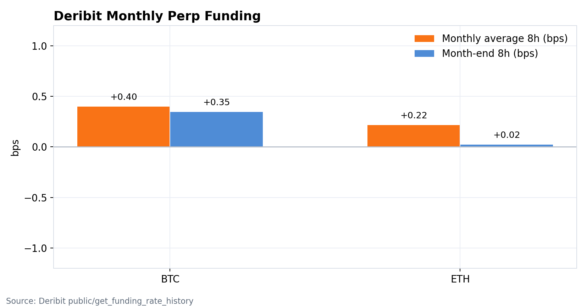

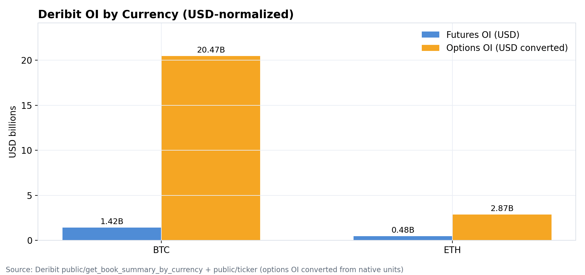

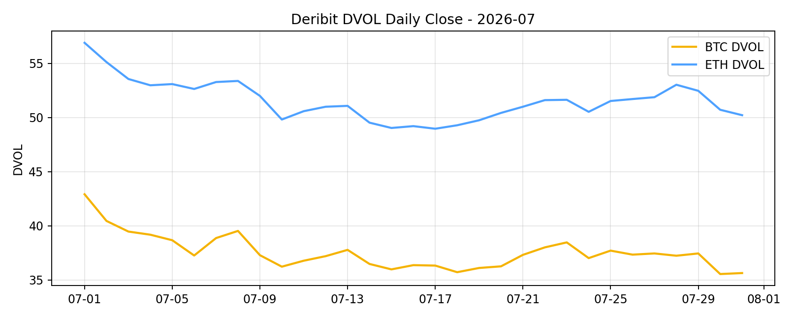

## 情绪与波动定价
恐惧与贪婪指数（F&G）月末为 25（恐惧），月均约 25.3；价格端已经修复，但情绪仍弱，参与者信心没有同步回升。下月若 F&G 回到中性区间以上（通常指 50 以上），同时成交和广度改善，才可视为情绪对价格的确认。

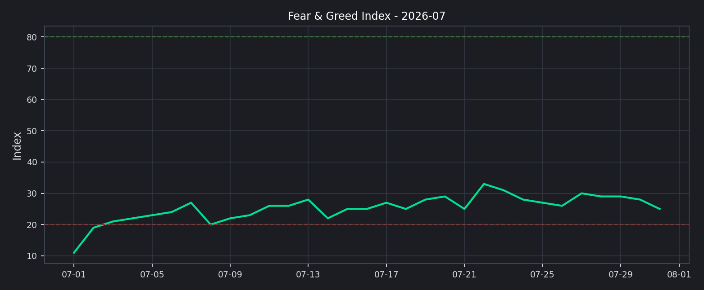

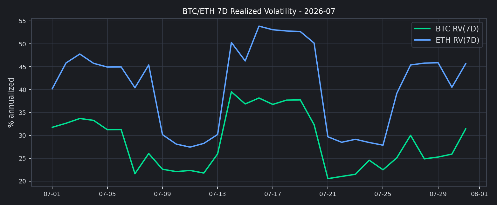

## 下月交易框架（基准情景）
1. 基准情景：维持核心资产优先的选择性风险暴露；只要总市值守住修复成果、成交不收缩且资金费率（Funding）没有持续升至高位，该配置仍然有效。
2. 上行情景：若市场广度扩散、成交放大、F&G 回到中性以上，且代币化股票（Tokenized Stocks）等交易型 RWA 不再走弱，再逐步提高头部山寨资产（Altcoins）和新品类的风险预算。
3. 风险情景：若总市值回吐涨幅、DVOL 上冲、资金费率快速升至高位或持续扩大并伴随 OI 上升，或 RWA/稳定币流动性出现收缩，应降低追涨仓位、提高保证金缓冲并收紧流动性门槛。
