# 2026 年 8 月二级市场月报

8 月不是一条直线上行的牛市，而是一次在月中完成的快速再定价：总市值月末较月初上升 21.07%，但 8 月 1–17 日几乎横盘，8 月 18–22 日集中放量突破，8 月 28 日触及月内高点后又回撤 3.18%。BTC 主导率同步上行，情绪则在价格和成交放大后才切换到贪婪区间。综合来看，本月更接近“核心资产先完成估值修复，广度和链上资金随后部分跟随”，尚不足以定义为全面风险偏好扩散。

## Key Takeaways

- 市场上涨高度前置：8 月 1–17 日总市值仅变化 +0.07%；8 月 18–22 日（相对 8 月 17 日）阶段涨幅 +22.42%，8 月 20–22 日日均成交额约 $138.88B，接近全月均值的 1.99 倍。
- 核心资产占主导、广度仍收窄：BTC 主导率由 58.41% 升至 59.70%；按图 6 的当前 Top10 alt 篮子回溯，篮子之外占比由 20.78% 降至 15.29%，BTC 与当前 Top10 alt 合计约占 84.71%。
- 头部资产整体上涨但分化很大：当前 Top10 样本平均收益 +35.66%，中位数 +31.94%，6 个跑赢 BTC；ZEC、HYPE、SOL 领涨，TRX 仅上涨 1.62%，首尾相差 82.31 个百分点。
- 成交参与真实但结构偏衍生品：前排交易所 27 日样本的衍生品成交占比约 86.38%，前三家约占 71.53%；Funding 月均温和为正，DVOL 冲高后回落，尚未形成持续杠杆拥挤。
- 链上风险偏好有扩张但未完成确认：DeFi TVL 增长 +15.36%，低于市场市值 +21.07%，Ethereum 占比升至 55.74%；NFT 成交额低基数增长 +50.71%，而 F&G 在价格和成交放大后才切入贪婪区。
- RWA 尚未跟随二级市场风险扩张：六类观察池规模仅增 1.76%，RWA/加密市值比由 1.41% 降至 1.19%；内部增量偏向信用与代币化股票，但二级成交和溢折价证据仍不足。

## 宏观代理与市场状态

全市场总市值由 $2.158T 升至 $2.613T，月度变化 +21.07%。但月度首尾数字掩盖了行情的阶段性：月内低点为 8 月 2 日的 $2.151T，高点为 8 月 28 日的 $2.699T，月末仍比高点低 3.18%。因此，本月的主要风险不是“上涨是否发生”，而是上涨是否能从一次高成交量冲击转化为高位的持续换手。

| 阶段 | 总市值变化（起点→阶段末） | 阶段日均 24h 成交额 | BTC 主导率变化 | 盘面含义 |
|---|---:|---:|---:|---|
| 8 月 1 日→17 日 | +0.07% | $47.38B | -0.01 个百分点 | 价格与成交都在等待，风险预算尚未释放 |
| 8 月 17 日→22 日（上涨发生于 18–22 日） | +22.42% | $103.13B | +1.08 个百分点 | 价格、成交和核心资产权重同时抬升，发生快速再定价 |
| 8 月 22 日→31 日（消化发生于 23–31 日） | -1.17% | $94.07B | +0.23 个百分点 | 高位震荡，成交仍高于月均，但广度没有同步证明趋势延续 |

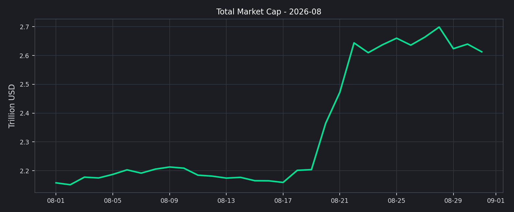

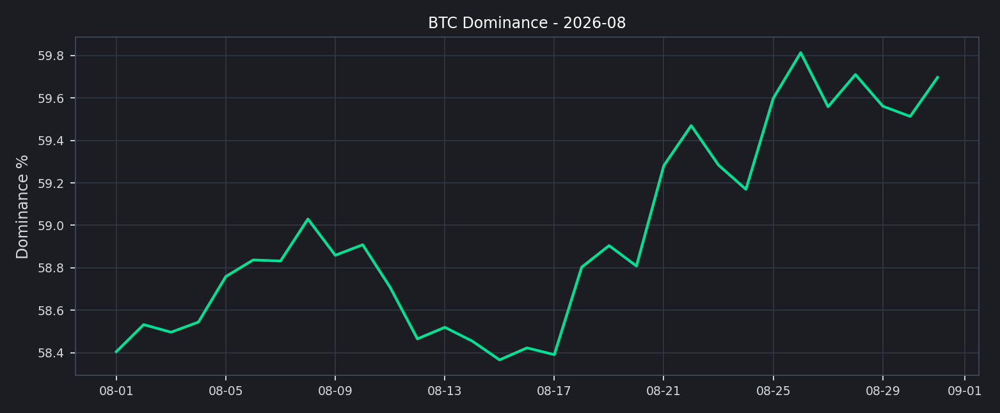

更集中看 8 月 20–22 日，8 月 19 日至 22 日总市值上涨 +19.95%，三日平均成交额 $138.88B，是全月均值的 1.99 倍。这不是典型的无量估值抬升，确实有较强的交易参与；但 BTC 主导率也在同一段上升 0.57 个百分点，说明新增风险承担并没有平均分配到全市场，优先流向了 BTC 和流动性更好的头部资产。若下月只是总市值守住而成交逐步收缩，市场更可能进入高位消化，而不是新一轮趋势扩张。

## 交易所流量与资金活跃度

8 月前排 10 家交易所的 27 日样本显示，日均成交额约 $138.31B，中位数 $125.08B，8 月 20 日达到样本高点 $331.10B。峰值与全市场 8 月 20–22 日的放量窗口重合，说明月中再定价伴随交易活跃度显著抬升。

交易结构比总量更有解释力：27 日样本合计的衍生品成交占比约 86.38%，Binance 平均占样本成交约 43.77%，前三家约占 71.53%。这意味着本轮价格上行伴随的是高度衍生品化、且集中在头部平台的交易活动；它更像杠杆和风险预算的快速迁移，而不是现货资金已经广泛铺开。若要把反弹升级为趋势，需要继续观察现货占比、盘口深度和成交质量，而不能只看名义成交额。

另外，270 个交易所-日期单元的成交变化均值为 +16.19%，但中位数只有 +1.12%，上升 139 个、下降 131 个。均值明显受少数极端样本抬高，平台之间更接近分歧下的流量重排，而不是全平台同步扩张。

## 主流资产表现与市场广度

Top10 样本按报告生成时的当前市值排名选取，再回溯目标月收益；这不是 8 月月初固定篮子，存在幸存者偏差。样本中 10 个资产全部上涨，平均收益 +35.66%，中位数 +31.94%，第 25/75 分位为 +21.54% / +41.67%，标准差达到 22.08 个百分点。6 个资产跑赢 BTC 的 +25.13%，但收益并非均匀分布：ZEC +83.92%、HYPE +62.11%、SOL +43.56%，而 TRX 只有 +1.62%，首尾相差 82.31 个百分点。

这组结果提供了一个比“全部上涨”更重要的判断：本月存在高 beta 轮动，但轮动主要发生在当前头部篮子内部，而不是从 BTC 扩散到全体长尾。图 6 的当前 Top10 alt 篮子分解显示，Top10 alt 之外市值占比由 7 月 20.78% 降至 8 月 15.29%，月末 BTC 约占 60.37%、当前 Top10 alt 约占 24.34%，两者合计 84.71%。价格、供给和资产排名变化共同影响市值结构，因此更准确的结论是“修复偏集中”，而不是简单把占比变化解释成资金流出。

日报中的“Top10 外占比”更偏向全市场集中度观察，本月图表的 15.29% 则反映 BTC 之外当前 Top10 alt 篮子的剩余部分。两组指标共同指向同一结论：单看 Top10 全线上涨，市场广度仍没有真正打开。

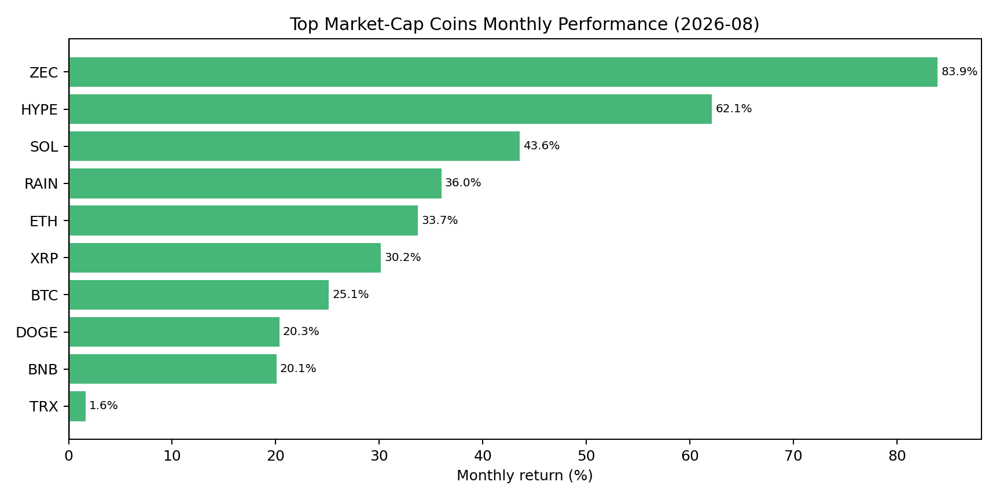

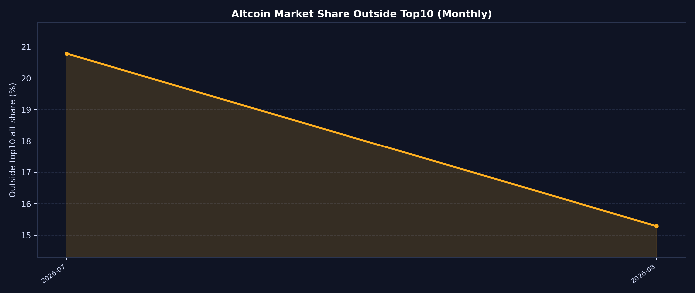

## 链上风险偏好

DeFi TVL 由 7 月的 $75.34B 升至 8 月的 $86.92B，环比增长 +15.36%，而同期加密市场总市值增长 +21.07%，相差约 5.71 个百分点。这个差值不能简单解读为资金流出，因为 TVL 也会受到资产价格重估影响；但它至少说明，代币价格的修复速度快于链上抵押和锁仓规模的扩张，链上资本并没有完全按同等速度确认这轮风险偏好。

结构上，Ethereum TVL 增长 +17.04%，占比由 54.95% 升至 55.74%，约为 Solana TVL 的 8.36 倍；Solana 增长 +19.95%，Base 增长 +17.89%，但份额仍分别只有 6.66% 和 6.30%。因此，本月不是“新链全面接棒”，而是 Ethereum 锚定的链上流动性随市场修复扩张，其他链有 beta 但尚未改变结算层的集中结构。下月若要确认链上风险偏好继续改善，需要看到 TVL 增长不再持续落后于市场市值，且 Ethereum 之外的份额能够在美元规模和占比上同时改善。

NFT 月成交额由 7 月 $194.17M 升至 8 月 $292.61M，增长 +50.71%，增速高于主流加密市值和 DeFi TVL。但绝对规模仍只有约 $0.29B，更像低基数下的活跃度修复，尚未重新成为全市场风险偏好的主要传导渠道。

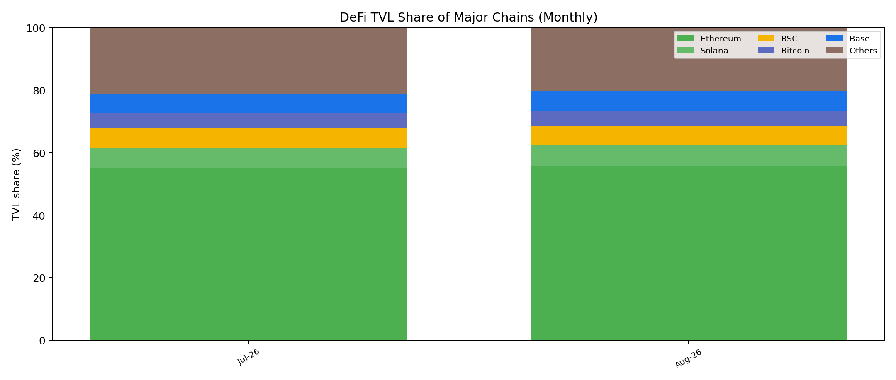

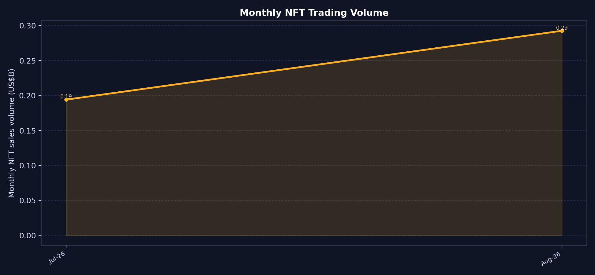

## RWA 与代币化资产

RWA 本月的第一层信号不是规模大增，而是相对加密市场明显落后：六类观察池规模约由 $30.43B 升至 $30.97B，仅增 1.76%，同期加密市场总市值增长 21.07%，RWA/加密市值比由 1.41% 降至 1.19%，相对下降约 15.95%。因此，8 月核心加密资产的修复尚未转化为 RWA 的同步扩容，RWA 更像独立的结构性配置盘。

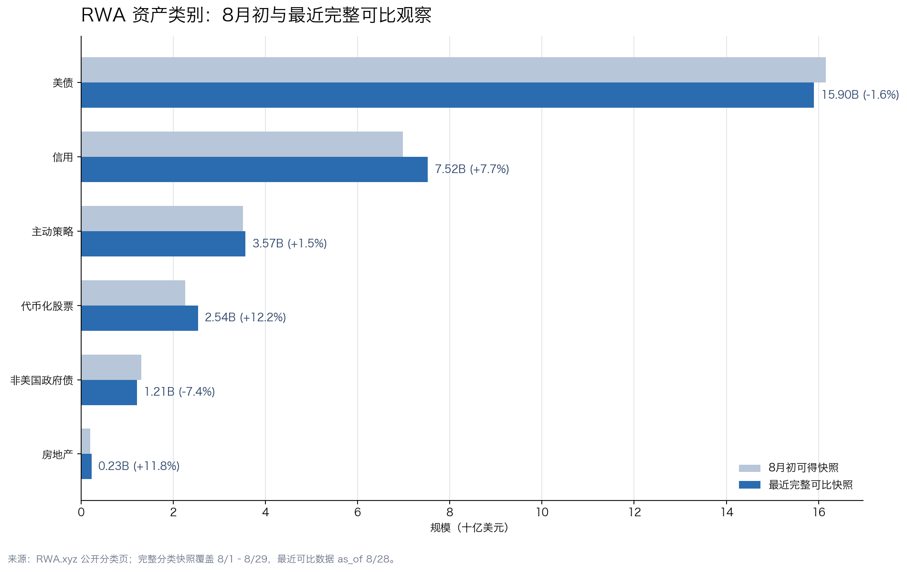

第二层信号是 RWA 内部的风险迁移：净增量约 $536M，其中信用类资产增加约 $539M，代币化股票增加约 $275M，房地产与主动策略合计增加约 $76M；美债与非美国政府债合计减少约 $354M。增量主要来自“信用 + 权益型资产”，而不是政府债整体扩张，配置结构明显更进取；但这更像类别之间的重配，尚未表现为 RWA 对整体风险偏好的同步放大。

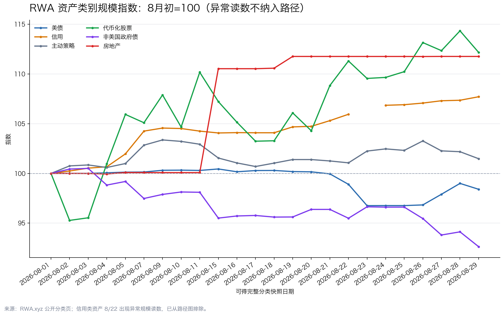

更值得注意的是代币化股票的规模与交易表现出现背离：类别规模增长 12.18%，但 Top5 代币化股票样本的 135 条记录中，正收益占 48.9%，24h 变动中位数为 -0.78%；同时 123 条记录的成交量出现尺度异常。更合理的解释是类别估值或供给扩张先于二级交易活跃度，不能直接写成资金全面涌入。

这组数据的路径还暴露出一个需要排除的跳点：信用类资产在 8 月 22 日对应的快照读数曾达到约 $21.87T，下一观察日回到约 $7.46B；房地产则在 8 月中旬出现约 $20M 的阶跃上修并随后横盘。RWA 类别数据更适合作为结构规模代理指标，单日跳变不能解释为真实资金流量。下月重点观察 RWA/加密市值比能否止跌、信用与美债是否重新同步，以及代币化股票的上涨覆盖率、成交活跃度和溢折价表现能否改善。

## 衍生品仓位温度

资金费率（Funding）月内平均为 BTC +0.355bps、ETH +0.375bps，最低值接近零轴（分别约 -0.022bps / -0.033bps），最高值也只有 +2.840bps / +2.240bps，月末收于 +0.936bps / +0.253bps。月均为正说明多头愿意为杠杆付费，但费率没有持续处于极端区间；尤其 ETH 月末回到接近零轴，未显示价格上涨是由永续合约单边拥挤持续推动。

月末附近 BTC 期货 OI 约 $1.74B，ETH 约 $461M，BTC 约为 ETH 的 3.77 倍，仓位重心明显偏向 BTC。OI 反映的是时点仓位规模，适合判断杠杆集中方向，仍需与 Funding、DVOL 和价格路径结合观察多空风险。

期权隐含波动率指数（DVOL）给出的信息更有区分度：BTC 从 35.55 上升至 8 月 24 日高点 43.41，月末回落至 37.63；ETH 从 50.80 升至 8 月 23 日高点 60.31，月末回落至 51.31。波动率高点出现在 8 月 20–22 日价格冲击之后，而 Funding 没有同步冲到极端，组合起来更接近“方向修复伴随事件性不确定性上升”，而不是持续加杠杆的单边趋势。下月若价格继续上涨但 Funding 快速抬升、DVOL 不降反升，才需要重新评估拥挤和反身性风险。

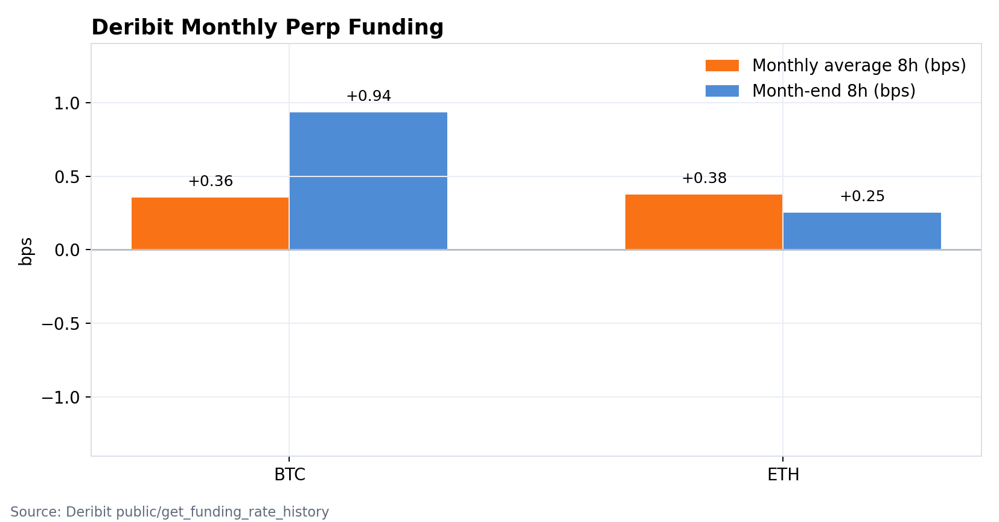

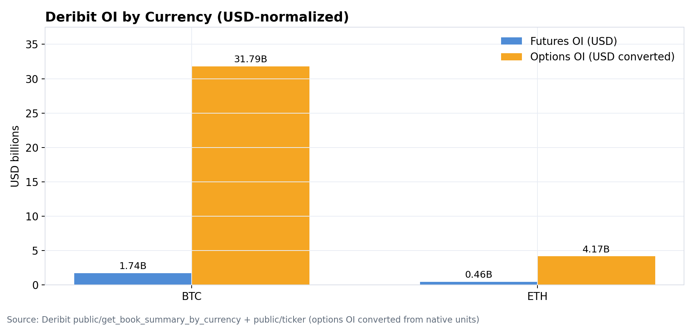

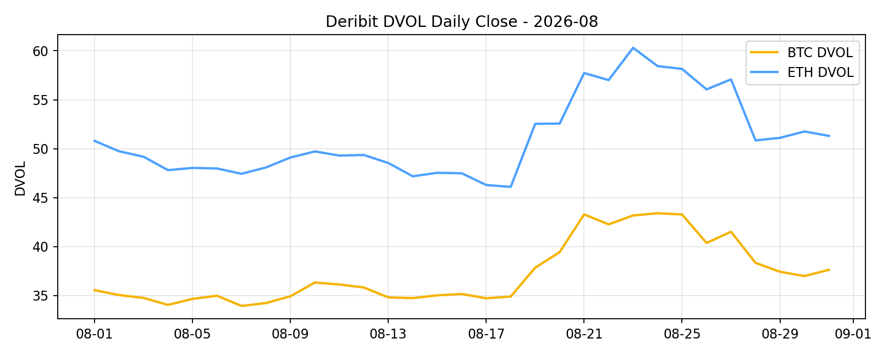

## 情绪与波动定价

F&G 月均为 45.32，单看均值会把本月两个完全不同的阶段压扁：8 月 1–17 日均值只有 28.94，17 天没有一天进入贪婪区；8 月 18–31 日均值升至 65.21，后 14 天中有 12 天处于贪婪区。指数在 8 月 19 日仍为 46，8 月 20 日便跳到 62，与市值和成交的月中脉冲几乎同步，说明情绪主要是对价格和成交的后验确认，而不是提前给出方向。

情绪最高为 8 月 25 日的 74，月末回到 62；同期总市值比 8 月 28 日高点回撤 3.18%，但情绪仍停留在贪婪区。这种“价格先冲高回撤、情绪仍偏乐观”的组合不等于已经过热，却意味着市场对回撤的容忍度可能高于实际广度和链上资本的确认程度。若下月价格转弱而 F&G 仍高位钝化，需防范情绪补跌；若价格、成交和广度同步改善，情绪才从后验确认变成趋势确认。

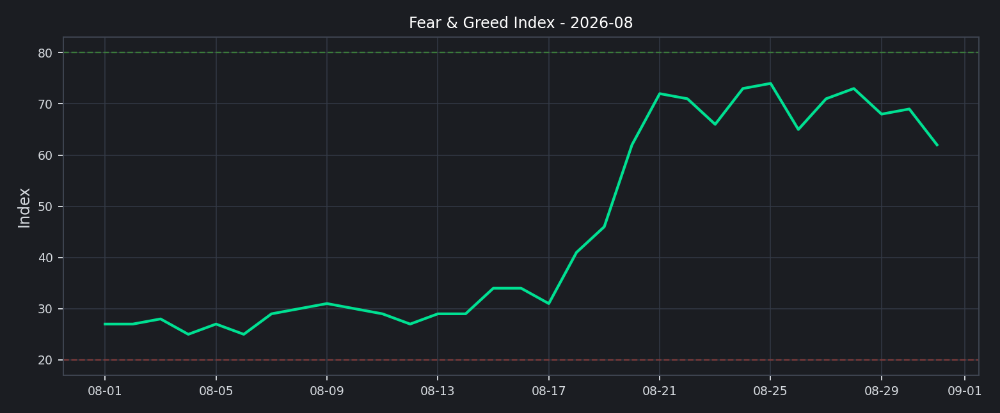

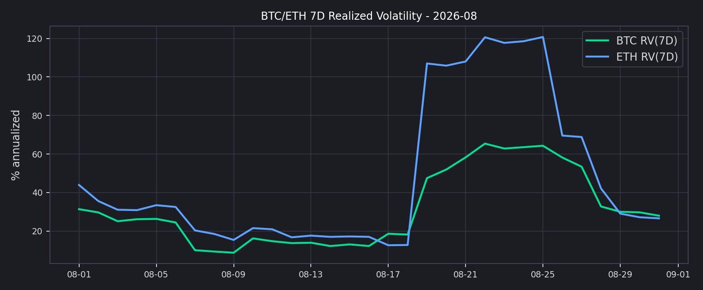

## 下月交易框架（基准情景）

8 月最值得保留的不是“上涨”这一结论，而是四个相对关系：价格相对广度更强、成交相对现货更偏衍生品、波动相对资金费率更先上升、二级市场相对链上与 RWA 更快。以下把这些错位转成可证伪的研究假设；它们是下月的优先验证队列，不是脱离数据的直接交易信号。

### 本月研究假设与验证清单

| 研究假设 | 本月支持证据 | 失效条件 | 下月验证变量 |
|---|---|---|---|
| H1 核心资产修复未扩散 | 市值 +21.07%；BTC.D +1.29pct；篮子外占比 -5.49pct | 篮子外占比回升、BTC.D 回落、广度扩大 | BTC.D、篮子外占比、上涨覆盖率 |
| H2 成交参与但未证明现货趋势 | 8/20–22 成交为月均 1.99 倍；衍生品 86.38%；前三家 71.53% | 现货与深度改善，前三家集中度下降 | 现货占比、集中度、深度 |
| H3 波动先于杠杆 | Funding 均值 +0.355/+0.375bps；DVOL 43.41/60.31 后回落 | 价格、Funding、OI、DVOL 同步抬升 | Funding、OI、DVOL 同步性 |
| H4 链上扩张仍由 Ethereum 锚定 | DeFi +15.36%，落后市值 5.71pct；Ethereum 份额 55.74% | DeFi 增速追上市值，非 Ethereum 份额上升 | 相对增速、Ethereum 份额、非 Ethereum TVL |
| H5 RWA 规模尚未转化为二级流动性 | RWA +1.76%；相对市值比 -15.95%；代币化股票中位数 -0.78% | 相对市值比止跌，成交与溢折价同步改善 | 类别比值、成交深度、上涨覆盖率、溢折价 |

这张清单把“判断”与“证明判断错误的条件”放在同一层：如果下月只有总市值继续上升，而广度、现货成交、DeFi 相对增速和 RWA 二级数据不改善，基准判断仍应停留在“核心资产修复”；如果这些变量同步改善，才有理由把 regime 上调为更广泛的风险扩张。

1. 基准情景：把 8 月定义为月中冲击后的高位消化，保持核心资产优先和中等风险暴露，等待成交质量、长尾占比与 DeFi TVL 给出二次确认。
2. 上行情景：若总市值重新接近或突破 $2.70T，同时 Top10 外占比不再收缩、现货参与度改善、Funding 仍接近月均水平，再逐步提高高 beta 资产的风险预算。
3. 风险情景：若市值回落时成交再次放大、BTC 主导率继续上行且 DVOL 回到 8 月高点附近，应减少追涨和高杠杆暴露；若情绪仍处贪婪而广度继续收窄，则优先执行止盈和提高保证金缓冲。
